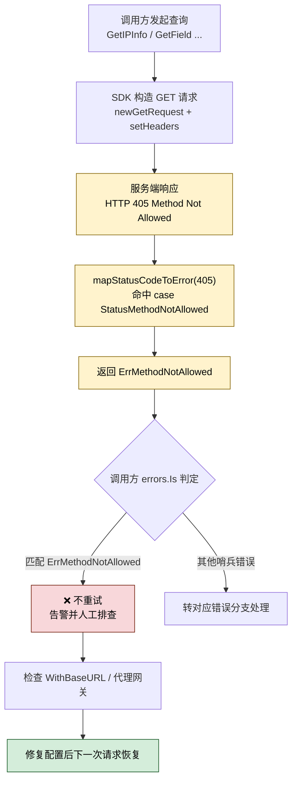

# 🚷 `ErrMethodNotAllowed` — 请求方法不允许错误

> 当服务端返回 HTTP `405 Method Not Allowed` 时抛出，表示所用的 HTTP 请求方法被服务端拒绝。`ipapi.co` 的查询接口仅接受 `GET`，而 SDK 内部也只构造 `GET` 请求，因此 **正常使用下几乎不会触发**；一旦出现，通常意味着 BaseURL 被改写、被中间网关改写或服务端配置异常，且 **不可重试**。

::: tip 🎨 一图抵千言
`ErrMethodNotAllowed` 属于 **不可重试** 错误，下图展示从请求发出到调用方处置的完整决策流。


:::

---

## 📦 错误定义

```go
// ErrMethodNotAllowed 表示服务端拒绝了当前 HTTP 请求方法（HTTP 405）
var ErrMethodNotAllowed = errors.New("method not allowed")
```

| 属性 | 值 |
| --- | --- |
| 🔣 符号 | `ipapi.ErrMethodNotAllowed` |
| 💬 本地消息 | `"method not allowed"` |
| 🌐 服务端 Reason | （HTTP 405 兜底，无独立 reason 字段） |
| 📡 触发状态码 | `405 Method Not Allowed` |
| 📍 触发位置 | `mapStatusCodeToError(405)` |
| 🔁 可重试 | ❌ 否 |

---

## 🎯 触发场景

该错误仅在 SDK 收到服务端 `405 Method Not Allowed` 响应时触发，常见诱因包括：

1. **🔧 BaseURL 被改写**
   通过 `ipapi.WithBaseURL(...)` 指向了一个不支持 `GET` 的端点（例如误指向了某个仅接收 `POST` 的内部接口），服务端以 405 拒绝。

2. **🌐 中间网关 / 代理改写请求方法**
   部署在 SDK 与 `ipapi.co` 之间的反向代理、WAF 或 API 网关将 `GET` 重写或拦截，导致最终到达后端的方法不被允许。

3. **🖥️ 服务端配置异常**
   `ipapi.co` 自身路由或服务器配置发生异常，对查询路径返回 405。属于服务端侧问题，客户端无法通过重试解决。

> 💡 关键点：SDK 内部使用 `http.NewRequest(http.MethodGet, ...)` 构造请求，**只发 GET**，因此正常调用链路不会产生 405。出现该错误几乎可以判定为环境配置或网络链路问题，而非业务代码问题。

::: warning ⚠️ 常见误用：误把 405 当成「偶尔抖动」去重试
不少同学在写兜底重试逻辑时，习惯把所有非 2xx 都丢进指数退避队列。对 `ErrMethodNotAllowed` 这样做 **毫无意义**：因为请求方法或链路配置不被接受是 **确定性** 故障，重试 100 次结果仍是 `405`，还会白白占用配额并触发 [`ErrRateLimited`](./err-rate-limited)。
正确做法：用 [`errors.Is`](https://pkg.go.dev/errors#Is) 精准匹配后 **立即告警、转人工**，而非重试。
:::

---

## 📍 触发位置

| 位置 | 说明 |
| --- | --- |
| `mapStatusCodeToError` | 在 `api.go` 的状态码映射函数中，`case http.StatusMethodNotAllowed` 分支直接返回 `ErrMethodNotAllowed`。 |
| 调用入口 | `doRequest` 收到响应后，若 `resp.StatusCode` 为 `405`，即调用 `mapStatusCodeToError(405)` 完成映射。 |

源码片段（`pkg/ipapi/api.go`）：

```go
func (c *Client) mapStatusCodeToError(code int) error {
	switch code {
	// ...
	case http.StatusMethodNotAllowed:
		return ErrMethodNotAllowed
	// ...
	}
}
```

---

## 💻 示例代码

```go
package main

import (
	"context"
	"errors"
	"fmt"
	"log"

	"github.com/cyberspacesec/ipapi"
)

func main() {
	// SDK 只发 GET，正常不会触发
	client := ipapi.NewClient()
	ctx := context.Background()

	_, err := client.GetIPInfo(ctx, "8.8.8.8", "json")
	if err != nil {
		if errors.Is(err, ipapi.ErrMethodNotAllowed) {
			// 👉 说明链路上有人拒绝了 GET，检查 BaseURL / 代理配置
			log.Fatalf("请求方法被拒绝（405）: %v", err)
		}
		log.Fatalf("查询失败: %v", err)
	}

	fmt.Println("查询成功")
}
```

> ⚠️ 排查建议：若反复触发本错误，请用 `curl -X GET https://ipapi.co/8.8.8.8/json/` 直接验证目标端点，确认是否为 405；若 `curl` 正常而 SDK 报错，重点检查 `WithBaseURL` 选项与中间代理。

---

## 🛠️ 错误处理

使用 `errors.Is` 精准匹配本错误，避免字符串比较带来的脆弱性：

```go
result, err := client.GetIPInfo(ctx, "8.8.8.8", "json")
if err != nil {
	switch {
	case errors.Is(err, ipapi.ErrMethodNotAllowed):
		// 👉 链路 / 配置问题：不要重试，转人工排查 BaseURL 与代理
		log.Printf("请求方法被服务端拒绝（405）: %v", err)
		return
	case errors.Is(err, ipapi.ErrRateLimited):
		// 参见 ./err-rate-limited
		handleRateLimited()
		return
	case errors.Is(err, ipapi.ErrInvalidKey):
		// 参见 ./err-invalid-key
		handleUnauthorized()
		return
	case errors.Is(err, ipapi.ErrServerError):
		// 参见 ./err-server-error
		handleServerError()
		return
	default:
		// 其他网络或解析错误
		log.Printf("未知错误: %v", err)
		return
	}
}
```

> 💡 提示：本错误本质是配置 / 链路问题，正确的处置方式是 **告警并人工介入**，而非在代码中静默吞掉。

::: details 🧭 触发 405 后的排查清单
按以下顺序逐项排查，定位 405 究竟来自 SDK、代理还是服务端：

1. **直连验证** — 用 `curl -X GET https://ipapi.co/8.8.8.8/json/` 直连目标，若同样返回 405，问题在服务端 / 网关侧，跳到第 4 步。
2. **核对 BaseURL** — 检查 `ipapi.WithBaseURL(...)` 是否被误指向了仅接收 `POST` 的内部接口；纠正为 `https://ipapi.co/` 或合法查询路径。
3. **核对代理链路** — 排查反向代理 / WAF / API 网关是否将 `GET` 重写为其他方法；必要时在网关层放行 `GET`。
4. **核对请求头** — 部分网关会因 `User-Agent` 或 `Authorization` 异常而拒绝请求，确认 `setHeaders` / `applyAuth` 传入的值合法。
5. **修复后复测** — 配置修正后，下一次请求即应恢复；若仍报错，对比 `curl` 与 SDK 的完整请求头差异。
:::

---

## 🔁 可重试性

| 是否可重试 | ❌ 否 |
| --- | --- |

本错误源于 **请求方法或链路配置不被服务端接受**，属于确定性故障而非瞬时性抖动。对同一个被拒绝的请求重试任意次数，结果都将是 `405`，因此：

- ❌ 不要纳入指数退避 / 自动重试队列（`IsRetryableError` 也未将其列入可重试集合）
- ✅ 应当立即告警，转人工排查 BaseURL、代理网关与服务端配置
- ✅ 修复配置后，下一次请求即可恢复正常

源码佐证（`pkg/ipapi/errors.go`）：

```go
func IsRetryableError(err error) bool {
	return errors.Is(err, ErrRateLimited) ||
		errors.Is(err, ErrServerError) ||
		errors.Is(err, ErrNotFound)
	// ErrMethodNotAllowed 未被列入 → 不可重试
}
```

---

## 🔗 相关错误

- ⚡ [`ErrRateLimited`](./err-rate-limited) — 请求频率超限，**可重试**
- 🔑 [`ErrInvalidKey`](./err-invalid-key) — API Key 缺失或无效
- 📭 [`ErrNotFound`](./err-not-found) — 查询结果为空
- 🖥️ [`ErrServerError`](./err-server-error) — 服务端 5xx 错误，**可重试**
- 🧾 完整错误列表参见 [`errors` 包](../../api/errors)

---

## 👉 下一步

- 📖 阅读 [`errors` 包 API 参考](../../api/errors) 了解全部错误类型与状态码映射关系
- 🔍 用 `curl -X GET` 直连目标端点，定位 405 来自 SDK 侧还是网关侧
- 🛡️ 检查 `ipapi.WithBaseURL(...)` 配置，确保指向 `ipapi.co` 的合法查询路径
