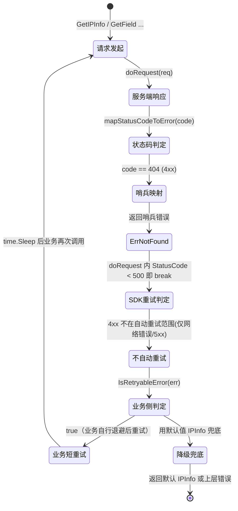
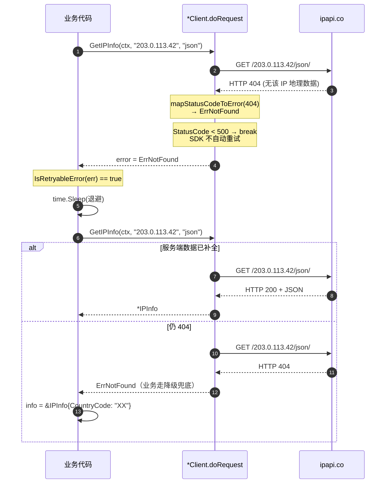
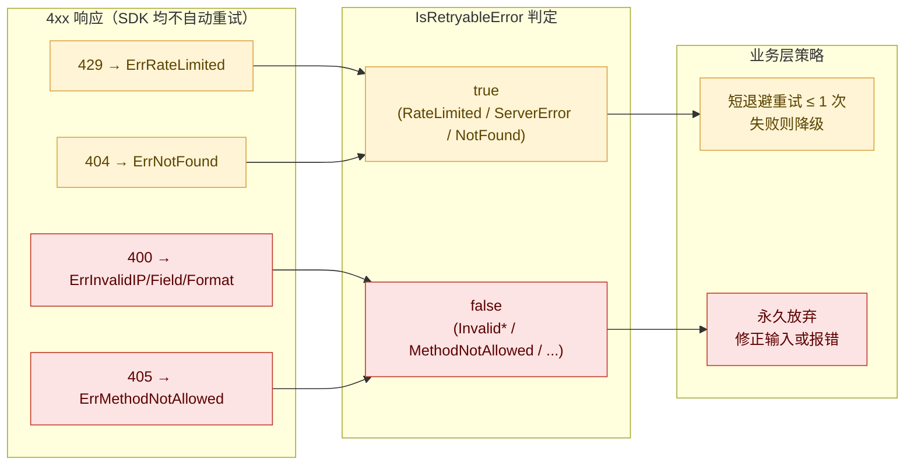

# 🔍 ErrNotFound —— 资源未找到

> HTTP 404 兜底错误：请求的资源（IP/字段/格式组合）在服务端未找到。

::: tip 🎨 一图抵千言

:::

::: tip 🎨 触发 → 可重试 → 业务重试（时序视角）

:::

::: info 🎨 ErrNotFound vs 邻近 4xx 的重试路径对比

:::

::: warning ⚠️ 可重试 ≠ SDK 自动重试
`ErrNotFound` 虽然被 [`IsRetryableError`](../../api/is-retryable) 判定为 `true`，但 SDK 内部的 `doRequest` **不会**对 404 自动重试——自动重试仅覆盖**网络错误与 5xx**，4xx（含 404、429）在 `doRequest` 中命中 `StatusCode < 500` 即 `break`，直接返回。`IsRetryableError` 返回 `true` 仅是给**业务层**的信号：你可以自行做短退避重试，但不要指望 SDK 帮你重试 404。
:::

## 📐 错误定义

```go
package ipapi

import "errors"

var ErrNotFound = errors.New("resource not found")
```

| 属性 | 值 |
| --- | --- |
| 🔖 符号 | `ipapi.ErrNotFound` |
| 📝 消息 | `"resource not found"` |
| 🌐 服务端 Reason | 无（由 HTTP 404 状态码兜底） |
| 🔄 可重试 | 是（`IsRetryableError` 返回 `true`） |
| 📤 触发位置 | `mapStatusCodeToError(404)` |

## 🎯 触发场景

当 ipapi.co 返回 **HTTP 404** 时，`doRequest` 调用 [`mapStatusCodeToError`](../internal/map-status-code) 兜底映射为 `ErrNotFound`。

常见诱因：
- 请求的 IP 合法但服务端暂无该 IP 的地理数据
- 路径组合异常（极少见，SDK 内部 URL 拼接已校验）

::: tip 💡 正常不会触发
SDK 在发请求前已用 [`ValidateIP`](../../api/validate-ip) / [`ValidateFormat`](../../api/validate-format) / `validFields` 拦截非法输入，因此 404 多为服务端数据缺失而非客户端错误。
:::

## 🔧 内部映射

```go
func (c *Client) mapStatusCodeToError(code int) error {
	switch code {
	// ...
	case http.StatusNotFound: // 404
		return ErrNotFound
	// ...
	}
}
```

仅在响应体**不含**合法 `APIError`（`HasError=true`）时才走状态码兜底；若服务端返回了结构化错误，则优先返回 `*APIError`，再由 [`handleError`](../internal/handle-error) 按 `Reason` 映射。

::: details 🔎 排查清单：收到 ErrNotFound 时
- [ ] 确认 IP 是否合法（用 [`ValidateIP`](../../api/validate-ip) 预检）—— 非法 IP 会被前置拦截为 `ErrInvalidIP`，不会走到 404。
- [ ] 确认字段名是否在 [`ValidFields`](../../api/fields) 返回集合内 —— 非法字段会先返回 `ErrInvalidField`。
- [ ] 确认 format 是否为 [`ValidFormats`](../../api/validate-format) 之一 —— 非法格式会先返回 `ErrInvalidFormat`。
- [ ] 用 `curl -i https://ipapi.co/{ip}/json/` 直接观测 HTTP 状态码，确认确为 404 而非 5xx（5xx 会映射为 `ErrServerError`）。
- [ ] 短退避后重试一次；若仍 404，多为服务端确实无该 IP 的地理数据，应走降级路径而非无限重试。
:::

::: warning ⚠️ 常见误用
不要把 `ErrNotFound` 当作「IP 非法」处理。IP 格式校验失败返回的是不可重试的 [`ErrInvalidIP`](./err-invalid-ip)，而 `ErrNotFound` 表示 IP 合法但服务端无数据，属于**可重试**错误。两者语义与处理策略完全不同，混用会导致本可恢复的请求被永久放弃。
:::

## 📝 示例

```go
info, err := client.GetIPInfo(ctx, "203.0.113.42", "json")
if err != nil {
	if errors.Is(err, ipapi.ErrNotFound) {
		fmt.Println("→ 服务端无该 IP 数据")
		// 可重试或用默认值
		info = &ipapi.IPInfo{CountryCode: "XX"}
	}
}
```

## 🛡 错误处理

```go
switch {
case errors.Is(err, ipapi.ErrNotFound):
	// 404：可重试或降级
case errors.Is(err, ipapi.ErrServerError):
	// 5xx
case errors.Is(err, ipapi.ErrRateLimited):
	// 429
}
```

## 🔄 可重试性

`ErrNotFound` 被标记为**可重试**：

```go
func IsRetryableError(err error) bool {
	return errors.Is(err, ErrRateLimited) ||
		errors.Is(err, ErrServerError) ||
		errors.Is(err, ErrNotFound) // ← 此处
}
```

业务层可用 [`IsRetryableError`](../../api/is-retryable) 判断后做短重试（服务端数据可能稍后补全）：

```go
if ipapi.IsRetryableError(err) {
	time.Sleep(2 * time.Second)
	// 重试...
}
```

::: details 🧭 重试还是降级？决策清单
收到 `ErrNotFound` 后，按以下顺序决策：

1. **是否已重试过？** —— 业务层短退避重试**最多 1 次**即可（服务端数据缺失通常不会在数秒内补全，反复重试浪费配额）。
2. **重试后仍 404？** —— 走降级路径：返回缓存的 `IPInfo` 默认值（如 `CountryCode: "XX"`）或上层错误，不要无限重试。
3. **是否高频出现？** —— 同一段 IP 段持续 404 多为服务端数据缺口，考虑换数据源或对该段 IP 做缓存降级标记。
4. **是否伴随其他错误？** —— 用 `errors.Is` 依次判 `ErrNotFound` → `ErrServerError` → `ErrRateLimited`，**先处理可重试类**再处理不可重试类。
:::

## 🔗 相关错误

- [`ErrServerError`](./err-server-error) —— 5xx 服务端错误
- [`ErrRateLimited`](./err-rate-limited) —— 429 限流
- [`ErrInvalidIP`](./err-invalid-ip) —— IP 格式非法（不可重试）
- [错误类型总览](../../api/errors)

## 🚀 下一步

- 📖 看 [`mapStatusCodeToError`](../internal/map-status-code)
- 📖 看 [`IsRetryableError`](../../api/is-retryable)
- 🛡 学 [错误处理概念](../../guide/error-concept)
