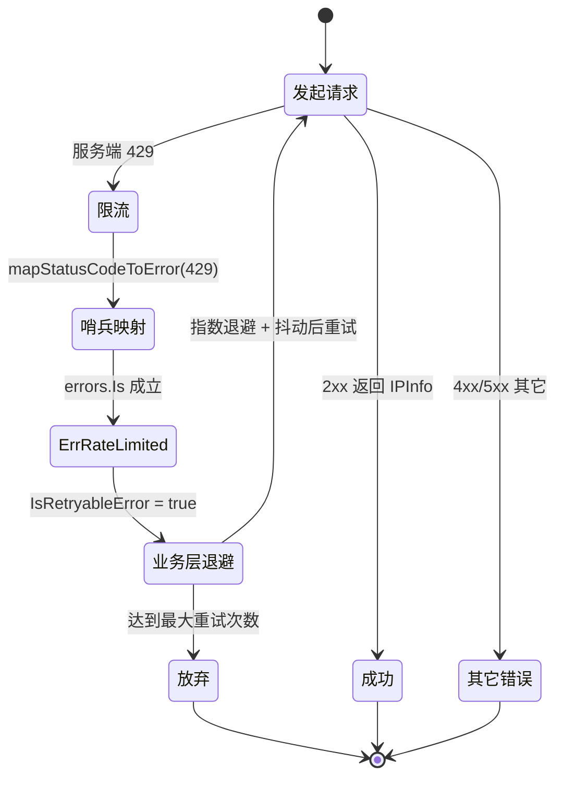
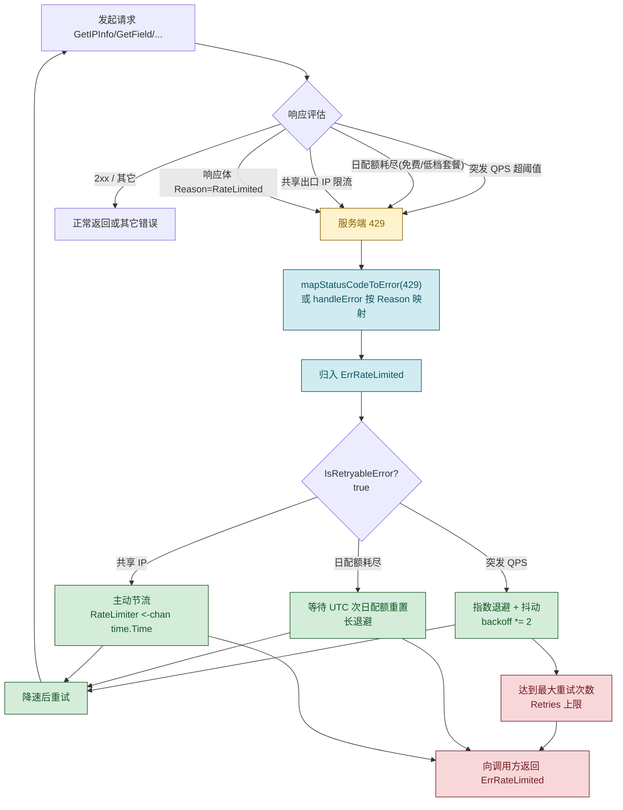

# ⚡ `ErrRateLimited` — 请求频率超限

> 当 `ipapi.co` 服务端返回 HTTP `429 Too Many Requests`，或响应体 `reason` 字段为 `"RateLimited"` 时，SDK 会将其映射为 `ipapi.ErrRateLimited`，表示请求频率已超出当前套餐 / API Key 的速率配额。该错误代表 **限流而非失败**，通常具有瞬时性，**可重试**。

::: tip 🎨 一图抵千言：429 限流的状态流转

:::

::: tip 🌳 一图抵千言：触发条件决策树与退避策略选择

:::

---

## 📦 错误定义

```go
// pkg/ipapi/client.go
var ErrRateLimited = errors.New("API rate limit exceeded")
```

| 属性 | 值 |
| --- | --- |
| 🔣 符号 | `ipapi.ErrRateLimited` |
| 💬 本地消息 | `"API rate limit exceeded"` |
| 🌐 服务端 Reason | `"RateLimited"` |
| 📡 触发状态码 | `429 Too Many Requests` |
| 📍 触发位置 | `mapStatusCodeToError(429)`；`handleError` 按 `Reason` 映射 |
| 🔁 可重试 | ✅ 是 |

服务端返回的错误体结构（`APIError`）如下：

```go
// pkg/ipapi/models.go
type APIError struct {
    HasError bool   `json:"error"`
    Reason   string `json:"reason"`
    Message  string `json:"message"`
    IP       string `json:"ip"`
    Reserved bool   `json:"reserved"`
    Version  string `json:"version"`
}
```

当 `Reason == "RateLimited"` 时，SDK 会用 `fmt.Errorf("%w: %s", ErrRateLimited, apiErr.Message)` 包装并保留原始 `Message`。

---

## 🎯 触发场景

`ErrRateLimited` 在 SDK 命中服务端速率限制时触发，常见诱因包括：

1. **⏱️ 突发高频请求**
   短时间内发起大量查询，瞬时 QPS 超出当前套餐允许的上限，服务端返回 `429 Too Many Requests`。

2. **📊 日配额耗尽**
   免费或低档套餐通常按天限额；当日累计请求达到上限后，后续请求会被服务端持续限流，直至配额在 UTC 次日重置。

3. **🌐 服务端 `RateLimited` 响应**
   响应体可被解析为 `APIError` 且 `Reason == "RateLimited"` 时，`handleError` 会按 Reason 将其归入本错误，并附带服务端返回的 `Message`（通常包含重试窗口提示）。

4. **🤝 共享出口 IP**
   多个客户端复用同一出口 IP 时，可能因他人流量触发 IP 维度的限流，导致本客户端也收到 `429`。

> 💡 关键点：`ErrRateLimited` 是 **可恢复** 错误。它不代表请求本身有缺陷，而是提示调用方需要降速或等待重置窗口后再行重试。

---

## 📍 触发位置

`ErrRateLimited` 有两个独立的触发路径，最终都归入同一哨兵错误。

### 1️⃣ `mapStatusCodeToError` 按 429 状态码映射

当响应体无法被解析为结构化 `APIError`（例如纯 `429` 状态码无 JSON 体）时，`mapStatusCodeToError` 直接按状态码映射：

```go
// pkg/ipapi/api.go
func (c *Client) mapStatusCodeToError(code int) error {
    switch code {
    // ...
    case http.StatusTooManyRequests: // 429
        return ErrRateLimited
    // ...
    }
}
```

### 2️⃣ `handleError` 按 Reason 映射

当响应体可被解析为 `APIError` 时，`handleError` 通过 `errors.As` 解包后按 `Reason` 字段分发：

```go
// pkg/ipapi/errors.go
func (c *Client) handleError(err error) error {
    if c.errorHandler != nil {
        return c.errorHandler(err)
    }

    var apiErr *APIError
    if errors.As(err, &apiErr) {
        switch apiErr.Reason {
        case "RateLimited":
            return fmt.Errorf("%w: %s", ErrRateLimited, apiErr.Message)
        // ... 其他 case
        }
    }
    return err
}
```

### 3️⃣ `doRequest` 的入口判定

`doRequest` 在收到响应后，若 `resp.StatusCode >= 400`，会优先尝试将响应体解析为 `*APIError`；解析成功且 `apiErr.HasError` 为 `true` 时直接返回该 `APIError` 实例（随后由 `handleError` 走路径 2️⃣），否则调用 `mapStatusCodeToError(resp.StatusCode)` 走路径 1️⃣：

```go
// pkg/ipapi/api.go
if resp.StatusCode >= 400 {
    defer resp.Body.Close()
    var apiErr *APIError
    if err := json.NewDecoder(resp.Body).Decode(&apiErr); err == nil && apiErr.HasError {
        return nil, apiErr // 随后由 handleError 按 Reason 映射
    }
    return nil, c.mapStatusCodeToError(resp.StatusCode)
}
```

> 📌 三条路径最终都归入 `ErrRateLimited`，调用方统一用 `errors.Is(err, ipapi.ErrRateLimited)` 判定即可，无需关心具体来源分支。

---

## 💻 示例代码

```go
package main

import (
	"context"
	"errors"
	"fmt"
	"log"
	"time"

	"github.com/cyberspacesec/ipapi"
)

func main() {
	client := ipapi.NewClient()
	ctx := context.Background()

	_, err := client.GetIPInfo(ctx, "8.8.8.8", "json")
	if err != nil {
		if errors.Is(err, ipapi.ErrRateLimited) {
			// 👉 命中速率限制：退避一段时间后重试
			time.Sleep(time.Minute) // 退避
			return
		}
		log.Fatalf("查询失败: %v", err)
	}

	fmt.Println("查询成功")
}
```

> ⚠️ 排查建议：若本错误高频出现，可先用 `curl -i https://ipapi.co/8.8.8.8/json/` 直连观察响应头中的速率相关信息；若持续返回 `429`，说明当前套餐配额已耗尽，需等待配额重置或升级套餐。

---

## 🛠️ 错误处理

使用 `errors.Is` 精准匹配本错误，避免字符串比较带来的脆弱性：

```go
result, err := client.GetIPInfo(ctx, "8.8.8.8", "json")
if err != nil {
	switch {
	case errors.Is(err, ipapi.ErrRateLimited):
		// 👉 速率限制：退避后重试
		time.Sleep(time.Minute) // 退避
		return
	case errors.Is(err, ipapi.ErrServerError):
		// 参见 ./err-server-error
		return
	case errors.Is(err, ipapi.ErrNotFound):
		// 参见 ./err-not-found
		return
	case errors.Is(err, ipapi.ErrInvalidKey):
		// 参见 ./err-invalid-key
		return
	default:
		// 其他网络或解析错误
		log.Printf("未知错误: %v", err)
		return
	}
}
```

> ⚠️ 不要使用 `err == ipapi.ErrRateLimited` 直接比较，因为返回的错误是被 `fmt.Errorf("%w: ...", ...)` 包装过的，直接比较恒为 `false`。必须使用 `errors.Is` 解包判定。

> 💡 提示：可借助 `Client.RateLimiter`（一个 `<-chan time.Time`）在客户端侧主动节流，从源头避免触发 `429`；也可通过 `WithErrorHandler` 注入自定义错误处理逻辑统一接管限流错误。

---

## 🔁 可重试性

| 项目 | 说明 |
| --- | --- |
| 🔁 可重试 | ✅ 是 |
| 📝 原因 | 速率限制为瞬时性约束，等待退避窗口后请求通常可恢复 |
| ✅ 正确做法 | 指数退避 / 等待配额重置后重试 |
| 🚫 错误做法 | 立即无间隔重试，可能加剧限流 |

`IsRetryableError` 函数已将 `ErrRateLimited` 列入可重试集合：

```go
// pkg/ipapi/errors.go
func IsRetryableError(err error) bool {
    return errors.Is(err, ErrRateLimited) ||
        errors.Is(err, ErrServerError) ||
        errors.Is(err, ErrNotFound)
    // ErrRateLimited 已被列入 → 可重试
}
```

对 `ErrRateLimited` 调用 `IsRetryableError` 将返回 `true`。推荐配合指数退避策略在调用方实现自动重试，例如：

```go
backoff := 500 * time.Millisecond
for i := 0; i < 3; i++ {
    if ipapi.IsRetryableError(err) {
        time.Sleep(backoff)
        backoff *= 2
        // 重新发起请求...
    }
}
```

---

## 🔗 相关错误

- 🖥️ [`ErrServerError`](./err-server-error) — 服务端 4xx/5xx 兜底故障，**可重试**
- 📭 [`ErrNotFound`](./err-not-found) — 查询结果为空，**可重试**
- 🔑 [`ErrInvalidKey`](./err-invalid-key) — API Key 缺失或无效，**不可重试**
- 🚷 [`ErrMethodNotAllowed`](./err-method-not-allowed) — 请求方法被拒绝（HTTP 405）
- 🚫 [`ErrInvalidIP`](./err-invalid-ip) — 非法 IP 地址，**不可重试**
- 🧾 完整错误列表参见 [完整错误列表](../../api/errors)

---

## 👉 下一步

- 📖 阅读 [API 参考](../../api/errors) 了解全部错误类型与状态码映射关系
- 🔁 结合 `ipapi.IsRetryableError` 与指数退避，构建稳健的自动重试机制
- ⏱️ 通过 `Client.RateLimiter` 在客户端侧主动节流，从源头规避 `429`
- 🧪 参考 [错误处理示例](../../examples/error-handling) 编写健壮的容错逻辑
