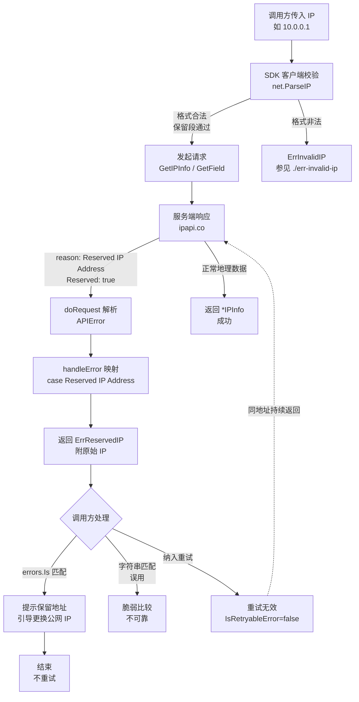
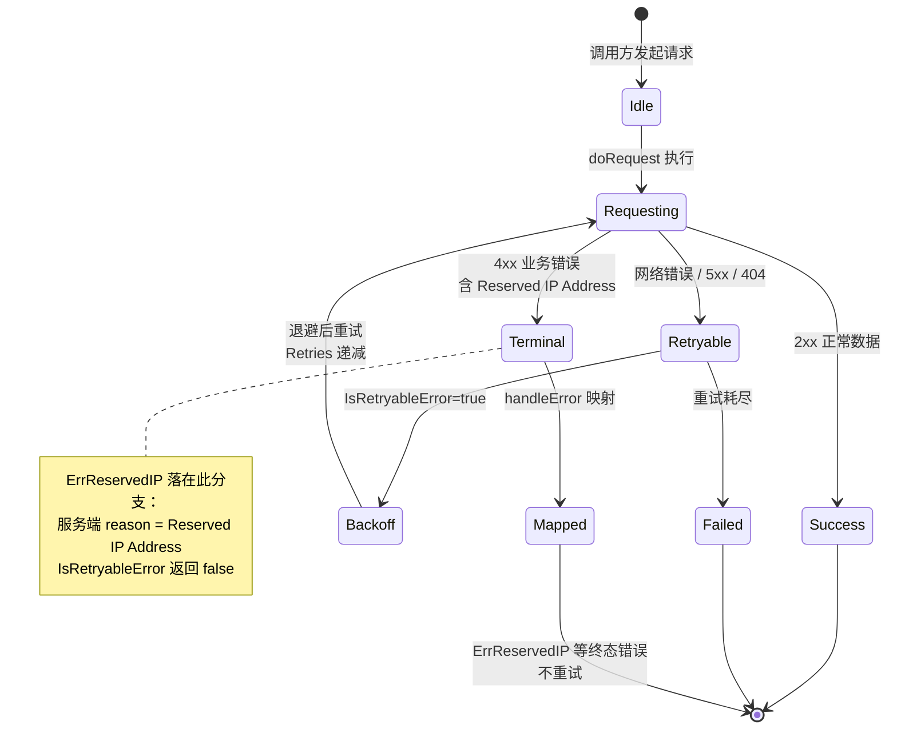

# 🚫 `ErrReservedIP` — 保留 IP 地址错误

> 当查询的目标 IP 属于私有、回环、链路本地等 **保留地址段**（如 `10.0.0.1`、`127.0.0.1`、`192.168.x.x`）时，服务端 `ipapi.co` 不提供地理位置归属信息，返回 `Reserved IP Address`，SDK 在 `handleError` 中将其映射为本错误。属于业务语义错误，**不可重试**。

::: tip 🎨 一图抵千言
以下决策流展示 `ErrReservedIP` 从触发到调用方处理的完整路径。注意保留地址在客户端格式校验阶段会**放行**，错误只能在服务端响应阶段被识别。



作为对照，可重试错误（[`ErrRateLimited`](./err-rate-limited)、[`ErrServerError`](./err-server-error)、[`ErrNotFound`](./err-not-found)）遵循的是**带退避的状态流转**，最终可恢复；而 `ErrReservedIP` 是终态业务错误，不进入该流转：


:::

---

## 📦 错误定义

```go
// ErrReservedIP 表示查询的 IP 属于保留地址段（私有/回环等）
var ErrReservedIP = errors.New("reserved IP address")
```

| 属性 | 值 |
| --- | --- |
| 🔣 符号 | `ipapi.ErrReservedIP` |
| 💬 本地消息 | `"reserved IP address"` |
| 🌐 服务端 Reason | `"Reserved IP Address"` |
| 🔁 可重试 | ❌ 否 |

---

## 🎯 触发场景

该错误在以下情形下会被触发：

1. **🌐 服务端返回 `Reserved IP Address`**
   传入的 IP 虽然格式合法（能通过 `net.ParseIP` 校验），但属于 IANA 划定的保留地址段，`ipapi.co` 对此类地址不维护地理位置数据，会在响应中以 `reason: "Reserved IP Address"` 标识。SDK 会将其映射为 `ErrReservedIP`。

   典型保留地址段：

   | 类别 | 示例网段 | 示例地址 |
   | --- | --- | --- |
   | 🔒 IPv4 私有地址（RFC 1918） | `10.0.0.0/8`、`172.16.0.0/12`、`192.168.0.0/16` | `10.0.0.1`、`192.168.1.1` |
   | 🔁 IPv4 回环地址 | `127.0.0.0/8` | `127.0.0.1` |
   | 🔗 IPv4 链路本地 | `169.254.0.0/16` | `169.254.1.1` |
   | 🧷 IPv4 测试网段 | `192.0.2.0/24`、`198.51.100.0/24` | `192.0.2.1` |
   | 🔒 IPv6 唯一本地地址 | `fc00::/7` | `fd00::1` |
   | 🔁 IPv6 回环地址 | `::1/128` | `::1` |
   | 🔗 IPv6 链路本地 | `fe80::/10` | `fe80::1` |

2. **🧪 客户端校验通过但语义非法**
   注意：与 `ErrInvalidIP` 不同，保留地址在格式上是合法的，`ValidateIP` 会放行；只有服务端的地理库判定其为保留段后才会触发本错误。

::: warning ⚠️ 常见误用
- **误把保留地址当作网络错误重试**：`ErrReservedIP` 属于业务语义错误，[`IsRetryableError`](../../api/errors) 对其返回 `false`，纳入退避重试队列只会反复命中同一响应，浪费配额。
- **误用字符串比较判断错误类型**：服务端 Reason 文案（`"Reserved IP Address"`）与 SDK 本地消息（`"reserved IP address"`）大小写与措辞均不同，务必使用 `errors.Is(err, ipapi.ErrReservedIP)` 精准匹配，而非 `strings.Contains`。
- **误以为客户端能前置拦截**：保留地址在格式上合法，`net.ParseIP` 会放行，本错误**只能**由服务端响应触发，无法通过客户端校验提前拦截。
- **混淆 [`ErrInvalidIP`](./err-invalid-ip) 与 `ErrReservedIP`**：前者是格式非法（解析失败），后者是格式合法但属保留段，二者触发阶段与处理方式完全不同。
:::

---

## 📍 触发位置

| 位置 | 说明 |
| --- | --- |
| `GetIPInfo` | 客户端格式校验通过、发起请求后，服务端返回 `reason: "Reserved IP Address"`，经 `handleError` 映射为 `ErrReservedIP`。 |
| `GetIPInfoRaw` | 同上，非 JSON 格式场景下也会由服务端响应触发。 |
| `GetField` | 查询保留 IP 的单个字段时，服务端同样会返回保留地址错误。 |
| `handleError` | 错误映射中枢：`case "Reserved IP Address": return fmt.Errorf("%w: %s", ErrReservedIP, apiErr.IP)`，将服务端 Reason 转译为 SDK 哨兵错误，并附上原始 IP。 |
| 响应解析层 | `doRequest` 在 `StatusCode >= 400` 时解码出 `*APIError`，其中 `Reserved: true` 与 `Reason: "Reserved IP Address"` 字段共同标识本情形。 |

---

## 💻 示例代码

```go
package main

import (
	"context"
	"errors"
	"fmt"
	"log"

	"github.com/cyberspacesec/ipapi"
)

func main() {
	client := ipapi.NewClient()
	ctx := context.Background()

	// 查询私有地址段，服务端返回 Reserved IP Address
	_, err := client.GetIPInfo(ctx, "10.0.0.1", "json")
	if err != nil {
		log.Printf("查询失败: %v", err) // 查询失败: reserved IP address: 10.0.0.1
	}

	// 使用 errors.Is 精准匹配
	fmt.Println(errors.Is(err, ipapi.ErrReservedIP)) // true
}
```

> ⚠️ 注意：保留地址在格式上合法，因此 `ipapi.ValidateIP("10.0.0.1")` 返回 `nil`；本错误只能由服务端响应触发，无法在客户端前置拦截。

---

## 🛠️ 错误处理

使用 `errors.Is` 精准匹配本错误，避免字符串比较带来的脆弱性：

```go
result, err := client.GetIPInfo(ctx, userInput, "json")
if err != nil {
	switch {
	case errors.Is(err, ipapi.ErrReservedIP):
		// 👉 目标 IP 属于保留地址段，无地理位置数据
		fmt.Println("该 IP 属于私有/回环等保留地址段，不提供地理信息")
		return
	case errors.Is(err, ipapi.ErrInvalidIP):
		// 参见 ./err-invalid-ip
		fmt.Println("请输入合法的 IPv4 / IPv6 地址，例如 8.8.8.8")
		return
	case errors.Is(err, ipapi.ErrRateLimited):
		// 参见 ./err-rate-limited
		handleRateLimited()
		return
	default:
		// 其他网络或解析错误
		log.Printf("未知错误: %v", err)
		return
	}
}
```

> 💡 提示：若业务侧只关心公网地理定位，可在调用前用 `net.IP.IsPrivate()`、`net.IP.IsLoopback()` 等方法预过滤保留地址，避免无效请求。

::: details 🔍 排查清单：收到 `ErrReservedIP` 时
当 `errors.Is(err, ipapi.ErrReservedIP)` 返回 `true` 时，按以下步骤定位根因：

1. **确认目标 IP 是否属保留段**：用 `net.ParseIP(ip)` 解析后调用 `.IsPrivate()`、`.IsLoopback()`、`.IsLinkLocalUnicast()`、`.IsUnspecified()` 验证；若任一为 `true`，则本错误符合预期。
2. **检查输入来源**：若 IP 来自用户输入或配置文件，确认是否误填了内网地址（如 `127.0.0.1`、`192.168.x.x`）或示例地址（如 `192.0.2.x`）。
3. **核对日志中的原始 IP**：SDK 在 `handleError` 中以 `fmt.Errorf("%w: %s", ErrReservedIP, apiErr.IP)` 附上原始 IP，检查该 IP 是否与预期一致。
4. **确认是否被误纳入重试**：检查重试逻辑是否调用 [`IsRetryableError`](../../api/errors)，本错误应返回 `false`，重试队列对其应跳过。
5. **业务侧预过滤**：在入口处用 `net.IP` 的 `IsPrivate()` / `IsLoopback()` 等方法过滤，从源头规避无效请求，参见上方示例代码。
6. **若确属公网 IP 却仍报错**：极少数情况下可能是 IP 段归属数据库未更新，可在 [ipapi.co 官网](https://ipapi.co) 手工查询同一 IP 复核，若一致则反馈给上游。
:::

---

## 🔁 可重试性

| 是否可重试 | ❌ 否 |
| --- | --- |

本错误源于 **目标 IP 本身属于保留地址段**，而非瞬时性故障（如网络抖动、限流）。对同一个保留地址重试任意次数，服务端都会持续返回 `Reserved IP Address`，因此：

- ❌ 不要纳入指数退避 / 自动重试队列
- ❌ `ipapi.IsRetryableError(err)` 对本错误返回 `false`
- ✅ 应当向调用方明确提示“保留地址无地理信息”，并引导更换为公网 IP

---

## 🔗 相关错误

- 🚫 [`ErrInvalidIP`](./err-invalid-ip) — IP 格式非法，`net.ParseIP` 解析失败，**不可重试**
- ⚡ [`ErrRateLimited`](./err-rate-limited) — 请求频率超限，**可重试**
- 🚫 [`ErrInvalidKey`](./err-invalid-key) — 无权限访问目标 IP
- 📭 [`ErrNotFound`](./err-not-found) — 查询结果为空，**可重试**
- 🌐 [`ErrServerError`](./err-server-error) — 底层网络异常，**可重试**
- 🧾 完整错误列表参见 [`错误总览`](../../api/errors)

---

## 👉 下一步

- 📖 阅读 [`API 参考 · 错误总览`](../../api/errors) 了解全部错误类型与映射关系
- 🧪 在 [示例代码#-示例代码) 中替换为不同保留地址（如 `127.0.0.1`、`192.168.1.1`、`::1`），观察触发行为
- 🛡️ 结合 `net.IP.IsPrivate()` / `IsLoopback()` 在入口做预过滤，从源头规避保留地址查询
