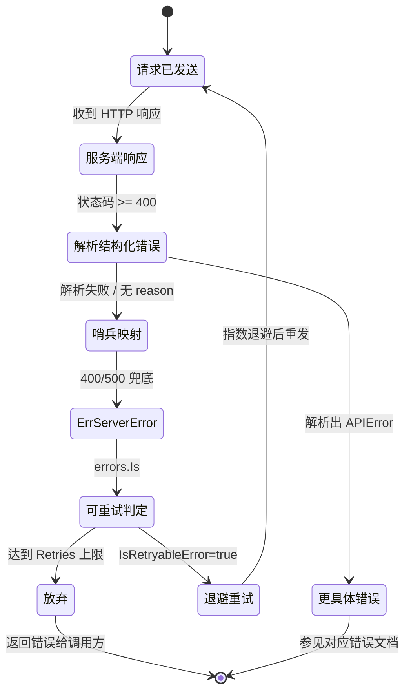
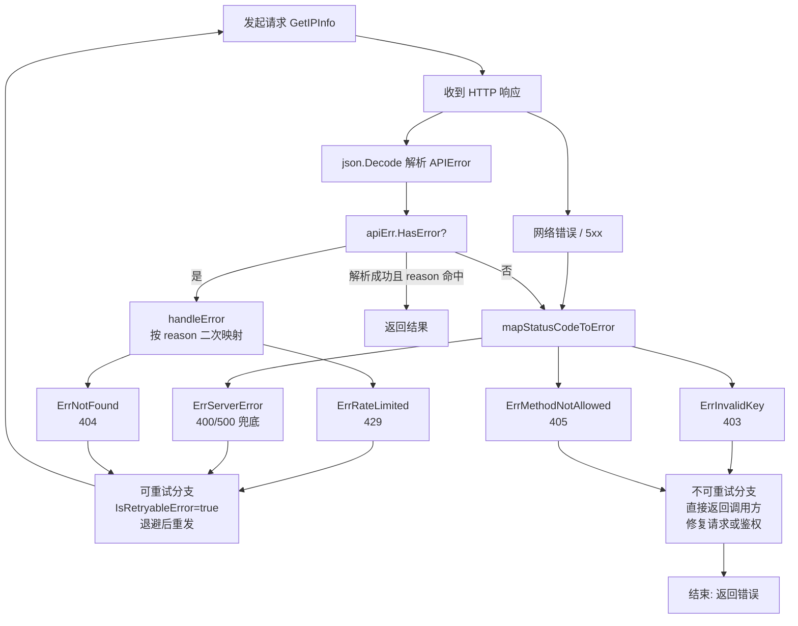

# 🖥️ `ErrServerError` — 服务端错误

> 当 `ipapi.co` 服务端返回 HTTP `400 Bad Request` 或 `5xx`（典型为 `500 Internal Server Error`）响应，且响应体未能解析出结构化 `APIError` 时，SDK 会将其兜底映射为 `ErrServerError`。该错误代表 **服务端侧故障**，通常具有瞬时性，**可重试**。

::: tip 🎨 一图抵千言
`ErrServerError` 属于 **可重试** 错误。下图展示一次请求从发出到最终判定「退避重试 / 放弃」的完整状态流转：



下图横向对照 **可重试** 与 **不可重试** 两类错误的触发 → 映射 → 处理决策流，便于区分 `ErrServerError` 在整体错误版图中的位置：


:::

---

## 📦 错误定义

```go
// ErrServerError 表示服务端返回了 4xx/5xx 错误（兜底）
var ErrServerError = errors.New("server error")
```

| 属性 | 值 |
| --- | --- |
| 🔣 符号 | `ipapi.ErrServerError` |
| 💬 本地消息 | `"server error"` |
| 🌐 服务端 Reason | （HTTP 400 / 500 兜底，无独立 reason 字段） |
| 📡 触发状态码 | `400 Bad Request`、`500 Internal Server Error` |
| 📍 触发位置 | `mapStatusCodeToError(400)` / `mapStatusCodeToError(500)` |
| 🔁 可重试 | ✅ 是 |

---

## 🎯 触发场景

该错误在 SDK 收到服务端 `4xx` / `5xx` 响应、且响应体不包含可识别的结构化错误时触发，常见诱因包括：

1. **🖥️ HTTP 500 服务端内部错误**
   `ipapi.co` 后端出现瞬时性故障（如服务过载、依赖组件抖动、内部异常），返回 `500 Internal Server Error`。此时响应体通常不是标准的 JSON 错误结构，SDK 走兜底逻辑映射为 `ErrServerError`。

2. **⚠️ HTTP 400 错误请求（兜底）**
   服务端判定请求存在问题（如查询参数异常、路由不匹配等），返回 `400 Bad Request`。当响应体无法解析为带 `reason` 字段的 `APIError` 时，`mapStatusCodeToError(400)` 会以 `ErrServerError: invalid request` 形式兜底返回。

3. **🧱 响应体非结构化**
   即使状态码是 4xx / 5xx，SDK 会优先尝试 `json.Decode` 解析响应体为 `*APIError`；只有当解析失败或 `apiErr.HasError` 为 `false` 时，才会落到 `mapStatusCodeToError`，最终归为 `ErrServerError`。

> 💡 关键点：`ErrServerError` 是 400 / 500 的 **兜底分类**。如果服务端返回了带 `reason` 的结构化错误（如 `RateLimited`、`Invalid IP Address`），SDK 会优先映射为更具体的错误，而非本错误。

---

## 📍 触发位置

| 位置 | 说明 |
| --- | --- |
| `mapStatusCodeToError(400)` | `case http.StatusBadRequest` 分支，返回 `fmt.Errorf("%w: invalid request", ErrServerError)`，将 400 兜底归入本错误。 |
| `mapStatusCodeToError(500)` | `case http.StatusInternalServerError` 分支，直接返回 `ErrServerError`。 |
| `doRequest` | 收到响应后，若 `resp.StatusCode >= 400`，先尝试解析结构化 `APIError`；解析失败时调用 `mapStatusCodeToError(resp.StatusCode)` 完成兜底映射。 |

源码片段（`pkg/ipapi/api.go`）：

```go
func (c *Client) mapStatusCodeToError(code int) error {
	switch code {
	case http.StatusBadRequest:
		return fmt.Errorf("%w: invalid request", ErrServerError)
	// ...
	case http.StatusInternalServerError:
		return ErrServerError
	// ...
	}
}
```

---

## 💻 示例代码

```go
package main

import (
	"context"
	"errors"
	"fmt"
	"log"
	"time"

	"github.com/cyberspacesec/ipapi"
)

func main() {
	client := ipapi.NewClient()
	ctx := context.Background()

	// 查询一个合法 IP；当服务端出现 5xx 抖动时，会返回 ErrServerError
	_, err := client.GetIPInfo(ctx, "8.8.8.8", "json")
	if err != nil {
		if errors.Is(err, ipapi.ErrServerError) {
			// 👉 服务端故障：可重试
			retry()
			return
		}
		log.Fatalf("查询失败: %v", err)
	}

	fmt.Println("查询成功")
}

// retry 演示对可重试错误执行简单的指数退避重试
func retry() {
	backoff := 500 * time.Millisecond
	for i := 0; i < 3; i++ {
		time.Sleep(backoff)
		backoff *= 2
		log.Printf("第 %d 次重试中...", i+1)
	}
}
```

> ⚠️ 排查建议：若本错误高频出现，可先用 `curl -i https://ipapi.co/8.8.8.8/json/` 直连验证服务端状态；若 `curl` 同样返回 5xx，说明是 `ipapi.co` 侧故障，等待恢复或启用重试即可。

---

## 🛠️ 错误处理

使用 `errors.Is` 精准匹配本错误，避免字符串比较带来的脆弱性：

```go
result, err := client.GetIPInfo(ctx, "8.8.8.8", "json")
if err != nil {
	switch {
	case errors.Is(err, ipapi.ErrServerError):
		// 👉 服务端 4xx/5xx 兜底故障：可重试
		if ipapi.IsRetryableError(err) {
			retry()
		}
		return
	case errors.Is(err, ipapi.ErrRateLimited):
		// 参见 ./err-rate-limited
		handleRateLimited()
		return
	case errors.Is(err, ipapi.ErrNotFound):
		// 参见 ./err-not-found
		handleNotFound()
		return
	case errors.Is(err, ipapi.ErrInvalidKey):
		// 参见 ./err-invalid-key
		handleUnauthorized()
		return
	default:
		// 其他网络或解析错误
		log.Printf("未知错误: %v", err)
		return
	}
}
```

> 💡 提示：`ErrServerError` 是 **可重试** 错误，推荐配合指数退避策略在调用方实现自动重试；SDK 内部的 `doRequest` 已对 5xx 做了有限次重试（受 `Client.Retries` 控制），但仍建议业务侧兜底。

::: warning ⚠️ 常见误用：用字符串比较判断错误
不要用 `strings.Contains(err.Error(), "server error")` 之类的方式判断本错误。`ErrServerError` 的消息文案可能随版本调整，且 400 兜底分支返回的是 `fmt.Errorf("%w: invalid request", ErrServerError)`，包装后的字符串不等于 `"server error"`。**始终用 [`errors.Is`](https://pkg.go.dev/errors) 配合 [`ipapi.ErrServerError`](./err-server-error) 精准匹配**，再用 [`ipapi.IsRetryableError`](../../api/errors) 统一判定可重试性。
:::

::: details 🔍 排查清单：ErrServerError 持续出现时怎么办
- [ ] 用 `curl -i https://ipapi.co/8.8.8.8/json/` 直连验证服务端是否同样返回 5xx
- [ ] 检查 `Client.Retries` 是否被设为 `0`（默认 `2`，最多请求 3 次）
- [ ] 确认是否高频触发 400 兜底——若响应体含 `reason` 字段，会被映射为更具体错误，应优先排查对应文档（如 [`ErrInvalidIP`](./err-invalid-ip)、[`ErrInvalidKey`](./err-invalid-key)）
- [ ] 查看 `ipapi.co` 状态页或公告，确认是否存在区域性故障
- [ ] 业务侧重试务必带指数退避，避免在服务端抖动期放大流量
:::

---

## 🔁 可重试性

| 是否可重试 | ✅ 是 |
| --- | --- |

本错误源于 **服务端侧瞬时性故障**（5xx 抖动、400 兜底），而非请求本身的确定性缺陷。下一次请求很可能恢复正常，因此：

- ✅ 应纳入指数退避 / 自动重试队列
- ✅ SDK 内部 `doRequest` 已对 `StatusCode >= 500` 的情况执行有限次重试（默认 `Retries = 2`，间隔 `500ms`）
- ✅ 业务侧可通过 `ipapi.IsRetryableError(err)` 统一判断是否可重试

源码佐证（`pkg/ipapi/errors.go`）：

```go
func IsRetryableError(err error) bool {
	return errors.Is(err, ErrRateLimited) ||
		errors.Is(err, ErrServerError) ||
		errors.Is(err, ErrNotFound)
	// ErrServerError 已被列入 → 可重试
}
```

---

## 🔗 相关错误

- ⚡ [`ErrRateLimited`](./err-rate-limited) — 请求频率超限，**可重试**
- 📭 [`ErrNotFound`](./err-not-found) — 查询结果为空，**可重试**
- 🔑 [`ErrInvalidKey`](./err-invalid-key) — API Key 缺失或无效
- 🚷 [`ErrMethodNotAllowed`](./err-method-not-allowed) — 请求方法被拒绝（HTTP 405）
- 🚫 [`ErrInvalidIP`](./err-invalid-ip) — 非法 IP 地址，**不可重试**
- 🧾 完整错误列表参见 [`ipapi` 错误总览](../../api/errors)

---

## 👉 下一步

- 📖 阅读 [API 参考：错误总览](../../api/errors) 了解全部错误类型与状态码映射关系
- 🔁 结合 `ipapi.IsRetryableError` 与指数退避，构建稳健的自动重试机制
- 🔍 用 `curl -i` 直连 `ipapi.co` 验证服务端状态，区分瞬时抖动与持续故障
