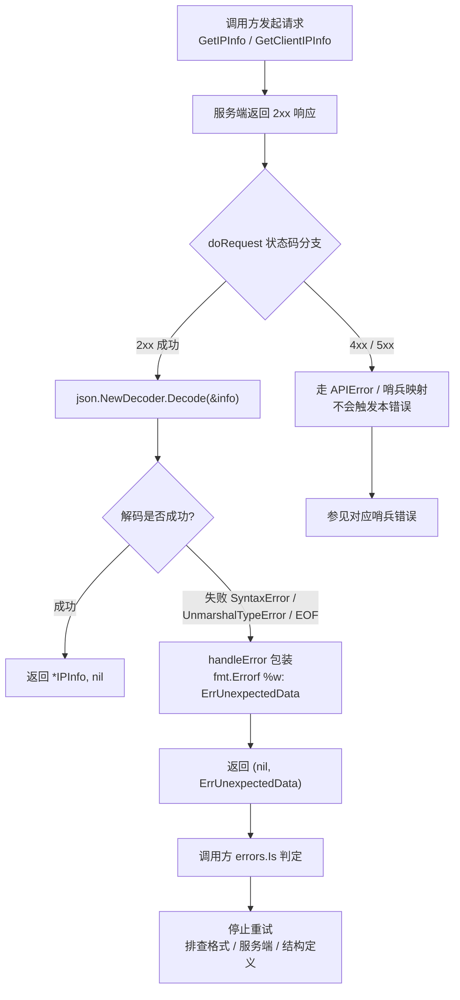
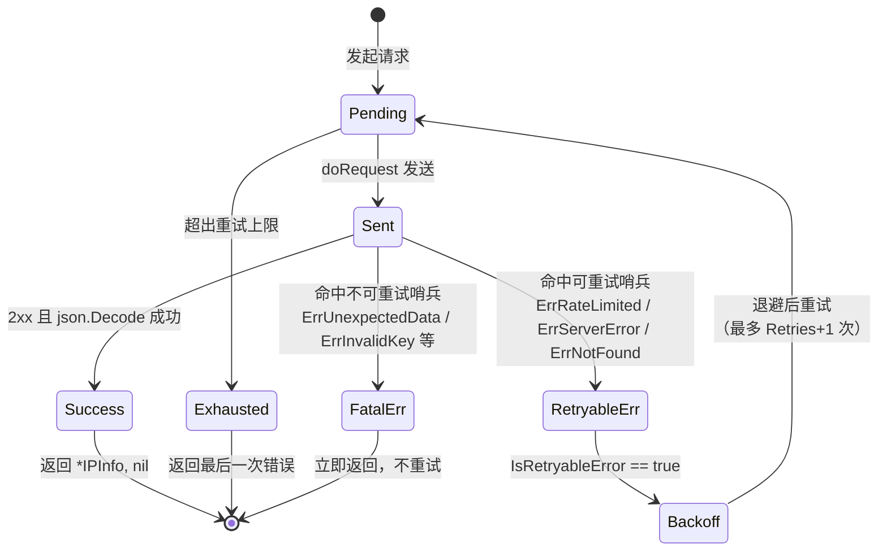

# 🧩 `ErrUnexpectedData` — 响应数据非预期

> 当 SDK 成功收到 HTTP 响应（状态码为 `2xx`），但响应体无法被 `json.Decode` 解码为 `IPInfo` 结构时，SDK 会将其映射为 `ipapi.ErrUnexpectedData`。该错误代表 **响应内容形态不符合预期**，通常源于服务端返回了非 JSON 结构或字段类型错配，属于 **确定性故障**，**不可重试**。

::: tip 🎨 一图抵千言
`ErrUnexpectedData` 属于 **不可重试** 错误，下图展示其从「触发条件」到「调用方处理」的完整决策流：



作为对比，下图展示 **可重试错误**（[`ErrRateLimited`](./err-rate-limited) / [`ErrServerError`](./err-server-error) / [`ErrNotFound`](./err-not-found)）的状态流转 —— 它们会进入「退避 → 重试」循环，直至成功或耗尽 `Retries` 次数；而 `ErrUnexpectedData` 属于 **不可重试** 分支，一次命中即终止：


:::

---

## 📦 错误定义

```go
// ErrUnexpectedData 表示响应体无法解码为预期的 IPInfo 结构
var ErrUnexpectedData = errors.New("unexpected response data")
```

| 属性 | 值 |
| --- | --- |
| 🔣 符号 | `ipapi.ErrUnexpectedData` |
| 💬 本地消息 | `"unexpected response data"` |
| 🌐 服务端 Reason | （解码失败，无可用 reason 字段） |
| 📡 触发状态码 | `2xx`（HTTP 层成功，内容层失败） |
| 📍 触发位置 | `GetIPInfo` / `GetClientIPInfo` 的 `json.Decode` 失败分支 |
| 🔁 可重试 | ❌ 否 |

::: tip 💡 与 `ErrServerError` 的区别
`ErrServerError` 处理的是 **HTTP 层错误**（4xx / 5xx 状态码）；而 `ErrUnexpectedData` 处理的是 **内容层错误** —— HTTP 请求本身成功返回 `2xx`，但响应体并非可解码的 JSON 结构。两者位于不同代码路径，互不重叠。
:::

---

## 🎯 触发场景

该错误在响应体通过 `json.NewDecoder(resp.Body).Decode(&info)` 解码失败时触发，常见诱因包括：

1. **🧱 响应体非 JSON 结构**
   服务端在 `2xx` 下返回了 HTML 错误页、纯文本、XML 或空文档等非 JSON 内容，`json.Decoder` 无法识别首字节为合法 JSON token，立即抛出 `json.SyntaxError`。

2. **🔡 字段类型错配**
   响应体是合法 JSON，但某个字段类型与 `IPInfo` 定义冲突（例如 `latitude` 返回为字符串 `"37.7749"` 而结构体声明为 `float64`），`json.Decode` 抛出 `json.UnmarshalTypeError`。

3. **🌫️ 响应体被截断 / 为空**
   网络中途断流、代理缓冲异常或服务端输出提前结束，导致响应体不完整或完全为空，`json.Decoder` 抛出 `io.EOF` 或 `io.ErrUnexpectedEOF`。

4. **🔀 端点与格式错配**
   调用方传入的 `format` 与 `GetIPInfo` 期望的 JSON 解码行为不匹配。`GetIPInfo` / `GetClientIPInfo` 内部固定按 JSON 解码；若 `format` 为 `xml` / `csv` / `yaml` / `jsonp`，服务端会返回对应格式的非 JSON 内容，解码必然失败。对于非 JSON 格式，应改用 [`GetIPInfoRaw`](../../api/get-ip-info-raw) / [`GetClientIPInfoRaw`](../../api/get-client-ip-info-raw) 获取原始字节。

> 💡 关键点：`ErrUnexpectedData` 永远发生在 **HTTP 成功之后**。如果请求本身返回 4xx / 5xx，会先被 `doRequest` 的状态码分支或结构化 `APIError` 解析拦截，不会走到 `json.Decode` 这一步。

::: details 🔍 触发条件排查清单
对照以下清单逐一排查本错误的根因：

- [ ] **响应体是否为 JSON？** 用 `curl -i` 直连，查看 `Content-Type` 与首字节；HTML / 纯文本 / 空文档都会触发。
- [ ] **`format` 参数是否为 `json`？** `GetIPInfo` / `GetClientIPInfo` 内部固定按 JSON 解码，传入 `xml` / `csv` / `yaml` / `jsonp` 必然失败 —— 应改用 `Raw` 变体。
- [ ] **响应体是否被截断？** 代理缓冲异常、网络中途断流会导致 `io.ErrUnexpectedEOF`。
- [ ] **字段类型是否错配？** 例如 `latitude` 返回字符串而 `IPInfo` 声明 `float64`，触发 `*json.UnmarshalTypeError`。
- [ ] **服务端是否处于维护态？** 维护期间常在 `2xx` 下返回 HTML 页面。
:::

---

## 📍 触发位置

`ErrUnexpectedData` 有两个对称的触发点，分别对应「指定 IP 查询」与「客户端自身 IP 查询」：

| 位置 | 说明 |
| --- | --- |
| `GetIPInfo` | 查询指定 IP 时，对 `resp.Body` 执行 `json.Decode(&info)`；失败则包装为 `ErrUnexpectedData`。 |
| `GetClientIPInfo` | 查询客户端自身 IP 时，同样执行 `json.Decode(&info)`；失败路径与 `GetIPInfo` 一致。 |

源码片段（`pkg/ipapi/api.go`，两处实现完全对称）：

```go
var info IPInfo
if err := json.NewDecoder(resp.Body).Decode(&info); err != nil {
	return nil, c.handleError(fmt.Errorf("%w: %v", ErrUnexpectedData, err))
}

info.RetrievedAt = time.Now().UTC()
return &info, nil
```

> 📌 注意 `fmt.Errorf("%w: %v", ErrUnexpectedData, err)` 用 `%w` 包装 `ErrUnexpectedData`、用 `%v` 附带原始解码错误。因此调用方既能用 `errors.Is(err, ipapi.ErrUnexpectedData)` 精准命中，又能从错误字符串中看到底层 `json` 解码细节（如 `invalid character '<' looking for beginning of value`）。

---

## 💻 示例代码

```go
package main

import (
	"context"
	"errors"
	"fmt"
	"log"

	"github.com/cyberspacesec/ipapi"
)

func main() {
	client := ipapi.NewClient()
	ctx := context.Background()

	// 通常服务端返回非预期结构（例如 2xx 但响应体为 HTML 维护页或非 JSON 内容），
	// 此时 HTTP 层成功，json.Decode 失败，SDK 返回 ErrUnexpectedData。
	info, err := client.GetIPInfo(ctx, "8.8.8.8", "json")
	if err != nil {
		if errors.Is(err, ipapi.ErrUnexpectedData) {
			// 👉 响应内容不可解码：不要重试，应排查格式或服务端输出
			log.Printf("响应数据非预期: %v", err)
			return
		}
		log.Fatalf("查询失败: %v", err)
	}

	fmt.Printf("查询成功: %s / %s\n", info.IP, info.City)
}
```

> ⚠️ 排查建议：若本错误出现，可先用 `curl -i https://ipapi.co/8.8.8.8/json/` 直连查看 `Content-Type` 与响应体首字节。若返回的是 HTML 或空文档，说明是服务端维护 / 网关异常；若返回合法 JSON 但字段类型异常，则需核对 `IPInfo` 结构定义是否与服务端实际输出一致。

---

## 🛠️ 错误处理

使用 `errors.Is` 精准匹配本错误，避免字符串比较带来的脆弱性：

```go
info, err := client.GetIPInfo(ctx, "8.8.8.8", "json")
if err != nil {
	switch {
	case errors.Is(err, ipapi.ErrUnexpectedData):
		// 👉 响应内容不可解码：确定性故障，不应重试
		log.Printf("响应数据非预期: %v", err)
		return
	case errors.Is(err, ipapi.ErrServerError):
		// 参见 ./err-server-error：服务端 4xx/5xx，可重试
		retry()
		return
	case errors.Is(err, ipapi.ErrRateLimited):
		// 参见 ./err-rate-limited：触发限流，可重试
		handleRateLimited()
		return
	case errors.Is(err, ipapi.ErrInvalidKey):
		// 参见 ./err-invalid-key：API Key 无效，不可重试
		handleUnauthorized()
		return
	default:
		// 其他网络或解析错误
		log.Printf("未知错误: %v", err)
		return
	}
}
```

::: warning ⚠️ 不要直接比较
不要使用 `err == ipapi.ErrUnexpectedData` 直接比较。SDK 通过 `fmt.Errorf("%w: ...", ErrUnexpectedData, ...)` 包装了原始解码错误，直接比较恒为 `false`。必须使用 `errors.Is` 解包判定。
:::

::: warning 🚫 常见误用：对非 JSON 格式调用 GetIPInfo
`GetIPInfo` / `GetClientIPInfo` 内部固定按 `json.Decode` 解码。若你的 `format` 是 `xml` / `csv` / `yaml` / `jsonp`，服务端会返回对应格式的非 JSON 内容，解码必然失败并命中 `ErrUnexpectedData`。

正确做法：对非 JSON 格式改用 [`GetIPInfoRaw`](../../api/get-ip-info-raw) / [`GetClientIPInfoRaw`](../../api/get-client-ip-info-raw) 获取原始字节，由调用方自行解码；或先用 [`ValidateFormat`](../../api/validate-format) 校验格式合法性。
:::

> 💡 提示：若需要拿到原始 `json.Decode` 错误（如 `*json.SyntaxError`、`*json.UnmarshalTypeError`）做精细化处理，可用 `errors.As` 进一步解包，或直接从 `err.Error()` 字符串中读取底层错误描述。

---

## 🔁 可重试性

| 是否可重试 | ❌ 否 |
| --- | --- |

本错误源于 **响应内容形态的确定性错配**，而非服务端瞬时性故障。相同请求重试会得到相同的非预期内容，重试无意义：

- ❌ 不应纳入自动重试队列
- ❌ SDK 内部 `doRequest` 的重试逻辑仅覆盖网络错误与 `5xx`，不会因 `json.Decode` 失败而重试
- ❌ `IsRetryableError` 未将 `ErrUnexpectedData` 列入可重试集合

源码佐证（`pkg/ipapi/errors.go`）：

```go
func IsRetryableError(err error) bool {
	return errors.Is(err, ErrRateLimited) ||
		errors.Is(err, ErrServerError) ||
		errors.Is(err, ErrNotFound)
	// ErrUnexpectedData 未列入 → 不可重试
}
```

对 `ErrUnexpectedData` 调用 `IsRetryableError` 将返回 `false`。

::: warning 🚫 常见误用：对 `ErrUnexpectedData` 触发自动重试
部分调用方会写出如下「一刀切」的重试逻辑：只要 `err != nil` 就退避重试。这种写法对 [`ErrRateLimited`](./err-rate-limited) / [`ErrServerError`](./err-server-error) / [`ErrNotFound`](./err-not-found) 是合理的，但对 `ErrUnexpectedData` 会 **白白浪费配额** —— 相同请求重试必然得到相同的非 JSON 内容。

正确做法：在重试前用 `IsRetryableError(err)` 或 `errors.Is(err, ipapi.ErrUnexpectedData)` 显式过滤，将 `ErrUnexpectedData` 直接走失败分支，不进入重试队列。
:::

::: details 🧰 可重试 vs 不可重试 快速判定清单
- [ ] 是否先调用 `ipapi.IsRetryableError(err)` 判定？命中即重试，未命中即终止。
- [ ] 是否用 `errors.Is(err, ipapi.ErrUnexpectedData)` 兜底，避免把内容层错误当作网络层错误重试？
- [ ] 重试循环是否设置了 `Retries` 上限（默认 `2`，即最多请求 `3` 次），防止无限重试？
- [ ] 对非 JSON 格式是否已改用 [`GetIPInfoRaw`](../../api/get-ip-info-raw) / [`GetClientIPInfoRaw`](../../api/get-client-ip-info-raw)，从源头避免 `ErrUnexpectedData`？
:::

::: tip ✅ 正确做法
停止重试，转而排查：(1) 调用方是否为非 JSON 格式错误地选用了 `GetIPInfo` / `GetClientIPInfo`（应改用 `Raw` 变体）；(2) 服务端是否处于维护态返回了非 JSON 内容；(3) `IPInfo` 结构定义是否与服务端实际输出存在字段类型偏差。
:::

---

## 🔗 相关错误

- 🖥️ [`ErrServerError`](./err-server-error) — 服务端 4xx/5xx 兜底故障，**可重试**
- ⚡ [`ErrRateLimited`](./err-rate-limited) — 请求频率超限，**可重试**
- 📭 [`ErrNotFound`](./err-not-found) — 查询结果为空，**可重试**
- 🔑 [`ErrInvalidKey`](./err-invalid-key) — API Key 无效，**不可重试**
- 🚫 [`ErrInvalidIP`](./err-invalid-ip) — 非法 IP 地址，**不可重试**
- 🏷️ [`ErrReservedIP`](./err-reserved-ip) — 保留 IP 地址，**不可重试**
- 🧾 完整错误列表参见 [`APIError 与哨兵错误`](../../api/errors)

---

## 👉 下一步

- 📖 阅读 [`API 参考`](../../api/errors) 了解全部错误类型与状态码映射关系
- 🔄 若需处理非 JSON 格式（`xml` / `csv` / `yaml` / `jsonp`），改用 [`GetIPInfoRaw`](../../api/get-ip-info-raw) / [`GetClientIPInfoRaw`](../../api/get-client-ip-info-raw) 获取原始字节
- 🧪 参考 [`错误处理示例`](../../examples/error-handling) 编写健壮的容错逻辑
