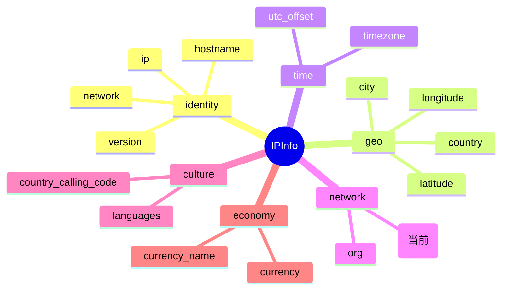

# 🌐 字段详解：asn

> 🏷️ 字段类别：**ASN（自治系统）** · 🔑 JSON Key：`asn` · 🐹 Go 字段：`IPInfo.ASN`

本页详细介绍 `ipapi.co` 返回的 `asn` 字段，涵盖其定义、含义、类型说明、访问方式与典型用途。

::: tip 🎨 一图抵千言
`asn` 字段在 `IPInfo` 结构中的位置、所属分组与相关字段关系：



`asn` 归属 **network（网络）** 分组，与同组的 [`org`](./org) 配套使用：`asn` 给出自治系统编号，`org` 给出对应组织名称。
:::

---

## 📐 字段定义

`asn` 在 `IPInfo` 结构体中的定义如下（对应 JSON tag 行）：

```go
ASN string `json:"asn"`
```

完整结构体位于 [`models.go`](https://github.com/cyberspacesec/ipapi.co-skills/blob/main/pkg/ipapi/models.go)：

```go
type IPInfo struct {
	// ... 其他字段
	ASN string `json:"asn"`
	Org string `json:"org"`
	// ...
}
```

---

## 📖 含义

🌐 **自治系统号（Autonomous System Number，ASN）**，即目标 IP 地址所归属网络的自治系统编号。

- 🏢 自治系统（AS）是互联网路由的最小管理单元，通常对应一个 ISP、大型企业或云服务商的网络。
- 🔢 形如 `AS15169`：前缀 `AS` 加上一串数字，`15169` 即该 AS 的编号。
- 🧭 与 `org` 字段配套使用：`asn` 给出编号，`org` 给出对应组织名称（如 `Google LLC`）。
- 🌍 借助 ASN 可在 BGP/路由层面定位流量来源，是网络归属判断的可靠依据。

---

## 🔬 类型说明

### 🐹 `string` 普通字符串类型

`ASN` 字段的 Go 类型是 **`string`**，而非指针类型。这意味着：

| 情况 | 表现 |
|------|------|
| 数据存在 | `"AS15169"` |
| 数据缺失 | 空字符串 `""` |

✅ 作为普通 `string`，它**无需判空指针**，直接读取即可，不会触发 panic。

### 🛡️ 关于访问器方法

- 📌 与指针字段（如 `Postal *string` 配套 `GetPostal()`）不同，`ASN` 是普通 `string`，SDK **未为其提供专门的 `GetASN()` 访问器**。
- 🚀 直接通过 `info.ASN` 读取即可，简洁且安全。

### 🏷️ 关于 `omitempty`

- 📝 `asn` 字段的 JSON tag 为 `json:"asn"`，**没有附加 `omitempty`**。
- 🧩 这意味着在序列化 `IPInfo` 为 JSON 时，即使 `ASN` 为空字符串 `""`，键 `"asn"` 仍会被输出（值为 `""`）。
- ⚖️ 对比同结构体中 `Hostname` 字段：`json:"hostname,omitempty"`，使用了 `omitempty`，零值时该键会被省略。
- 💡 因此反序列化时若响应中 `asn` 缺失，`ASN` 会保持零值 `""`。

---

## 📝 示例值

📦 典型 JSON 响应片段：

```json
{
  "ip": "8.8.8.8",
  "asn": "AS15169",
  "org": "Google LLC"
}
```

- 🔢 示例值：`AS15169`
- 🌐 这是 Google LLC 的自治系统编号，`8.8.8.8`（Google Public DNS）即归属该 AS。

---

## 🧰 访问方式

SDK 提供三种方式获取 `asn`，按场景选择即可。

### 1️⃣ 结构体字段访问（批量查询后）

调用 `GetLocation` / `GetIPInfo` 拿到完整 `IPInfo` 后，直接读字段：

```go
package main

import (
	"context"
	"fmt"
	"log"

	"github.com/cyberspacesec/ipapi.co-skills/pkg/ipapi"
)

func main() {
	client, err := ipapi.NewClient()
	if err != nil {
		log.Fatal(err)
	}

	info, err := client.GetLocation(context.Background(), "8.8.8.8")
	if err != nil {
		log.Fatal(err)
	}

	// ✅ 普通 string 字段，直接读取
	fmt.Println("ASN:", info.ASN) // AS15169
}
```

### 2️⃣ `GetField` 单字段查询（指定 IP）

仅查询单个字段，节省带宽与解析开销：

```go
// 查询 8.8.8.8 的自治系统号
asn, err := client.GetField(ctx, "8.8.8.8", "asn")
if err != nil {
	log.Fatal(err)
}
fmt.Println("ASN:", asn) // AS15169
```

- 🎯 `GetField(ctx, ip, field)` 中的 `field` 必须是 SDK 已校验的合法字段名（`asn` 已被列入 `validFields`）。
- 📤 返回的是原始字符串（ipapi.co 单字段接口直接返回纯文本，如 `"AS15169"`）。

### 3️⃣ `GetClientField` 单字段查询（客户端 IP）

查询**调用方自身出口 IP** 的 `asn`（无需传入 IP 参数）：

```go
asn, err := client.GetClientField(ctx, "asn")
if err != nil {
	log.Fatal(err)
}
fmt.Println("My ASN:", asn)
```

- 🪪 适合“查我自己的网络归属”这类场景。
- 🧪 `GetClientField(ctx, field)` 内部请求 ipapi.co 的 `check` 接口。

---

## 🎯 用途

🌐 `asn` 字段常见用途包括：

- 🏢 **网络归属识别**：通过 ASN 判断流量来自哪个 ISP、云厂商或企业网络，常与 `org` 配合展示。
- 🛡️ **安全与风控**：依据 ASN 黑白名单拦截可疑网络，或识别代理/云出口流量，辅助反欺诈。
- 📊 **流量分析**：按 ASN 聚合访问数据，生成网络来源分布报表与拓扑视图。
- 🚦 **智能路由**：结合 ASN 做地理/网络级的流量调度与内容分发策略。
- 🔍 **资产盘点**：盘点自有 IP 段的 ASN 归属，核验 BGP 公告与服务商一致性。

---

## 🔗 相关字段

- 📋 [字段总览](../../api/fields) —— 所有可查询字段的完整清单。
- 🌐 [ASN 类字段](../../api/field-asn) —— `asn` 所属的“ASN”分类页，包含 `asn`、`org` 等同类字段。

---

## ➡️ 下一步

- 🚀 尝试用 `client.GetField(ctx, "8.8.8.8", "asn")` 跑一个最小示例。
- 🏢 阅读 [ASN 类字段](../../api/field-asn)，了解 `asn` 与 `org` 如何组合刻画网络归属。
- 📖 查看 [`models.go`](https://github.com/cyberspacesec/ipapi.co-skills/blob/main/pkg/ipapi/models.go) 中 `IPInfo` 的完整字段定义。
- 🔍 探索 [字段总览](../../api/fields)，规划你需要的批量查询字段组合。

---

::: details 📋 字段速查

| 项目 | 值 |
|------|------|
| 🔑 JSON Key | `asn` |
| 🐹 Go 字段 | `IPInfo.ASN` |
| 📦 类型 | `string` |
| 🏷️ 分组 | network（网络） |
| 📝 示例值 | `AS15169` |
| 🔗 相关字段 | [`org`](./org) |
| 📤 单字段查询 | `client.GetField(ctx, ip, "asn")` |
| 🪪 自身 IP 查询 | `client.GetClientField(ctx, "asn")` |

:::

