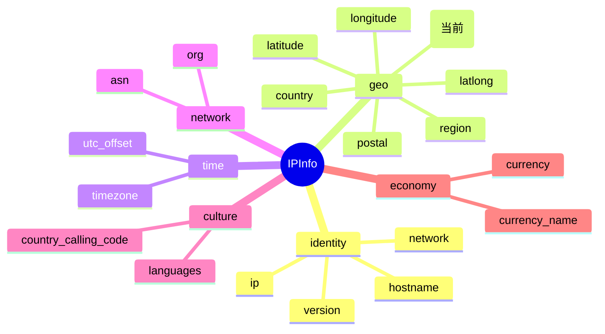

# 🏙️ city

> 城市名（英文） — IP 所属地理城市字段。

::: tip 🎨 一图抵千言
`city` 在 `IPInfo` 结构中隶属于 **geo（地理）** 分组，与 `region`、`country`、`postal`、`latitude`、`longitude` 等同组，描述 IP 的地理归属。


:::

## 📐 字段定义

`IPInfo` 结构体中 `city` 字段的定义如下：

```go
City string `json:"city"`
```

- **JSON key**：`city`
- **Go 字段**：`IPInfo.City`
- **Go 类型**：`string`
- **字段类别**：地理（Geo）

## 📖 含义

`city` 表示目标 IP 地址所属的**城市名称**，由 ipapi.co 基于地理定位数据库解析返回。

该值为英文城市名（例如 `Mountain View`、`Beijing`、`Tokyo`），不包含国家、地区等上层信息，仅代表城市一级的地理归属。对于无法精确到城市级别的 IP，可能返回空字符串。

## 🔬 类型说明

`City` 是一个普通的 `string` 字段，**不是指针类型**，可以直接读取，无需解引用。

需要特别留意的是：与 `city` 同属地理分组的 `Postal` 字段被声明为 `*string` 指针类型，原因在于当某些 IP 不存在邮政编码时，JSON 中不会出现该键，指针可清晰地表达「键不存在」与「键存在但为空字符串」的区别。针对 `Postal`，SDK 提供了 `GetPostal()` 方法进行安全访问：

```go
// Postal 是 *string 指针字段，使用 GetPostal() 安全访问
postal := info.GetPostal() // 为 nil 时返回 ""

// 而 City 是普通 string，直接访问即可
city := info.City
```

此外，结构体中部分字段（如 `hostname`）在 tag 中带有 `omitempty`，表示当值为零值时在 JSON 序列化时被省略；`city` 本身未带 `omitempty`，反序列化时若 JSON 缺少该键则保持 `string` 零值（即空字符串 `""`）。

## 📝 示例值

```text
Mountain View
```

其他常见示例：

| IP          | city 示例值   |
| ----------- | ------------- |
| 8.8.8.8     | Mountain View |
| 1.1.1.1     | Los Angeles   |
| 114.114.114.114 | Beijing   |

## 🛠️ 访问方式

### 1. 结构体字段访问

通过 `GetIPInfo` 获取完整的 `IPInfo` 结构后，直接访问 `City` 字段：

```go
package main

import (
    "context"
    "fmt"

    "github.com/cyberspacesec/ipapi.co-skills/pkg/ipapi"
)

func main() {
    client := ipapi.NewClient()
    info, err := client.GetIPInfo(context.Background(), "8.8.8.8", "json")
    if err != nil {
        panic(err)
    }
    fmt.Println("city:", info.City) // city: Mountain View
}
```

### 2. GetField 单字段查询

只需查询单个字段时，使用 `GetField` 直接向 API 请求该字段，避免传输整份 JSON：

```go
client := ipapi.NewClient()

city, err := client.GetField(context.Background(), "8.8.8.8", "city")
if err != nil {
    panic(err)
}
fmt.Println("city:", city) // city: Mountain View
```

对应 API 端点：`GET https://ipapi.co/8.8.8.8/city/`

### 3. GetClientField 查询本机字段

查询**调用方自身出口 IP** 的 `city` 字段时，使用 `GetClientField`：

```go
client := ipapi.NewClient()

city, err := client.GetClientField(context.Background(), "city")
if err != nil {
    panic(err)
}
fmt.Println("my city:", city)
```

对应 API 端点：`GET https://ipapi.co/city/`

## 🎯 用途

`city` 字段的典型应用场景包括：

- 🌐 **地理定位展示**：在用户画像、访问日志中标注访客所在城市。
- 📊 **区域统计分析**：按城市维度聚合流量、订单、异常等业务数据。
- 🧭 **本地化内容分发**：根据城市推荐就近服务、本地天气或新闻。
- 🛡️ **风控与安全审计**：比对登录城市与历史城市，识别异常登录。
- 🗺️ **地图可视化**：配合 `latitude` / `longitude` 在地图上标注城市点位。

## 🔗 相关字段

- 📋 [字段总览](../../api/fields) — 所有可用字段一览。
- 🌍 [地理字段分类](../../api/field-geo) — `city` 所属的地理分组（含 `region`、`country`、`postal`、`latitude`、`longitude` 等）。

## ➡️ 下一步

- 查阅 [`region` 字段详解](./region)，了解 `city` 上一级行政区信息。
- 阅读 [API 参考总览](../../api/fields)，掌握全部字段及其分类。
- 查看 [GetField 用法示例](../../api/get-field)，深入理解单字段查询的最佳实践。

::: details 📋 字段速查

| 项          | 值                  |
| ----------- | ------------------- |
| **JSON key**    | `city`              |
| **Go 字段**     | [`IPInfo.City`](../../api/fields) |
| **Go 类型**     | `string`            |
| **分组**       | geo（地理）         |
| **示例值**     | `Mountain View`     |
| **相关字段**   | [`region`](./region)、[`country`](./country)、[`postal`](./postal)、[`latitude`](./latitude)、[`longitude`](./longitude)、[`latlong`](./latlong) |
| **查询方法**   | [`GetIPInfo`](../../api/get-ip-info)、[`GetField`](../../api/get-field)、[`GetClientField`](../../api/get-client-field) |
:::
