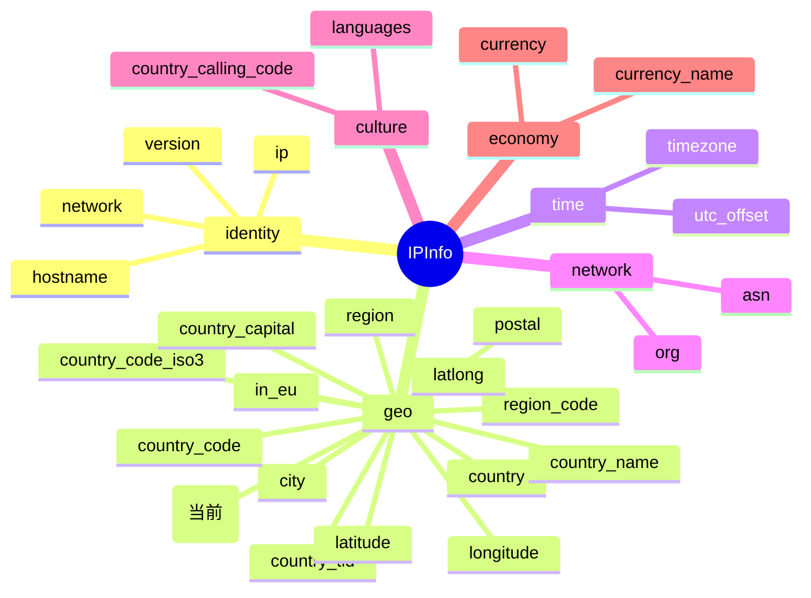

# 🌍 continent_code — 洲代码

> 🏷️ 字段类别：**国家** · 🔑 JSON Key：`continent_code` · 🧩 Go 字段：`IPInfo.ContinentCode`

::: tip 🎨 一图抵千言
`continent_code` 属于 `geo`（地理）分组，用于在洲级粒度上定位 IP 归属。下图展示其在 [`IPInfo`](../../api/fields) 结构中的位置与相关字段关系（当前字段以 **(当前)** 标注）：


:::

---

## 📐 字段定义

`IPInfo` 结构体中对应的 JSON tag 行如下：

```go
ContinentCode string `json:"continent_code"`
```

完整的字段定义位于 [`models.go`](https://github.com/cyberspacesec/ipapi.co-skills/blob/main/pkg/ipapi/models.go) 的 `IPInfo` 结构体内。

---

## 📖 含义

🎯 `continent_code` 表示目标 IP 地址所属的 **大洲代码（continent code）**。

- 🌎 例如：`NA` 代表北美洲（North America）
- 🌍 例如：`EU` 代表欧洲（Europe）
- 🌏 例如：`AS` 代表亚洲（Asia）
- 🌎 例如：`SA` 代表南美洲（South America）
- 🌍 例如：`AF` 代表非洲（Africa）
- 🌏 例如：`OC` 代表大洋洲（Oceania）
- 🧊 例如：`AN` 代表南极洲（Antarctica）

该代码用于在更粗的地理粒度上划分 IP 的归属，常用于大区级别的流量统计、合规分区与内容分发策略。

---

## 🔬 类型说明

| 属性 | 值 |
| --- | --- |
| Go 类型 | `string` |
| JSON Key | `continent_code` |
| 是否指针字段 | ❌ 否（直接为 `string`，非 `*string`） |
| 是否 omitempty | ❌ 否 |

### ⚠️ 关于指针字段与 `omitempty` 的特别说明

`ContinentCode` 本身是普通的 `string` 类型，**不是** 指针字段，因此可以直接访问，无需判空。

但 `IPInfo` 结构体中确实存在指针类型字段，例如：

```go
Postal *string `json:"postal"`
```

对于这类 `*string` 指针字段：

- 🚫 直接解引用 `*info.Postal` 在值为 `nil` 时会触发 **panic**
- ✅ SDK 提供了安全访问方法 `GetPostal()`，内部已做 nil 判断：

```go
func (info *IPInfo) GetPostal() string {
    if info.Postal == nil {
        return ""
    }
    return *info.Postal
}
```

对于带有 `omitempty` 的字段（如 `Hostname string \`json:"hostname,omitempty"\``），当 API 返回中不包含该字段时，Go 端会保留零值（空字符串），调用方需自行处理空值语义。而 `continent_code` 既非指针也非 `omitempty`，访问最为直接。

---

## 📌 示例值

```text
NA
```

常见取值参考：

| 大洲 | continent_code |
| --- | --- |
| 北美洲 | `NA` |
| 欧洲 | `EU` |
| 亚洲 | `AS` |
| 南美洲 | `SA` |
| 非洲 | `AF` |
| 大洋洲 | `OC` |
| 南极洲 | `AN` |

---

## 🛠️ 访问方式

### 1️⃣ 结构体字段访问

通过 `GetIPInfo` 拿到完整的 `*IPInfo` 后，直接读取字段：

```go
package main

import (
    "context"
    "fmt"
    "log"

    "github.com/cyberspacesec/ipapi.co-skills/pkg/ipapi"
)

func main() {
    client := ipapi.NewClient()
    info, err := client.GetIPInfo(context.Background(), "8.8.8.8", "json")
    if err != nil {
        log.Fatal(err)
    }

    // 直接访问 ContinentCode 字段
    fmt.Println("洲代码:", info.ContinentCode) // 输出: NA
}
```

### 2️⃣ GetField 单字段查询

只需查询 `continent_code` 这一个字段时，使用 `GetField` 更轻量，仅发起一次单字段请求：

```go
code, err := client.GetField(ctx, "8.8.8.8", "continent_code")
if err != nil {
    log.Fatal(err)
}
fmt.Println("洲代码:", code) // 输出: NA
```

> 💡 `GetField` 返回的是原始字符串（API 原始响应体），无需解析整个 JSON，适合只关心单个字段的场景。

### 3️⃣ GetClientField 查询本机 IP 的字段

查询**当前发起请求的客户端 IP** 的 `continent_code`（不传 IP 参数，对应 `GET /{field}/` 端点）：

```go
code, err := client.GetClientField(ctx, "continent_code")
if err != nil {
    log.Fatal(err)
}
fmt.Println("本机 IP 洲代码:", code)
```

> 🧭 `GetField` 与 `GetClientField` 的区别：前者需要显式传入目标 IP（`GET /{ip}/{field}/`），后者针对调用方自身 IP（`GET /{field}/`）。

---

## 🎯 用途

`continent_code` 在实际业务中应用广泛，典型场景包括：

- 🌍 **大区级地理定位**：在比国家更粗的粒度上划分用户归属，用于大区内容分发与语言兜底。
- 🛡️ **风控与反欺诈**：结合 [`in_eu`](./in_eu) 识别跨大洲的异地登录、批量注册等可疑行为。
- ⚖️ **合规与区域限制**：依据 GDPR 等法规，对欧洲（`EU`）等大区流量做统一的隐私合规处理。
- 📊 **统计分析**：按大洲维度聚合访问量、用户分布等业务指标，绘制全球流量热力图。
- 🚚 **内容与定价策略**：根据大洲匹配默认货币、运费模板、可用支付方式。
- 🔁 **与国家代码互补**：与 [`country_code`](./country_code)（如 `US`）配合使用，先做大洲筛选再做国家级精准判断。

---

## 🔗 相关字段

- 📚 [字段总览](../../api/fields) — 查看所有可用字段的全景列表。
- 🏳️ [国家类字段分类页](../../api/field-country) — 浏览与国家相关的全部字段（`country`、`country_name`、`country_code`、`country_code_iso3`、`country_capital`、`country_tld`、`country_calling_code`、`country_area`、`country_population`、`continent_code`、`in_eu` 等）。

---

## 🚀 下一步

- 📖 阅读 [字段总览](../../api/fields)，了解 `continent_code` 在整个字段体系中的位置。
- 🏳️ 进入 [国家类字段分类页](../../api/field-country)，对比 `continent_code` 与 `country_code`、`country`、`in_eu` 的差异。
- 🧪 参考仓库 [`main.go`](https://github.com/cyberspacesec/ipapi.co-skills/blob/main/examples/basic_usage/main.go) 运行一个完整的查询示例。
- 🔍 试用 `GetField` 单字段查询其他字段，如 `country_code`、`in_eu`、`timezone`，体会不同字段类型的返回差异。

---

::: details 字段速查

| 项目 | 值 |
| --- | --- |
| JSON key | `continent_code` |
| Go 字段 | [`IPInfo.ContinentCode`](./continent_code) |
| Go 类型 | `string` |
| 分组 | geo（地理） |
| 示例值 | `NA` |
| 指针字段 | 否 |
| omitempty | 否 |
| 安全访问方法 | 无（直接访问 `info.ContinentCode`） |
| 单字段查询 | [`GetField`](../../api/fields)`(ctx, ip, "continent_code")` |
| 本机 IP 查询 | [`GetClientField`](../../api/fields)`(ctx, "continent_code")` |

:::
