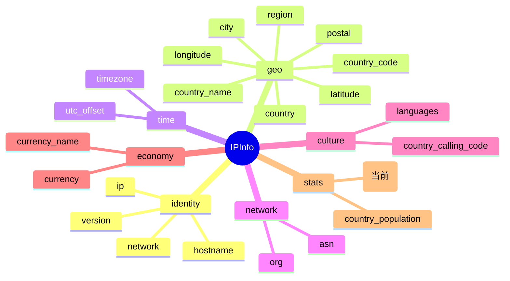

# 📐 country_area — 国家面积

> 🏷️ 字段类别：**统计** · 🔑 JSON Key：`country_area` · 🧩 Go 字段：`IPInfo.CountryArea` · 🧮 Go 类型：`float64`

::: tip 🎨 一图抵千言
下图展示 `country_area` 在 `IPInfo` 字段体系中的位置、所属分组及相关字段关系。`country_area` 归属 **stats（统计）** 分组，与同组的 `country_population` 常配合使用。


:::

---

## 📐 字段定义

`IPInfo` 结构体中对应的 JSON tag 行如下：

```go
CountryArea        float64   `json:"country_area"`
```

完整的字段定义位于 [`models.go`](https://github.com/cyberspacesec/ipapi.co-skills/blob/main/pkg/ipapi/models.go) 的 `IPInfo` 结构体内。

---

## 📖 含义

🎯 `country_area` 表示目标 IP 地址所属国家的 **国土总面积**，单位为 **平方公里（km²）**。

- 🇺🇸 例如：`9833520` 代表美国总面积约 983 万 3520 平方公里
- 🇨🇳 例如：`9596961` 代表中国总面积约 959 万 6961 平方公里
- 🇯🇵 例如：`377975` 代表日本总面积约 37 万 7975 平方公里
- 🇩🇪 例如：`357114` 代表德国总面积约 35 万 7114 平方公里

该字段反映的是国家维度的宏观地理体量数据，与 `country` / `country_name` / `country_code` 字段所归属的国家保持一致。面积通常涵盖陆地与内水总面积，具体口径以 ipapi.co 数据源为准。

::: tip 💡 与 `country_population` 配合使用
`country_area` 常与同属统计类的 [`country_population`](./country_population)（国家人口）配合，二者相除即可估算**人口密度**（人/km²），是国别宏观分析的一对经典组合。
:::

---

## 🔬 类型说明

| 属性 | 值 |
| --- | --- |
| Go 类型 | `float64` |
| JSON Key | `country_area` |
| 是否指针字段 | ❌ 否（直接为 `float64`，非 `*float64`） |
| 是否 omitempty | ❌ 否 |

### ⚠️ 关于指针字段与 `omitempty` 的特别说明

`CountryArea` 本身是普通的 `float64` 值类型，**不是** 指针字段，因此可以直接访问，无需判空。

但 `IPInfo` 结构体中确实存在指针类型字段，例如：

```go
Postal *string `json:"postal"`
```

对于这类 `*string` 指针字段：

- 🚫 直接解引用 `*info.Postal` 在值为 `nil` 时会触发 **panic**
- ✅ SDK 提供了安全访问方法 `GetPostal()`，内部已做 nil 判断：

```go
func (info *IPInfo) GetPostal() string {
    if info.Postal == nil {
        return ""
    }
    return *info.Postal
}
```

对于带有 `omitempty` 的字段（如 `Hostname string \`json:"hostname,omitempty"\``），当 API 返回中不包含该字段时，Go 端会保留零值，调用方需自行处理空值语义。而 `country_area` 既非指针也非 `omitempty`，访问最为直接——当 API 未返回该字段时，`CountryArea` 即为零值 `0`，调用方可通过 `!= 0` 判断是否存在有效值。

> 📝 注意：`CountryArea` 字段本身没有专属的 `Get` 访问器方法（不像 `Postal` 有 `GetPostal()`），因为它不是指针字段，直接读取 `info.CountryArea` 即可得到 `float64`，无需额外封装。`float64` 的零值 `0` 同样是一个合法的数值，因此 SDK 未为其设计 nil 风险规避访问器。

---

## 📌 示例值

```text
9833520
```

常见取值参考：

| 国家 | country_area（km²） |
| --- | --- |
| 美国 | `9833520` |
| 中国 | `9596961` |
| 日本 | `377975` |
| 德国 | `357114` |
| 英国 | `242495` |
| 法国 | `551695` |
| 巴西 | `8515767` |
| 印度 | `3287263` |
| 俄罗斯 | `17098242` |

> 💡 示例 IP `8.8.8.8`（Google DNS）查询得到的 `country_area` 通常为 `9833520`，对应美国的国土总面积。

---

## 🛠️ 访问方式

SDK 提供三种方式获取 `country_area` 字段的值，按场景选用。

### 1️⃣ 结构体字段访问

通过 `GetIPInfo` 拿到完整的 `*IPInfo` 后，直接读取字段（得到 `float64`，可直接参与数值运算）：

```go
package main

import (
    "context"
    "fmt"
    "log"

    "github.com/cyberspacesec/ipapi.co-skills/pkg/ipapi"
)

func main() {
    client := ipapi.NewClient()
    info, err := client.GetIPInfo(context.Background(), "8.8.8.8", "json")
    if err != nil {
        log.Fatal(err)
    }

    // 直接访问 CountryArea 字段
    fmt.Printf("国家面积: %.0f km²\n", info.CountryArea) // 输出: 国家面积: 9833520 km²
}
```

### 2️⃣ GetField 单字段查询

只需查询 `country_area` 这一个字段时，使用 `GetField` 更轻量，仅发起一次单字段请求：

```go
area, err := client.GetField(ctx, "8.8.8.8", "country_area")
if err != nil {
    log.Fatal(err)
}
fmt.Println("国家面积:", area) // 输出: 9833520
```

> ⚠️ 注意：`GetField` 返回的是 `string` 类型（API 原始响应体），如需进行数值运算（如人口密度计算），请使用 `strconv.ParseFloat` 转换为 `float64`。

### 3️⃣ GetClientField 查询本机 IP 的字段

查询**当前发起请求的客户端 IP** 的 `country_area`（不传 IP 参数，对应 `GET /{field}/` 端点）：

```go
area, err := client.GetClientField(ctx, "country_area")
if err != nil {
    log.Fatal(err)
}
fmt.Println("本机 IP 所属国家面积:", area)
```

> 🧭 `GetField` 与 `GetClientField` 的区别：前者需要显式传入目标 IP（`GET /{ip}/{field}/`），后者针对调用方自身 IP（`GET /{field}/`）。

---

## 🎯 用途

`country_area` 在实际业务中应用广泛，典型场景包括：

- 📊 **人口密度计算**：与 `country_population` 相除，估算"人/km²"，输出国家级人口密度报表。
- 🗺️ **地理可视化**：在地图上按面积对国家进行分级填色（chloropleth），直观对比各国国土体量。
- 📈 **宏观统计分析**：按国家面积维度聚合用户分布、流量来源，辅助国别体量维度的数据看板。
- 🛡️ **风控与反欺诈**：将注册地/登录地国家面积纳入规则上下文，识别"小国面积却出现异常高并发"等可疑组合。
- 🚚 **物流与选址**：以国家面积作为跨境运达时效、仓储覆盖半径的粗略估算输入。
- 🌍 **本地化与合规**：结合面积与人口推断市场体量，指导区域准入、内容分发与资源调度策略。

---

## 🔗 相关字段

- 📚 [字段总览](../../api/fields) — 查看所有可用字段的全景列表。
- 📊 [统计类字段分类页](../../api/field-stats) — 浏览与统计相关的全部字段（`country_area`、`country_population`）。
- 👥 [`country_population`](./country_population) — 国家人口，与 `country_area` 配合可计算人口密度。
- 🏳️ [`country`](./country) / [`country_name`](./country_name) / [`country_code`](./country_code) — 国家标识字段，与 `country_area` 同属国家维度。

---

## 🚀 下一步

- 📖 阅读 [字段总览](../../api/fields)，了解 `country_area` 在整个字段体系中的位置。
- 📊 进入 [统计类字段分类页](../../api/field-stats)，对比 `country_area` 与 `country_population` 的字段类型与用法差异。
- 🧪 参考仓库 [`main.go`](https://github.com/cyberspacesec/ipapi.co-skills/blob/main/examples/basic_usage/main.go) 运行一个完整的查询示例。
- 🔍 试用 `GetField` 单字段查询 `country_population`，并结合 `country_area` 计算一个国家的人口密度。

---

::: details 🗂️ 字段速查
| 项目 | 值 |
| --- | --- |
| JSON Key | `country_area` |
| Go 字段 | [`IPInfo.CountryArea`](https://github.com/cyberspacesec/ipapi.co-skills/blob/main/pkg/ipapi/models.go) |
| Go 类型 | `float64` |
| 字段分组 | stats（统计） |
| 示例值 | `9833520` |
| 单位 | km²（平方公里） |
| 是否指针字段 | 否 |
| 是否 omitempty | 否 |
:::
