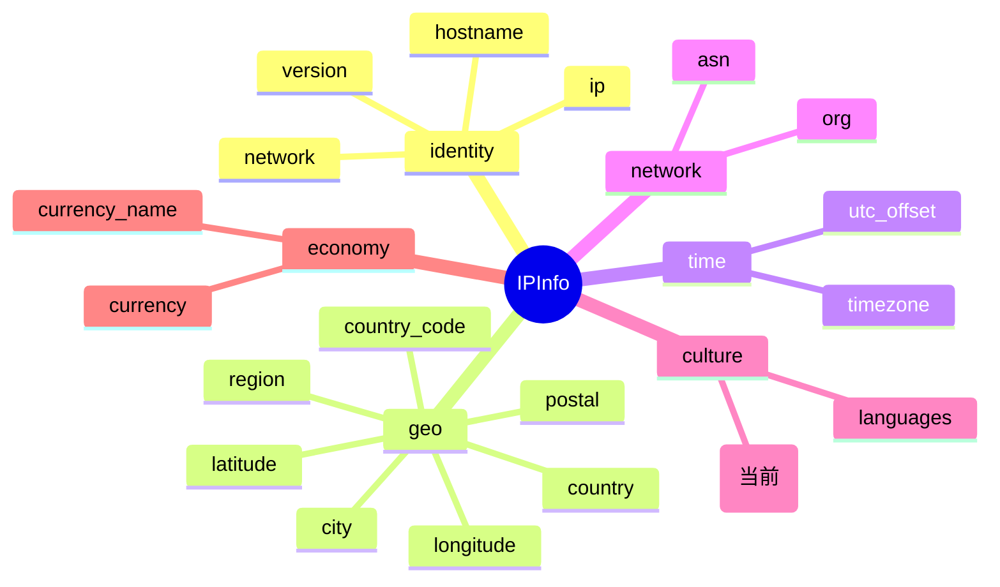

# 📞 country_calling_code

::: tip 🎨 一图抵千言
`country_calling_code` 属于 `culture`（文化与语言）分组，与 [`languages`](./languages) 同组，记录 IP 所属国家/地区的国际电话区号。


:::

## 📋 字段定义

```go
CountryCallingCode string `json:"country_calling_code"`
```

字段位于 [`IPInfo`](https://github.com/cyberspacesec/ipapi.co-skills/blob/main/pkg/ipapi/models.go) 结构体中，是 IP 地理位置返回结果里用于标识国家或地区**国际电话区号**的字段之一。

## 📖 含义

`country_calling_code` 表示 IP 地址所属国家或地区的 **国际电话区号**（International Calling Code / Country Dialing Code）。它是一串用于在国际长途通话中拨打的数字前缀，例如 `1` 代表美国/加拿大、`86` 代表中国、`81` 代表日本。

在拨打跨国电话时，通常需要在该区号前加拨国际接入前缀（如中国大陆的 `00`、北美的 `011`），再依次输入国家区号与本地号码。本字段返回的值通常以 `+` 开头或为纯数字，例如 `+1` 或 `1`。

适合以下场景：

- ☎️ **联系电话自动填充**：根据访客 IP 预填注册/登录表单的国家拨号前缀。
- 📨 **短信与营销触达**：结合用户号码构建 E.164 格式（如 `+8613xxxxxxxxx`）以发送国际短信。
- 🌐 **本地化展示**：在客服、订单或工单界面按访客所在国展示对应拨号格式与提示。
- 🗂️ **数据归一**：将不同来源的电话号码统一为带国家区号的标准形式，便于去重与匹配。

## 🔧 类型说明

- Go 类型：`string`（非指针，**不可空**）。
- JSON 解析后，即使后端未返回该字段，Go 端也会是空字符串 `""`，而不会出现 `nil`。
- ⚠️ 注意：与 `CountryCallingCode` 不同，结构体中的 `Postal` 字段是 `*string` 指针类型。这类指针字段在 JSON 缺省时为 `nil`，**不能直接解引用**，必须通过安全访问器 [`GetPostal()`](https://github.com/cyberspacesec/ipapi.co-skills/blob/main/pkg/ipapi/models.go) 获取，以避免空指针 panic：

  ```go
  // ✅ 正确：指针字段用 GetPostal()
  postal := info.GetPostal()

  // ❌ 错误：直接解引用 Postal 可能触发 panic
  // postal := *info.Postal
  ```

- 而 `CountryCallingCode` 是普通 `string` 字段，可直接访问，无需访问器方法。
- 该字段的 JSON tag 为 `country_calling_code`，未使用 `omitempty`，因此在序列化时即使值为空也会输出 `"country_calling_code":""`。
- 💡 提示：结构体中 `Hostname` 字段使用 `json:"hostname,omitempty"`，`omitempty` 的作用是在序列化时若字段为零值则**省略该字段**；`CountryCallingCode` 未启用该选项，故零值也会出现在输出中。

## 📌 示例值

```json
"country_calling_code": "1"
```

常见取值示例：

| 国家/地区 | country_calling_code |
| --- | --- |
| 🇺🇸 美国 | `1` |
| 🇨🇦 加拿大 | `1` |
| 🇨🇳 中国 | `86` |
| 🇯🇵 日本 | `81` |
| 🇬🇧 英国 | `44` |
| 🇩🇪 德国 | `49` |
| 🇫🇷 法国 | `33` |
| 🇮🇳 印度 | `91` |
| 🇧🇷 巴西 | `55` |

> 📝 说明：北美编号计划（NANP）覆盖的美国、加拿大、墨西哥等共用区号 `1`，因此同一 `country_calling_code` 可能对应多个 `country_code`，需结合国家字段联合判断。

## 🚀 访问方式

### 1️⃣ 结构体字段访问

调用 `GetIPInfo` 获取完整的 `IPInfo` 结构体后，直接读取 `CountryCallingCode` 字段：

```go
package main

import (
    "context"
    "fmt"
    "log"

    "github.com/cyberspacesec/ipapi.co-skills/pkg/ipapi"
)

func main() {
    client := ipapi.NewClient()
    info, err := client.GetIPInfo(context.Background(), "8.8.8.8", "json")
    if err != nil {
        log.Fatal(err)
    }
    fmt.Println("国际电话区号:", info.CountryCallingCode) // 1
}
```

### 2️⃣ GetField 单字段查询

只需查询这一个字段时，使用 [`GetField`](https://github.com/cyberspacesec/ipapi.co-skills/blob/main/pkg/ipapi/api.go) 直接获取，避免拉取整条记录，更省流量：

```go
code, err := client.GetField(ctx, "8.8.8.8", "country_calling_code")
if err != nil {
    log.Fatal(err)
}
fmt.Println("国际电话区号:", code) // 1
```

### 3️⃣ GetClientField 查询本机 IP

查询调用方自身出口 IP 对应的国际电话区号时，使用 [`GetClientField`](https://github.com/cyberspacesec/ipapi.co-skills/blob/main/pkg/ipapi/api.go)：

```go
code, err := client.GetClientField(ctx, "country_calling_code")
if err != nil {
    log.Fatal(err)
}
fmt.Println("本机 IP 的国际电话区号:", code)
```

## 🎯 用途

- ☎️ **表单拨号前缀预填**：根据访客 IP 自动在电话输入框前固定 `+{country_calling_code}`，减少手动选择国家的摩擦。
- 📲 **E.164 号码归一**：将本地裸号码拼接为 `+{区号}{号码}` 的 E.164 标准格式，便于存储与国际短信网关下发。
- 📊 **区域来源分析**：在用户/订单报表中按电话区号维度粗粒度聚合来源地区。
- 🌐 **多语言/多区域客服路由**：依据区号将客户电话路由至对应语种或时区的客服坐席。
- 🛡️ **风控辅助**：结合 `country_code` 与注册手机号区号做一致性校验，识别代理或异常注册。

## 🔗 相关字段

- 📚 [IP 字段总览](../../api/fields) —— 查看所有可查询字段的完整列表。
- 💱 [货币与语言字段分类](../../api/field-currency) —— 浏览货币、语言及国际电话区号相关字段，包括 `currency`、`currency_name`、`languages`、`country_calling_code` 等。

## 📑 字段速查

::: details 字段速查表
| 项目 | 值 |
| --- | --- |
| JSON key | `country_calling_code` |
| Go 字段 | [`CountryCallingCode`](https://github.com/cyberspacesec/ipapi.co-skills/blob/main/pkg/ipapi/models.go) |
| 类型 | `string`（非指针，不可空） |
| 分组 | `culture`（文化与语言） |
| 同组字段 | [`languages`](./languages) |
| JSON tag | `json:"country_calling_code"`（无 `omitempty`） |
| 示例值 | `"1"` |
:::

## ➡️ 下一步

- 🚀 试试用 `GetField` 查询其他字段，如 [`country_code`](./country_code) 或 [`country_name`](./country_name)。
- 🧩 结合 `country_calling_code` 与 `country_code` 构建国家-区号映射，做电话号码归属地校验。
- 📖 阅读 [API 参考](../../api/methods) 了解 `GetIPInfo`、`GetField`、`GetClientField` 的完整签名与参数。
- 🛠️ 查看 [示例代码](../../examples/basic-usage) 获取更多实战用法。
