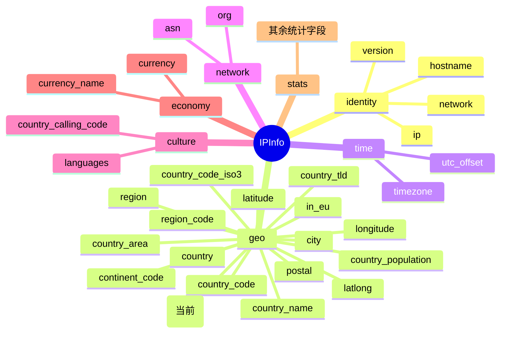

# 🏛️ country_capital — 国家首都

> 🏷️ 字段类别：**国家** · 🔑 JSON Key：`country_capital` · 🧩 Go 字段：`IPInfo.CountryCapital`

::: tip 🎨 一图抵千言
下图展示 `country_capital` 在 `IPInfo` 字段体系中的位置、所属分组及与其他相关字段的关系（当前字段以 `(当前)` 标注）。


:::

---

## 📐 字段定义

`IPInfo` 结构体中对应的 JSON tag 行如下：

```go
CountryCapital string `json:"country_capital"`
```

完整的字段定义位于 [`models.go`](https://github.com/cyberspacesec/ipapi.co-skills/blob/main/pkg/ipapi/models.go) 的 `IPInfo` 结构体内。

---

## 📖 含义

🎯 `country_capital` 表示目标 IP 地址所属国家的 **首都（或首府）名称**。

- 🇺🇸 例如：`Washington D.C.` 代表美国的首都
- 🇨🇳 例如：`Beijing` 代表中国的首都
- 🇯🇵 例如：`Tokyo` 代表日本的首都
- 🇩🇪 例如：`Berlin` 代表德国的首都

该字段返回的是首都的英文（拉丁字母）名称，与 `country` / `country_name` 字段所归属的国家保持一致，常用于在国家维度之上补充"行政中心"这一更具体的地理信息。

---

## 🔬 类型说明

| 属性 | 值 |
| --- | --- |
| Go 类型 | `string` |
| JSON Key | `country_capital` |
| 是否指针字段 | ❌ 否（直接为 `string`，非 `*string`） |
| 是否 omitempty | ❌ 否 |

### ⚠️ 关于指针字段与 `omitempty` 的特别说明

`CountryCapital` 本身是普通的 `string` 类型，**不是** 指针字段，因此可以直接访问，无需判空。

但 `IPInfo` 结构体中确实存在指针类型字段，例如：

```go
Postal *string `json:"postal"`
```

对于这类 `*string` 指针字段：

- 🚫 直接解引用 `*info.Postal` 在值为 `nil` 时会触发 **panic**
- ✅ SDK 提供了安全访问方法 `GetPostal()`，内部已做 nil 判断：

```go
func (info *IPInfo) GetPostal() string {
    if info.Postal == nil {
        return ""
    }
    return *info.Postal
}
```

对于带有 `omitempty` 的字段（如 `Hostname string \`json:"hostname,omitempty"\``），当 API 返回中不包含该字段时，Go 端会保留零值（空字符串），调用方需自行处理空值语义。而 `country_capital` 既非指针也非 `omitempty`，访问最为直接——当 API 未返回该字段时，`CountryCapital` 即为空字符串 `""`，可配合 `len()` 或 `!= ""` 判断是否存在有效值。

---

::: details 📋 字段速查

| 项 | 值 |
| --- | --- |
| JSON Key | `country_capital` |
| Go 字段 | `IPInfo.CountryCapital` |
| Go 类型 | `string` |
| 所属分组 | geo（地理 / 国家） |
| 示例值 | `Washington D.C.` |
| 指针字段 | ❌ 否 |
| omitempty | ❌ 否 |
| 零值（未返回时） | `""`（空字符串） |
| 相关字段 | `country`、`country_name`、`country_code`、`country_code_iso3`、`country_tld`、`country_calling_code` |

:::

---

## 📌 示例值

```text
Washington D.C.
```

常见取值参考：

| 国家 | country_capital |
| --- | --- |
| 美国 | `Washington D.C.` |
| 中国 | `Beijing` |
| 日本 | `Tokyo` |
| 德国 | `Berlin` |
| 英国 | `London` |
| 法国 | `Paris` |
| 巴西 | `Brasília` |
| 印度 | `New Delhi` |

> 💡 注意：部分国家存在多个"事实首都"或行政中心与法定首都不一致的情况（如荷兰法定首都为阿姆斯特丹，政府所在地为海牙），本字段以 ipapi.co 数据源返回的统一口径为准。

---

## 🛠️ 访问方式

### 1️⃣ 结构体字段访问

通过 `GetIPInfo` 拿到完整的 `*IPInfo` 后，直接读取字段：

```go
package main

import (
    "context"
    "fmt"
    "log"

    "github.com/cyberspacesec/ipapi.co-skills/pkg/ipapi"
)

func main() {
    client := ipapi.NewClient()
    info, err := client.GetIPInfo(context.Background(), "8.8.8.8", "json")
    if err != nil {
        log.Fatal(err)
    }

    // 直接访问 CountryCapital 字段
    fmt.Println("国家首都:", info.CountryCapital) // 输出: Washington D.C.
}
```

### 2️⃣ GetField 单字段查询

只需查询 `country_capital` 这一个字段时，使用 `GetField` 更轻量，仅发起一次单字段请求：

```go
capital, err := client.GetField(ctx, "8.8.8.8", "country_capital")
if err != nil {
    log.Fatal(err)
}
fmt.Println("国家首都:", capital) // 输出: Washington D.C.
```

> 💡 `GetField` 返回的是原始字符串（API 原始响应体），无需解析整个 JSON，适合只关心单个字段的场景。

### 3️⃣ GetClientField 查询本机 IP 的字段

查询**当前发起请求的客户端 IP** 的 `country_capital`（不传 IP 参数，对应 `GET /{field}/` 端点）：

```go
capital, err := client.GetClientField(ctx, "country_capital")
if err != nil {
    log.Fatal(err)
}
fmt.Println("本机 IP 所属国家首都:", capital)
```

> 🧭 `GetField` 与 `GetClientField` 的区别：前者需要显式传入目标 IP（`GET /{ip}/{field}/`），后者针对调用方自身 IP（`GET /{field}/`）。

---

## 🎯 用途

`country_capital` 在实际业务中应用广泛，典型场景包括：

- 🏛️ **国家行政中心展示**：在用户地理信息面板中，比 `country_name` 更进一步地展示其所属国家的首都名称。
- 🌍 **本地化与内容推荐**：根据首都推断默认城市、默认语言、默认货币等本地化偏好，作为"国家级行政中心"的锚点。
- 🛡️ **风控与反欺诈**：将注册地/登录地的国家首都纳入规则引擎，识别"国家一致但城市与首都严重偏离"等异常组合。
- 📊 **统计分析**：按首都维度聚合访问量、用户分布，输出"国家—首都"二级地理报表。
- 🚚 **物流与电商**：以首都作为国家级默认配送节点或仓储枢纽的参考坐标，辅助估算跨境运达时效。
- 🔁 **与坐标字段互补**：与 `latitude` / `longitude` 配合，可在地图上以首都作为国家级标注点，避免逐 IP 打点造成的密度过载。

---

## 🔗 相关字段

- 📚 [`字段总览`](../../api/fields) — 查看所有可用字段的全景列表。
- 🏳️ [`国家类字段分类页`](../../api/field-country) — 浏览与国家相关的全部字段（`country`、`country_name`、`country_code`、`country_code_iso3`、`country_capital`、`country_tld`、`country_calling_code`、`country_area`、`country_population` 等）。

---

## 🚀 下一步

- 📖 阅读 [`字段总览`](../../api/fields)，了解 `country_capital` 在整个字段体系中的位置。
- 🏳️ 进入 [`国家类字段分类页`](../../api/field-country)，对比 `country_capital` 与 `country`、`country_name`、`country_code`、`country_code_iso3` 的差异。
- 🧪 参考仓库 [`main.go`](https://github.com/cyberspacesec/ipapi.co-skills/blob/main/examples/basic_usage/main.go) 运行一个完整的查询示例。
- 🔍 试用 `GetField` 单字段查询其他字段，如 `country_calling_code`、`currency`、`languages`，体会同属国家维度的不同字段返回差异。
