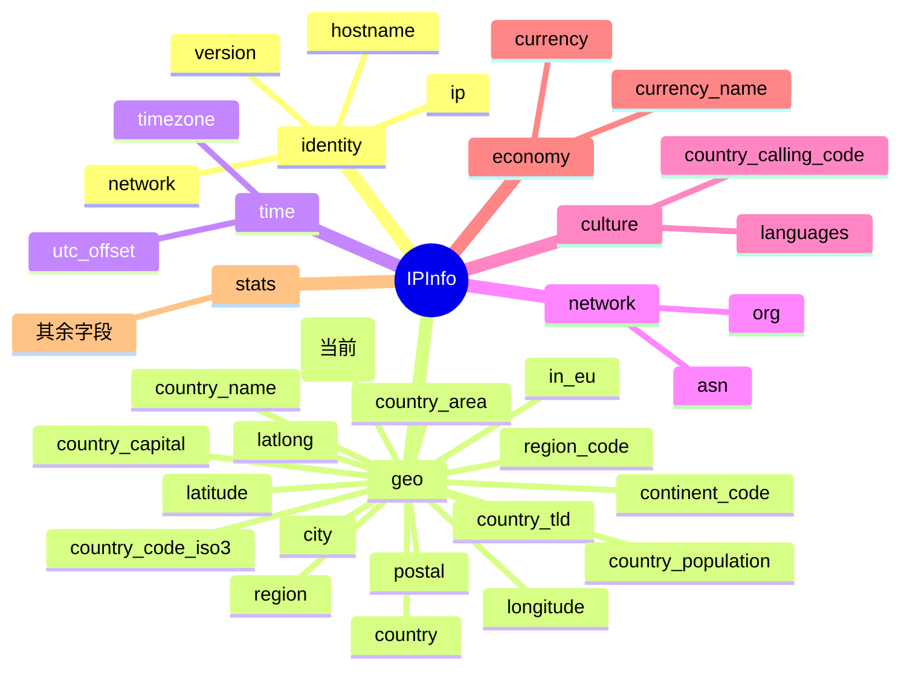

# 🌐 country_code — ISO 2 位国家代码

> 🏷️ 字段类别：**国家** · 🔑 JSON Key：`country_code` · 🧩 Go 字段：`IPInfo.CountryCode`

::: tip 🎨 一图抵千言
`country_code` 属于 `IPInfo` 结构体的 **geo（地理）分组**，与 `country`、`country_name`、`country_code_iso3` 等国家类字段并列，用于在地理维度中标识国家。


:::

---

## 📐 字段定义

`IPInfo` 结构体中对应的 JSON tag 行如下：

```go
CountryCode string `json:"country_code"`
```

完整的字段定义位于 [`models.go`](https://github.com/cyberspacesec/ipapi.co-skills/blob/main/pkg/ipapi/models.go) 的 `IPInfo` 结构体内。

---

## 📖 含义

🎯 `country_code` 表示目标 IP 地址所属国家的 **ISO 3166-1 alpha-2（2 位字母）国家代码**。

- 🇺🇸 例如：`US` 代表美国（United States）
- 🇨🇳 例如：`CN` 代表中国（China）
- 🇯🇵 例如：`JP` 代表日本（Japan）
- 🇩🇪 例如：`DE` 代表德国（Germany）

该代码由国际标准化组织（ISO）维护，是全球通用的国家标识符，常用于地理统计、风控、合规区域判断等场景。

---

## 🔬 类型说明

| 属性 | 值 |
| --- | --- |
| Go 类型 | `string` |
| JSON Key | `country_code` |
| 是否指针字段 | ❌ 否（直接为 `string`，非 `*string`） |
| 是否 omitempty | ❌ 否 |

### ⚠️ 关于指针字段与 `omitempty` 的特别说明

`CountryCode` 本身是普通的 `string` 类型，**不是** 指针字段，因此可以直接访问，无需判空。

但 `IPInfo` 结构体中确实存在指针类型字段，例如：

```go
Postal *string `json:"postal"`
```

对于这类 `*string` 指针字段：

- 🚫 直接解引用 `*info.Postal` 在值为 `nil` 时会触发 **panic**
- ✅ SDK 提供了安全访问方法 `GetPostal()`，内部已做 nil 判断：

```go
func (info *IPInfo) GetPostal() string {
    if info.Postal == nil {
        return ""
    }
    return *info.Postal
}
```

对于带有 `omitempty` 的字段（如 `Hostname string \`json:"hostname,omitempty"\``），当 API 返回中不包含该字段时，Go 端会保留零值（空字符串），调用方需自行处理空值语义。而 `country_code` 既非指针也非 `omitempty`，访问最为直接。

---

## 📌 示例值

```text
US
```

常见取值参考：

| 国家 | country_code |
| --- | --- |
| 美国 | `US` |
| 中国 | `CN` |
| 日本 | `JP` |
| 德国 | `DE` |
| 英国 | `GB` |
| 法国 | `FR` |
| 巴西 | `BR` |
| 印度 | `IN` |

---

## 🛠️ 访问方式

### 1️⃣ 结构体字段访问

通过 `GetIPInfo` 拿到完整的 `*IPInfo` 后，直接读取字段：

```go
package main

import (
    "context"
    "fmt"
    "log"

    "github.com/cyberspacesec/ipapi.co-skills/pkg/ipapi"
)

func main() {
    client := ipapi.NewClient()
    info, err := client.GetIPInfo(context.Background(), "8.8.8.8", "json")
    if err != nil {
        log.Fatal(err)
    }

    // 直接访问 CountryCode 字段
    fmt.Println("国家代码:", info.CountryCode) // 输出: US
}
```

### 2️⃣ GetField 单字段查询

只需查询 `country_code` 这一个字段时，使用 `GetField` 更轻量，仅发起一次单字段请求：

```go
code, err := client.GetField(ctx, "8.8.8.8", "country_code")
if err != nil {
    log.Fatal(err)
}
fmt.Println("国家代码:", code) // 输出: US
```

> 💡 `GetField` 返回的是原始字符串（API 原始响应体），无需解析整个 JSON，适合只关心单个字段的场景。

### 3️⃣ GetClientField 查询本机 IP 的字段

查询**当前发起请求的客户端 IP** 的 `country_code`（不传 IP 参数，对应 `GET /{field}/` 端点）：

```go
code, err := client.GetClientField(ctx, "country_code")
if err != nil {
    log.Fatal(err)
}
fmt.Println("本机 IP 国家代码:", code)
```

> 🧭 `GetField` 与 `GetClientField` 的区别：前者需要显式传入目标 IP（`GET /{ip}/{field}/`），后者针对调用方自身 IP（`GET /{field}/`）。

---

## 🎯 用途

`country_code` 在实际业务中应用广泛，典型场景包括：

- 🌍 **地理定位**：根据 IP 快速判定用户所在国家，用于本地化内容展示、语言切换。
- 🛡️ **风控与反欺诈**：识别异常登录国家的异地登录、批量注册等可疑行为。
- ⚖️ **合规与区域限制**：依据 GDPR、内容审查等要求，对特定国家流量做放行或拦截。
- 📊 **统计分析**：按国家维度聚合访问量、用户分布等业务指标。
- 🚚 **物流与电商**：根据国家代码匹配运费模板、税费规则、可用支付方式。
- 🔁 **与 ISO 3166-1 alpha-3 互补**：与 [`country_code_iso3`](./country_code_iso3)（3 位代码，如 `USA`）配合使用，满足不同系统的编码要求。

---

## 🔗 相关字段

- 📚 [字段总览](../../api/fields) — 查看所有可用字段的全景列表。
- 🏳️ [国家类字段分类页](../../api/field-country) — 浏览与国家相关的全部字段（`country`、`country_name`、`country_code`、`country_code_iso3`、`country_capital`、`country_tld`、`country_calling_code`、`country_area`、`country_population` 等）。

::: details 📋 字段速查
| 项目 | 值 |
| --- | --- |
| JSON Key | `country_code` |
| Go 字段 | `IPInfo.CountryCode` |
| Go 类型 | `string` |
| 所属分组 | geo（地理） |
| 是否指针字段 | ❌ 否 |
| 是否 `omitempty` | ❌ 否 |
| 示例值 | `US` |
| 相关字段 | [`country`](./country) · [`country_name`](./country_name) · [`country_code_iso3`](./country_code_iso3) |
:::

---

## 🚀 下一步

- 📖 阅读 [字段总览](../../api/fields)，了解 `country_code` 在整个字段体系中的位置。
- 🏳️ 进入 [国家类字段分类页](../../api/field-country)，对比 `country_code` 与 `country`、`country_name`、`country_code_iso3` 的差异。
- 🧪 参考仓库 [`main.go`](https://github.com/cyberspacesec/ipapi.co-skills/blob/main/examples/basic_usage/main.go) 运行一个完整的查询示例。
- 🔍 试用 `GetField` 单字段查询其他字段，如 `asn`、`timezone`、`currency`，体会不同字段类型的返回差异。
