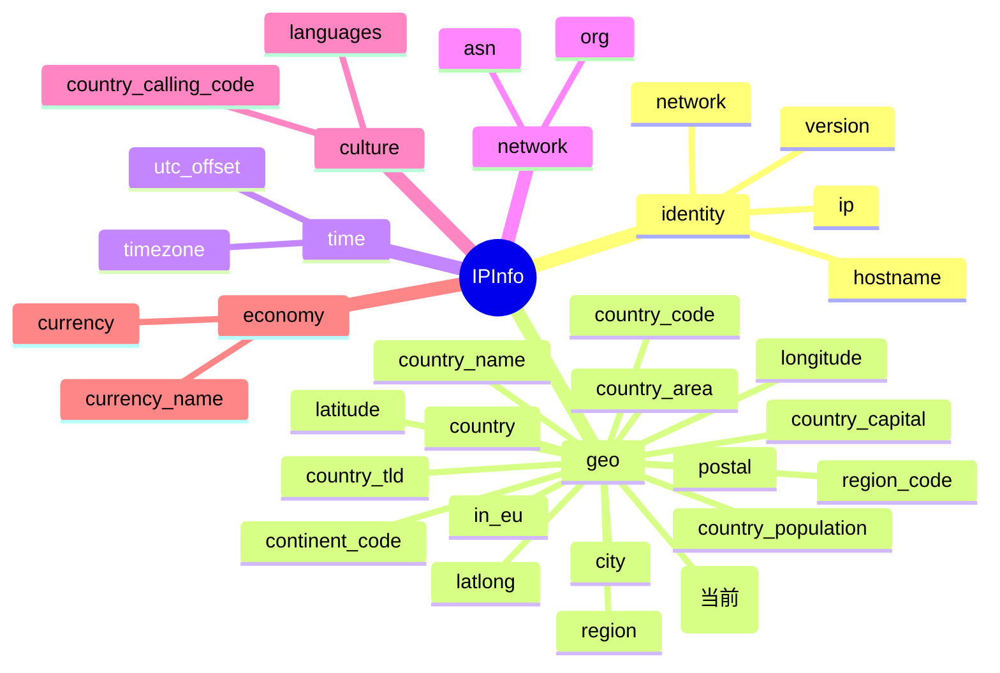

# 🌍 country_code_iso3

::: tip 🎨 一图抵千言
下图展示 `country_code_iso3` 在 [`IPInfo`](https://github.com/cyberspacesec/ipapi.co-skills/blob/main/pkg/ipapi/models.go) 结构体中的位置、所属 **geo**（地理）分组，以及与其他国家类字段的关系。


:::

## 📋 字段定义

```go
CountryCodeISO3    string    `json:"country_code_iso3"`
```

字段位于 [`IPInfo`](https://github.com/cyberspacesec/ipapi.co-skills/blob/main/pkg/ipapi/models.go) 结构体中，是 IP 地理位置返回结果里用于标识国家的字段之一。

## 📖 含义

`country_code_iso3` 表示 IP 地址所属国家或地区的 **ISO 3166-1 alpha-3 三位字母代码**（ISO 3 位国家代码）。它由三个大写英文字母组成，例如 `USA` 代表美利坚合众国、`CHN` 代表中国、`JPN` 代表日本。

与两位字母代码 `country_code` 相比，三位字母代码通常更直观、更易辨识，尤其适合以下场景：

- 🌐 需要展示给最终用户阅读的国家标识
- 🔀 与使用 ISO 3 位代码的第三方系统进行数据交换
- 📊 跨语言环境下的国家统计与聚合

## 🔧 类型说明

- Go 类型：`string`（非指针，**不可空**）。
- JSON 解析后，即使后端未返回该字段，Go 端也会是空字符串 `""`，而不会出现 `nil`。
- ⚠️ 注意：与 `CountryCodeISO3` 不同，结构体中的 `Postal` 字段是 `*string` 指针类型，并用 `omitempty` 标记。这类指针字段在 JSON 缺省时为 `nil`，**不能直接解引用**，必须通过安全访问器 [`GetPostal()`](https://github.com/cyberspacesec/ipapi.co-skills/blob/main/pkg/ipapi/models.go) 获取，以避免空指针 panic：

  ```go
  // ✅ 正确：指针字段用 GetPostal()
  postal := info.GetPostal()

  // ❌ 错误：直接解引用 Postal 可能触发 panic
  // postal := *info.Postal
  ```

- 而 `CountryCodeISO3` 是普通 `string` 字段，可直接访问，无需访问器方法。
- 该字段的 JSON tag 为 `country_code_iso3`，未使用 `omitempty`，因此在序列化时即使值为空也会输出 `"country_code_iso3":""`。

## 📌 示例值

```json
"country_code_iso3": "USA"
```

常见取值示例：

| 国家/地区 | country_code_iso3 |
| --- | --- |
| 🇺🇸 美国 | `USA` |
| 🇨🇳 中国 | `CHN` |
| 🇯🇵 日本 | `JPN` |
| 🇬🇧 英国 | `GBR` |
| 🇩🇪 德国 | `DEU` |
| 🇫🇷 法国 | `FRA` |

## 🚀 访问方式

### 1️⃣ 结构体字段访问

调用 `GetIPInfo` 获取完整的 `IPInfo` 结构体后，直接读取 `CountryCodeISO3` 字段：

```go
package main

import (
    "context"
    "fmt"
    "log"

    "github.com/cyberspacesec/ipapi.co-skills/pkg/ipapi"
)

func main() {
    client := ipapi.NewClient()
    info, err := client.GetIPInfo(context.Background(), "8.8.8.8", "json")
    if err != nil {
        log.Fatal(err)
    }
    fmt.Println("ISO 3 国家代码:", info.CountryCodeISO3) // USA
}
```

### 2️⃣ GetField 单字段查询

只需查询这一个字段时，使用 [`GetField`](https://github.com/cyberspacesec/ipapi.co-skills/blob/main/pkg/ipapi/api.go) 直接获取，避免拉取整条记录，更省流量：

```go
code, err := client.GetField(ctx, "8.8.8.8", "country_code_iso3")
if err != nil {
    log.Fatal(err)
}
fmt.Println("ISO 3 国家代码:", code) // USA
```

### 3️⃣ GetClientField 查询本机 IP

查询调用方自身出口 IP 对应的国家代码时，使用 [`GetClientField`](https://github.com/cyberspacesec/ipapi.co-skills/blob/main/pkg/ipapi/api.go)：

```go
code, err := client.GetClientField(ctx, "country_code_iso3")
if err != nil {
    log.Fatal(err)
}
fmt.Println("本机 IP 的 ISO 3 国家代码:", code)
```

## 🎯 用途

- 🌍 **多语言国家展示**：三位字母代码在非英语界面中更易识别，适合 UI 展示。
- 🔗 **国际标准对接**：与海关、物流、金融等系统（常用 ISO alpha-3）交换数据时无缝匹配。
- 📊 **数据分析与聚合**：在数据仓库或 BI 报告中按国家维度汇总访问来源。
- 🛡️ **风控与合规**：根据 IP 所属国家执行地区限制、合规审查或欺诈检测。
- 🗺️ **地图可视化**：作为地理映射的主键，配合 `latitude` / `longitude` 绘制访问来源热力图。

## 🔗 相关字段

- 📚 [IP 字段总览](../../api/fields) —— 查看所有可查询字段的完整列表。
- 🏳️ [国家类字段分类](../../api/field-country) —— 浏览与国家相关的全部字段，包括 `country`、`country_name`、`country_code`、`country_capital`、`country_tld` 等。

## ➡️ 下一步

- 🚀 试试用 `GetField` 查询其他字段，如 [`country`](./country) 或 [`country_name`](./country_name)。
- 🧩 结合 `country_code`（2 位）与 `country_code_iso3`（3 位）做双向映射表。
- 📖 阅读 [API 参考](../../api/methods) 了解 `GetIPInfo`、`GetField`、`GetClientField` 的完整签名与参数。
- 🛠️ 查看 [示例代码](../../examples/basic-usage) 获取更多实战用法。

## 🗂️ 字段速查

::: details 字段速查
| 项目 | 值 |
| --- | --- |
| JSON key | `country_code_iso3` |
| Go 字段 | [`CountryCodeISO3`](https://github.com/cyberspacesec/ipapi.co-skills/blob/main/pkg/ipapi/models.go) |
| 类型 | `string` |
| 分组 | geo（地理） |
| 示例值 | `USA` |
:::
