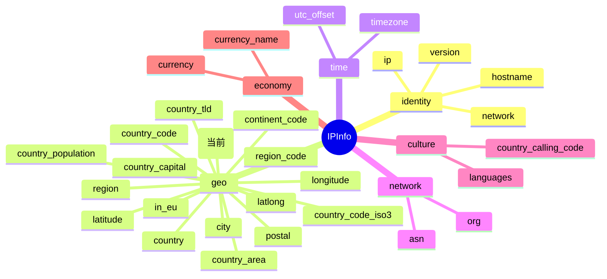

# 🏳 `country_name` — 国家全名

> `IPInfo.CountryName` 字段详解。返回 IP 归属国家的完整英文名称，是与 ISO 国家代码字段（`country` / `country_code`）互补的「可读形态」国家信息。

::: tip 🎨 一图抵千言
`country_name` 属于 **geo（地理）** 分组下的国家字段，与 `country` / `country_code` 等同组字段互补：代码字段用于机读，全名字段用于人读。


:::

---

## 📦 字段定义

```go
CountryName string `json:"country_name"`
```

| 属性 | 值 |
| --- | --- |
| 🔣 JSON Key | `country_name` |
| 🧩 Go 字段 | `IPInfo.CountryName` |
| 🏷️ Go 类型 | `string` |
| 📂 字段类别 | 国家 |
| 🌐 端点形态 | `/{ip}/country_name/` |

---

## 💡 含义

`country_name` 表示该 IP 地址所归属国家的 **完整英文名称**，例如 `United States`、`China`、`Germany`。

与国家代码类字段相比：

- `country` / `country_code` → ISO 2 位代码（如 `US`、`CN`）—— 适合程序匹配、数据库外键、协议交换
- `country_name` → 全名（如 `United States`）—— 适合直接展示给最终用户、生成报表、日志可读性

当你的业务需要把归属国信息 **呈现给人看** 而非用于程序比对时，优先使用本字段，可省去本地维护一份「国家代码 → 国家名称」映射表的麻烦。

---

## 🔤 类型说明

`CountryName` 的 Go 类型是普通 `string`，**不是指针类型**，因此：

- ✅ 直接通过 `info.CountryName` 访问，无需解引用
- ✅ 当服务端未返回该字段时，零值为空字符串 `""`，不会触发空指针 panic
- ✅ 无需任何 Getter 包装即可安全使用

::: tip 🆚 与指针字段的区别
`IPInfo` 中并非所有字段都这么「省心」。以地理字段 `Postal` 为例，它被定义为指针类型：

```go
Postal   *string `json:"postal"`        // 指针字段，可能为 nil
Hostname string  `json:"hostname,omitempty"` // 带 omitempty 的普通字段
```

- `Postal *string`：服务端可能不返回该字段（例如某些 IP 无法精确定位到邮编），用指针以便区分「未返回（nil）」与「返回空串」。直接解引用 `*info.Postal` 在 nil 时会 panic，**必须** 使用安全访问器 `info.GetPostal()`，它会在 nil 时返回空串。
- `Hostname` 带 `json:"hostname,omitempty"` 标签：`omitempty` 仅影响 **序列化**（Go → JSON）时是否省略零值字段，对 **反序列化**（JSON → Go）无影响；服务端不返回时同样得到空串。
- `CountryName`：普通 `string`，无 `omitempty`，**最简单**——直接读，空串即代表「无数据」。

所以本字段是 SDK 中最易用的一类：无指针、无 omitempty 语义陷阱、无 Getter 强制要求。
:::

---

## 📝 示例值

```
United States
```

常见取值参考：

| IP 示例 | `country_name` |
| --- | --- |
| `8.8.8.8` | `United States` |
| `1.1.1.1` | `Australia` |
| `114.114.114.114` | `China` |
| `208.67.222.222` | `United States` |

> ⚠️ 名称一律为英文，且遵循 ipapi.co 服务端的命名规范（如 `United States` 而非 `USA`、`United Kingdom` 而非 `UK`）。如需本地化中文展示，请由调用方自行做映射。

---

## 🚪 访问方式

### 1. 结构体字段直接访问

通过 `GetIPInfo` 一次性获取完整 `IPInfo` 后，直接读取字段：

```go
package main

import (
	"context"
	"fmt"
	"log"

	"github.com/cyberspacesec/ipapi"
)

func main() {
	client := ipapi.NewClient()
	ctx := context.Background()

	info, err := client.GetIPInfo(ctx, "8.8.8.8", "json")
	if err != nil {
		log.Fatalf("查询失败: %v", err)
	}

	// 直接访问结构体字段
	fmt.Println("国家全名:", info.CountryName) // 国家全名: United States

	// 与国家代码字段联动展示
	fmt.Printf("%s (%s)\n", info.CountryName, info.CountryCode)
	// 输出: United States (US)
}
```

### 2. GetField 单字段查询

只需国家全名一项数据时，用 `GetField` 直接拉取该字段，避免下载完整 JSON，**更省配额、更快**：

```go
ctx := context.Background()

name, err := client.GetField(ctx, "8.8.8.8", "country_name")
if err != nil {
	log.Fatal(err)
}
fmt.Println(name) // United States
```

> 💡 `GetField` 返回纯文本，端点为 `GET https://ipapi.co/8.8.8.8/country_name/`。它只校验 `field` 是否合法，**不** 校验 IP 格式（IP 非法由服务端返回）。详见 [GetField](../../api/get-field)。

### 3. GetClientField 查询本机出口 IP

想知道 **当前机器出口 IP** 的归属国家（例如服务自检、CDN 节点探测）时，用 `GetClientField` 省去先取 IP 再查询的两步：

```go
ctx := context.Background()

myCountry, err := client.GetClientField(ctx, "country_name")
if err != nil {
	log.Fatal(err)
}
fmt.Println("本机出口 IP 所在国家:", myCountry)
```

> 📡 端点为 `GET https://ipapi.co/country_name/`（不带 IP 段，服务端自动识别调用方出口 IP）。详见 [GetClientField](../../api/get-client-field)。

---

## 🎯 用途

- 🌐 **用户归属地展示**：在登录日志、风控面板、访问统计中直接显示「United States」而非裸代码，提升可读性
- 🏷️ **本地化兜底**：当缺少 i18n 国家名称资源时，先用英文名占位，保证界面不出现裸代码
- 📊 **报表与导出**：CSV / Excel 导出时人类可读，无需查阅代码表
- 🛡️ **合规初筛**：配合 `InEU`、`CountryCode` 判断数据出境合规性时，名称便于人工复核
- 🔗 **与代码字段互补**：`country_code`（`US`）用于程序匹配，`country_name`（`United States`）用于展示，两者搭配覆盖「机读 + 人读」两端

---

## 🔗 相关字段

- 📋 [IPInfo 字段总览](../../api/fields) — 全部 28 个字段按类别分组一览
- 🌍 [国家字段分类页](../../api/field-country) — `Country`、`CountryCode`、`CountryCodeISO3`、`CountryCapital`、`CountryTLD`、`ContinentCode`、`InEU` 等同类别字段
- 📖 [GetField](../../api/get-field) — 单字段查询 API 参考
- 📖 [GetClientField](../../api/get-client-field) — 客户端出口 IP 单字段查询
- 🧪 [单字段查询示例](../../examples/single-field) — 实战代码

---

## 👉 下一步

- 🌍 阅读国家字段分类页，了解 `CountryName` 与 `Country` / `CountryCode` / `CountryCodeISO3` 的分工与取舍
- 📋 回到 [字段总览](../../api/fields)，按类别浏览其余字段
- 🧪 在 [单字段查询示例](../../examples/single-field) 中替换 `country_name` 为其他字段名，观察返回差异
- 🏗️ 试着用 `GetField(ctx, "8.8.8.8", "country_name")` 与 `GetIPInfo` 两种方式分别查询同一 IP，对比响应大小与配额消耗

---

::: details 📇 字段速查
| 项目 | 值 |
| --- | --- |
| 🔣 JSON Key | `country_name` |
| 🧩 Go 字段 | [`IPInfo.CountryName`](country_name) |
| 🏷️ Go 类型 | `string`（非指针，零值为空串） |
| 📂 所属分组 | geo（地理） |
| 🌐 端点形态 | `/{ip}/country_name/` |
| 📝 示例值 | `United States` |
| 🔗 同组相关 | [`country`](./country) · [`country_code`](country_code) · [`country_code_iso3`](country_code_iso3) · [`country_capital`](country_capital) · [`country_tld`](country_tld) · [`continent_code`](continent_code) · [`in_eu`](in_eu) |
| 📖 查询 API | [`GetField`](../../api/get-field) · [`GetClientField`](../../api/get-client-field) |
:::
