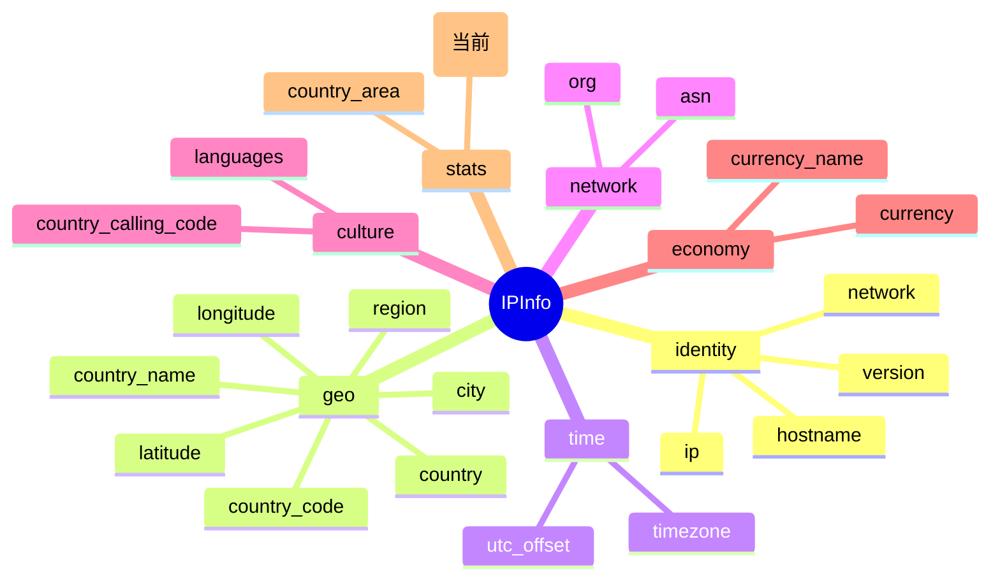

# 👥 country_population

::: tip 🎨 一图抵千言
`country_population` 属于 **stats（统计）** 分组，描述 IP 所属国家的宏观人口指标。下图展示其在 `IPInfo` 结构中的位置与相关字段关系。


:::

## 📋 字段定义

```go
CountryPopulation  int  `json:"country_population"`
```

## 💡 含义

**`country_population`** 表示该 IP 地址所属 **国家的人口总数**。

ipapi.co 在返回地理信息时，会同时附带该国家的宏观统计指标，`country_population` 就是其中之一。它通常与 `country_name`、`country_code`、`country_area` 等字段一起出现，帮助你快速了解目标 IP 所在国家的整体规模。

例如，对于一个位于美国的 IP，该字段会返回美国全国人口数（如 `327167434`）。

## 🧩 类型说明

- **Go 类型**：`int` —— 这是一个 **非指针的整数类型** 字段，无需做空指针判空。
- **JSON tag**：`json:"country_population"`，反序列化时直接映射到 `IPInfo.CountryPopulation`。
- **omitempty 说明**：本字段 **未使用 `omitempty`**。也就是说，即使 API 返回的人口为 `0`，字段也会原样保留为 `0`，不会被忽略。注意区分：结构体中只有 `Hostname` 字段标注了 `omitempty`。
- **`*string` 指针字段对比**：本字段不是指针类型，因此 **不需要** 像 `Postal` 那样使用 `GetPostal()` 这类安全访问器。`Postal` 字段类型为 `*string`，当 API 未返回邮编时指针为 `nil`，直接解引用会 panic，所以 SDK 提供了 `GetPostal()` 方法返回空串兜底。而 `CountryPopulation` 是值类型，直接 `info.CountryPopulation` 即可安全访问。
- 若 API 未返回该字段，`int` 的零值为 `0`，使用时应注意区分“人口为 0”与“字段缺失”两种语义（实践中人口为 0 的情况极少）。

## 📊 示例值

```
327167434
```

对应 JSON 片段：

```json
{
  "country_name": "United States",
  "country_code": "US",
  "country_population": 327167434
}
```

## 🔧 访问方式

### 1. 结构体字段访问

通过 `GetIPInfo` 获取完整的 `IPInfo` 结构体后，直接读取字段：

```go
info, err := client.GetIPInfo(ctx, "8.8.8.8", "json")
if err != nil {
    log.Fatal(err)
}
fmt.Printf("国家人口: %d\n", info.CountryPopulation)
```

### 2. GetField 单字段查询

只查询该字段，返回原始字符串：

```go
val, err := client.GetField(ctx, "8.8.8.8", "country_population")
if err != nil {
    log.Fatal(err)
}
fmt.Printf("country_population = %s\n", val)
// 注意：返回值为 string 类型，如需数值运算请用 strconv.Atoi 转换
```

调用示例：

```go
client.GetField(ctx, "8.8.8.8", "country_population")
```

### 3. GetClientField 查询本机 IP 字段

查询 **当前客户端出口 IP** 所在国家的字段（无需传入 IP 参数）：

```go
val, err := client.GetClientField(ctx, "country_population")
if err != nil {
    log.Fatal(err)
}
fmt.Printf("本机所属国家人口: %s\n", val)
```

## 🎯 用途

- 🌍 **国家规模估算**：结合 `country_area`（国土面积）可计算人口密度。
- 📈 **市场分析**：根据 IP 所在国家的人口体量评估潜在用户规模。
- 🗂️ **数据分组**：按国家人口对流量进行分级或聚合统计。
- 🔍 **异常检测**：当 `country_population` 为 0 或显著偏离常识值时，可辅助判断数据完整性问题。
- 🧮 **人口加权计算**：在多国 IP 分布分析中，以人口作为权重因子。

## 🔗 相关字段

- 字段总览：[`IPInfo`](../../api/fields)
- 统计类字段分类：[`stats`](../../api/field-stats)
- 关联字段：[`country_name`](./country_name)、[`country_code`](./country_code)、[`country_code_iso3`](./country_code_iso3)、[`country_area`](./country_area)、[`country_capital`](./country_capital)、[`country_tld`](./country_tld)

## 🚀 下一步

- 📖 阅读 [`字段总览`](../../api/fields) 了解所有可用字段。
- 📊 查看 [`统计类字段`](../../api/field-stats) 探索更多宏观指标。
- 🧪 试用 `GetField` 查询 `country_area`，结合本字段计算人口密度。
- ⚙️ 参考 [高级用法示例](https://github.com/cyberspacesec/ipapi.co-skills/tree/main/examples/advanced_usage) 编写完整的数据采集脚本。

::: details 字段速查
| JSON key | Go 字段 | 类型 | 分组 | 示例值 |
| --- | --- | --- | --- | --- |
| `country_population` | `CountryPopulation` | `int` | stats | `327167434` |

相关链接：[`IPInfo`](../../api/fields) · [`GetField`](../../api/client) · [`GetClientField`](../../api/client)
:::
