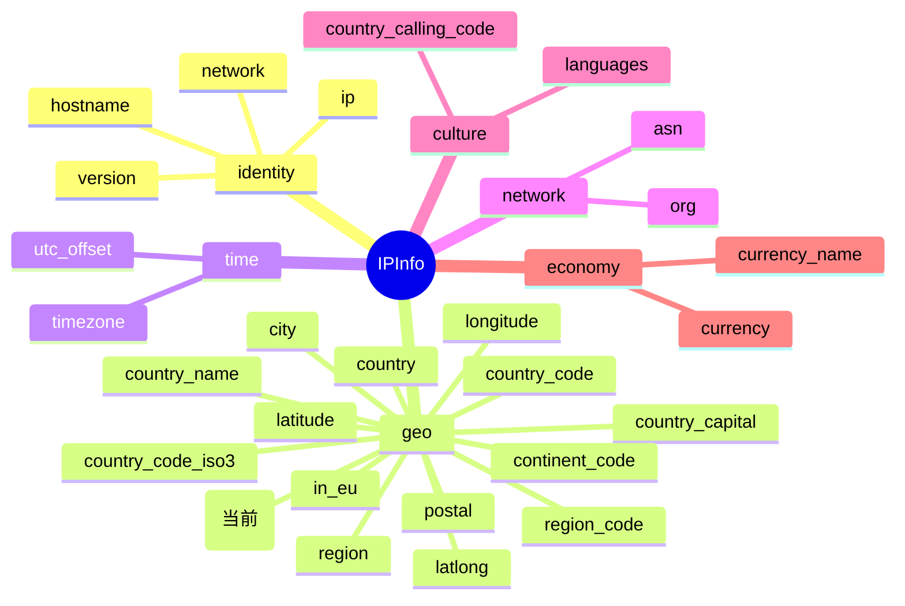

# 🌐 country_tld — 国家顶级域

> 🏷️ 字段类别：**国家** · 🔑 JSON Key：`country_tld` · 🧩 Go 字段：`IPInfo.CountryTLD`

::: tip 🎨 一图抵千言
`country_tld` 属于 `geo`（地理）分组下的国家类字段，与一组 `country_*` 字段共同描述 IP 归属国的网络与地理标识。下图展示其在 `IPInfo` 结构中的位置与相关字段关系。


:::

---

## 📐 字段定义

`IPInfo` 结构体中对应的 JSON tag 行如下：

```go
CountryTLD string `json:"country_tld"`
```

完整的字段定义位于 [`models.go`](https://github.com/cyberspacesec/ipapi.co-skills/blob/main/pkg/ipapi/models.go) 的 `IPInfo` 结构体内。

---

## 📖 含义

🎯 `country_tld` 表示目标 IP 地址所属国家的 **国家代码顶级域（Country-Code Top-Level Domain，ccTLD）**。

- 🇺🇸 例如：`.us` 代表美国（United States）
- 🇨🇳 例如：`.cn` 代表中国（China）
- 🇯🇵 例如：`.jp` 代表日本（Japan）
- 🇩🇪 例如：`.de` 代表德国（Germany）

国家代码顶级域由 IANA（互联网号码分配机构）依据 ISO 3166-1 alpha-2 国家代码分配并维护，每个国家或地区拥有一个专属的两位字母后缀（如 `.uk`、`.fr`、`.br`）。它常用于识别一个国家在网络空间中的域名标识，便于做地理归属判断、域名归属国归类等。

::: tip 💡 区别于通用顶级域
`country_tld` 特指**国家代码顶级域**（ccTLD，如 `.us`、`.cn`），而非通用顶级域（gTLD，如 `.com`、`.net`、`.org`）。前者天然带地理语义，可直接用于推断 IP/域名的归属国。
:::

---

## 🔬 类型说明

| 属性 | 值 |
| --- | --- |
| Go 类型 | `string` |
| JSON Key | `country_tld` |
| 是否指针字段 | ❌ 否（直接为 `string`，非 `*string`） |
| 是否 omitempty | ❌ 否 |

### ⚠️ 关于指针字段与 `omitempty` 的特别说明

`CountryTLD` 本身是普通的 `string` 类型，**不是** 指针字段，因此可以直接访问，无需判空。

但 `IPInfo` 结构体中确实存在指针类型字段，例如：

```go
Postal *string `json:"postal"`
```

对于这类 `*string` 指针字段：

- 🚫 直接解引用 `*info.Postal` 在值为 `nil` 时会触发 **panic**
- ✅ SDK 提供了安全访问方法 `GetPostal()`，内部已做 nil 判断：

```go
func (info *IPInfo) GetPostal() string {
    if info.Postal == nil {
        return ""
    }
    return *info.Postal
}
```

对于带有 `omitempty` 的字段（如 `Hostname string \`json:"hostname,omitempty"\``），当 API 返回中不包含该字段时，Go 端会保留零值（空字符串），调用方需自行处理空值语义。而 `country_tld` 既非指针也非 `omitempty`，访问最为直接。

> 📝 注意：`CountryTLD` 字段本身没有专属的 `Get` 访问器方法（不像 `Postal` 有 `GetPostal()`），因为它不是指针字段，直接读取 `info.CountryTLD` 即可，无需额外封装。

---

## 📌 示例值

```text
.us
```

常见取值参考：

| 国家 | country_tld |
| --- | --- |
| 美国 | `.us` |
| 中国 | `.cn` |
| 日本 | `.jp` |
| 德国 | `.de` |
| 英国 | `.uk` |
| 法国 | `.fr` |
| 巴西 | `.br` |
| 印度 | `.in` |

> 📝 注意：返回值**包含前导点**（如 `.us`），这是 ccTLD 的标准书写形式，解析时无需自行补点。

---

## 🛠️ 访问方式

### 1️⃣ 结构体字段访问

通过 `GetIPInfo` 拿到完整的 `*IPInfo` 后，直接读取字段：

```go
package main

import (
    "context"
    "fmt"
    "log"

    "github.com/cyberspacesec/ipapi.co-skills/pkg/ipapi"
)

func main() {
    client := ipapi.NewClient()
    info, err := client.GetIPInfo(context.Background(), "8.8.8.8", "json")
    if err != nil {
        log.Fatal(err)
    }

    // 直接访问 CountryTLD 字段
    fmt.Println("国家顶级域:", info.CountryTLD) // 输出: .us
}
```

### 2️⃣ GetField 单字段查询

只需查询 `country_tld` 这一个字段时，使用 `GetField` 更轻量，仅发起一次单字段请求：

```go
tld, err := client.GetField(ctx, "8.8.8.8", "country_tld")
if err != nil {
    log.Fatal(err)
}
fmt.Println("国家顶级域:", tld) // 输出: .us
```

> 💡 `GetField` 返回的是原始字符串（API 原始响应体），无需解析整个 JSON，适合只关心单个字段的场景。

### 3️⃣ GetClientField 查询本机 IP 的字段

查询**当前发起请求的客户端 IP** 的 `country_tld`（不传 IP 参数，对应 `GET /{field}/` 端点）：

```go
tld, err := client.GetClientField(ctx, "country_tld")
if err != nil {
    log.Fatal(err)
}
fmt.Println("本机 IP 国家顶级域:", tld)
```

> 🧭 `GetField` 与 `GetClientField` 的区别：前者需要显式传入目标 IP（`GET /{ip}/{field}/`），后者针对调用方自身 IP（`GET /{field}/`）。

---

## 🎯 用途

`country_tld` 在实际业务中应用广泛，典型场景包括：

- 🌐 **域名归属国识别**：根据 ccTLD 快速判定一个域名注册在哪个国家，用于域名资产盘点、归属分析。
- 🛡️ **风控与反欺诈**：比对 IP 所属国与访问域名的 ccTLD，识别跨国异常访问、钓鱼站点等可疑行为。
- 🌍 **地理定位辅助**：与 [`country`](./country)、[`country_code`](./country_code) 等 ISO 代码字段互补，从域名维度佐证地理归属。
- 📊 **统计分析**：按 ccTLD 维度聚合域名分布、流量来源、用户分布等指标。
- 🏷️ **本地化与合规**：依据 ccTLD 做内容分发、语言切换、区域准入等策略匹配。
- 🔁 **与国家代码字段联动**：与 [`country_code_iso3`](./country_code_iso3)（3 位代码，如 `USA`）等字段配合，满足不同系统对国家标识的编码要求。

---

## 📇 字段速查

::: details 📇 字段速查表
| 项目 | 值 |
| --- | --- |
| JSON Key | `country_tld` |
| Go 字段 | `IPInfo.CountryTLD` |
| Go 类型 | `string` |
| 分组 | `geo`（地理） |
| 是否指针 | 否 |
| 是否 omitempty | 否 |
| 示例值 | `.us` |
| 关联字段 | [`country`](./country)、[`country_name`](./country_name)、[`country_code`](./country_code)、[`country_code_iso3`](./country_code_iso3)、[`country_capital`](./country_capital) |
:::

---

## 🔗 相关字段

- 📚 [字段总览](../../api/fields) — 查看所有可用字段的全景列表。
- 🏳️ [国家类字段分类页](../../api/field-country) — 浏览与国家相关的全部字段（`country`、`country_name`、`country_code`、`country_code_iso3`、`country_capital`、`country_tld`、`country_calling_code`、`country_area`、`country_population` 等）。

---

## 🚀 下一步

- 📖 阅读 [字段总览](../../api/fields)，了解 `country_tld` 在整个字段体系中的位置。
- 🏳️ 进入 [国家类字段分类页](../../api/field-country)，对比 `country_tld` 与 `country`、`country_code`、`country_code_iso3` 的差异。
- 🧪 参考仓库 [`main.go`](https://github.com/cyberspacesec/ipapi.co-skills/blob/main/examples/basic_usage/main.go) 运行一个完整的查询示例。
- 🔍 试用 `GetField` 单字段查询其他字段，如 `asn`、`timezone`、`currency`，体会不同字段类型的返回差异。
