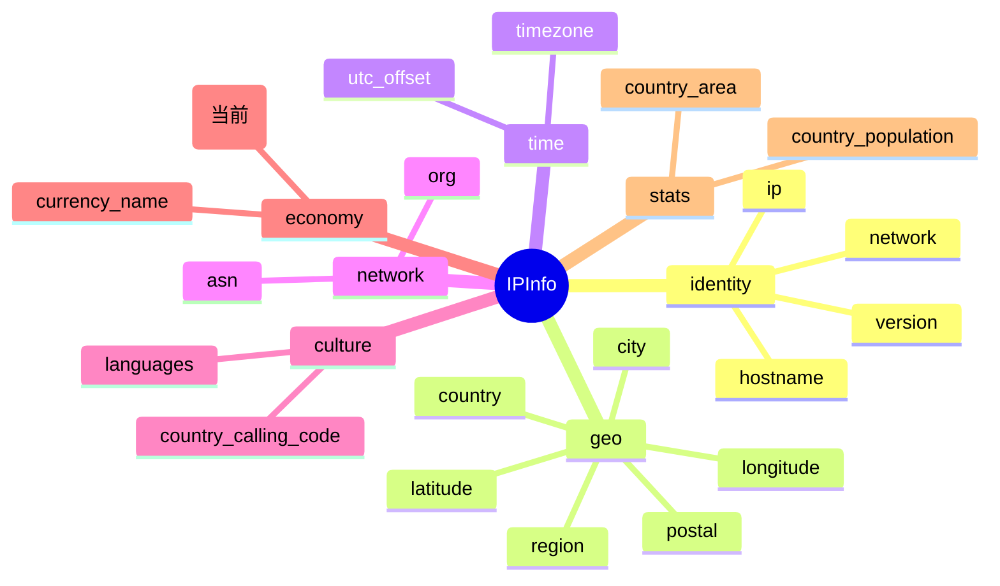

# 💱 `currency` — ISO 4217 货币代码

> 🏷️ 字段类别：**货币（Currency）** · 🔑 JSON Key：`currency` · 🧩 Go 字段：`IPInfo.Currency`

本页详细介绍 `ipapi.co` 返回的 `currency` 字段，涵盖其定义、含义、类型说明、访问方式与典型用途。

::: tip 🎨 一图抵千言
`currency` 在 `IPInfo` 结构中的位置与所属分组（economy 货币分组），及其与同组 [`currency_name`](./currency_name) 等相关字段的关系：


:::

---

## 📐 字段定义

`IPInfo` 结构体中对应的 JSON tag 行如下：

```go
Currency string `json:"currency"`
```

完整的字段定义位于 [`models.go`](https://github.com/cyberspacesec/ipapi.co-skills/blob/main/pkg/ipapi/models.go) 的 `IPInfo` 结构体内。

---

## 📖 含义

💱 `currency` 表示目标 IP 地址所归属国家/地区的 **ISO 4217 货币代码**（三位大写字母）。

- 🇺🇸 例如：`USD` 代表美元（United States Dollar）
- 🇨🇳 例如：`CNY` 代表人民币（Chinese Yuan）
- 🇪🇺 例如：`EUR` 代表欧元（Euro）
- 🇯🇵 例如：`JPY` 代表日元（Japanese Yen）
- 🇬🇧 例如：`GBP` 代表英镑（Pound Sterling）

该代码由国际标准化组织（ISO）依据 **ISO 4217** 标准维护，是全球通用的货币标识符，常用于跨境支付、价格本地化、汇率换算等场景。

> 💡 与同结构体中的 [`currency_name`](./currency_name) 互补：`currency` 是 **机读代码**（`USD`），`currency_name` 是 **人读全称**（`US Dollar`）。前者用于程序匹配与协议交换，后者用于直接展示给最终用户。

---

## 🔬 类型说明

| 属性 | 值 |
| --- | --- |
| Go 类型 | `string` |
| JSON Key | `currency` |
| 是否指针字段 | ❌ 否（直接为 `string`，非 `*string`） |
| 是否 omitempty | ❌ 否 |

### ⚠️ 关于指针字段与 `omitempty` 的特别说明

`Currency` 本身是普通的 `string` 类型，**不是** 指针字段，因此可以直接访问，无需判空。

但 `IPInfo` 结构体中确实存在指针类型字段，例如：

```go
Postal *string `json:"postal"`
```

对于这类 `*string` 指针字段：

- 🚫 直接解引用 `*info.Postal` 在值为 `nil` 时会触发 **panic**
- ✅ SDK 提供了安全访问方法 `GetPostal()`，内部已做 nil 判断：

```go
func (info *IPInfo) GetPostal() string {
    if info.Postal == nil {
        return ""
    }
    return *info.Postal
}
```

对于带有 `omitempty` 的字段（如 `Hostname string \`json:"hostname,omitempty"\``），`omitempty` 仅影响 **序列化**（Go → JSON）时是否省略零值字段，对 **反序列化**（JSON → Go）无影响；服务端不返回时同样得到空串。而 `currency` 既非指针也非 `omitempty`，访问最为直接——直接读 `info.Currency`，空串即代表「无数据」。

---

## 📝 示例值

```text
USD
```

常见取值参考：

| 国家/地区 | currency | 货币名称 |
| --- | --- | --- |
| 美国 | `USD` | US Dollar |
| 中国 | `CNY` | Chinese Yuan |
| 欧元区（德/法等） | `EUR` | Euro |
| 日本 | `JPY` | Japanese Yen |
| 英国 | `GBP` | Pound Sterling |
| 印度 | `INR` | Indian Rupee |
| 巴西 | `BRL` | Brazilian Real |
| 澳大利亚 | `AUD` | Australian Dollar |

典型 JSON 响应片段：

```json
{
  "ip": "8.8.8.8",
  "country": "US",
  "country_name": "United States",
  "currency": "USD",
  "currency_name": "US Dollar"
}
```

---

## 🧰 访问方式

SDK 提供三种方式获取 `currency`，按场景选择即可。

### 1️⃣ 结构体字段访问（批量查询后）

调用 `GetIPInfo` 拿到完整的 `*IPInfo` 后，直接读取字段：

```go
package main

import (
    "context"
    "fmt"
    "log"

    "github.com/cyberspacesec/ipapi.co-skills/pkg/ipapi"
)

func main() {
    client := ipapi.NewClient()
    info, err := client.GetIPInfo(context.Background(), "8.8.8.8", "json")
    if err != nil {
        log.Fatal(err)
    }

    // 直接访问 Currency 字段
    fmt.Println("货币代码:", info.Currency) // 输出: USD

    // 与 currency_name 联动展示
    fmt.Printf("%s (%s)\n", info.CurrencyName, info.Currency)
    // 输出: US Dollar (USD)
}
```

### 2️⃣ `GetField` 单字段查询（指定 IP）

只需查询 `currency` 这一个字段时，使用 `GetField` 更轻量，仅发起一次单字段请求，**更省配额、更快**：

```go
ctx := context.Background()

// 查询 8.8.8.8 的货币代码
currency, err := client.GetField(ctx, "8.8.8.8", "currency")
if err != nil {
    log.Fatal(err)
}
fmt.Println("货币代码:", currency) // 输出: USD
```

> 🎯 `GetField(ctx, ip, field)` 中的 `field` 必须是 SDK 已校验的合法字段名（`currency` 已被列入 `validFields`）。返回的是原始字符串（API 原始响应体，如 `"USD"`），无需解析整个 JSON。

### 3️⃣ `GetClientField` 单字段查询（客户端 IP）

查询**调用方自身出口 IP** 的 `currency`（无需传入 IP 参数，对应 `GET /{field}/` 端点）：

```go
ctx := context.Background()

myCurrency, err := client.GetClientField(ctx, "currency")
if err != nil {
    log.Fatal(err)
}
fmt.Println("本机出口 IP 货币代码:", myCurrency)
```

> 🪪 适合「查我自己的地理位置」这类场景，如服务自检、CDN 节点探测。`GetField` 需显式传入目标 IP（`GET /{ip}/{field}/`），`GetClientField` 针对调用方自身 IP（`GET /{field}/`）。

---

## 🎯 用途

💱 `currency` 字段常见用途包括：

- 💰 **价格本地化**：根据用户 IP 推断本地货币，自动以 `USD`/`CNY`/`EUR` 展示商品价格，提升跨境购物体验。
- 🔄 **汇率换算**：拿到货币代码后，配合实时汇率 API 换算成结算货币，用于跨境支付与结算。
- 🛒 **电商与 SaaS 定价**：按地区动态切换计价货币、税费规则与支付方式（如 `BRL` 走巴西本地支付通道）。
- 📊 **财务与报表**：按货币维度聚合订单金额、收入分布，生成区域财务报表。
- 🛡️ **风控与合规**：识别货币异常（如登录地货币与账户常用货币不符）辅助反欺诈；配合 GDPR 等做区域合规路由。
- 🔁 **与 `currency_name` 互补**：`currency`（`USD`）用于程序匹配与数据库外键，`currency_name`（`US Dollar`）用于展示，两者搭配覆盖「机读 + 人读」两端。

---

## 🔗 相关字段

- 📋 [字段总览](../../api/fields) —— 所有可查询字段的完整清单。
- 💱 [货币类字段分类页](../../api/field-currency) —— `currency` 所属的「货币」分类页，包含 `currency`、`currency_name` 等同类字段。

---

## ➡️ 下一步

- 🚀 尝试用 `client.GetField(ctx, "8.8.8.8", "currency")` 跑一个最小示例。
- 💱 阅读 [货币类字段分类页](../../api/field-currency)，了解 `currency` 与 `currency_name` 的分工与取舍。
- 📋 回到 [字段总览](../../api/fields)，按类别浏览其余字段。
- 📖 查看 [`models.go`](https://github.com/cyberspacesec/ipapi.co-skills/blob/main/pkg/ipapi/models.go) 中 `IPInfo` 的完整字段定义。

---

::: details 🔎 字段速查
| JSON Key | Go 字段 | 类型 | 分组 | 示例值 |
| --- | --- | --- | --- | --- |
| `currency` | [`IPInfo.Currency`](https://github.com/cyberspacesec/ipapi.co-skills/blob/main/pkg/ipapi/models.go) | `string` | economy（货币） | `USD` |
:::
