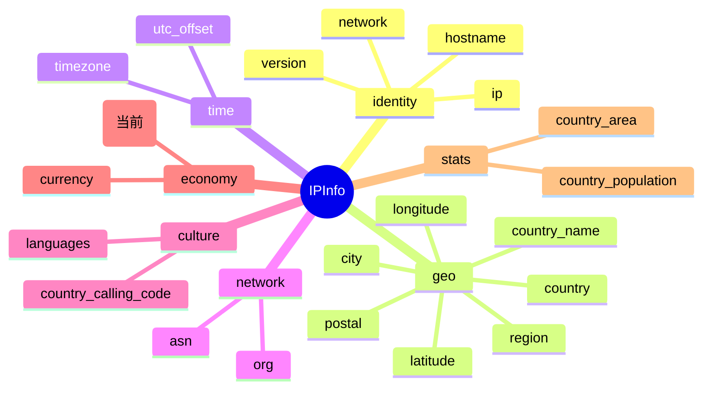

# 💴 字段详解：currency_name

::: tip 🎨 一图抵千言
`currency_name` 在 `IPInfo` 结构中的位置、所属分组与相关字段关系如下：


:::

> 💰 字段类别：**货币（Currency）** · 🏷️ JSON Key：`currency_name` · 🐹 Go 字段：`IPInfo.CurrencyName`

本页详细介绍 `ipapi.co` 返回的 `currency_name` 字段，涵盖其定义、含义、类型说明、访问方式与典型用途。

---

## 📐 字段定义

`currency_name` 在 `IPInfo` 结构体中的定义如下（对应 JSON tag 行）：

```go
CurrencyName string `json:"currency_name"`
```

完整结构体位于 [`models.go`](https://github.com/cyberspacesec/ipapi.co-skills/blob/main/pkg/ipapi/models.go)：

```go
type IPInfo struct {
	// ... 其他字段
	Currency     string `json:"currency"`
	CurrencyName string `json:"currency_name"`
	// ...
}
```

---

## 📖 含义

💴 **货币全名（Currency Name）**，即目标 IP 地址所属国家或地区官方使用的货币的完整名称。

- 🌍 由 ipapi.co 根据地理位置对应的国家级数据映射得出，与 `country` / `country_name` 字段所代表的主权地区一致。
- 🏷️ 例如美国为 `United States dollar`，日本为 `Japanese yen`，欧元区国家多为 `Euro`。
- 🪙 与 `currency`（货币代码，如 `USD`）构成「代码 + 全名」的成对信息，适合面向人类展示。
- ⚠️ 该字段描述的是国家/地区级货币，**不随城市或邮编变化**，同一国家内的所有 IP 通常返回相同的 `currency_name`。

---

## 🔬 类型说明

### 🐹 `string` 普通类型

`CurrencyName` 字段的 Go 类型是普通的 **`string`**，而不是指针类型。这与同结构体中的 `Postal *string` 形成对比：

| 情况 | 普通字段 `string`（如 `CurrencyName`） | 指针字段 `*string`（如 `Postal`） |
|------|----------------------------------|-----------------------------------|
| 数据存在 | `"United States dollar"` | `*string -> "94043"` |
| 数据缺失 | 空字符串 `""`（无法区分“无货币”与“货币名就是空”） | `nil`（明确表示“无数据”） |

✅ 由于货币全名几乎总有值，使用普通 `string` 即可，无需判空，直接读取即可。

### 🛡️ 关于访问器方法

- 🔒 `CurrencyName` 是普通 `string` 字段，**不会**出现 `nil` 指针解引用，因此 SDK **没有**为它提供专门的 `GetCurrencyName()` 访问器。
- 📌 对比：指针字段 `Postal` 才需要 `GetPostal()` 来安全解引用；而 `CurrencyName` 直接以 `info.CurrencyName` 访问即可。
- 🚀 若你仍想统一“空值兜底”逻辑，可自行封装：`name := info.CurrencyName; if name == "" { name = "Unknown" }`。

### 🏷️ 关于 `omitempty`

请注意：`currency_name` 字段的 JSON tag 为 `json:"currency_name"`，**没有附加 `omitempty`**。

- 这意味着在序列化 `IPInfo` 为 JSON 时，即使 `CurrencyName` 为空字符串，键 `"currency_name"` 仍会被输出（值为 `""`）。
- 对比同结构体中 `Hostname` 字段：`json:"hostname,omitempty"`，使用了 `omitempty`，零值时该键会被省略。
- 💡 反序列化时若响应中缺失 `currency_name` 键，`CurrencyName` 会保持零值 `""`；若响应中显式为 `null`，Go 的 `json` 包会将其解码为 `""`。

---

## 📝 示例值

📦 典型 JSON 响应片段：

```json
{
  "ip": "8.8.8.8",
  "country": "US",
  "country_name": "United States",
  "currency": "USD",
  "currency_name": "United States dollar"
}
```

- 💵 示例值：`United States dollar`
- 🇺🇸 这是美元（USD）的货币全名，与 `currency` 字段的代码 `USD` 成对出现。

---

## 🧰 访问方式

SDK 提供三种方式获取 `currency_name`，按场景选择即可。

### 1️⃣ 结构体字段访问（批量查询后）

调用 `GetLocation` / `GetIPInfo` 拿到完整 `IPInfo` 后，直接读字段：

```go
package main

import (
	"context"
	"fmt"
	"log"

	"github.com/cyberspacesec/ipapi.co-skills/pkg/ipapi"
)

func main() {
	client, err := ipapi.NewClient()
	if err != nil {
		log.Fatal(err)
	}

	info, err := client.GetLocation(context.Background(), "8.8.8.8")
	if err != nil {
		log.Fatal(err)
	}

	// ✅ 直接读字段，无需判空
	fmt.Println("Currency Name:", info.CurrencyName) // United States dollar
	fmt.Println("Currency Code:", info.Currency)     // USD
}
```

### 2️⃣ `GetField` 单字段查询（指定 IP）

仅查询单个字段，节省带宽与解析开销：

```go
// 查询 8.8.8.8 的货币全名
name, err := client.GetField(ctx, "8.8.8.8", "currency_name")
if err != nil {
	log.Fatal(err)
}
fmt.Println("Currency Name:", name) // United States dollar
```

- 🎯 `GetField(ctx, ip, field)` 中的 `field` 必须是 SDK 已校验的合法字段名（`currency_name` 已被列入 `validFields`）。
- 📤 返回的是原始字符串（ipapi.co 单字段接口直接返回纯文本，如 `"United States dollar"`）。

### 3️⃣ `GetClientField` 单字段查询（客户端 IP）

查询**调用方自身出口 IP** 的 `currency_name`（无需传入 IP 参数）：

```go
name, err := client.GetClientField(ctx, "currency_name")
if err != nil {
	log.Fatal(err)
}
fmt.Println("My Currency Name:", name)
```

- 🪪 适合“查我自己的所在国家货币”这类场景。
- 🧪 `GetClientField(ctx, field)` 内部请求 ipapi.co 的 `check` 接口。

---

## 🎯 用途

💴 `currency_name` 字段常见用途包括：

- 💰 **价格本地化展示**：在电商、订阅、结算页面用货币全名标注价格，例如「$29.99 (United States dollar)」，比单纯代码 `USD` 更友好。
- 🌐 **多币种切换**：根据访客 IP 自动预选货币，配合 `currency` 代码做下拉项的「全名展示 + 代码提交」。
- 📊 **财务与对账报表**：在交易记录、发票、对账文件中用全名标注币种，减少代码含义的二次解读。
- 🧾 **合规与税务**：结合 `country` / `country_name` 判断是否适用某国税务规则，用货币全名落档。
- 🪙 **数据可视化**：在地理报表中按 `currency_name` 分组统计各国营收，生成货币维度的图表。

---

## 🔗 相关字段

- 📋 [字段总览](../../api/fields) —— 所有可查询字段的完整清单。
- 💰 [货币类字段](../../api/field-currency) —— `currency_name` 所属的「货币」分类页，包含 `currency`（货币代码）等同类字段。

---

## ➡️ 下一步

- 🚀 尝试用 `client.GetField(ctx, "8.8.8.8", "currency_name")` 跑一个最小示例。
- 💱 阅读 [货币类字段](../../api/field-currency)，了解 `currency_name` 与 `currency` 如何配合使用。
- 📖 查看 [`models.go`](https://github.com/cyberspacesec/ipapi.co-skills/blob/main/pkg/ipapi/models.go) 中 `IPInfo` 的完整字段定义与各 `Get*()` 访问器。
- 🔍 探索 [字段总览](../../api/fields)，规划你需要的批量查询字段组合。

---

::: details 📋 字段速查

| 项 | 值 |
|------|------|
| 🏷️ JSON Key | `currency_name` |
| 🐹 Go 字段 | `IPInfo.CurrencyName` |
| 🔬 类型 | `string`（普通字段，非指针） |
| 📦 分组 | **economy**（经济/货币） |
| 🪙 示例值 | `United States dollar` |
| 🔗 相关字段 | [`currency`](./currency) |
| 📜 定义文件 | [`models.go`](https://github.com/cyberspacesec/ipapi.co-skills/blob/main/pkg/ipapi/models.go) |
| 🚰 单字段查询 | [`GetField`](../../api/get-field) · [`GetClientField`](../../api/get-client-field) |

:::
