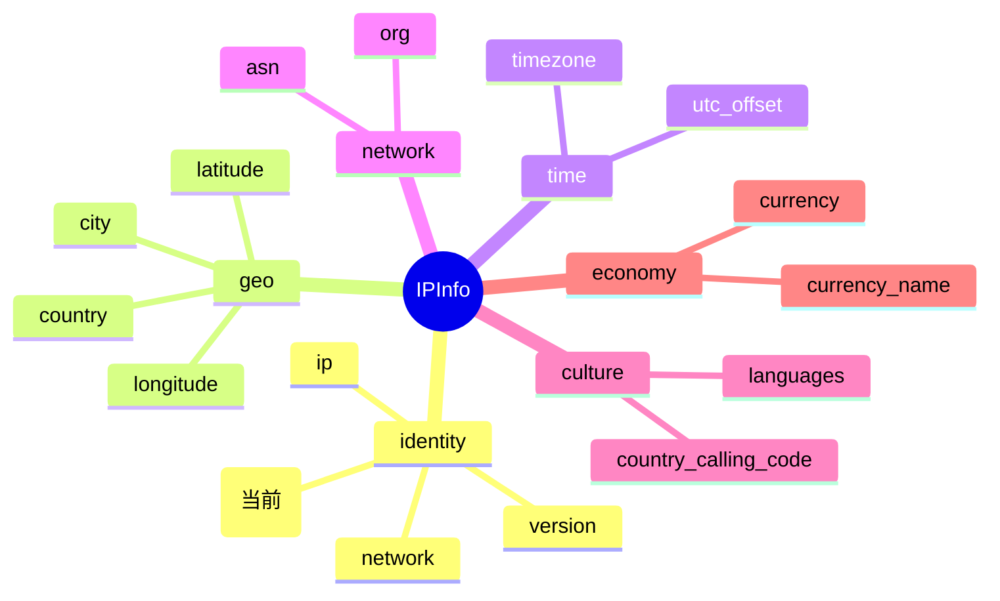

# 🖧 字段详解：hostname

> 🏷️ 字段类别：**ASN** · 🔑 JSON Key：`hostname` · 🐹 Go 字段：`IPInfo.Hostname`

本页详细介绍 `ipapi.co` 返回的 `hostname` 字段，涵盖其定义、含义、类型说明、访问方式与典型用途。

::: tip 🎨 一图抵千言
下图展示 `hostname` 在 [`IPInfo`](../../api/fields) 结构中的位置、所属分组（identity）及相关字段关系。


:::

---

## 📐 字段定义

`hostname` 在 `IPInfo` 结构体中的定义如下（对应 JSON tag 行）：

```go
Hostname string `json:"hostname,omitempty"`
```

完整结构体位于 [`models.go`](https://github.com/cyberspacesec/ipapi.co-skills/blob/main/pkg/ipapi/models.go)：

```go
type IPInfo struct {
    // ... 其他字段
    ASN      string    `json:"asn"`
    Org      string    `json:"org"`
    Hostname string    `json:"hostname,omitempty"` // ← 本字段
    // ...
}
```

对应的 JSON 原始 key：

```json
{
  "hostname": "dns.google"
}
```

---

## 📖 含义

hna 🖧 **反向解析主机名（Reverse DNS / PTR 记录）**，即对目标 IP 地址执行反向 DNS 解析后得到的主机名。

- 🔁 通过 PTR 记录由 IP 反查域名，是正向 DNS 解析（域名 → IP）的逆过程。
- 🌐 例如 `8.8.8.8` 的 `hostname` 为 `dns.google`，说明该 IP 在 DNS 中被反向注册为 Google 的公共 DNS 服务。
- 🧩 与 `asn`、`org` 同属 **ASN 类别**，三者共同刻画 IP 的网络归属画像：`asn` 给出自治系统编号、`org` 给出组织名、`hostname` 给出反向解析的域名。
- ⚠️ **并非所有 IP 都有反向解析记录**：当该 IP 未配置 PTR 记录时，上游接口可能不返回该字段，此时 `Hostname` 为空字符串。

> 💡 **小贴士**：反向解析主机名由 IP 持有者通过其运营商在反向 DNS 区（如 `in-addr.arpa`）配置，并非所有运营商都会准确维护 PTR 记录，因此该值**可能缺失或与正向解析不一致**。

---

## 🔬 类型说明

### 🐹 `string` 类型（非指针）

`Hostname` 字段的 Go 类型是 **普通 `string`**，而非 `*string` 指针。因此：

- ✅ 可以直接通过 `info.Hostname` 访问，**无需判空**，不会触发 panic。
- ✅ 当 API 未返回该字段时，`info.Hostname` 为空字符串 `""`。

### 🏷️ 关于 `omitempty`

`hostname` 字段的 JSON tag 为 `json:"hostname,omitempty"`，**附加了 `omitempty`**：

- 📤 当结构体被 **序列化** 为 JSON 时，若 `Hostname` 为零值（空字符串），键 `"hostname"` 会被**省略**，不输出到 JSON 中。
- 📥 对从 API **反序列化** 到结构体的过程无影响：响应中缺失 `hostname` 键时，`Hostname` 保持零值 `""`；响应中显式为 `null` 时同样为 `""`。

### 🆚 与 `*string` 指针字段的区别

`IPInfo` 中部分字段（如 `Postal`）使用 **`*string` 指针类型**，以便区分“无数据”与“空字符串”：

```go
Postal   *string   `json:"postal"`             // 指针字段：nil 表示“无数据”
Hostname string    `json:"hostname,omitempty"` // 普通 string + omitempty
Org      string    `json:"org"`                // 普通 string
```

| 字段类型 | 访问方式 | 为空时的值 | 说明 |
|---------|---------|-----------|------|
| `string` + `omitempty`（如 `Hostname`） | `info.Hostname` | `""` | 直接访问，安全；序列化时省略该 key |
| `*string`（如 `Postal`） | `info.GetPostal()` | `""` | 需用访问器方法判 nil，否则直接解引用会 panic |
| 普通 `string`（如 `Org`） | `info.Org` | `""` | 直接访问，安全 |

> ⚠️ **注意**：`Hostname` 是普通 `string`，**没有**对应的 `Get*()` 访问器方法。请直接读取 `info.Hostname`，不要去调用 `GetHostname()`（该方法不存在）。`omitempty` 仅在序列化时生效，不影响反序列化与日常读取。

---

## 📝 示例值

📦 典型 JSON 响应片段：

```json
{
  "ip": "8.8.8.8",
  "asn": "AS15169",
  "org": "Google LLC",
  "hostname": "dns.google"
}
```

| IP 地址 | hostname 示例值 |
|--------|----------------|
| `8.8.8.8` | `dns.google` |
| `1.1.1.1` | `one.one.one.one` |
| `208.67.222.222` | `resolver1.opendns.com` |

本字段在文档中采用的 **标准示例值** 为：

```
dns.google
```

---

## 🧰 访问方式

SDK 提供三种方式获取 `hostname`，按场景选择即可。

### 1️⃣ 结构体字段访问（批量查询后）

调用 `GetLocation` / `GetIPInfo` 拿到完整 `IPInfo` 后，直接读取 `Hostname` 字段：

```go
package main

import (
	"context"
	"fmt"
	"log"

	"github.com/cyberspacesec/ipapi.co-skills/pkg/ipapi"
)

func main() {
	client, err := ipapi.NewClient()
	if err != nil {
		log.Fatal(err)
	}

	info, err := client.GetIPInfo(context.Background(), "8.8.8.8")
	if err != nil {
		log.Fatal(err)
	}

	// ✅ Hostname 是普通 string，直接访问即可
	fmt.Println("Hostname:", info.Hostname) // 输出: Hostname: dns.google
}
```

### 2️⃣ `GetField` 单字段查询（指定 IP）

仅查询单个字段，节省带宽与解析开销：

```go
// 查询 8.8.8.8 的反向解析主机名
hostname, err := client.GetField(ctx, "8.8.8.8", "hostname")
if err != nil {
	log.Fatal(err)
}
fmt.Println("Hostname:", hostname) // 输出: Hostname: dns.google
```

- 🎯 `GetField(ctx, ip, field)` 中的 `field` 必须是 SDK 已校验的合法字段名（`hostname` 已被列入 `validFields`）。
- 📤 返回的是原始字符串（ipapi.co 单字段接口直接返回纯文本，如 `dns.google`）。

### 3️⃣ `GetClientField` 单字段查询（客户端 IP）

查询**调用方自身出口 IP** 的 `hostname`（无需传入 IP 参数）：

```go
hostname, err := client.GetClientField(ctx, "hostname")
if err != nil {
	log.Fatal(err)
}
fmt.Println("My Hostname:", hostname)
```

- 🪪 适合“查我自己的反向解析主机名”这类场景。
- 🧪 `GetClientField(ctx, field)` 内部请求 ipapi.co 的 `check` 接口。

---

## 🎯 用途

hna 🖧 `hostname` 字段常见用途包括：

- 🛡️ **威胁情报与风控**：通过反向主机名识别数据中心 / 云服务商（如 `*.cloudfront.net`、`*.amazonaws.com`），常与住宅 ISP 区分以评估请求风险。
- 🤖 **反爬虫 / 反作弊**：屏蔽已知来自代理、Tor 出口节点或云服务商的请求来源。
- 🌐 **网络归属分析**：配合 `asn`、`org` 字段，从域名视角交叉验证 IP 的运营实体。
- 📊 **访问日志分组**：按反向主机名对访问日志进行聚合、统计与可视化，便于追踪来源。
- 🔍 **异常检测**：当 `hostname` 与请求方声明的域名不一致时，可作为可疑请求的辅助判据。
- 📧 **邮件反垃圾**：在 SMTP 服务中校验发件方 IP 的 PTR 记录是否规范配置，缺乏反向解析的 IP 常被视作可疑来源。

---

## 📇 字段速查

::: details 字段速查
| 项目 | 值 |
|------|-----|
| JSON key | `hostname` |
| Go 字段 | `IPInfo.Hostname` |
| Go 类型 | `string`（非指针） |
| JSON tag | `json:"hostname,omitempty"` |
| 分组 | identity（身份标识） |
| 访问器方法 | 无（直接读取 `info.Hostname`） |
| 单字段查询 | [`GetField`](../../api/get-field)（`field="hostname"`） |
| 客户端 IP 查询 | [`GetClientField`](../../api/get-client-field)（`field="hostname"`） |
| 示例值 | `dns.google` |
:::

---

## 🔗 相关字段

- 📋 [字段总览](../../api/fields) —— 所有可查询字段的完整清单。
- 🌐 [ASN 分类字段](../../api/field-asn) —— `hostname` 所属的 ASN 类别页面，包含 `asn`、`org` 等网络归属相关字段。
- 🏷️ [`org` 字段详解](./org) —— 组织名称，与 `hostname` 同属 ASN 类别，常一起用于网络归属画像。
- 🔢 [`asn` 字段详解](./asn)（如存在）—— 自治系统编号，与 `hostname` 配对使用。

---

## ➡️ 下一步

- 🚀 尝试用 `client.GetField(ctx, "8.8.8.8", "hostname")` 跑一个最小示例，观察返回的反向主机名。
- 🌐 阅读 [ASN 分类字段](../../api/field-asn)，了解 `hostname` 与 `asn`、`org` 如何组合刻画 IP 的网络归属。
- 📖 查看 [`models.go`](https://github.com/cyberspacesec/ipapi.co-skills/blob/main/pkg/ipapi/models.go) 中 `IPInfo` 的完整字段定义与各 `Get*()` 访问器。
- 🔍 探索 [字段总览](../../api/fields)，规划你需要的批量查询字段组合。
