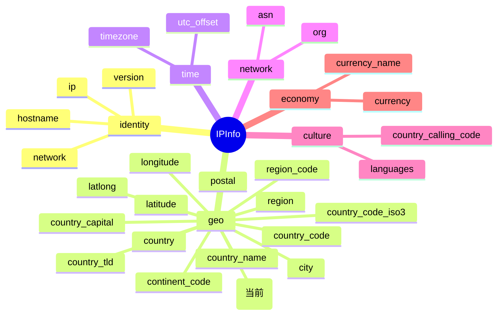

# 🇪🇺 `in_eu` 字段详解

> 字段类别：🌍 国家（Country）

本页详解 `ipapi.co-skills` Go SDK 中 `IPInfo` 结构体的 `in_eu` 字段，用于判断一个 IP 地址所属国家是否为欧盟成员国。

::: tip 🎨 一图抵千言
`in_eu` 属于 `IPInfo` 的 **geo（地理）** 分组，与国家、大洲、坐标等字段同组，用于标识欧盟成员国身份。


:::

---

## 📐 字段定义

`InEU` 是 `IPInfo` 结构体中的一个普通布尔字段，对应 JSON 响应中的 `in_eu` 键：

```go
type IPInfo struct {
    // ... 其他字段
    InEU  bool  `json:"in_eu"`
    // ... 其他字段
}
```

对应的结构体 tag 行为：

```go
InEU bool `json:"in_eu"`
```

---

## 🧭 含义

🌟 **是否欧盟成员国**

`in_eu` 表示该 IP 地址所定位到的国家是否属于**欧盟（European Union）成员国**。

- `true`：该 IP 所属国家为欧盟成员国（例如 🇩🇪 德国、🇫🇷 法国、🇮🇹 意大利、🇳🇱 荷兰等）。
- `false`：该 IP 所属国家**不是**欧盟成员国（例如 🇺🇸 美国、🇨🇳 中国、🇬🇧 英国（脱欧后已为 `false`）、🇯🇵 日本等）。

> 💡 注意：英国（UK）在 2020 年正式脱欧后，其 IP 地址的 `in_eu` 已返回 `false`。该字段反映的是**当前**的欧盟成员国身份。

---

## 🔬 类型说明

| 属性     | 值                        |
| -------- | ------------------------- |
| Go 字段  | `IPInfo.InEU`             |
| Go 类型  | `bool`                    |
| JSON key | `"in_eu"`                 |
| 零值     | `false`                   |
| 可空     | 否（普通值类型，非指针） |

### 📌 关于 `bool` 值类型与 `*string` 指针字段的区别

`InEU` 是一个普通的 `bool` **值类型**字段，因此：

- ✅ 可以直接通过 `info.InEU` 安全访问，无需判空。
- ✅ 当 API 响应中缺少该字段时，Go 的 `encoding/json` 会将其解码为零值 `false`，**不会 panic**。
- ⚠️ 因此你**无法**通过零值区分“API 明确返回 `false`”和“字段缺失”。如需区分，请检查原始响应或配合 `country_code` 等字段辅助判断。

相比之下，结构体中的 `Postal` 字段使用的是 **指针类型**：

```go
Postal *string `json:"postal"`
```

- 🔗 指针类型字段在 API 未返回该字段时为 `nil`，可明确区分“缺失”与“空字符串”。
- 🛡️ 为避免空指针解引用，SDK 提供了安全的访问器方法 `GetPostal()`：

```go
// GetPostal returns the postal code as a string, or empty string if nil
func (info *IPInfo) GetPostal() string {
    if info.Postal == nil {
        return ""
    }
    return *info.Postal
}
```

> 📝 总结：`in_eu` 作为 `bool` 值类型，访问最简单、无需辅助方法；而 `postal` 这类 `*string` 指针字段则推荐使用 `GetPostal()` 这类安全访问器。

### 🧹 关于 `omitempty`

`InEU` 的 tag 为 `json:"in_eu"`，**未使用** `omitempty`。

- 不使用 `omitempty`：作为 SDK 的响应反序列化模型，这是正确的——因为我们要让 JSON 响应中的 `"in_eu": false` 能被完整解码，而不是被忽略。
- 结构体中 `Hostname` 字段则使用了 `omitempty`：`Hostname string \`json:"hostname,omitempty"\``，用于在序列化时省略空主机名。

---

## 📊 示例值

```json
{
  "in_eu": false
}
```

| IP 示例        | 所属国家 | `in_eu` 值 |
| -------------- | -------- | ---------- |
| `8.8.8.8`      | 🇺🇸 美国 | `false`    |
| `1.1.1.1`      | 🇺🇺 澳大利亚 | `false` |
| `141.255.0.1`  | 🇩🇪 德国 | `true`     |
| `212.27.32.1`  | 🇫🇷 法国 | `true`     |
| `131.175.1.1`  | 🇮🇹 意大利 | `true`   |

---

## 🚀 访问方式

### 1️⃣ 结构体字段直接访问

通过 `GetIPInfo()` 获取完整的 `IPInfo` 结构体后，直接访问 `InEU` 字段：

```go
package main

import (
    "context"
    "fmt"
    "log"

    "github.com/cyberspacesec/ipapi.co-skills/pkg/ipapi"
)

func main() {
    client := ipapi.NewClient()
    info, err := client.GetIPInfo(context.Background(), "8.8.8.8", "json")
    if err != nil {
        log.Fatal(err)
    }

    if info.InEU {
        fmt.Println("该 IP 位于欧盟成员国 🇪🇺")
    } else {
        fmt.Println("该 IP 不在欧盟成员国 🌍")
    }
}
```

### 2️⃣ `GetField` 单字段查询

当你只需要 `in_eu` 这一个字段时，使用 `GetField()` 更轻量，避免下载完整响应：

```go
package main

import (
    "context"
    "fmt"
    "log"

    "github.com/cyberspacesec/ipapi.co-skills/pkg/ipapi"
)

func main() {
    client := ipapi.NewClient()

    // 单字段查询 in_eu
    val, err := client.GetField(context.Background(), "8.8.8.8", "in_eu")
    if err != nil {
        log.Fatal(err)
    }

    fmt.Printf("in_eu 原始返回值: %s\n", val) // 输出: false
}
```

> ⚠️ 注意：`GetField()` 返回的是 **字符串**（`string`），其内容为 API 的原始文本响应（例如 `"false"` 或 `"true"`）。如需布尔值，请使用 `strconv.ParseBool(val)` 转换：

```go
import "strconv"

inEU, err := strconv.ParseBool(val)
if err != nil {
    log.Fatal(err)
}
fmt.Printf("解析后的布尔值: %v\n", inEU)
```

### 3️⃣ `GetClientField` 查询客户端自身 IP

`GetClientField()` 用于查询**调用方自身出口 IP** 的某个字段（对应 `GET https://ipapi.co/{field}/`）：

```go
package main

import (
    "context"
    "fmt"
    "log"

    "github.com/cyberspacesec/ipapi.co-skills/pkg/ipapi"
)

func main() {
    client := ipapi.NewClient()

    // 查询客户端自身 IP 是否在欧盟
    val, err := client.GetClientField(context.Background(), "in_eu")
    if err != nil {
        log.Fatal(err)
    }

    fmt.Printf("客户端 IP 的 in_eu 值: %s\n", val)
}
```

> 💡 `GetClientField` 同样返回字符串，需要 `strconv.ParseBool` 转换为布尔值。

---

## 🎯 用途

`in_eu` 字段在实际业务中有广泛应用，尤其是在**合规、隐私与区域化服务**场景：

- 📜 **GDPR 合规判断**：快速识别用户是否位于欧盟，从而决定是否需要展示 Cookie 同意横幅、适用 GDPR 数据保护条款。
- 🔒 **隐私策略路由**：根据是否在欧盟，动态调整数据收集策略、隐私政策页面或数据处理路径。
- 🌐 **区域化内容与服务**：为欧盟用户展示欧盟专属内容（如欧元定价、欧盟语言版本）。
- 🛡️ **风险与合规规则引擎**：在风控、反欺诈规则中作为一项地理合规维度。
- 📊 **数据分析与统计**：统计欧盟与非欧盟用户的访问分布。

---

## 🔗 相关字段

- 📋 [字段总览](../../api/fields) — 查看所有可用字段的完整列表。
- 🌍 [国家类字段](../../api/field-country) — 浏览与国家/地区相关的其他字段，如 `country`、`country_name`、`country_code`、`country_code_iso3`、`country_capital`、`country_tld`、`continent_code` 等。

### 字段对比

| 字段               | 类型   | 说明                          |
| ------------------ | ------ | ----------------------------- |
| `in_eu`            | `bool` | 是否欧盟成员国                |
| `country_code`     | `string` | ISO 3166-1 alpha-2 国家代码   |
| `country_code_iso3`| `string` | ISO 3166-1 alpha-3 国家代码   |
| `continent_code`   | `string` | 大洲代码（如 `EU`、`NA`、`AS`）|

> 💡 组合使用 `in_eu` 与 `continent_code` 可更精确地判断地理区域：例如 🇨🇭 瑞士位于欧洲大陆（`continent_code = EU`）但 `in_eu = false`。

---

## 📋 字段速查

::: details 字段速查表

| JSON key   | Go 字段         | 类型   | 分组   | 示例值    |
| ---------- | --------------- | ------ | ------ | --------- |
| `in_eu`    | `IPInfo.InEU`   | `bool` | geo    | `false`   |

**相关字段链接：**

- [`country`](./country) — 国家代码（ISO 3166-1 alpha-2）
- [`country_name`](./country_name) — 国家名称
- [`country_code`](./country_code) — 国家代码
- [`country_code_iso3`](./country_code_iso3) — ISO 3166-1 alpha-3 国家代码
- [`country_capital`](./country_capital) — 国家首都
- [`country_tld`](./country_tld) — 国家顶级域
- [`continent_code`](./continent_code) — 大洲代码
- [`postal`](./postal) — 邮政编码
- [`latitude`](./latitude) / [`longitude`](./longitude) / [`latlong`](./latlong) — 经纬度
- [`city`](./city) / [`region`](./region) / [`region_code`](./region_code) — 城市与区域
- [`asn`](./asn) / [`org`](./org) — 网络归属

:::

---

## ➡️ 下一步

- 🚀 尝试运行 [基础示例](../../api/field-country) 了解如何批量查询国家类字段。
- 📖 阅读 [字段总览](../../api/fields) 探索 `IPInfo` 的全部字段。
- 🔧 查看 `GetField` 与 `GetClientField` 的完整 API 文档，掌握单字段查询的更多用法。
- 🌍 继续浏览 [国家类字段](../../api/field-country) 分类页，了解 `country`、`country_name` 等相关字段。
