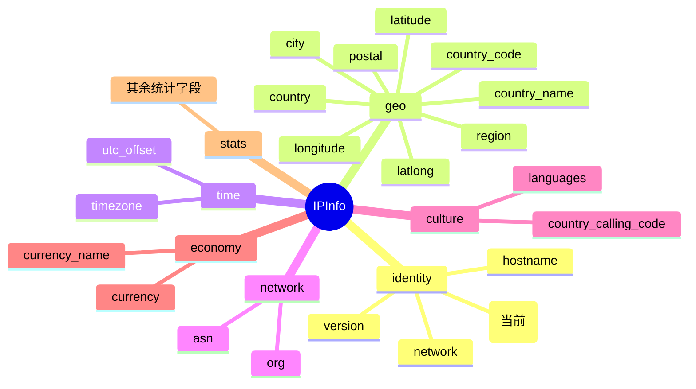

# 🌐 字段详解：`ip`

> 🏷️ **字段类别**：[网络](../../api/field-network) ｜ 📚 [返回字段总览](../../api/fields)

---

::: tip 🎨 一图抵千言
`ip` 字段在 `IPInfo` 结构体中属于 **identity（身份）** 分组，是整条记录的主键与锚点。下图展示其在 7 大字段分组中的位置及相关字段关系（当前字段用 `(当前)` 标注）：


:::

---

## 📐 字段定义

`IPInfo` 结构体中 `ip` 字段定义如下：

```go
type IPInfo struct {
    IP string `json:"ip"`
    // ...其余字段
}
```

对应的 JSON tag 行为：

```go
IP string `json:"ip"`
```

| 属性 | 值 |
| --- | --- |
| JSON key | `"ip"` |
| Go 字段 | `IPInfo.IP` |
| Go 类型 | `string` |
| 是否可空 | 否（普通值类型，非指针） |
| 字段类别 | 网络 🌐 |

---

## 💡 含义

`ip` 字段表示 **本次查询的 IP 地址本身**，即你向 ipapi.co 发起请求时所传入的目标 IP。

- 当你调用 `GetIPInfo(ctx, ip, "json")` 查询某个 IP 时，返回结果中的 `ip` 就是你查询的那个地址。
- 当你调用 `GetClientIPInfo(ctx, "json")` 查询「调用方自身」的 IP 时，返回的 `ip` 是 SDK 所在机器出口公网 IP。

它是整条 `IPInfo` 记录的「主键」与锚点 —— 所有其他地理 / 网络 / 时区字段都是围绕这个 IP 展开的。✅

---

## 🔬 类型说明

`IP` 在 Go 侧的类型是普通 `string`（**值类型**，不是指针），因此：

- ✅ 访问时无需判空指针，直接 `info.IP` 即可拿到字符串。
- ✅ 即使上游接口未返回该字段，反序列化后 `info.IP` 也是零值 `""`（空串），不会触发 nil panic。

> 💡 **关于 `*string` 指针字段的小知识**
>
> 同一个结构体里，`Postal` 字段是 `*string` 指针类型：
>
> ```go
> Postal *string `json:"postal"`
> ```
>
> 这种指针字段在 JSON 缺省时会保持 `nil`，直接解引用会 panic。为此 SDK 提供了安全的访问器：
>
> ```go
> func (info *IPInfo) GetPostal() string
> ```
>
> `GetPostal()` 在指针为 `nil` 时返回空串 `""`，否则返回 `*info.Postal`。**所有指针类型字段都应优先使用对应的 `Get*()` 方法访问。**
>
> 而 `ip` 字段是值类型 `string`，**没有也不需要** `GetIP()` 方法，直接读 `info.IP` 即可。

> 📝 **关于 `omitempty`**
>
> 注意 `Hostname` 字段使用了 `json:"hostname,omitempty"`，意味着序列化时若为空值会被省略；而 `ip` 字段 **没有** `omitempty`，因此在序列化 `IPInfo` 时 `ip` 始终会出现在 JSON 输出中（即使为空串也会输出 `"ip":""`）。

---

## 📌 示例值

请求 `GET https://ipapi.co/8.8.8.8/json/` 后，返回 JSON 片段：

```json
{
  "ip": "8.8.8.8",
  "network": "8.8.8.0/24",
  "version": "IPv4",
  ...
}
```

对应的 Go 值：

```go
info.IP // "8.8.8.8"
```

常见示例值：

| 场景 | 示例 `ip` 值 |
| --- | --- |
| IPv4 查询 | `8.8.8.8` |
| IPv6 查询 | `2001:4860:4860::8888` |
| 查询调用方自身 IP | （由出口公网 IP 决定） |

---

## 🛠️ 访问方式

### 1. 结构体字段直接访问

通过 `GetIPInfo` 拿到 `*IPInfo` 后，直接读字段：

```go
package main

import (
    "context"
    "fmt"
    "log"

    "github.com/cyberspacesec/ipapi.co-skills/pkg/ipapi"
)

func main() {
    client := ipapi.NewClient()
    info, err := client.GetIPInfo(context.Background(), "8.8.8.8", "json")
    if err != nil {
        log.Fatal(err)
    }
    fmt.Println("查询的 IP 地址：", info.IP) // 8.8.8.8
}
```

### 2. `GetField` 单字段查询（指定 IP）

只需 `ip` 这一个字段时，无需拉取整条记录，可直接走单字段端点：

```go
// 对应 API: GET https://ipapi.co/8.8.8.8/ip/
ipStr, err := client.GetField(ctx, "8.8.8.8", "ip")
if err != nil {
    log.Fatal(err)
}
fmt.Println("查询的 IP 地址：", ipStr) // 8.8.8.8
```

> ⚡ `GetField` 返回的是原始字符串（接口直接回传的纯文本），无需 JSON 解析，**最省流量、最快**。当你只关心单个字段时，优先使用它。

### 3. `GetClientField` 单字段查询（调用方自身 IP）

不传 IP，查询 SDK 所在机器自身的出口 IP：

```go
// 对应 API: GET https://ipapi.co/ip/
myIP, err := client.GetClientField(ctx, "ip")
if err != nil {
    log.Fatal(err)
}
fmt.Println("我的出口 IP：", myIP)
```

> 📋 三种方式对照：
>
> | 方法 | 查询目标 | 返回类型 | 是否解析 JSON |
> | --- | --- | --- | --- |
> | `info.IP`（来自 `GetIPInfo`） | 指定 IP 的完整记录 | `string`（结构体字段） | 是 |
> | `client.GetField(ctx, ip, "ip")` | 指定 IP 的单个字段 | `string`（原始文本） | 否 |
> | `client.GetClientField(ctx, "ip")` | 调用方自身 IP 的单个字段 | `string`（原始文本） | 否 |

---

## 🎯 用途

`ip` 字段虽看似「只是把入参原样回显」，但实际用途广泛：

- 🔍 **请求校验 / 日志对齐**：把返回的 `ip` 与你请求时传入的 IP 比对，确认接口处理的就是你期望的目标，避免代理 / NAT 造成的错位。
- 🧭 **自省出口 IP**：通过 `GetClientField(ctx, "ip")` 快速获取本机公网出口 IP，用于运维巡检、灰度路由判断、安全审计。
- 🧩 **结果主键**：作为整条 `IPInfo` 记录的标识，落库时可作为主键或分片键。
- 🛡️ **风控与安全**：在风控链路里把 `ip` 作为关联键，串联后续 ASN、地理位置等字段做综合判定。
- 📊 **数据去重 / 聚合**：按 `ip` 聚合统计访问来源，或对同一 IP 的多次查询结果做去重。

---

## 🔗 相关字段

- 📚 **字段总览**：[所有字段一览](../../api/fields)
- 🌐 **网络分类**：[网络相关字段（network / version / asn / org / hostname）](../../api/field-network)

同属「网络」类别的兄弟字段：

| 字段 | JSON key | 说明 |
| --- | --- | --- |
| `IP` | `ip` | 查询的 IP 地址本身（本页） |
| `Network` | `network` | IP 所在网段（CIDR） |
| `Version` | `version` | IP 版本（IPv4 / IPv6） |
| `ASN` | `asn` | 自治系统号 |
| `Org` | `org` | ASN 所属组织 |
| `Hostname` | `hostname` | 反向 DNS 主机名 |

---

## 🚀 下一步

- 📖 阅读 [字段总览页](../../api/fields)，了解 `IPInfo` 全部字段及其分类。
- 🌐 跳转 [网络字段分类页](../../api/field-network)，深入理解 `network`、`asn`、`org` 等网络维度字段。
- ⚡ 试用 `GetField` 单字段查询其他字段，例如 `client.GetField(ctx, "8.8.8.8", "asn")`。
- 🧪 查看 `examples/` 目录下的可运行示例，动手跑一遍 SDK。

---

::: details 🔎 字段速查
| 项目 | 值 |
| --- | --- |
| JSON key | `"ip"` |
| Go 字段 | [`IPInfo.IP`](../../api/models) |
| Go 类型 | `string`（值类型，非指针） |
| 所属分组 | identity（身份） |
| 字段类别 | 网络 🌐 |
| 示例值 | `8.8.8.8` |
| 单字段端点 | `GET https://ipapi.co/{ip}/ip/` |
| 访问方式 | 直接读 `info.IP`，无需 `Get*()` 方法 |
| `omitempty` | 否（始终出现在序列化输出中） |
:::
