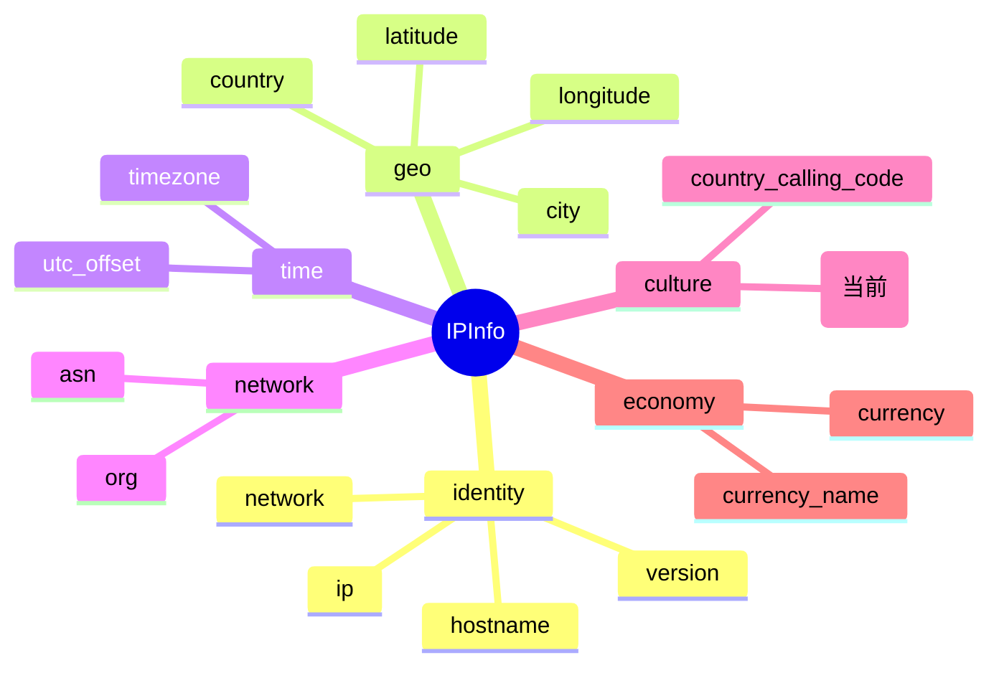

# 🗣️ languages — 官方语言列表

> 🏷️ 字段类别：**语言** · 🔑 JSON Key：`languages` · 🧩 Go 字段：`IPInfo.Languages`

::: tip 🎨 一图抵千言
下图展示 `languages` 在 `IPInfo` 结构中的位置、所属分组（culture）及相关字段的关系。


:::

---

## 📐 字段定义

`IPInfo` 结构体中对应的 JSON tag 行如下：

```go
Languages string `json:"languages"`
```

完整的字段定义位于 [`models.go`](https://github.com/cyberspacesec/ipapi.co-skills/blob/main/pkg/ipapi/models.go) 的 `IPInfo` 结构体内。

---

## 📖 含义

🎯 `languages` 表示目标 IP 地址所属国家的 **官方语言列表**，以逗号分隔的字符串形式返回。

- 🇺🇸 例如：`en` 代表英语为官方语言的国家
- 🇨🇳 例如：`zh` 代表中文为官方语言的国家
- 🇩🇪 例如：`de` 代表德语为官方语言的国家
- 🇨🇦 例如：`en,fr` 代表加拿大同时以英语和法语为官方语言
- 🇮🇳 例如：`en,hi` 代表印度以英语和印地语等为官方语言

每个语言条目通常采用 [BCP 47 / ISO 639https://en.wikipedia.org/wiki/IETF_language_tag) 风格的语言标签，可能为短码（如 `en`），也可能带区域子标签（如 `en-US`）。该字段常与 [`country`](./country)、[`country_calling_code`](./country_calling_code) 等一起用于本地化决策。

::: tip 💡 这是一个“列表型”字符串
`languages` 虽然在 Go 端表现为单个 `string`，但其语义是 **逗号分隔的多语言列表**。若需逐项处理，请用 `strings.Split(info.Languages, ",")` 拆分后再使用，避免把整串当作单一语言代码。
:::

---

## 🔬 类型说明

| 属性 | 值 |
| --- | --- |
| Go 类型 | `string` |
| JSON Key | `languages` |
| 是否指针字段 | ❌ 否（直接为 `string`，非 `*string`） |
| 是否 omitempty | ❌ 否 |

### ⚠️ 关于指针字段与 `omitempty` 的特别说明

`Languages` 本身是普通的 `string` 类型，**不是** 指针字段，因此可以直接访问，无需判空。

但 `IPInfo` 结构体中确实存在指针类型字段，例如：

```go
Postal *string `json:"postal"`
```

对于这类 `*string` 指针字段：

- 🚫 直接解引用 `*info.Postal` 在值为 `nil` 时会触发 **panic**
- ✅ SDK 提供了安全访问方法 `GetPostal()`，内部已做 nil 判断：

```go
func (info *IPInfo) GetPostal() string {
    if info.Postal == nil {
        return ""
    }
    return *info.Postal
}
```

对于带有 `omitempty` 的字段（如 `Hostname string \`json:"hostname,omitempty"\``），当 API 返回中不包含该字段时，Go 端会保留零值（空字符串），调用方需自行处理空值语义。而 `languages` 既非指针也非 `omitempty`，访问最为直接；当 API 未返回该字段时，`Languages` 将为空字符串 `""`，可通过 `info.Languages == ""` 判定。

> 📝 注意：`Languages` 字段本身没有专属的 `Get` 访问器方法（不像 `Postal` 有 `GetPostal()`），因为它不是指针字段，直接读取 `info.Languages` 即可，无需额外封装。

---

## 📌 示例值

```text
en
```

常见取值参考：

| 国家/地区 | 官方语言 | languages |
| --- | --- | --- |
| 美国 | 英语（多语言并存） | `en-US,es-US,haw,fr` |
| 加拿大 | 英语、法语 | `en,fr` |
| 中国 | 中文 | `zh` |
| 日本 | 日语 | `ja` |
| 德国 | 德语 | `de` |
| 印度 | 英语、印地语等 | `en,hi,...` |
| 瑞士 | 德/法/意/罗曼什语 | `de,fr,it,rm` |

> 💡 单语言国家（如 `en`、`zh`、`ja`）通常只返回一个语言代码；多官方语言国家则返回以英文逗号 `,` 分隔的多个代码。

---

## 🛠️ 访问方式

### 1️⃣ 结构体字段访问

通过 `GetIPInfo` 拿到完整的 `*IPInfo` 后，直接读取字段：

```go
package main

import (
    "context"
    "fmt"
    "log"
    "strings"

    "github.com/cyberspacesec/ipapi.co-skills/pkg/ipapi"
)

func main() {
    client := ipapi.NewClient()
    info, err := client.GetIPInfo(context.Background(), "8.8.8.8", "json")
    if err != nil {
        log.Fatal(err)
    }

    // 直接访问 Languages 字段
    fmt.Println("官方语言:", info.Languages) // 输出: en

    // 若需逐项处理，按逗号拆分
    for _, lang := range strings.Split(info.Languages, ",") {
        fmt.Println(" -", lang)
    }
}
```

### 2️⃣ GetField 单字段查询

只需查询 `languages` 这一个字段时，使用 `GetField` 更轻量，仅发起一次单字段请求：

```go
langs, err := client.GetField(ctx, "8.8.8.8", "languages")
if err != nil {
    log.Fatal(err)
}
fmt.Println("官方语言:", langs) // 输出: en
```

> 💡 `GetField` 返回的是原始字符串（API 原始响应体），无需解析整个 JSON，适合只关心单个字段的场景。SDK 内部会先校验 `languages` 是否为合法字段名，非法字段将返回 `ErrInvalidField`。

### 3️⃣ GetClientField 查询本机 IP 的字段

查询**当前发起请求的客户端 IP** 的 `languages`（不传 IP 参数，对应 `GET /{field}/` 端点）：

```go
langs, err := client.GetClientField(ctx, "languages")
if err != nil {
    log.Fatal(err)
}
fmt.Println("本机 IP 所属国家官方语言:", langs)
```

> 🧭 `GetField` 与 `GetClientField` 的区别：前者需要显式传入目标 IP（`GET /{ip}/{field}/`），后者针对调用方自身 IP（`GET /{field}/`）。

---

## 🎯 用途

`languages` 在实际业务中应用广泛，典型场景包括：

- 🗣️ **界面语言切换**：根据 IP 所属国家的官方语言，自动为用户选择默认界面语言（i18n 初始化）。
- 🌐 **本地化内容分发**：优先展示对应语言版本的文档、营销页、公告，提升转化率。
- 📧 **多语言通知**：邮件、短信、推送模板按 `languages` 列表选择主语言，避免错发语言。
- 🛡️ **风控与合规**：识别登录地官方语言与用户账号常用语言是否一致，辅助判定异地登录可疑度。
- 📊 **统计分析**：按官方语言维度聚合用户分布，指导多语言产品规划与资源投入。
- 🔁 **与货币字段联动**：与 [`currency`](./currency)、[`currency_name`](./currency_name) 一起，同时确定展示语言与货币单位，构建完整的本地化展示层。

---

## 🔗 相关字段

- 📚 [字段总览](../../api/fields) — 查看所有可用字段的全景列表。
- 💱 [货币与语言字段分类页](../../api/field-currency) — 浏览与语言、货币相关的全部字段（`currency`、`currency_name`、`languages`、`country_calling_code` 等）。

---

## 🗂️ 字段速查

::: details 📋 languages 字段速查表
| 项目 | 值 |
| --- | --- |
| JSON Key | `languages` |
| Go 字段 | `IPInfo.Languages` |
| Go 类型 | `string` |
| 分组 | culture |
| 示例值 | `en` |

相关字段链接：[`country`](./country)、[`country_calling_code`](./country_calling_code)、[`currency`](./currency)、[`currency_name`](./currency_name)。
:::

---

## 🚀 下一步

- 📖 阅读 [字段总览](../../api/fields)，了解 `languages` 在整个字段体系中的位置。
- 💱 进入 [货币与语言字段分类页](../../api/field-currency)，对比 `languages` 与 `currency`、`currency_name`、`country_calling_code` 的协作方式。
- 🧪 参考仓库 [`main.go`](https://github.com/cyberspacesec/ipapi.co-skills/blob/main/examples/basic_usage/main.go) 运行一个完整的查询示例。
- 🔍 试用 `GetField` 单字段查询其他字段，如 `country`、`currency`、`country_calling_code`，体会不同字段类型的返回差异。
