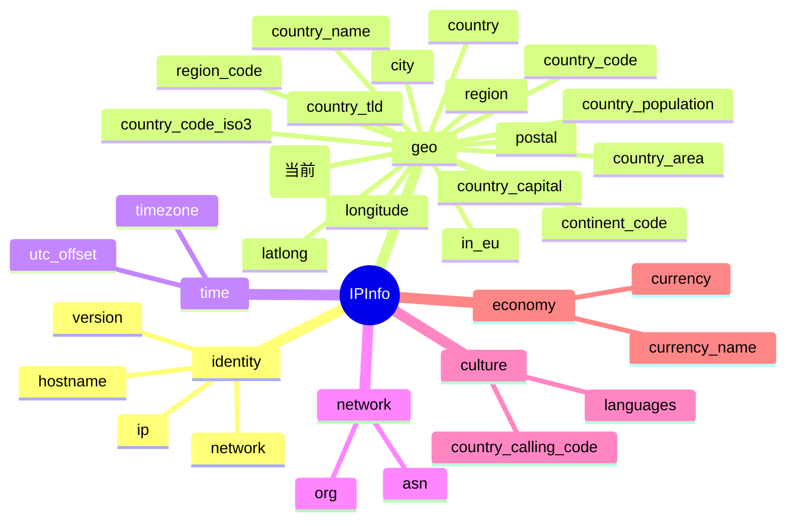

# 🌍 latitude 字段详解

> 📍 字段名：`latitude` · 🗂️ 类别：坐标 · 🧭 关联：[`longitude`](./longitude) / [`latlong`](./latlong)

ipapi.co-skills Go SDK 的 `IPInfo` 结构体中，`latitude` 字段承载 IP 归属地的**纬度**信息，是地图定位、地理可视化与距离计算等场景的核心坐标数据。本页对该字段进行完整说明。

::: tip 🎨 一图抵千言
下图展示 `latitude` 在 `IPInfo` 结构体中所处的位置、所属分组（geo）以及与相关字段的层级关系。


:::

---

## 📐 字段定义

在 `pkg/ipapi/models.go` 的 `IPInfo` 结构体中，`latitude` 的定义如下：

```go
Latitude           float64   `json:"latitude"`
```

- 🏷️ **JSON key**：`latitude`
- 🧩 **Go 字段**：`IPInfo.Latitude`
- 🧮 **Go 类型**：`float64`
- 📦 **字段类别**：坐标（Coordinate）

---

## 💡 含义

`latitude` 表示 IP 归属地的**纬度**，即该地理位置在地球表面相对于赤道南北方向的角距离。

- 🌐 纬度取值范围为 **-90.0 ~ 90.0**
  - 正值表示**北纬**（北半球），例如 `37.4056`
  - 负值表示**南纬**（南半球），例如 `-33.8688`
- 📏 单位为**十进制度（Decimal Degrees, DD）**
- 🗺️ 与 `longitude`（经度）组合，即可定位地球表面上的一个点

> 💡 提示：ipapi.co 同时提供了字符串形式的 `latlong` 字段（形如 `"37.4056,-122.0775"`），可通过 `IPInfo.ParseLatLong()` 一次性解析出纬度和经度两个 `float64` 值。

---

## 🔬 类型说明

`Latitude` 的类型为 **`float64`**（非指针），具有以下特点：

- ✅ **非指针类型**：与 `Postal *string` 不同，`Latitude` 是值类型字段，反序列化时无需做空指针判断。
- 🚫 **无 `omitempty`**：该字段的 JSON tag 中没有 `omitempty`，因此即使纬度为 `0`，也会出现在序列化结果中（`0` 同样是合法的纬度值，例如赤道附近）。
- 📥 **自动解析**：当调用 `GetIPInfo` / `GetClientIPInfo` 时，SDK 使用 `encoding/json` 将 API 返回的数字直接反序列化为 `float64`，无需手动转换。

### ℹ️ 关于 `*string` 指针字段

同一结构体中的 `Postal` 字段为 `*string` 指针类型，用于区分“空值”与“未返回”。为避免空指针解引用，SDK 提供了安全访问器：

```go
// Postal 是 *string 指针，需用 GetPostal() 安全取值
postal := info.GetPostal() // 为 nil 时返回 ""

// Latitude 是 float64 值类型，可直接访问
lat := info.Latitude // 直接得到 float64
```

> 📌 `Latitude` 不需要类似 `GetLatitude()` 的访问器，因为它不存在 nil 风险；零值 `0` 本身即是一个有意义的地理坐标。

---

## 📊 示例值

```json
{
  "latitude": 37.4056
}
```

| 字段 | 值 | 说明 |
| --- | --- | --- |
| JSON key | `latitude` | API 响应中的键名 |
| 示例值 | `37.4056` | 北纬 37.4056 度 |
| Go 类型 | `float64` | 64 位浮点数 |

示例 IP `8.8.8.8`（Google DNS）查询得到的 `latitude` 通常为 `37.4056`，对应美国加利福尼亚州山景城（Mountain View）附近的纬度。

---

## 🛠️ 访问方式

SDK 提供三种方式获取 `latitude` 字段的值，按场景选用。

### 1️⃣ 结构体字段访问（完整查询）

调用 `GetIPInfo` 一次性获取所有字段后，直接访问结构体字段：

```go
package main

import (
    "context"
    "fmt"
    "log"

    "github.com/cyberspacesec/ipapi.co-skills/pkg/ipapi"
)

func main() {
    client := ipapi.NewClient()
    info, err := client.GetIPInfo(context.Background(), "8.8.8.8", "json")
    if err != nil {
        log.Fatal(err)
    }

    // 直接访问 Latitude 字段
    fmt.Printf("纬度: %f\n", info.Latitude) // 纬度: 37.405600
}
```

### 2️⃣ GetField 单字段查询（指定 IP）

若只需纬度，无需拉取完整响应，可使用 `GetField` 按字段名查询：

```go
client := ipapi.NewClient()
lat, err := client.GetField(context.Background(), "8.8.8.8", "latitude")
if err != nil {
    log.Fatal(err)
}
fmt.Printf("纬度: %s\n", lat) // 纬度: 37.4056
```

> ⚠️ 注意：`GetField` 返回的是 `string` 类型（原始响应体），如需进行数值运算，请使用 `strconv.ParseFloat` 转换。

### 3️⃣ GetClientField（查询调用方自身 IP 的纬度）

当需要获取**当前客户端出口 IP** 的纬度时，使用 `GetClientField`：

```go
client := ipapi.NewClient()
lat, err := client.GetClientField(context.Background(), "latitude")
if err != nil {
    log.Fatal(err)
}
fmt.Printf("本机纬度: %s\n", lat)
```

> 📌 `GetClientField` 对应 API 端点 `GET https://ipapi.co/{field}/`，无需传入 IP 参数。

---

## 🎯 用途

`latitude` 字段在以下场景中被广泛使用：

- 🗺️ **地图定位**：与 `longitude` 组合，在地图上标注 IP 的地理位置
- 📏 **距离计算**：使用 Haversine 公式等计算两个 IP 之间的球面距离
- 🌦️ **本地化服务**：根据纬度推断气候带、时区近似范围，辅助本地化推荐
- 🛡️ **风控与反欺诈**：将注册地纬度与登录地纬度比对，识别异常登录
- 📊 **地理可视化**：在数据看板上按纬度聚合用户分布热力图
- 🚚 **物流与选址**：辅助估算用户与仓储/节点的大致方位

---

## 🔗 相关字段

- 📋 [字段总览](../../api/fields) — 所有可用字段的完整清单
- 🧭 [坐标类字段分类](../../api/field-coord) — 坐标相关字段（latitude / longitude / latlong）合集
- 🌐 [`longitude`](./longitude) — 经度，与 `latitude` 成对出现
- 📍 [`latlong`](./latlong) — “纬度,经度”字符串，可经 `ParseLatLong()` 解析
- 🏙️ [`city`](./city) / [`region`](./region) / [`country`](./country) — 地理位置文本字段，常与坐标配合展示

---

## 🔎 字段速查

::: details 字段速查表
| 项目 | 内容 |
| --- | --- |
| JSON key | `latitude` |
| Go 字段 | `IPInfo.Latitude` |
| Go 类型 | `float64` |
| 字段分组 | geo（地理） |
| 所属类别 | 坐标（Coordinate） |
| 是否指针 | 否（值类型，无 nil 风险） |
| 是否 omitempty | 否（零值 `0` 仍输出） |
| 示例值 | `37.4056` |
| 取值范围 | `-90.0` ~ `90.0` |
| 关联字段 | [`longitude`](./longitude) · [`latlong`](./latlong) |
| 单字段查询 | [`GetField`](../../api/get-field) / [`GetClientField`](../../api/get-client-field) |
:::

---

## ➡️ 下一步

- 🚀 实战：查看 [基础用法示例](../../examples/basic-usage)，快速上手 `GetIPInfo`
- 🧩 进阶：了解 [坐标字段分类](../../api/field-coord) 中 `ParseLatLong()` 的批量解析用法
- 🔧 配置：阅读 [客户端配置](../../api/options)，学习如何设置 API Key、超时与重试
- 📡 端点：浏览 [API 端点总览](../../api/methods)，掌握 `GetField` / `GetClientField` 的差异
