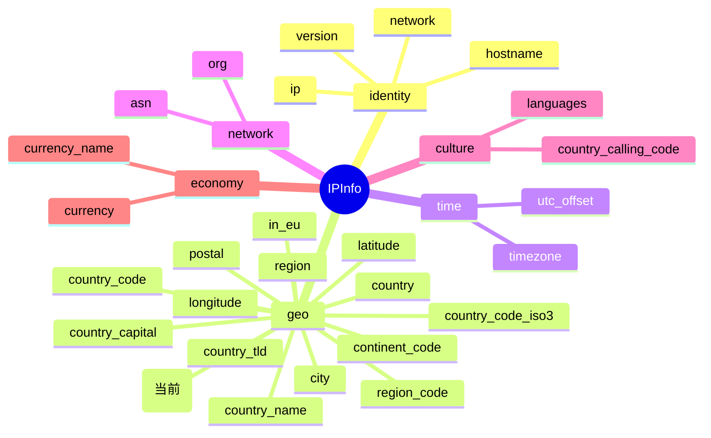

# 📍 latlong 字段详解

> 📍 字段名：`latlong` · 🗂️ 类别：坐标 · 🧭 关联：[`latitude`](./latitude) / [`longitude`](./longitude)

ipapi.co-skills Go SDK 的 `IPInfo` 结构体中，`latlong` 字段以**组合字符串**的形式承载 IP 归属地的经纬度信息，是地图定位、地理可视化与一次性坐标解析等场景的便捷数据。本页对该字段进行完整说明。

::: tip 🎨 一图抵千言
下图展示 `latlong` 在 `IPInfo` 结构体中的位置、所属 `geo` 分组以及与相关字段的关系。


:::

---

## 📐 字段定义

在 `pkg/ipapi/models.go` 的 `IPInfo` 结构体中，`latlong` 的定义如下：

```go
LatLong            string    `json:"latlong"`
```

- 🏷️ **JSON key**：`latlong`
- 🧩 **Go 字段**：`IPInfo.LatLong`
- 🧮 **Go 类型**：`string`
- 📦 **字段类别**：坐标（Coordinate）

---

## 💡 含义

`latlong` 表示 IP 归属地的**经纬度组合字符串**，格式为 `lat,lon`（纬度在前，经度在后，以英文逗号分隔）。

- 🌐 字符串形如 `"37.4056,-122.0775"`
  - 前半段 `37.4056` 为**纬度**（latitude）
  - 后半段 `-122.0775` 为**经度**（longitude）
- 📏 数值单位为**十进制度（Decimal Degrees, DD）**
- 🗺️ 与 `latitude` / `longitude` 两个独立字段提供的是同一组地理坐标，只是组织形式不同——`latlong` 以单一字符串便于传输与拼接 URL

> 💡 提示：当需要同时获取经纬度两个数值时，直接使用 `latlong` 比分别请求 `latitude` 和 `longitude` 更省一次解析；SDK 提供了 `IPInfo.ParseLatLong()` 方法将其拆分为两个 `float64`。

---

## 🔬 类型说明

`LatLong` 的类型为 **`string`**（非指针），具有以下特点：

- ✅ **非指针类型**：与 `Postal *string` 不同，`LatLong` 是值类型字段，反序列化时无需做空指针判断。
- 🚫 **无 `omitempty`**：该字段的 JSON tag 中没有 `omitempty`，因此即便字符串为空也会出现在序列化结果中。
- 📥 **自动解析**：当调用 `GetIPInfo` / `GetClientIPInfo` 时，SDK 使用 `encoding/json` 将 API 返回的字符串原样赋值给 `LatLong`，无需手动转换。

### ℹ️ 关于 `*string` 指针字段

同一结构体中的 `Postal` 字段为 `*string` 指针类型，用于区分“空值”与“未返回”。为避免空指针解引用，SDK 提供了安全访问器 `GetPostal()`：

```go
// Postal 是 *string 指针，需用 GetPostal() 安全取值（为 nil 时返回 ""）
postal := info.GetPostal()

// LatLong 是 string 值类型，可直接访问
ll := info.LatLong // 直接得到 "37.4056,-122.0775"
```

> 📌 `LatLong` 不需要类似 `GetLatLong()` 的访问器，因为它不存在 nil 风险；空字符串 `""` 本身即可表示“未返回坐标”。需要拆分时，请使用下文介绍的 `ParseLatLong()`。

---

## 📊 示例值

```json
{
  "latlong": "37.4056,-122.0775"
}
```

| 字段 | 值 | 说明 |
| --- | --- | --- |
| JSON key | `latlong` | API 响应中的键名 |
| 示例值 | `37.4056,-122.0775` | 纬度 37.4056，经度 -122.0775 |
| Go 类型 | `string` | 组合坐标字符串 |

示例 IP `8.8.8.8`（Google DNS）查询得到的 `latlong` 通常为 `37.4056,-122.0775`，对应美国加利福尼亚州山景城（Mountain View）附近的地理坐标。

---

## 🛠️ 访问方式

SDK 提供三种方式获取 `latlong` 字段的值，按场景选用。

### 1️⃣ 结构体字段访问（完整查询）

调用 `GetIPInfo` 一次性获取所有字段后，直接访问结构体字段，并可借助 `ParseLatLong()` 拆分：

```go
package main

import (
    "context"
    "fmt"
    "log"

    "github.com/cyberspacesec/ipapi.co-skills/pkg/ipapi"
)

func main() {
    client := ipapi.NewClient()
    info, err := client.GetIPInfo(context.Background(), "8.8.8.8", "json")
    if err != nil {
        log.Fatal(err)
    }

    // 直接访问 LatLong 字段
    fmt.Printf("经纬度: %s\n", info.LatLong) // 经纬度: 37.4056,-122.0775

    // 拆分为纬度 / 经度两个 float64
    lat, lon, err := info.ParseLatLong()
    if err != nil {
        log.Fatal(err)
    }
    fmt.Printf("纬度: %f, 经度: %f\n", lat, lon) // 纬度: 37.405600, 经度: -122.077500
}
```

### 2️⃣ GetField 单字段查询（指定 IP）

若只需经纬度字符串，无需拉取完整响应，可使用 `GetField` 按字段名查询：

```go
client := ipapi.NewClient()
ll, err := client.GetField(context.Background(), "8.8.8.8", "latlong")
if err != nil {
    log.Fatal(err)
}
fmt.Printf("经纬度: %s\n", ll) // 经纬度: 37.4056,-122.0775
```

> ⚠️ 注意：`GetField` 返回的是 `string` 类型（原始响应体），即 API 返回的 `lat,lon` 文本。如需拆分数值，请自行用 `strings.Split` 处理或改用 `GetIPInfo` + `ParseLatLong()`。

### 3️⃣ GetClientField（查询调用方自身 IP 的经纬度）

当需要获取**当前客户端出口 IP** 的经纬度时，使用 `GetClientField`：

```go
client := ipapi.NewClient()
ll, err := client.GetClientField(context.Background(), "latlong")
if err != nil {
    log.Fatal(err)
}
fmt.Printf("本机经纬度: %s\n", ll)
```

> 📌 `GetClientField` 对应 API 端点 `GET https://ipapi.co/{field}/`，无需传入 IP 参数。

---

## 🎯 用途

`latlong` 字段在以下场景中被广泛使用：

- 🗺️ **地图定位**：直接拼接为地图标记坐标，或用于生成静态地图 URL
- 🔗 **坐标拼接**：作为单一字符串便于在日志、URL 查询参数或数据库字段中存储完整坐标
- 📏 **批量解析**：通过 `ParseLatLong()` 一次性得到 `lat` / `lon` 两个 `float64`，避免分别请求两个字段
- 🌦️ **本地化服务**：依据坐标推断气候带、时区近似范围，辅助本地化推荐
- 🛡️ **风控与反欺诈**：将注册地坐标与登录地坐标比对，识别异常登录
- 📊 **地理可视化**：在数据看板上按坐标聚合用户分布热力图

---

## 🔗 相关字段

- 📋 [字段总览](../../api/fields) — 所有可用字段的完整清单
- 🧭 [坐标类字段分类](../../api/field-coord) — 坐标相关字段（latitude / longitude / latlong）合集
- 🌐 [`latitude`](./latitude) — 纬度，`float64` 类型，`latlong` 的前半段
- 🧭 [`longitude`](./longitude) — 经度，`float64` 类型，`latlong` 的后半段
- 🏙️ [`city`](./city) / [`region`](./region) / [`country`](./country) — 地理位置文本字段，常与坐标配合展示

---

::: details 🗂️ 字段速查
| 项目 | 值 |
| --- | --- |
| JSON key | `latlong` |
| Go 字段 | `IPInfo.LatLong` |
| Go 类型 | `string` |
| 所属分组 | `geo`（地理坐标） |
| 示例值 | `37.4056,-122.0775` |
| 关联字段 | [`latitude`](./latitude) / [`longitude`](./longitude) |
| 安全访问 | 直接访问（值类型，无需 `Get*` 访问器） |
| 拆分方法 | `IPInfo.ParseLatLong()` → `(lat, lon float64, err error)` |
:::

---

## ➡️ 下一步

- 🚀 实战：查看 [基础用法示例](../../examples/basic-usage)，快速上手 `GetIPInfo`
- 🧩 进阶：了解 [坐标字段分类](../../api/field-coord) 中 `ParseLatLong()` 的解析用法
- 🔧 配置：阅读 [客户端配置](../../api/options)，学习如何设置 API Key、超时与重试
- 📡 端点：浏览 [API 端点总览](../../api/methods)，掌握 `GetField` / `GetClientField` 的差异
