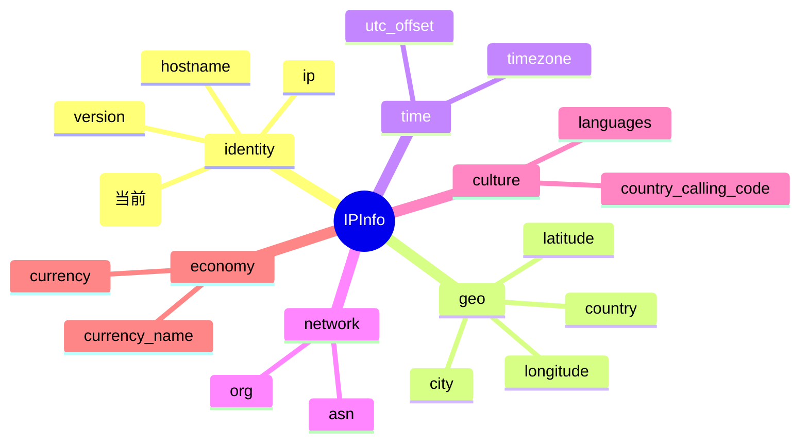

# 🌐 Network — IP 所属网段 CIDR

> 字段类别：🌐 **网络**

::: tip 🎨 一图抵千言
`network` 字段在 `IPInfo` 结构中的位置、所属分组与相关字段关系：



`network` 归属 **identity（身份）** 分组，与同组的 [`ip`](./ip)、[`version`](./version)、[`hostname`](./hostname) 一同描述 IP 的基础身份信息；与 network 分组的 [`asn`](./asn)、[`org`](./org) 互补，后者刻画自治系统层面，前者刻画网段 CIDR 层面。
:::

## 📋 字段定义

```go
Network string `json:"network"`
```

## 🔍 含义

`network` 字段表示该 IP 地址所属的 **网段 CIDR**（Classless Inter-Domain Range）。

CIDR 是一种用 `IP/前缀长度` 形式表示 IP 地址块的方式，例如 `8.8.8.0/24` 表示从 `8.8.8.0` 到 `8.8.8.255` 的 256 个 IPv4 地址组成的子网。通过该字段，你可以快速判断目标 IP 所在的网段范围，常用于网段归属分析、子网聚合查询和 IP 段风险评估。

## 🏷️ 类型说明

- **JSON key**：`"network"`
- **Go 字段**：`IPInfo.Network`
- **Go 类型**：`string`

> 💡 **指针字段说明**：虽然 `Network` 本身是值类型 `string`，但 `IPInfo` 结构体中许多字段（如 `Postal`）是 `*string` 指针类型并标记了 `omitempty`。对于这些指针字段：
>
> - 当 API 未返回该字段时，指针为 `nil`，直接访问会触发 **panic**。
> - 请使用对应的 Getter 方法（例如 `GetPostal()`）安全取值，Getter 内部已做 `nil` 判空处理。
> - `omitempty` 标签确保序列化时省略空值字段，避免输出冗余的 `"field": null`。
>
> `Network` 作为值类型 `string`，未返回时为零值 `""`，可安全直接访问，但仍推荐结合业务逻辑判空。

## 📦 示例值

```json
{
  "network": "8.8.8.0/24"
}
```

常见取值示例：

| IP 地址 | network 示例 | 说明 |
| --- | --- | --- |
| 8.8.8.8 | `8.8.8.0/24` | Google Public DNS 所在 /24 网段 |
| 1.1.1.1 | `1.1.1.0/24` | Cloudflare DNS 所在 /24 网段 |
| 8.8.4.4 | `8.8.4.0/24` | Google Public DNS 备用网段 |

## 🔧 访问方式

### 1️⃣ 结构体字段直接访问

调用 `Lookup` 获取完整的 `IPInfo` 结构体后，直接读取 `Network` 字段：

```go
info, err := client.Lookup(ctx, "8.8.8.8")
if err != nil {
    log.Fatal(err)
}
fmt.Println("Network:", info.Network) // 8.8.8.0/24
```

### 2️⃣ GetField 单字段查询

当你只需要 `network` 这一个字段时，使用 `GetField` 进行轻量级单字段查询，避免拉取全量数据：

```go
network, err := client.GetField(ctx, "8.8.8.8", "network")
if err != nil {
    log.Fatal(err)
}
fmt.Println("Network:", network) // 8.8.8.0/24
```

### 3️⃣ GetClientField 客户端字段查询

针对客户端相关字段，可使用 `GetClientField` 获取当前请求来源 IP 的对应字段值：

```go
network, err := client.GetClientField(ctx, "network")
if err != nil {
    log.Fatal(err)
}
fmt.Println("Client Network:", network)
```

::: details 🗂️ 字段速查
| JSON key | Go 字段 | 类型 | 分组 | 示例值 |
| --- | --- | --- | --- | --- |
| `network` | `IPInfo.Network` | `string` | identity（身份） | `8.8.8.0/24` |
:::

## 🎯 用途

- 🛡️ **网段归属分析**：通过 CIDR 快速定位 IP 所属子网，识别同一网段下的关联资产。
- 🧩 **子网聚合**：将分散 IP 按 /24、/16 等前缀聚合，便于批量统计与可视化。
- 🚨 **风险评估**：结合威胁情报，判断目标网段是否为已知恶意 IP 段。
- 📡 **路由与网络规划**：辅助理解 IP 的网络边界与广播范围。
- 🔎 **日志关联**：在安全日志中按网段聚类，快速发现扫描、爆破等横向移动行为。

## 🔗 相关字段

- 📚 [字段总览](../index) — 查看所有可用字段的完整列表。
- 🌐 [网络类字段](./asn) — 查看与 `network` 同属「网络」相关分组的其他字段（如 [`asn`](./asn)、[`org`](./org)）。
- 🆔 [`ip`](./ip) · [`version`](./version) · [`hostname`](./hostname) — 与 `network` 同属 identity（身份）分组的兄弟字段。

## ➡️ 下一步

- 🚀 试试用 `GetField` 查询其他字段，如 [`asn`](./asn)、[`org`](./org)，组合构建完整的网络画像。
- 📖 阅读 [字段总览](../index)，了解全部字段及其类别。
- 🧪 参考 [高级用法示例](https://github.com/cyberspacesec/ipapi.co-skills/tree/main/examples/advanced_usage)，学习批量查询与字段组合的最佳实践。
