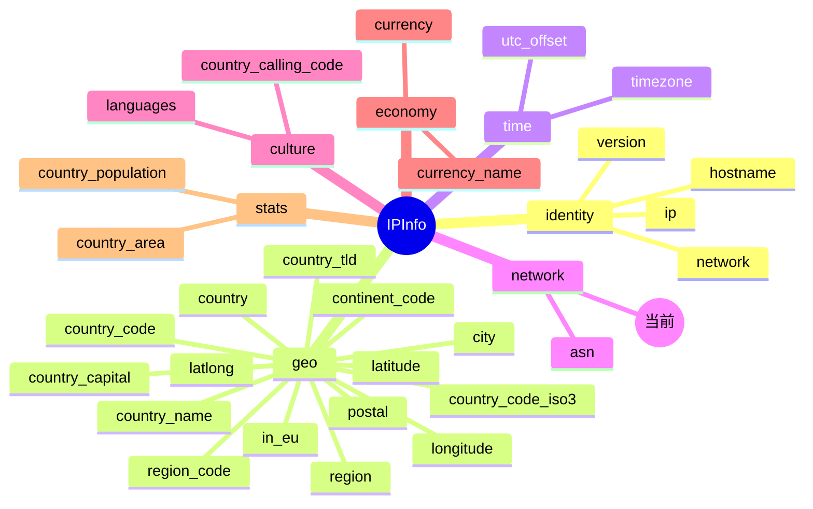

# 🏢 字段详解：org

> 本页对应 `IPInfo.Org` 字段，用于描述 IP 地址所属的 **组织（Organization）** 信息。

::: tip 🎨 一图抵千言
`org` 字段属于 `IPInfo` 结构体的 **network（网络归属）** 分组，与 `asn` 字段配对使用，共同描述 IP 的自治系统与运营实体。


:::

---

## 📋 字段定义

`Org` 字段定义在 `IPInfo` 结构体中，对应的 JSON tag 为 `org`：

```go
type IPInfo struct {
    // ... 其他字段
    ASN      string    `json:"asn"`
    Org      string    `json:"org"`   // ← 本字段
    Hostname string    `json:"hostname,omitempty"`
    // ...
}
```

对应的 JSON 原始 key：

```json
{
  "org": "Google LLC"
}
```

---

## 📖 含义

`org` 字段表示该 IP 地址所属的 **组织名称**（Organization Name）。

- 通常为持有该 IP 段的 **运营商、企业、云服务商或互联网接入商（ISP）** 的法定名称。
- 与 `asn` 字段配对使用：`asn` 给出自治系统编号（如 `AS15169`），`org` 给出对应的组织名（如 `Google LLC`）。
- 例如 `8.8.8.8` 的 `org` 为 `Google LLC`，说明该 IP 属于 Google 运营的网络。

> 💡 **小贴士**：`org` 的值由各区域互联网注册管理机构（RIR，如 ARIN、RIPE、APNIC 等）的 WHOIS 数据库维护，可能与实际使用方略有出入。

---

## 🧩 类型说明

`Org` 字段的 Go 类型为 **`string`**（非指针），因此：

- ✅ 可以直接通过 `info.Org` 访问，无需判空。
- ✅ 当 API 未返回该字段时，`info.Org` 为空字符串 `""`，不会引发 panic。

### 与 `*string` 指针字段的区别

`IPInfo` 中的部分字段（如 `Postal`）使用的是 **`*string` 指针类型**，并配合 `omitempty` 使用：

```go
Postal   *string   `json:"postal"`            // 指针字段
Hostname string    `json:"hostname,omitempty"` // omitempty 字段
Org      string    `json:"org"`                // 普通字符串字段
```

对于指针字段，SDK 提供了安全的访问器方法，避免直接解引用导致 `nil` panic：

```go
// Postal 是 *string，必须用 GetPostal() 安全访问
postal := info.GetPostal() // 内部判 nil，返回 ""

// Org 是普通 string，直接访问即可
org := info.Org // 直接取值，无需判空
```

| 字段类型 | 访问方式 | 为空时的值 | 说明 |
|---------|---------|-----------|------|
| `string`（如 `Org`） | `info.Org` | `""` | 直接访问，安全 |
| `*string`（如 `Postal`） | `info.GetPostal()` | `""` | 需用访问器方法判 nil |
| 带 `omitempty`（如 `Hostname`） | `info.Hostname` | `""` | 序列化时省略该 key |

> ⚠️ **注意**：`Org` 字段未使用 `omitempty`，意味着即使值为空字符串，反序列化时也不会影响字段存在性判断。`omitempty` 仅在结构体被 **序列化** 为 JSON 时生效，对从 API 反序列化到结构体的过程无影响。

---

## 📌 示例值

常见的 `org` 示例值：

| IP 地址 | org 示例值 |
|--------|-----------|
| `8.8.8.8` | `Google LLC` |
| `1.1.1.1` | `Cloudflare, Inc.` |
| `208.67.222.222` | `Cisco OpenDNS` |

本字段在文档中采用的 **标准示例值** 为：

```
Google LLC
```

---

## 🔧 访问方式

### 1️⃣ 结构体字段直接访问

调用 `GetIPInfo` 获取完整的 `IPInfo` 结构体后，可直接读取 `Org` 字段：

```go
info, err := client.GetIPInfo(ctx, "8.8.8.8")
if err != nil {
    log.Fatal(err)
}
fmt.Println("组织:", info.Org) // 输出: 组织: Google LLC
```

### 2️⃣ GetField 单字段查询

如果只需要 `org` 这一个字段，可使用 `GetField` 进行轻量查询，节省带宽：

```go
org, err := client.GetField(ctx, "8.8.8.8", "org")
if err != nil {
    log.Fatal(err)
}
fmt.Println("组织:", org) // 输出: 组织: Google LLC
```

> 🚀 `GetField` 仅请求单个字段，响应体更小、速度更快，适合只关心特定信息的场景。

### 3️⃣ GetClientField 查询本机 IP 的字段

若要查询 **当前客户端出口 IP** 的 `org` 字段，可使用 `GetClientField`（无需传入 IP 地址）：

```go
org, err := client.GetClientField(ctx, "org")
if err != nil {
    log.Fatal(err)
}
fmt.Println("本机所属组织:", org)
```

---

## 🎯 用途

`org` 字段在 IP 地理位置与网络安全分析中有广泛应用：

- 🏢 **ISP / 云厂商识别**：判断 IP 来自 Google、AWS、Cloudflare 还是本地宽带运营商。
- 🛡️ **威胁情报与风控**：识别请求是否来自数据中心 / 云服务商（常与住宅 ISP 区分以评估风险）。
- 🌐 **网络归属分析**：配合 `asn` 字段，定位 IP 所属的自治系统与运营实体。
- 📊 **访问日志统计**：按组织维度对访问日志进行分组、聚合与可视化。
- 🤖 **反爬虫 / 反作弊**：屏蔽已知来自代理或云服务商的请求来源。

---

## 🔗 相关字段

- 📚 [`字段总览`](../../api/fields) —— 查看所有可用字段的完整列表。
- 🌐 [`ASN 分类字段`](../../api/field-asn) —— `org` 所属的 ASN 类别页面，包含 `asn`、`org` 等网络归属相关字段。
- 🏷️ [`ASN 字段详解`](./asn) —— 自治系统编号，与 `org` 配对使用。

::: details 📋 字段速查
| 项目 | 值 |
|------|-----|
| JSON key | `org` |
| Go 字段 | `IPInfo.Org` |
| Go 类型 | `string`（非指针，无 `omitempty`） |
| 所属分组 | network（网络归属） |
| 配对字段 | [`asn`](./asn) |
| 访问方式 | `info.Org`（直接访问）或 [`GetField`](../../api/get-field) / [`GetClientField`](../../api/get-client-field) |
| 标准示例值 | `Google LLC` |
| 数据来源 | RIR WHOIS 数据库（ARIN / RIPE / APNIC 等） |
:::

---

## ➡️ 下一步

- 📖 阅读 [`GetField` 方法文档](../../api/get-field)，了解单字段查询的完整用法与可用字段名列表。
- 📖 阅读 [`GetClientField` 方法文档](../../api/get-client-field)，了解如何查询本机 IP 的字段。
- 🏗️ 查看 [`IPInfo` 模型定义](../../api/models)，了解 `Org` 在结构体中的位置及周边字段。
- 🚀 前往 [使用指南](../../guide/intro) 了解更多实战场景与最佳实践。
