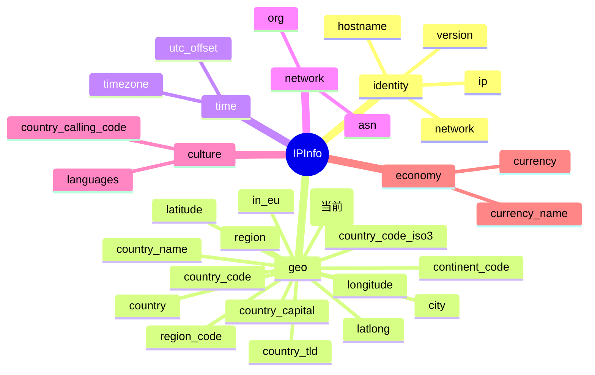

# 📮 字段详解：postal

> 📍 字段类别：**地理（Geo）** · 🏷️ JSON Key：`postal` · 🐹 Go 字段：`IPInfo.Postal`

本页详细介绍 `ipapi.co` 返回的 `postal` 字段，涵盖其定义、含义、类型说明、访问方式与典型用途。

::: tip 🎨 一图抵千言
`postal` 属于 **地理（Geo）** 分组，与 `city`、`region`、`latitude`/`longitude` 等字段共同构成 IP 的地理画像。下图展示其在 `IPInfo` 结构中的位置与相关字段关系。


:::

---

## 📐 字段定义

`postal` 在 `IPInfo` 结构体中的定义如下（对应 JSON tag 行）：

```go
Postal *string `json:"postal"`
```

完整结构体位于 [`models.go`](https://github.com/cyberspacesec/ipapi.co-skills/blob/main/pkg/ipapi/models.go)：

```go
type IPInfo struct {
	// ... 其他字段
	Postal *string `json:"postal"`
	// ...
}
```

---

## 📖 含义

📮 **邮政编码（Postal Code）**，即目标 IP 地址所对应地理位置的邮政编码。

- 🌍 由 ipapi.co 基于地理定位数据库推算得出。
- 🏷️ 例如美国地址形如 `94043`（加州山景城地区）。
- 🧭 用于在更细粒度上区分同一城市内的不同区域，常与 `city`、`region`、`latitude`/`longitude` 配合使用。
- ⚠️ 该值**并非所有 IP 都能返回**：当上游数据不足以推断邮编时，该字段可能为 `nil`。

---

## 🔬 类型说明

### 🐹 `*string` 指针类型

`Postal` 字段的 Go 类型是 **`*string`（指向 string 的指针）**，而不是普通的 `string`。这样设计的原因是：

| 情况 | 普通字段 `string` | 指针字段 `*string` |
|------|------------------|-------------------|
| 数据存在 | `"94043"` | `*string -> "94043"` |
| 数据缺失 | 空字符串 `""`（**无法区分**“没有邮编”与“邮编就是空”） | `nil`（**明确**表示“无数据”） |

✅ 指针类型让“无数据”和“空字符串”可以清晰区分，避免歧义。

### 🛡️ 安全访问：`GetPostal()`

由于直接解引用 `nil` 指针会触发 panic，SDK 提供了安全的访问器方法：

```go
// GetPostal returns the postal code as a string, or empty string if nil
func (info *IPInfo) GetPostal() string {
	if info.Postal == nil {
		return ""
	}
	return *info.Postal
}
```

- 🔒 若 `Postal` 为 `nil`，返回空字符串 `""`，不会 panic。
- 🚀 推荐在业务代码中使用 `GetPostal()` 而非直接读取 `Postal`。

### 🏷️ 关于 `omitempty`

请注意：`postal` 字段的 JSON tag 为 `json:"postal"`，**没有附加 `omitempty`**。

- 这意味着在序列化 `IPInfo` 为 JSON 时，即使 `Postal` 为 `nil`，键 `"postal"` 仍会被输出（值为 `null`）。
- 对比同结构体中 `Hostname` 字段：`json:"hostname,omitempty"`，使用了 `omitempty`，零值时该键会被省略。
- 💡 因此反序列化时若响应中 `postal` 缺失，`Postal` 会保持 `nil`；若响应中显式为 `null`，同样为 `nil`。

---

## 📝 示例值

📦 典型 JSON 响应片段：

```json
{
  "ip": "8.8.8.8",
  "city": "Mountain View",
  "region": "California",
  "country_code": "US",
  "postal": "94043",
  "latitude": 37.4056,
  "longitude": -122.0775
}
```

- 🔢 示例值：`94043`
- 🇺🇸 这是美国加州山景城（Mountain View）地区的邮政编码。

---

## 🧰 访问方式

SDK 提供三种方式获取 `postal`，按场景选择即可。

### 1️⃣ 结构体字段访问（批量查询后）

调用 `GetLocation` / `GetIPInfo` 拿到完整 `IPInfo` 后，直接读字段或用访问器：

```go
package main

import (
	"context"
	"fmt"
	"log"

	"github.com/cyberspacesec/ipapi.co-skills/pkg/ipapi"
)

func main() {
	client, err := ipapi.NewClient()
	if err != nil {
		log.Fatal(err)
	}

	info, err := client.GetLocation(context.Background(), "8.8.8.8")
	if err != nil {
		log.Fatal(err)
	}

	// ✅ 推荐：使用安全访问器
	fmt.Println("Postal:", info.GetPostal()) // 94043

	// ⚠️ 直接读指针字段时需先判 nil
	if info.Postal != nil {
		fmt.Println("Postal (ptr):", *info.Postal) // 94043
	}
}
```

### 2️⃣ `GetField` 单字段查询（指定 IP）

仅查询单个字段，节省带宽与解析开销：

```go
// 查询 8.8.8.8 的邮政编码
postal, err := client.GetField(ctx, "8.8.8.8", "postal")
if err != nil {
	log.Fatal(err)
}
fmt.Println("Postal:", postal) // 94043
```

- 🎯 `GetField(ctx, ip, field)` 中的 `field` 必须是 SDK 已校验的合法字段名（`postal` 已被列入 `validFields`）。
- 📤 返回的是原始字符串（ipapi.co 单字段接口直接返回纯文本，如 `"94043"`）。

### 3️⃣ `GetClientField` 单字段查询（客户端 IP）

查询**调用方自身出口 IP** 的 `postal`（无需传入 IP 参数）：

```go
postal, err := client.GetClientField(ctx, "postal")
if err != nil {
	log.Fatal(err)
}
fmt.Println("My Postal:", postal)
```

- 🪪 适合“查我自己的地理位置”这类场景。
- 🧪 `GetClientField(ctx, field)` 内部请求 ipapi.co 的 `check` 接口。

---

## 🎯 用途

📮 `postal` 字段常见用途包括：

- 📍 **本地化推荐**：根据用户邮编推荐附近门店、服务或区域内容。
- 🚚 **物流与风控**：判断 IP 所属邮编是否与用户填写的收货地址邮编一致，辅助反欺诈。
- 🗺️ **地图与可视化**：与 `latitude`/`longitude` 一起标注用户大致位置。
- 📊 **区域统计**：按邮编聚合用户分布，生成地理热力图或区域报表。
- 🌐 **合规与合规路由**：结合 `country_code`、`region` 做地区级内容分发策略。

---

## 🔗 相关字段

- 📋 [`字段总览`](../../api/fields) —— 所有可查询字段的完整清单。
- 🌍 [`地理类字段`](../../api/field-geo) —— `postal` 所属的"地理"分类页，包含 `city`、`region`、`country`、`latitude`、`longitude` 等同类字段。

---

## ➡️ 下一步

- 🚀 尝试用 `client.GetField(ctx, "8.8.8.8", "postal")` 跑一个最小示例。
- 🗺️ 阅读 [`地理类字段`](../../api/field-geo)，了解 `postal` 与其他地理字段如何组合使用。
- 📖 查看 [`models.go`](https://github.com/cyberspacesec/ipapi.co-skills/blob/main/pkg/ipapi/models.go) 中 `IPInfo` 的完整字段定义与各 `Get*()` 访问器。
- 🔍 探索 [`字段总览`](../../api/fields)，规划你需要的批量查询字段组合。

::: details 📋 字段速查
| 项目 | 值 |
|------|-----|
| JSON Key | `postal` |
| Go 字段 | `IPInfo.Postal` |
| Go 类型 | `*string` |
| 安全访问器 | `GetPostal() string` |
| 分组 | geo（地理） |
| 示例值 | `94043` |
| 是否可空 | 是（数据缺失时为 `nil`） |
| `omitempty` | 否（零值时键仍输出 `null`） |
| 合法字段名校验 | 已列入 [`ValidFields`](../../api/fields) |
:::
