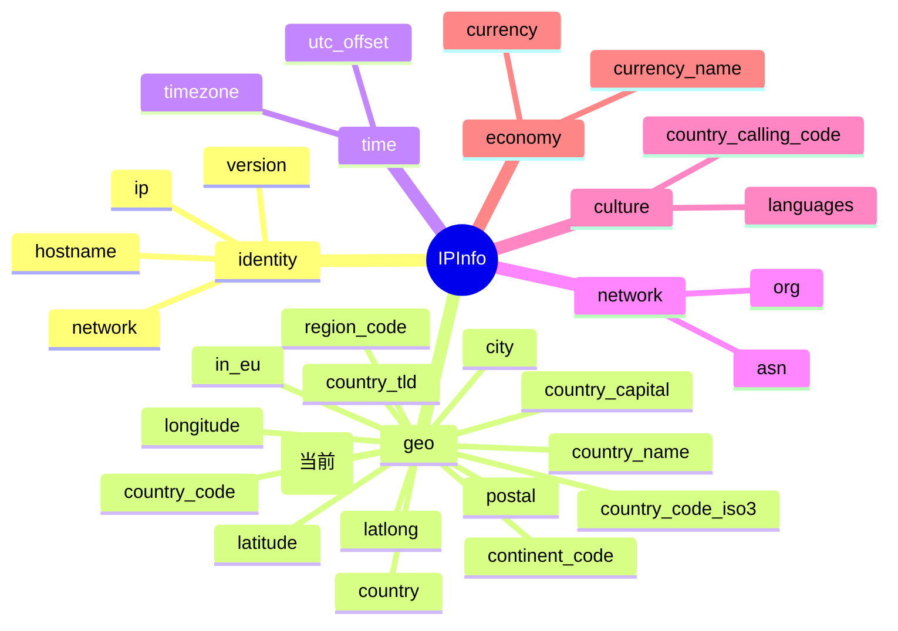

# 🗺️ region — 州/省名

> 🏷️ 字段类别：**地理** · 🔑 JSON Key：`region` · 🧩 Go 字段：`IPInfo.Region`

---

::: tip 🎨 一图抵千言
`region` 在 `IPInfo` 结构体中的位置与所属分组如下（当前字段用 (当前) 标注）：



`region` 属于 **geo（地理）** 分组，与 [`city`](./city)（城市）、[`region_code`](./region_code)（行政区代码）、[`country_name`](./country_name)（国家名）等同组，共同构成 IP 的行政区划层级信息。
:::

---

## 📐 字段定义

`IPInfo` 结构体中对应的 JSON tag 行如下：

```go
Region string `json:"region"`
```

完整的字段定义位于 [`models.go`](https://github.com/cyberspacesec/ipapi.co-skills/blob/main/pkg/ipapi/models.go) 的 `IPInfo` 结构体内。

---

## 📖 含义

🎯 `region` 表示目标 IP 地址所在的 **州/省名**（一级行政区划名称），以英文文本形式返回。

- 🇺🇸 例如：`California` 代表美国加利福尼亚州
- 🇨🇳 例如：`Beijing` 代表中国北京市
- 🇩🇪 例如：`Bavaria` 代表德国巴伐利亚州
- 🇯🇵 例如：`Tokyo` 代表日本东京都

该字段是 IP 地理定位中最常用的一级行政区划标识，返回值通常为该行政区的英文名称（首字母大写），常与 [`region_code`](./region_code)（行政区代码）配合使用。

---

## 🔬 类型说明

| 属性 | 值 |
| --- | --- |
| Go 类型 | `string` |
| JSON Key | `region` |
| 是否指针字段 | ❌ 否（直接为 `string`，非 `*string`） |
| 是否 omitempty | ❌ 否 |

### ⚠️ 关于指针字段与 `omitempty` 的特别说明

`Region` 本身是普通的 `string` 类型，**不是** 指针字段，因此可以直接访问，无需判空。

但 `IPInfo` 结构体中确实存在指针类型字段，例如：

```go
Postal *string `json:"postal"`
```

对于这类 `*string` 指针字段：

- 🚫 直接解引用 `*info.Postal` 在值为 `nil` 时会触发 **panic**
- ✅ SDK 提供了安全访问方法 `GetPostal()`，内部已做 nil 判断：

```go
func (info *IPInfo) GetPostal() string {
    if info.Postal == nil {
        return ""
    }
    return *info.Postal
}
```

对于带有 `omitempty` 的字段（如 `Hostname string \`json:"hostname,omitempty"\``），当 API 返回中不包含该字段时，Go 端会保留零值（空字符串），调用方需自行处理空值语义。而 `region` 既非指针也非 `omitempty`，访问最为直接；当 API 未返回该字段时，`Region` 将为空字符串 `""`，可通过 `info.Region == ""` 判定。

---

## 📌 示例值

```text
California
```

常见取值参考：

| 国家 | 州/省 | region |
| --- | --- | --- |
| 美国 | 加利福尼亚州 | `California` |
| 美国 | 纽约州 | `New York` |
| 中国 | 北京市 | `Beijing` |
| 中国 | 广东省 | `Guangdong` |
| 德国 | 巴伐利亚州 | `Bavaria` |
| 日本 | 东京都 | `Tokyo` |
| 英国 | 英格兰 | `England` |
| 加拿大 | 安大略省 | `Ontario` |

---

## 🛠️ 访问方式

### 1️⃣ 结构体字段访问

通过 `GetIPInfo` 拿到完整的 `*IPInfo` 后，直接读取字段：

```go
package main

import (
    "context"
    "fmt"
    "log"

    "github.com/cyberspacesec/ipapi.co-skills/pkg/ipapi"
)

func main() {
    client := ipapi.NewClient()
    info, err := client.GetIPInfo(context.Background(), "8.8.8.8", "json")
    if err != nil {
        log.Fatal(err)
    }

    // 直接访问 Region 字段
    fmt.Println("州/省名:", info.Region) // 输出: California
}
```

### 2️⃣ GetField 单字段查询

只需查询 `region` 这一个字段时，使用 `GetField` 更轻量，仅发起一次单字段请求：

```go
region, err := client.GetField(ctx, "8.8.8.8", "region")
if err != nil {
    log.Fatal(err)
}
fmt.Println("州/省名:", region) // 输出: California
```

> 💡 `GetField` 返回的是原始字符串（API 原始响应体），无需解析整个 JSON，适合只关心单个字段的场景。

### 3️⃣ GetClientField 查询本机 IP 的字段

查询**当前发起请求的客户端 IP** 的 `region`（不传 IP 参数，对应 `GET /{field}/` 端点）：

```go
region, err := client.GetClientField(ctx, "region")
if err != nil {
    log.Fatal(err)
}
fmt.Println("本机 IP 所在州/省:", region)
```

> 🧭 `GetField` 与 `GetClientField` 的区别：前者需要显式传入目标 IP（`GET /{ip}/{field}/`），后者针对调用方自身 IP（`GET /{field}/`）。

---

## 🎯 用途

`region` 在实际业务中应用广泛，典型场景包括：

- 🌍 **精细化地理定位**：在国家维度之下进一步定位到州/省，用于省级内容分发、区域化推荐。
- 🛡️ **风控与反欺诈**：识别异地登录（如账号常用地区与当前 `region` 不符），辅助判定可疑行为。
- 🌐 **本地化服务**：根据州/省切换语言变体、货币格式、税率规则（如美国各州销售税）。
- 📊 **区域统计分析**：按一级行政区划聚合用户分布、流量来源等业务指标，生成热力图。
- 🚚 **物流与电商**：结合 `region` 与 [`postal`](./postal)（邮政编码）确定配送范围、运费模板与时效。
- 🔁 **与 `region_code` 互补**：与 [`region_code`](./region_code)（行政区代码，如 `CA`）配合使用，同时满足文本展示与编码匹配的需求。

---

## 📋 字段速查

::: details 字段速查表
| 属性 | 值 |
| --- | --- |
| JSON Key | `region` |
| Go 字段 | `IPInfo.Region` |
| Go 类型 | `string` |
| 分组 | geo（地理） |
| 示例值 | `California` |
:::

---

## 🔗 相关字段

- 📚 [字段总览](../../api/fields) — 查看所有可用字段的全景列表。
- 🧭 [地理类字段分类页](../../api/field-geo) — 浏览与地理相关的全部字段（`city`、`region`、`region_code`、`country`、`country_name`、`country_code`、`latitude`、`longitude`、`latlong`、`postal`、`timezone` 等）。

---

## 🚀 下一步

- 📖 阅读 [字段总览](../../api/fields)，了解 `region` 在整个字段体系中的位置。
- 🧭 进入 [地理类字段分类页](../../api/field-geo)，对比 `region` 与 `city`、`region_code`、`country_name` 的层级关系。
- 🧪 参考仓库 [`main.go`](https://github.com/cyberspacesec/ipapi.co-skills/blob/main/examples/basic_usage/main.go) 运行一个完整的查询示例。
- 🔍 试用 `GetField` 单字段查询其他字段，如 `region_code`、`city`、`latitude`，体会不同字段类型的返回差异。
