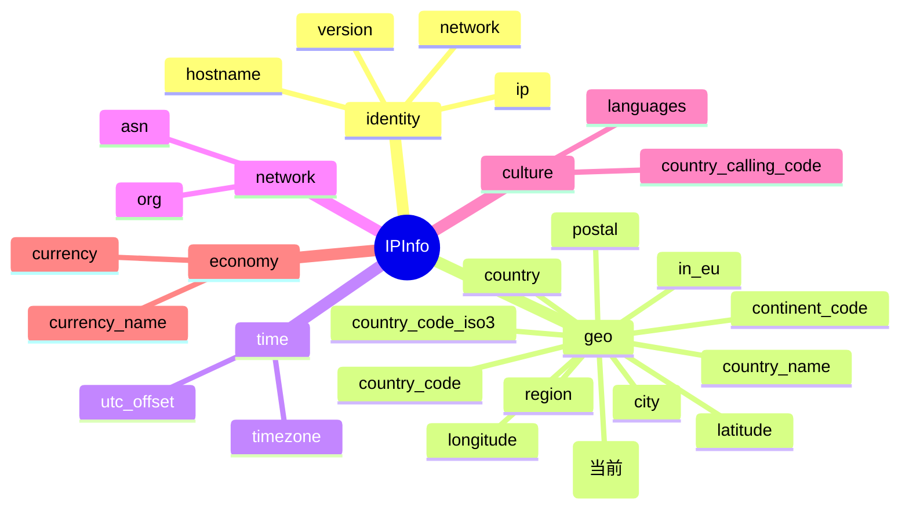

# 🗺️ region_code

> 🏷️ **字段名**：`region_code` · **Go 字段**：`IPInfo.RegionCode` · 📂 **类别**：地理

::: tip 🎨 一图抵千言
下图展示 `region_code` 在 `IPInfo` 结构体中的位置、所属 `geo` 分组，以及与同组相关字段的关系：


:::

## 📐 字段定义

`IPInfo` 结构体中，`region_code` 以纯字符串值类型直接映射，JSON tag 即为 `region_code`：

```go
RegionCode string `json:"region_code"`
```

## 💡 含义

🧭 **州 / 省代码**。

`region_code` 表示目标 IP 所在的一级行政区划（州、省、邦、都道府县等）的**短代码**，通常为该国国家标准下的缩写形式。它比全称 `region` 更紧凑、更适合用作程序里的区域主键或分组依据。

例如：对于位于美国加利福尼亚州的 IP，`region_code` 返回 `CA`，而 `region` 返回 `California`。

## 🔤 类型说明

| 属性 | 值 |
| --- | --- |
| JSON Key | `region_code` |
| Go 字段 | `IPInfo.RegionCode` |
| Go 类型 | `string`（值类型，非指针） |
| JSON Tag | `json:"region_code"`（无 `omitempty`） |
| 零值 | 空字符串 `""` |

📌 **关于指针字段与 `omitempty` 的特别说明**

`IPInfo` 结构体内部并非所有字段都采用同样的处理方式，这里有几类需要留意：

- 🪪 **值类型字段（如 `RegionCode`）**：直接用 `string` 声明，访问方式为 `info.RegionCode`。当 API 未返回该字段或返回为空时，Go 侧得到的就是零值空字符串 `""`，**无需判空指针**。
- 📮 **指针字段（如 `Postal *string`）**：采用指针是为了区分「API 没返回该字段（nil）」与「API 返回了空字符串」。直接解引用 `*info.Postal` 在 nil 时会 panic，因此 SDK 提供了安全访问器 `GetPostal()`：

  ```go
  // GetPostal 返回邮政编码字符串；若 Postal 为 nil 则返回空字符串
  func (info *IPInfo) GetPostal() string {
      if info.Postal == nil {
          return ""
      }
      return *info.Postal
  }
  ```

- 🧹 **`omitempty` 字段（如 `Hostname`，tag 为 `json:"hostname,omitempty"`）**：当值为空时，在序列化（反向输出 JSON）时会被省略；这主要影响序列化行为，反序列化（从 API 读取）时仍按值类型对待。

✅ 对 `region_code` 而言：它是**值类型 + 无 `omitempty`**，最简单的一类——读取后直接用 `info.RegionCode` 即可，不必调用任何 Getter，也不必担心空指针。

## 🧪 示例值

```text
CA
```

更多常见取值示例：

| 区域 | region | region_code |
| --- | --- | --- |
| 美国加利福尼亚州 | California | CA |
| 美国纽约州 | New York | NY |
| 中国广东省 | Guangdong | GD |
| 日本东京都 | Tokyo | 13 |
| 德国巴伐利亚州 | Bavaria | BY |

> 📝 注：不同国家的代码体系不同，长度与字符集可能各异（字母、数字均可能出现），处理时请按字符串对待，不要硬编码长度假设。

## 🚀 访问方式

### 1️⃣ 结构体字段访问

调用 `GetIPInfo` 拿到完整的 `*IPInfo` 后，直接通过结构体字段读取：

```go
package main

import (
    "context"
    "fmt"
    "log"

    "github.com/cyberspacesec/ipapi.co-skills/pkg/ipapi"
)

func main() {
    client := ipapi.NewClient()
    info, err := client.GetIPInfo(context.Background(), "8.8.8.8", "json")
    if err != nil {
        log.Fatal(err)
    }
    fmt.Printf("region_code = %s\n", info.RegionCode) // 例如：CA
}
```

### 2️⃣ GetField 单字段查询

只想取这一个字段时，用 `GetField` 走单字段端点，响应体更小、更快：

```go
client := ipapi.NewClient()
code, err := client.GetField(context.Background(), "8.8.8.8", "region_code")
if err != nil {
    log.Fatal(err)
}
fmt.Printf("region_code = %s\n", code) // 例如：CA
```

对应 API 端点：`GET https://ipapi.co/8.8.8.8/region_code/`

### 3️⃣ GetClientField 查询本机 IP 的字段

查询**当前出口 IP** 所在的州/省代码时，省略 IP 参数即可：

```go
client := ipapi.NewClient()
code, err := client.GetClientField(context.Background(), "region_code")
if err != nil {
    log.Fatal(err)
}
fmt.Printf("本机 region_code = %s\n", code)
```

对应 API 端点：`GET https://ipapi.co/region_code/`

## 🎯 用途

`region_code` 在工程实践中非常有用，典型场景包括：

- 🌐 **地理路由与就近接入**：根据州/省代码把用户路由到最近的 CDN 节点或服务区域。
- 📊 **区域级统计与归因**：按 `region_code` 分组聚合访问量、订单、错误率，做漏斗与画像。
- 🛡️ **风控与合规**：结合 `country_code` 判断是否落入受限州/省（如 GDPR、CCPA 相关区域）。
- 🏷️ **本地化展示**：作为区域主键关联本地化文案、货币、时区配置。
- 🔑 **紧凑主键**：相比全称 `region`，短代码更适合做日志标签、缓存 key、数据库索引。

## 📋 字段速查

::: details 字段速查表
| 项 | 值 |
| --- | --- |
| JSON Key | `region_code` |
| Go 字段 | [`RegionCode`](./region_code) |
| Go 类型 | `string` |
| 分组 | geo（地理） |
| 示例值 | `CA` |
:::

## 🔗 相关字段

- 📋 字段总览：[字段总览](../../api/fields)
- 🧭 地理分类：[地理字段分类](../../api/field-geo)
- 🏷️ 同类兄弟字段：`region`（州/省**全称**）、`country`、`country_code`、`country_code_iso3`、`continent_code`、`city`、`postal`

## ➡️ 下一步

- 🧭 学习如何按分类批量取字段，见 [地理字段分类](../../api/field-geo)
- 📚 浏览全部可用字段，见 [字段总览](../../api/fields)
- 🚀 动手跑一个完整示例，见 [基础用法示例https://github.com/cyberspacesec/ipapi.co-skills/tree/main/examples/basic_usage)
- 🧪 了解错误处理与重试机制，见 [错误处理示例https://github.com/cyberspacesec/ipapi.co-skills/tree/main/examples/error_handling)
