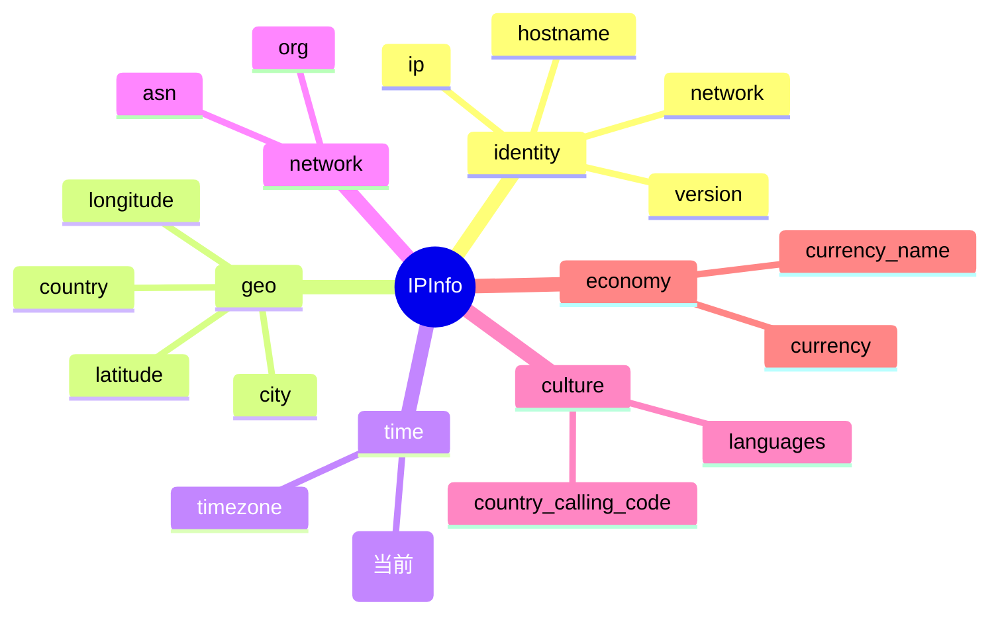

# 🕐 字段详解：utc_offset

> 字段类别：⏰ 时间 · JSON key：`utc_offset` · Go 字段：`IPInfo.UTCOffset`

::: tip 🎨 一图抵千言
`utc_offset` 属于 **time（时间）** 分组，与 [`timezone`](./utc_offset) 同组，描述 IP 所在地理位置的时间属性。


:::

---

## 📐 字段定义

`IPInfo.UTCOffset` 在 `pkg/ipapi/models.go` 中定义，其 Go 结构体 tag 行如下：

```go
UTCOffset string `json:"utc_offset"`
```

完整结构体定义位于 [`models.go`](https://github.com/cyberspacesec/ipapi.co-skills/blob/main/pkg/ipapi/models.go) 的 `IPInfo` 类型中。

::: details 📋 字段速查
| 项目 | 值 |
| --- | --- |
| JSON key | `utc_offset` |
| Go 字段 | `IPInfo.UTCOffset` |
| Go 类型 | `string` |
| 字段分组 | ⏰ time（时间） |
| 示例值 | `-07:00` |
:::

---

## 📖 含义

**UTC 偏移**（UTC offset）表示目标 IP 所在地理位置的本地时间相对于 **协调世界时（UTC）** 的固定时间差。

- 格式为带符号的 `±HH:MM` 字符串。
- 正值（如 `+08:00`）表示本地时间比 UTC **快** 8 小时（东时区）。
- 负值（如 `-07:00`）表示本地时间比 UTC **慢** 7 小时（西时区）。
- 与夏令时（DST）无关，它是该地点相对 UTC 的**标准**偏移。

它常与 [`timezone`](./utc_offset) 字段配合使用：`timezone` 给出 IANA 时区名（如 `America/Los_Angeles`），而 `utc_offset` 给出可直接用于时间换算的数值偏移。

---

## 🔬 类型说明

### Go 类型：`string`

`IPInfo.UTCOffset` 是普通的 `string` 类型（非指针）。这意味着：

- 反序列化后，即使 API 未返回该字段，`UTCOffset` 也会是**零值空字符串** `""`，而**不会**是 `nil`。
- 直接通过 `info.UTCOffset` 访问即可，**无需**判空指针，不会触发空指针 panic。
- 想判断字段是否缺失，应检查 `info.UTCOffset == ""`。

### ⚠️ 关于 `*string` 指针字段（如 `Postal`）

本字段本身**不是**指针字段。但 `IPInfo` 中部分字段（如 `Postal *string`）是指针类型，原因是：JSON 的 `omitempty` 对非指针 `string` 无法区分“空字符串”与“字段缺失”。对于这类指针字段，SDK 提供了安全的访问器方法，避免直接解引用导致空指针：

```go
// Postal 是 *string，必须用 GetPostal() 安全访问，返回 "" 而非 panic
info.GetPostal()
```

`UTCOffset` 不属于这种情况，无需类似包装方法，直接字段访问即可。

### 关于 `omitempty`

`IPInfo` 中带 `omitempty` tag 的字段是 `Hostname`：

```go
Hostname string `json:"hostname,omitempty"`
```

`utc_offset` 字段**没有** `omitempty` tag，即 API 默认会在 JSON 响应中包含该键（返回值为字符串或空串）。

---

## 🧪 示例值

```text
-07:00
```

其他常见示例：

| 地区示例             | utc_offset |
| -------------------- | ---------- |
| 美国洛杉矶（PDT 期间） | `-07:00`   |
| 中国上海             | `+08:00`   |
| 英国伦敦（GMT 期间）  | `+00:00`   |
| 日本东京             | `+09:00`   |
| 印度孟买             | `+05:30`   |

> 💡 注意：分钟部分不一定为 `00`，部分时区存在半小时/四十五分钟偏移（如 `+05:30`、`+05:45`）。

---

## 🛠️ 访问方式

SDK 提供三种方式获取 `utc_offset` 字段。

### 方式一：结构体字段访问（全量查询）

通过 `GetIPInfo` 一次性拉取完整 JSON 响应并反序列化为 `IPInfo`，再直接读取 `UTCOffset` 字段：

```go
package main

import (
    "context"
    "fmt"
    "log"

    "github.com/cyberspacesec/ipapi.co-skills/pkg/ipapi"
)

func main() {
    client := ipapi.NewClient()
    info, err := client.GetIPInfo(context.Background(), "8.8.8.8", "json")
    if err != nil {
        log.Fatal(err)
    }
    fmt.Println("UTC offset:", info.UTCOffset) // 例如：-07:00
}
```

### 方式二：`GetField` 单字段查询（指定 IP）

只请求单个字段的原始字符串值，对应 API 端点 `GET https://ipapi.co/{ip}/{field}/`：

```go
offset, err := client.GetField(ctx, "8.8.8.8", "utc_offset")
if err != nil {
    log.Fatal(err)
}
fmt.Println("UTC offset:", offset) // 例如：-07:00
```

> 📌 `GetField` 返回的是 API 响应体的原始字符串，**不会**经过 JSON 反序列化，因此拿到的就是 `-07:00` 这样的纯文本。

### 方式三：`GetClientField` 单字段查询（客户端自身 IP）

查询**调用方自身**出口 IP 的 `utc_offset`，对应 API 端点 `GET https://ipapi.co/{field}/`：

```go
offset, err := client.GetClientField(ctx, "utc_offset")
if err != nil {
    log.Fatal(err)
}
fmt.Println("My UTC offset:", offset)
```

---

## 🎯 用途

`utc_offset` 字段在以下场景中非常有用：

- 🕑 **本地时间换算**：将 UTC 时间戳快速转换为 IP 所在地的本地时间，无需引入完整时区数据库。
- 📊 **日志与事件归类**：按地理时区对日志、访问记录、订单事件进行分组统计。
- 🌐 **调度与展示**：为不同地区的用户显示符合其本地时钟的时间标签（如“该区域当前为工作时间”）。
- 🤖 **风控与异常检测**：结合请求发生时刻的本地时间，判断是否处于异常时段（如凌晨高频访问）。
- ⚡ **轻量级场景**：当只需要数值偏移、不需要 DST（夏令时）规则时，比解析 IANA `timezone` 更简单直接。

> ⚠️ 局限：`utc_offset` 是**固定**偏移，不随夏令时变化。若需要精确处理 DST，请改用 [`timezone`](./utc_offset) 字段配合 Go 标准库 `time.LoadLocation`。

---

## 🔗 相关字段

- 📋 [字段总览](../../api/fields) —— 所有可用字段的完整清单。
- ⏰ [时间类字段](../../api/field-time) —— `utc_offset` 所属的字段分类页（含 `timezone` 等时间相关字段）。
- 🕑 [timezone 字段详解](./utc_offset) —— IANA 时区名，常与 `utc_offset` 配合使用。

---

## ➡️ 下一步

- 🚀 尝试运行 [基础用法示例](../../examples/basic-usage)，亲眼看 `utc_offset` 的实际输出。
- 📖 阅读 [`GetField` 方法文档](../../api/get-field)，了解单字段查询的完整参数与错误处理。
- 🌍 探索 [时间类字段分类](../../api/field-time)，把 `utc_offset` 与 `timezone` 一起用于时间换算。
- 🧪 查看 [错误处理示例](../../examples/error-handling)，了解字段缺失或请求失败时的应对方式。
