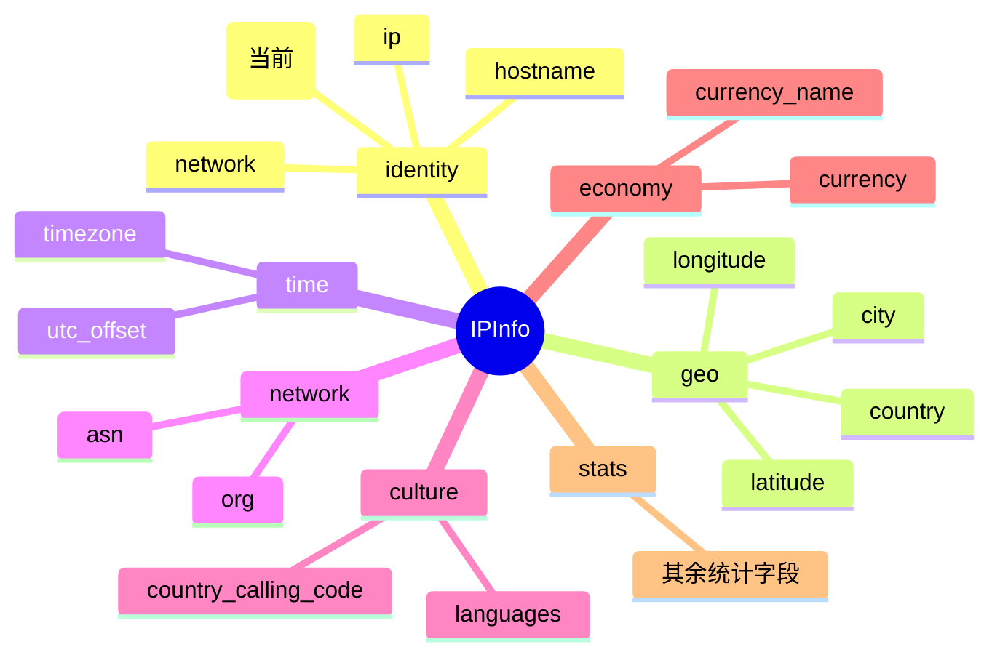

# 🧬 Version — IP 协议版本

> 字段类别：🌐 **网络**

::: tip 🎨 一图抵千言
`version` 字段在 [`IPInfo`](../../api/fields) 结构体中的位置与所属分组示意：


:::

## 📋 字段定义

```go
Version string `json:"version"`
```

## 🔍 含义

`version` 字段表示查询的 IP 地址所采用的 **IP 协议版本**，取值为 `IPv4` 或 `IPv6`。

IPv4 与 IPv6 是互联网协议的两代标准：IPv4 地址为 32 位，通常写作点分十进制（如 `8.8.8.8`）；IPv6 地址为 128 位，通常写作冒号分隔的十六进制（如 `2001:4860:4860::8888`）。通过该字段，你可以在拿到 `ip` 字段后无需自行解析格式即可一行判断目标地址属于哪一代协议，常用于双栈环境下的协议分流、IPv6 迁移度统计与合规性审计。

## 🏷️ 类型说明

- **JSON key**：`"version"`
- **Go 字段**：`IPInfo.Version`
- **Go 类型**：`string`

> 💡 **指针字段说明**：虽然 `Version` 本身是值类型 `string`，但 `IPInfo` 结构体中许多字段（如 `Postal`）是 `*string` 指针类型并标记了 `omitempty`。对于这些指针字段：
>
> - 当 API 未返回该字段时，指针为 `nil`，直接访问会触发 **panic**。
> - 请使用对应的 Getter 方法（例如 `GetPostal()`）安全取值，Getter 内部已做 `nil` 判空处理。
> - `omitempty` 标签确保序列化时省略空值字段，避免输出冗余的 `"field": null`。
>
> `Version` 作为值类型 `string`，未返回时为零值 `""`，可安全直接访问，但仍推荐结合业务逻辑判空。

## 📦 示例值

```json
{
  "version": "IPv4"
}
```

常见取值示例：

| IP 地址 | version | 说明 |
| --- | --- | --- |
| 8.8.8.8 | `IPv4` | Google Public DNS 的 IPv4 地址 |
| 1.1.1.1 | `IPv4` | Cloudflare DNS 的 IPv4 地址 |
| 2001:4860:4860::8888 | `IPv6` | Google Public DNS 的 IPv6 地址 |
| 2606:4700:4700::1111 | `IPv6` | Cloudflare DNS 的 IPv6 地址 |

## 🔧 访问方式

### 1️⃣ 结构体字段直接访问

调用 `GetIPInfo` 获取完整的 `IPInfo` 结构体后，直接读取 `Version` 字段：

```go
info, err := client.GetIPInfo(ctx, "8.8.8.8", "json")
if err != nil {
    log.Fatal(err)
}
fmt.Println("Version:", info.Version) // IPv4
```

### 2️⃣ GetField 单字段查询

当你只需要 `version` 这一个字段时，使用 `GetField` 进行轻量级单字段查询，避免拉取全量数据：

```go
version, err := client.GetField(ctx, "8.8.8.8", "version")
if err != nil {
    log.Fatal(err)
}
fmt.Println("Version:", version) // IPv4
```

### 3️⃣ GetClientField 客户端字段查询

针对客户端相关字段，可使用 `GetClientField` 获取当前请求来源 IP 的对应字段值：

```go
version, err := client.GetClientField(ctx, "version")
if err != nil {
    log.Fatal(err)
}
fmt.Println("Client Version:", version)
```

## 🎯 用途

- 🔄 **IPv4/IPv6 区分统计**：在双栈环境中按协议版本分流处理，分别走不同的下游逻辑。
- 📊 **IPv6 迁移度分析**：统计访问源中 IPv6 占比，衡量网络的 IPv6 就绪程度与迁移进度。
- 🛡️ **合规与审计**：部分安全策略要求对 IPv6 流量单独留存审计记录，`version` 可作为分流标识。
- 🧮 **日志归一化**：将不同协议版本的 IP 统一打标，便于后续在数据仓库中按版本维度聚合分析。
- 🌐 **协议感知路由**：根据版本字段决定使用 IPv4 还是 IPv6 的回源链路或健康检查策略。

## 🔗 相关字段

- 📚 [字段总览](../../api/fields) — 查看所有可用字段的完整列表。
- 🌐 [网络类字段](../../api/field-network) — 查看与 `version` 同属「网络」类别的其他字段（`ip`、`network`）。

## ➡️ 下一步

- 🚀 试试用 `GetField` 查询其他网络字段，如 `network`、`asn`、`org`，组合构建完整的网络画像。
- 📖 阅读 [字段总览](../../api/fields)，了解全部字段及其类别划分。
- 🧪 参考 [高级用法示例https://github.com/cyberspacesec/ipapi.co-skills/tree/main/examples/advanced_usage)，学习批量查询与字段组合的最佳实践。

::: details 📇 字段速查
| 项 | 值 |
| --- | --- |
| **JSON key** | `version` |
| **Go 字段** | `IPInfo.Version` |
| **Go 类型** | `string` |
| **分组** | `identity`（身份） |
| **示例值** | `IPv4` / `IPv6` |
| **相关字段** | [`ip`](./ip)、[`network`](./network)、[`hostname`](./hostname) |
| **查询方法** | [`GetIPInfo`](../../api/client)、[`GetField`](../../api/client)、[`GetClientField`](../../api/client) |
:::
