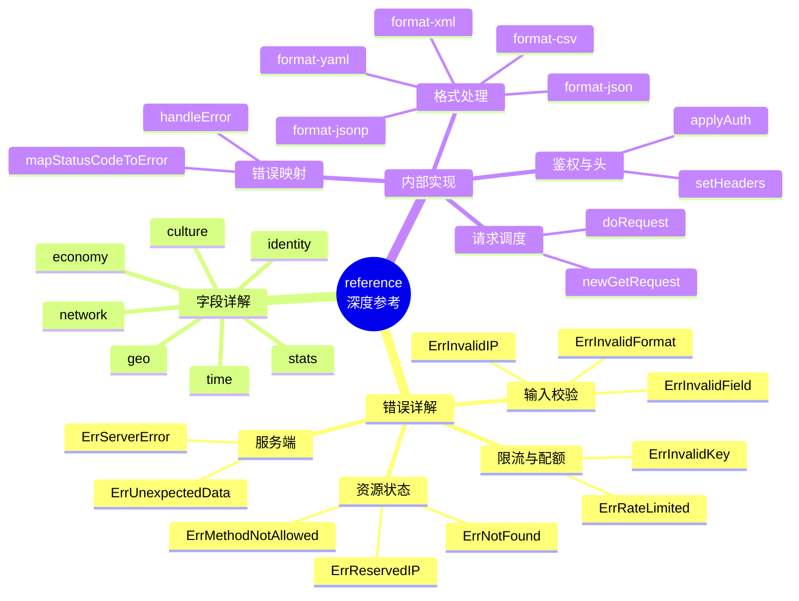

# 📚 功能点深度参考

> 逐个符号的详解文档。每个错误、字段、常量、内部函数都有独立页面。

::: tip 🎨 一图抵千言：reference 总览
本目录把 SDK 的每个公开符号拆成独立小页，按「错误 / 字段 / 内部实现」三类组织，配合流程图与状态图帮助理解。
:::

## 📂 目录结构

- 🛡 [错误详解](../api/errors) —— 10 个哨兵错误逐个剖析
- 🗂 [字段详解](../api/fields) —— 28 个 `IPInfo` 字段逐个剖析
- ⚙️ [常量与内部](../api/methods) —— 格式常量、认证模式、内部方法详解

## 🛡 错误详解

| 错误 | 说明 |
|------|------|
| [`ErrInvalidIP`](./errors/err-invalid-ip) | 无效 IP 地址 |
| [`ErrInvalidField`](./errors/err-invalid-field) | 无效字段名 |
| [`ErrInvalidFormat`](./errors/err-invalid-format) | 无效响应格式 |
| [`ErrRateLimited`](./errors/err-rate-limited) | 速率限制超限 |
| [`ErrReservedIP`](./errors/err-reserved-ip) | 保留 IP 地址 |
| [`ErrNotFound`](./errors/err-not-found) | 资源未找到 |
| [`ErrServerError`](./errors/err-server-error) | 服务器错误 |
| [`ErrUnexpectedData`](./errors/err-unexpected-data) | 意外响应数据 |
| [`ErrMethodNotAllowed`](./errors/err-method-not-allowed) | 请求方法不允许 |
| [`ErrInvalidKey`](./errors/err-invalid-key) | 无效 API 密钥 |

## 🗂 字段详解

### 🌐 网络
- [`ip`](./fields/ip) · [`network`](./fields/network) · [`version`](./fields/version)

### 🏙 地理
- [`city`](./fields/city) · [`region`](./fields/region) · [`region_code`](./fields/region_code) · [`postal`](./fields/postal)

### 🌍 国家
- [`country`](./fields/country) · [`country_name`](./fields/country_name) · [`country_code`](./fields/country_code) · [`country_code_iso3`](./fields/country_code_iso3) · [`country_capital`](./fields/country_capital) · [`country_tld`](./fields/country_tld) · [`continent_code`](./fields/continent_code) · [`in_eu`](./fields/in_eu)

### 🧭 坐标
- [`latitude`](./fields/latitude) · [`longitude`](./fields/longitude) · [`latlong`](./fields/latlong)

### ⏰ 时间
- [`timezone`](./fields/utc_offset) · [`utc_offset`](./fields/utc_offset)

### 💱 货币/语言
- [`country_calling_code`](./fields/country_calling_code) · [`languages`](./fields/languages) · [`currency`](./fields/currency) · [`currency_name`](./fields/currency_name)

### 📊 统计
- [`country_area`](./fields/country_area) · [`country_population`](./fields/country_population)

### 📡 ASN
- [`asn`](./fields/asn) · [`org`](./fields/org) · [`hostname`](./fields/hostname)

## ⚙️ 常量与内部

### 🎨 格式常量
- [`FormatJSON`](./internal/format-json) · [`FormatJSONP`](./internal/format-jsonp) · [`FormatXML`](./internal/format-xml) · [`FormatCSV`](./internal/format-csv) · [`FormatYAML`](./internal/format-yaml)

### 🔒 认证模式
- [`APIKeyHeader`](./internal/apikey-header) · [`APIKeyQuery`](./internal/apikey-query)

### 📌 常量
- [`defaultBaseURL`](./internal/default-base-url) · [`defaultTimeout`](./internal/default-timeout) · [`maxRedirects`](./internal/max-redirects) · [`defaultRetryDelay`](./internal/default-retry-delay)

### 🗃 变量
- [`validFormats`](./internal/valid-formats) · [`validFields`](./internal/valid-fields)

### 🏭 内部方法
- [`doRequest`](./internal/do-request) · [`applyAuth`](./internal/apply-auth) · [`setHeaders`](./internal/set-headers) · [`mapStatusCodeToError`](./internal/map-status-code) · [`handleError`](./internal/handle-error) · [`newGetRequest`](./internal/new-get-request)

### 🧩 类型方法
- [`IPInfo.ParseLatLong`](./internal/parselatlong) · [`IPInfo.GetPostal`](./internal/get-postal) · [`APIError.Error`](./internal/apierror-error) · [`APIError.ToError`](./internal/apierror-toerror)

## 🚀 下一步

- 📖 回 [API 参考](../api/methods)
- 🧭 看 [核心概念](../guide/intro)
- 🧪 跑 [示例](../examples/basic-usage)
