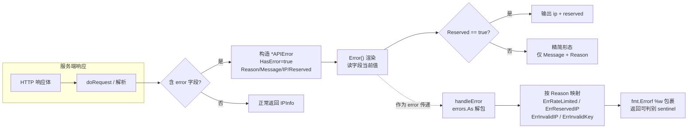

# 📛 `APIError.Error`

> 属于 [APIError 方法](../) · 实现 `error` 接口，把结构化错误渲染成可读字符串，并对保留 IP 做差异化输出

::: tip 🎨 一图抵千言
`APIError.Error()` 的产生与转换路径：从服务端响应到结构体，再到 `error` 字符串与哨兵错误的完整链路。


:::

## 📐 定义

```go
// 实现error接口
func (e *APIError) Error() string
```

## 📖 说明

✨ `Error()` 是 `*APIError` 上的 **接口实现方法**，让 `APIError` 满足 Go 内置的 `error` 接口。这意味着 `*APIError` 可以直接作为 `error` 在函数间传递、被 `fmt.Errorf("%w", ...)` 包裹、被 `errors.Is` / `errors.As` 识别，而无需任何适配层。

### 🎯 作用

- 🧱 **接口实现**：让 `*APIError` 本身就是 `error`，省去 `ToError()` 这类显式转换（旧版兼容入口见 [`APIError.ToError`](./apierror-toerror)）。
- 📝 **可读渲染**：把 `Message`、`Reason` 等结构化字段拼成人类可读的字符串，便于日志与终端输出。
- 🚦 **区分保留 IP**：当 `Reserved == true` 时，额外输出 `ip` 与 `reserved` 字段，让保留地址一眼可辨。

### 🔀 两种输出形态

`Error()` 根据 `e.Reserved` 走两个分支：

```
e.Reserved == true ?
   │
   ├─ 是 ──▶ "ipapi error: <Message> (reason: <Reason>, ip: <IP>, reserved: true)"
   │
   └─ 否 ──▶ "ipapi error: <Message> (reason: <Reason>)"
```

> 💡 这种差异化输出源于 ipapi.co 对保留地址段（如 `127.0.0.1`、`192.168.x.x` 等私网/环回地址）的响应：服务端会返回 `Reason: "Reserved IP Address"` 并把 `Reserved` 置为 `true`。`Error()` 据此在错误字符串里带上具体 IP，方便你定位到底是哪个保留地址触发了错误。

### 🧩 与错误处理链的关系

`*APIError` 通过 `Error()` 成为 `error` 后，SDK 的统一错误出口 [`handleError`](./handle-error) 才能用 `errors.As` 解包它，再按 `Reason` 映射到 `ErrRateLimited` / `ErrReservedIP` / `ErrInvalidIP` / `ErrInvalidKey` 等哨兵错误（见 [`Errors`](../../api/errors)）。换言之，`Error()` 是整个哨兵映射链能跑通的前提。

> ⚠️ 注意：`Error()` 只负责 **字符串渲染**，不做任何映射或包装。哨兵映射发生在 `handleError` 里，`Error()` 本身返回的字符串不保证可被 `errors.Is` 命中——可判别性来自 `handleError` 用的 `fmt.Errorf("%w: ...", sentinel, ...)`。

::: details 🐞 调试技巧：从 error 字符串反查 *APIError
当日志里只看到 `ipapi error: ... (reason: ..., ip: ..., reserved: true)` 这样的字符串时，别急着正则拆解——直接在调用端用 `errors.As` 把 `*APIError` 取回，即可拿到结构化字段：

```go
var ae *ipapi.APIError
if errors.As(err, &ae) {
    // 结构化字段比字符串更可靠：字段是当前值，可程序化判别
    log.Printf("ip=%s reserved=%v reason=%s", ae.IP, ae.Reserved, ae.Reason)
}
```

注意 `errors.As` 能命中是因为 `*APIError` 经 `Error()` 满足了 `error` 接口，且在 `handleError` 中以 `fmt.Errorf("%w", ...)` 形式被包裹传递（详见 [`handleError`](./handle-error)）。若你绕过 SDK 自行构造 `*APIError`，记得用指针赋值给 `error`，值类型不满足接口。
:::

::: warning ⚠️ 内部方法警告
`Error()` 返回的字符串 **仅供人类阅读**，绝不可用作程序判别条件。原因有二：

1. 字符串格式非契约：`ipapi error: ... (reason: ...)` 这套模板属于渲染实现细节，未来可能随 [`APIError`](../../api/models) 字段调整而变化，用 `strings.Contains` / 正则去匹配会悄悄失效。
2. 可判别性不来自 `Error()`：[`handleError`](./handle-error) 用 `fmt.Errorf("%w: ...", sentinel, ...)` 把哨兵错误（[`ErrRateLimited`](../../api/errors) / [`ErrReservedIP`](../../api/errors) / [`ErrInvalidIP`](../../api/errors) 等）包进 `%w`，判别应走 `errors.Is(err, sentinel)`，而非拆 `Error()` 字符串。

正确姿势：日志里打 `err.Error()` 给人看，代码里用 `errors.Is` / `errors.As` 给机器判。
:::

## 🧑‍💻 用法 / 示例

```go
package main

import (
	"errors"
	"fmt"

	"github.com/cyberspacesec/ipapi.co-skills/pkg/ipapi"
)

func main() {
	// 1) 普通错误：Reserved 为 false，输出精简形态
	invalidIP := &ipapi.APIError{
		HasError: true,
		Reason:   "Invalid IP Address",
		Message:  "invalid query",
		IP:       "999.999.999.999",
	}
	var err error = invalidIP // *APIError 直接当作 error（依赖 Error()）
	fmt.Println(err)
	// ipapi error: invalid query (reason: Invalid IP Address)

	// 2) 保留 IP：Reserved 为 true，输出带上 ip 与 reserved
	reserved := &ipapi.APIError{
		HasError: true,
		Reason:   "Reserved IP Address",
		Message:  "reserved range",
		IP:       "127.0.0.1",
		Reserved: true,
	}
	fmt.Println(reserved.Error())
	// ipapi error: reserved range (reason: Reserved IP Address, ip: 127.0.0.1, reserved: true)

	// 3) 字段变更会即时反映在 Error() 输出里（同一指针，非副本）
	reserved.Message = "loopback address"
	fmt.Println(reserved.Error())
	// ipapi error: loopback address (reason: Reserved IP Address, ip: 127.0.0.1, reserved: true)

	// 4) 真实场景：从 Client 拿到 error 后，用 errors.As 取回 *APIError
	client := ipapi.NewClient()
	_, err = client.Lookup("not-an-ip")
	if err != nil {
		var ae *ipapi.APIError
		if errors.As(err, &ae) {
			fmt.Printf("reason=%s message=%s ip=%s reserved=%v\n",
				ae.Reason, ae.Message, ae.IP, ae.Reserved)
			fmt.Println("Error() 输出：", ae.Error())
		} else {
			// 未命中 *APIError 时，回退到哨兵判别
			fmt.Println("其他错误：", err)
		}
	}
}
```

💡 小贴士：因为 `Error()` 读取的是 `*APIError` 字段的 **当前值**，修改字段会改变后续 `fmt.Println(err)` 的输出。若需要冻结快照，请自行复制结构体或保存 `err.Error()` 的字符串结果。

## 🔗 相关

- 🧱 [`Models（数据模型）`](../../api/models) — `APIError` 结构体定义与 `Reason` / `Message` / `IP` / `Reserved` 字段说明
- 🚨 [`Errors（错误体系）`](../../api/errors) — `ErrRateLimited` / `ErrReservedIP` / `ErrInvalidIP` / `ErrInvalidKey` 哨兵错误与 `IsRetryableError`
- 🤝 [`Client（客户端）`](../../api/client) — `Client` 与错误处理钩子 `errorHandler` 的承载关系
- 🛠️ [`Methods（方法）`](../../api/methods) — `Lookup` 等查询方法如何返回携带 `*APIError` 的 `error`
- ⚙️ [`Options（选项）`](../../api/options) — 配置客户端行为（含自定义错误处理）
- 🚪 [`handleError`](./handle-error) — 统一错误出口，用 `errors.As` 解包 `*APIError` 后做哨兵映射
- 🔁 [`APIError.ToError`](./apierror-toerror) — 兼容性转换方法，返回 `e` 自身（依赖本方法实现 `error` 接口）

## 🚀 下一步

- 📖 阅读 [`Errors`](../../api/errors)，了解 `*APIError` 如何被 `handleError` 解包成哨兵错误。
- 🔍 在 [`Methods`](../../api/methods) 中查看各方法返回 `error` 的具体语义。
- 🧪 试着用 `errors.Is(err, ipapi.ErrReservedIP)` 判断是否为保留地址错误，并对照本方法的 `reserved: true` 输出加深理解。
- 🚪 结合 [`handleError`](./handle-error) 理解 `Error()` 提供的可读字符串与哨兵可判别性之间的分工。
