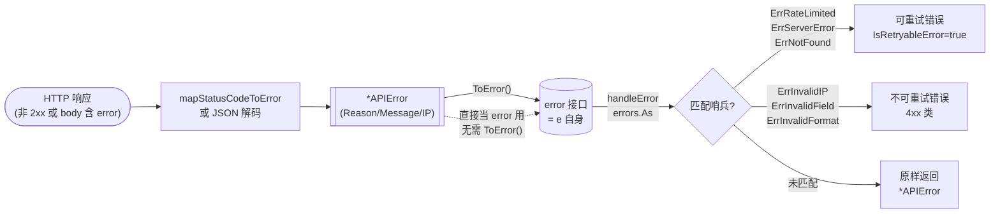

# 🔁 `APIError.ToError`

> 属于 [`APIError`](./apierror-error) 方法 · 把 `*APIError` 当作普通 `error` 返回

::: tip 🎨 一图抵千言
`*APIError` 的产生与转换路径：HTTP 响应被解析成 `*APIError`，通过 `ToError()` 适配为 `error`，再由 `handleError` 解包成哨兵错误。


:::

## 📐 定义

```go
// 保留原有方法但修改实现
func (e *APIError) ToError() error
```

## 📖 说明

✨ `ToError` 是 `*APIError` 上的一个**兼容性转换方法**。

它直接返回 `e` 自身（`*APIError` 已经通过 `Error() string` 实现了 `error` 接口），因此调用它等价于把 `*APIError` 适配成 `error` 类型。

💡 由于 `*APIError` 本身就满足 `error` 接口，在现代代码中你通常**不需要**显式调用这个方法——直接把 `*APIError` 当 `error` 用即可。它的存在主要是为了：

- 🕰️ **向后兼容**：旧版 API 中 `ToError()` 会构造一个新的 `error`，调用方可能依赖该方法签名。
- 🧩 **语义清晰**：在错误处理流程里显式表达「把这个结构化错误转成 `error`」这一步。
- 🔗 **配合 `handleError`**：`Client.handleError` 内部使用 `errors.As` 解包 `*APIError`，而 `ToError()` 提供了一个显式的入口。

> ⚠️ 注意：`ToError()` 返回的 `error` **就是 `e` 本身**，不是副本，也不会包装任何上下文。后续对 `e` 字段的修改会影响该 `error` 的 `Error()` 输出。

## 🧑‍💻 用法 / 示例

```go
package main

import (
	"errors"
	"fmt"

	"github.com/cyberspacesec/ipapi.co-skills/pkg/ipapi"
)

func main() {
	// 模拟一个来自 ipapi.co 的结构化错误
	apiErr := &ipapi.APIError{
		HasError: true,
		Reason:   "Invalid IP Address",
		Message:  "invalid query",
		IP:       "999.999.999.999",
	}

	// 1) 显式调用 ToError() 拿到 error
	var err error = apiErr.ToError()
	fmt.Println(err) // ipapi error: invalid query (reason: Invalid IP Address)

	// 2) 用 errors.As 检查并取回 *APIError
	var target *ipapi.APIError
	if errors.As(err, &target) {
		fmt.Printf("reason=%s ip=%s reserved=%v\n",
			target.Reason, target.IP, target.Reserved)
	}

	// 3) 实际场景：从 Client 拿到 error 后解包
	client := ipapi.NewClient()
	_, err = client.Lookup("not-an-ip")
	if err != nil {
		var ae *ipapi.APIError
		if errors.As(err, &ae) {
			fmt.Println("结构化错误：", ae.Reason, ae.Message)
		} else {
			fmt.Println("其他错误：", err)
		}
	}
}
```

💡 小贴士：在现代 Go（1.13+）错误处理范式下，`ToError()` 不是必须的——直接 `var err error = apiErr` 即可。它更像是一段「历史接口」的保留入口。

::: warning ⚠️ 内部方法，请勿直接调用
`mapStatusCodeToError(code)` 与 `handleError(err)` 是 `Client` 的**未导出内部方法**（小写命名），仅用于实现原理说明，无法在你的代码中调用。你只能在公开方法（如 [`GetIPInfo`](../../api/get-ip-info)）返回的 `error` 上，用 `errors.As` / `errors.Is` 进行解包与判别。若需自定义错误处理，请通过 [`WithErrorHandler`](../../api/with-error-handler) 选项注入钩子，而非依赖内部方法。
:::

::: details 🐛 调试技巧：用 errors.As 还原结构化错误
当返回的 `error` 语义模糊时，用 `errors.As` 把它还原回 `*APIError`，可以拿到服务端返回的 `Reason`、`Message`、`IP`、`Reserved` 等原始字段，便于定位问题：

```go
client := ipapi.NewClient()
_, err := client.GetIPInfo(ctx, "999.999.999.999", "json")
if err != nil {
    var ae *ipapi.APIError
    if errors.As(err, &ae) {
        fmt.Printf("reason=%s message=%s ip=%s reserved=%v\n",
            ae.Reason, ae.Message, ae.IP, ae.Reserved)
    }
    // 进一步判断是否可重试
    if ipapi.IsRetryableError(err) {
        // 退避后重试
    }
}
```

注意 [`ToError`](./apierror-toerror) 返回的就是 `e` 本身，不是副本，所以解包拿到的 `*APIError` 与内部用的是同一个指针——只读不写即可。
:::

## 🔗 相关

- 🧱 [`APIError`](../../api/models) — `APIError` 结构体定义与字段说明
- 🚨 [`ErrRateLimited`](../../api/errors) / [`ErrInvalidIP`](../../api/errors) — 哨兵错误与 [`IsRetryableError`](../../api/is-retryable)
- 🤝 [`Client`](../../api/client) — `Client` 与错误处理钩子 `errorHandler`
- 🛠️ [`GetIPInfo`](../../api/get-ip-info) / [`Lookup`](../../api/methods) — 方法如何返回错误
- ⚙️ [`WithErrorHandler`](../../api/with-error-handler) — 配置客户端行为（含自定义错误处理）

## 🚀 下一步

- 📖 阅读 [`*APIError` 与 `handleError`](../../api/errors)，了解 `*APIError` 如何被 [`handleError`](./handle-error) 解包成哨兵错误。
- 🔍 在 [方法总览](../../api/methods) 中查看各方法返回 `error` 的具体语义。
- 🧪 试着用 `errors.Is(err, ipapi.ErrRateLimited)` 判断是否为限流错误，并配合 [`IsRetryableError`](../../api/is-retryable) 实现重试。
