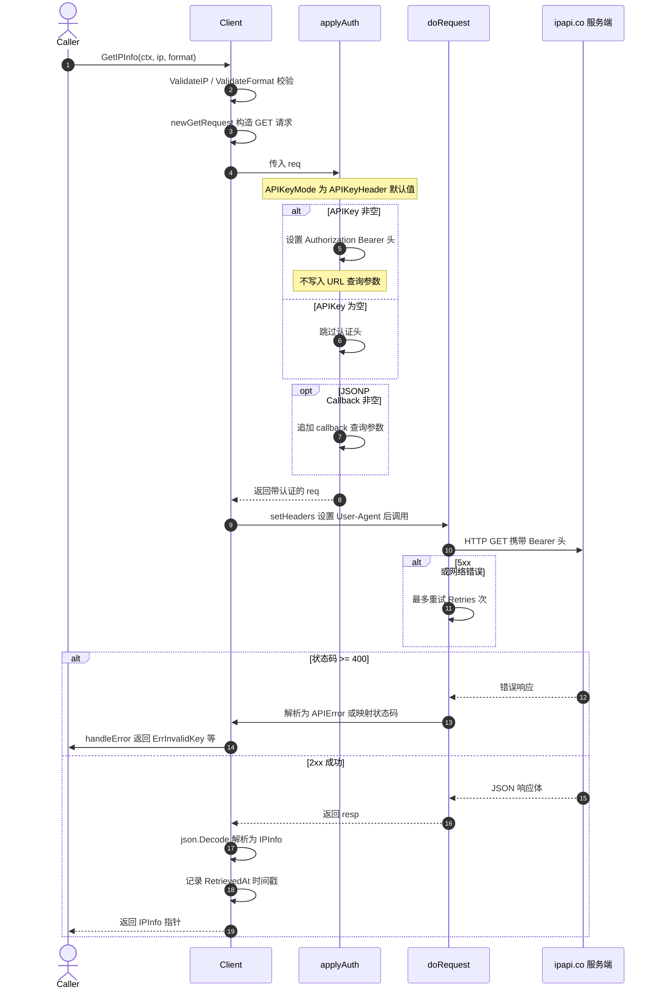

# 🔑 `APIKeyHeader` — Bearer 头认证模式

> 🛡️ 认证模式常量 · `APIKeyMode` 枚举的默认值（`0`），表示将 API Key 以 `Authorization: Bearer <key>` 请求头的形式发送给 ipapi.co 服务端。它是 SDK 的默认认证方式，无需任何额外配置即可生效。

---

## 📐 定义

```go
// pkg/ipapi/client.go

// APIKeyMode controls how the API key is sent to the server.
type APIKeyMode int

const (
	// APIKeyHeader sends the API key as a Bearer Authorization header (default).
	APIKeyHeader APIKeyMode = iota // 0
	// APIKeyQuery sends the API key as a ?key= query parameter.
	APIKeyQuery
)
```

| 属性 | 值 |
| --- | --- |
| 🔤 名称 | `APIKeyHeader` |
| 🏷️ 类别 | 认证模式常量（枚举值） |
| 🔢 值 | `0`（`iota` 首项） |
| 📐 类型 | `APIKeyMode`（`int` 别名） |
| 📁 定义位置 | `pkg/ipapi/client.go` |
| 🧩 所属枚举 | `APIKeyMode` |
| ⚙️ 默认性 | ✅ `Client.APIKeyMode` 的零值即此模式 |

> 💡 由于 `APIKeyHeader` 是 `iota` 的首项且值为 `0`，它恰好等于 `APIKeyMode` 的零值。因此 `NewClient` 构造出的 `Client` 即使不调用任何认证选项，其 `APIKeyMode` 字段也默认为 `APIKeyHeader` —— 这正是"默认认证模式"的由来。

---

## 📖 说明

### 🎯 作用

`APIKeyHeader` 决定了 SDK 在每次请求中 **如何携带 API Key**。当 `Client.APIKeyMode` 为此值时，`applyAuth` 方法会把 Key 写入 HTTP 请求头：

```go
// pkg/ipapi/api.go

// applyAuth applies the API key authentication and JSONP callback to the request.
// If APIKeyMode is APIKeyQuery, the key is added as a ?key= query parameter.
// Otherwise, the key is set as a Bearer Authorization header.
// If a JSONP callback is set, it is added as a ?callback= query parameter.
func (c *Client) applyAuth(req *http.Request) {
	if c.APIKey != "" {
		switch c.APIKeyMode {
		case APIKeyQuery:
			q := req.URL.Query()
			q.Set("key", c.APIKey)
			req.URL.RawQuery = q.Encode()
		default:
			req.Header.Set("Authorization", "Bearer "+c.APIKey)
		}
	}

	// Apply JSONP callback if specified
	if c.Callback != "" {
		q := req.URL.Query()
		q.Set("callback", c.Callback)
		req.URL.RawQuery = q.Encode()
	}
}
```

也就是说，在 `APIKeyHeader` 模式下，每个带 Key 的请求都会附带如下头：

```
Authorization: Bearer <你的 API Key>
```

::: tip 🎨 一图抵千言
下图展示了 `APIKeyHeader` 模式下，一次 `GetIPInfo` 调用从构造请求到 Bearer 头送达服务端、再到响应解码的完整时序，可对照上方 `applyAuth` 源码阅读。
:::



### 🧭 触发条件

`applyAuth` 在所有发起 HTTP 请求的查询方法（`GetIPInfo`、`GetField`、`GetClientIPInfo`、`GetClientField`、`GetIPInfoRaw`、`GetClientIPInfoRaw` 等）内部被调用。只要 `Client.APIKey` 非空且 `APIKeyMode` 为 `APIKeyHeader`（默认），Key 就会以 Bearer 头送出。

### 🛡️ 为何默认用请求头

1. **🔒 不外泄于 URL**：Key 留在请求头中，不会出现在 URL 查询串里，因此不易被访问日志、浏览器历史、代理缓存或 Referer 头泄露。
2. **🌐 符合通行约定**：`Authorization: Bearer ...` 是 OAuth 2.0 / JWT 生态广泛使用的标准头格式，便于接入网关、API 代理与统一鉴权层。
3. **🧱 与查询参数解耦**：URL 仅承载 IP、`format`、`callback` 等业务参数，认证信息独立于业务参数空间，避免字段冲突。

### 🆚 与 `APIKeyQuery` 的对比

| 维度 | `APIKeyHeader`（默认） | `APIKeyQuery` |
| --- | --- | --- |
| 📤 传输位置 | `Authorization` 请求头 | URL `?key=` 查询参数 |
| 🔢 枚举值 | `0` | `1` |
| 🛡️ 日志暴露风险 | 低（头通常不被记入访问日志） | 较高（Key 会进入 URL） |
| 🔄 切换方式 | 默认即为该模式，无需选项 | 调用 `WithAPIKeyQuery()` |
| 📦 典型场景 | 生产环境、服务端调用 | 受限环境（如某些代理剥离头时）的兜底 |

> ⚠️ 若运行环境中的反向代理 / 网关会 **剥离 `Authorization` 头**，则需改用 `APIKeyQuery` 模式（见 [`WithAPIKeyQuery`#-相关)），否则 ipapi.co 将收不到 Key 并按匿名请求计费/限流。

---

## 💻 用法 / 示例

### 🧪 场景一：默认 Bearer 头（最常见）

只需通过 `WithAPIKey` 设置 Key，无需任何额外选项 —— `APIKeyMode` 字段保持零值 `APIKeyHeader`，SDK 自动以 Bearer 头发送。

```go
package main

import (
	"fmt"
	"log"

	"github.com/cyberspacesec/ipapi"
)

func main() {
	// ✅ 默认即 APIKeyHeader 模式：Key 走 Authorization: Bearer 头
	client := ipapi.NewClient(
		ipapi.WithAPIKey("YOUR_API_KEY"),
	)

	info, err := client.GetIPInfo("8.8.8.8")
	if err != nil {
		log.Fatalf("查询失败: %v", err)
	}
	fmt.Printf("APIKeyMode = %d (APIKeyHeader)\n", client.APIKeyMode) // 0
	fmt.Printf("%s -> %s, %s\n", info.IP, info.City, info.CountryName)
}
```

### 🧪 场景二：显式断言默认模式

SDK 在 `pkg/ipapi/api_test.go` 中对枚举值做了断言，确保 `APIKeyHeader` 恒为 `0`、`APIKeyQuery` 恒为 `1`，可据此验证默认行为：

```go
// pkg/ipapi/api_test.go
func TestAPIKeyModeConstants(t *testing.T) {
	if APIKeyHeader != 0 {
		t.Errorf("APIKeyHeader should be 0, got %d", APIKeyHeader)
	}
	if APIKeyQuery != 1 {
		t.Errorf("APIKeyQuery should be 1, got %d", APIKeyQuery)
	}
}
```

### 🧪 场景三：服务端校验 Bearer 头

下列测试用例使用 `httptest` 模拟服务端，验证 Key 确实以 `Authorization: Bearer ...` 头送达、且 URL 中 **不含** `?key=`：

```go
// pkg/ipapi/api_test.go
func TestClient_APIKeyBearerHeader(t *testing.T) {
	mux := http.NewServeMux()
	mux.HandleFunc("/", func(w http.ResponseWriter, r *http.Request) {
		// ✅ 验证 Key 在 Authorization 头里
		if r.Header.Get("Authorization") != "Bearer my-api-key" {
			t.Errorf("expected Bearer authorization, got %q", r.Header.Get("Authorization"))
		}
		// ✅ 验证 URL 里没有 key 参数
		if r.URL.Query().Get("key") != "" {
			t.Errorf("expected no key query param, got %q", r.URL.Query().Get("key"))
		}
		w.Write([]byte(`{"ip":"8.8.8.8","city":"Mountain View"}`))
	})

	server := httptest.NewServer(mux)
	defer server.Close()

	client := ipapi.NewClient(
		ipapi.WithAPIKey("my-api-key"), // 默认 APIKeyHeader 模式
	)
	// 将 BaseURL 指向测试服务端以观察请求头
	client.BaseURL = server.URL + "/"

	_, err := client.GetIPInfo("8.8.8.8")
	if err != nil {
		t.Fatalf("unexpected error: %v", err)
	}
}
```

### 🔄 场景四：从默认头切回查询参数模式

若需临时切换为 `?key=` 查询参数模式，调用 `WithAPIKeyQuery()`；不调用则始终是 `APIKeyHeader`：

```go
// 默认 APIKeyHeader（Bearer 头）
headerClient := ipapi.NewClient(ipapi.WithAPIKey("YOUR_API_KEY"))
fmt.Println(headerClient.APIKeyMode == ipapi.APIKeyHeader) // true

// 切换为 APIKeyQuery（?key= 参数）
queryClient := ipapi.NewClient(
	ipapi.WithAPIKey("YOUR_API_KEY"),
	ipapi.WithAPIKeyQuery(),
)
fmt.Println(queryClient.APIKeyMode == ipapi.APIKeyQuery) // true
```

> 📌 上述逻辑与 SDK 自身的测试 `TestAPIKeyModeConstants`、`TestWithAPIKeyQuery`、`TestClient_APIKeyBearerHeader`（位于 `pkg/ipapi/api_test.go`）保持一致，可对照源码阅读。

---

## 🔗 相关

- 🖥️ [Client 结构体](../../api/client) — `APIKeyMode` 字段的宿主，承载认证模式配置
- 🏗️ [NewClient 构造函数](../../api/methods) — 初始化 `Client`，`APIKeyMode` 默认为零值 `APIKeyHeader`
- 📦 [数据模型](../../api/models) — `Client` 与响应结构定义
- 🚨 [错误类型](../../api/errors) — Key 无效或缺失时由 `handleError` 流转出的 `ErrInvalidKey` 等
- ⚙️ [配置选项](../../api/options) — `WithAPIKey` 设值、`WithAPIKeyQuery` 切换为另一模式

---

## 👉 下一步

- 🔄 阅读 [`APIKeyQuery`](./apikey-query) 了解另一种将 Key 放入 `?key=` 查询参数的认证模式
- 🧰 学习 [配置选项](../../api/options) 中的 `WithAPIKey` / `WithAPIKeyQuery`，掌握认证模式的切换方法
- 🧪 运行 `go test ./pkg/ipapi/ -run APIKey` 亲自验证 Bearer 头与查询参数两种模式的请求形态
- 🚨 结合 [错误处理概念](../../guide/error-concept) 理解 Key 缺失、无效或被代理剥离时的错误流转与恢复策略
