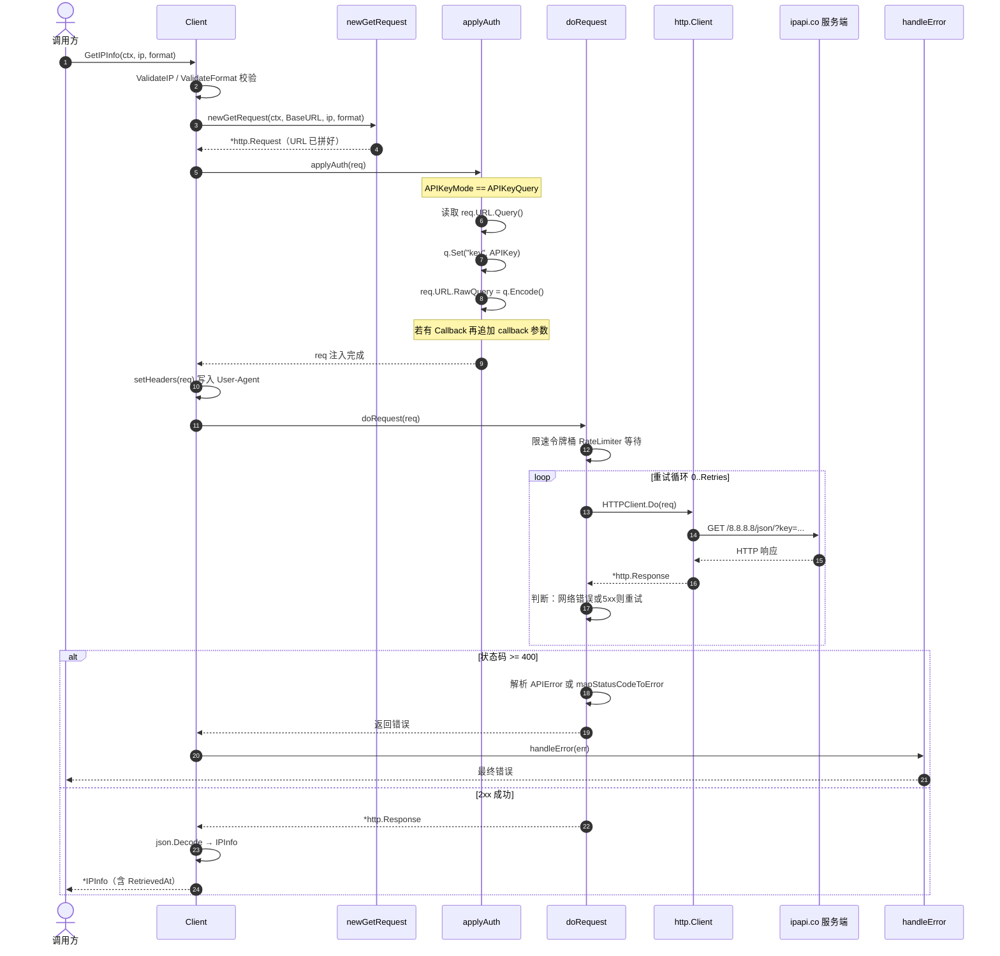

# 🔑 `APIKeyQuery` — 查询参数认证模式

> 📦 `APIKeyQuery` 是 `ipapi` SDK 的认证模式常量之一，对应把 API Key 以 `?key=` 查询参数的形式附加到请求 URL 上发送给 ipapi.co 服务端。其底层值为 `1`（`APIKeyHeader` 为默认的 `0`）。

---

## 📐 定义

```go
// pkg/ipapi/client.go

// APIKeyMode controls how the API key is sent to the server.
type APIKeyMode int

const (
	// APIKeyHeader sends the API key as a Bearer Authorization header (default).
	APIKeyHeader APIKeyMode = iota // 0
	// APIKeyQuery sends the API key as a ?key= query parameter.
	APIKeyQuery // 1
)
```

| 属性 | 值 |
| --- | --- |
| 🏷️ 符号 | `ipapi.APIKeyQuery` |
| 🔢 底层值 | `1` |
| 📂 类别 | 认证模式（`APIKeyMode`） |
| 🧩 底层类型 | `APIKeyMode`（`int` 别名） |
| 📁 定义位置 | `pkg/ipapi/client.go` |
| 🛡️ 作用对象 | `Client.APIKeyMode`，由 `Client.applyAuth` 消费 |

> 💡 `APIKeyHeader` 是 `iota` 的第 `0` 项，亦即 `NewClient` 构造出的客户端的默认值——不显式设置时，API Key 走 `Authorization: Bearer <key>` 头部。`APIKeyQuery` 是 `iota` 的第 `1` 项，需通过 [`WithAPIKeyQuery()`](../../api/with-api-key-query) 选项显式开启。

---

## 📖 说明

### 🎯 作用

`APIKeyQuery` 决定了 API Key 的传输通道。当 `Client.APIKeyMode` 被设为该值时，`applyAuth` 不再把 Key 写入请求头，而是把它拼进请求 URL 的查询串：

```go
// pkg/ipapi/api.go
func (c *Client) applyAuth(req *http.Request) {
	if c.APIKey != "" {
		switch c.APIKeyMode {
		case APIKeyQuery:
			q := req.URL.Query()
			q.Set("key", c.APIKey)
			req.URL.RawQuery = q.Encode()
		default:
			req.Header.Set("Authorization", "Bearer "+c.APIKey)
		}
	}

	// Apply JSONP callback if specified
	if c.Callback != "" {
		q := req.URL.Query()
		q.Set("callback", c.Callback)
		req.URL.RawQuery = q.Encode()
	}
}
```

启用后，发往 ipapi.co 的请求形如：

```
https://ipapi.co/8.8.8.8/json/?key=<your_api_key>
```

::: tip 🎨 一图抵千言
下面这张时序图展示了 `APIKeyQuery` 模式下一次请求从调用入口到返回结果的完整认证与处理链路，涵盖 `GetIPInfo` → `newGetRequest` → `applyAuth`（把 `key` 拼进查询串）→ `doRequest`（重试 + 状态码映射）→ `handleError` 的真实代码路径。
:::



### 🆚 与默认 Header 模式对比

| 维度 | `APIKeyHeader`（默认） | `APIKeyQuery` |
| --- | --- | --- |
| 📍 位置 | `Authorization` 请求头 | `?key=` URL 查询参数 |
| 🔐 日志暴露 | 不易出现在访问日志 | 易出现在反向代理 / CDN / 服务端访问日志 |
| 👀 前端可见 | 否（头不可见） | 是（URL 可见、可被 `Referer` 带走） |
| 📞 JSONP 可用 | ❌（`<script>` 无法设头） | ✅（URL 鉴权是 JSONP 唯一可行方式） |
| 🧰 调试便利 | 需抓包看头 | 直接看 URL 即可 |

### 🧭 何时选用 `APIKeyQuery`

1. **📞 JSONP 场景**：浏览器 `<script>` 标签无法设置自定义请求头，URL 查询参数是 JSONP 携带凭证的唯一通道。SDK 在 `applyAuth` 中将 `key` 与 `callback` 一并写入查询串，二者协同。
2. **🚪 受限代理 / CDN**：某些企业出口代理或 CDN 仅透传 URL 参数做鉴权，会剥离额外请求头，此时 Query 方式更可靠。
3. **🔧 本地调试**：希望直接从 URL 肉眼确认 Key 是否生效时，临时切到 Query 模式更直观。

::: warning ⚠️ 安全权衡
Query 方式下，API Key 会出现在 URL 中，进而可能落入：服务端访问日志、反向代理日志、浏览器历史、`Referer` 头、APM / 链路追踪快照。**仅在必要时使用**（如 JSONP），并优先采用受限权限或临时 Key；生产环境默认应使用 `APIKeyHeader`。
:::

### 🧪 常量值断言

SDK 在 `pkg/ipapi/api_test.go` 中对两个认证模式的底层值做了断言，确保 `iota` 顺序不被意外改动：

```go
// pkg/ipapi/api_test.go
if APIKeyHeader != 0 {
	t.Errorf("APIKeyHeader should be 0, got %d", APIKeyHeader)
}
if APIKeyQuery != 1 {
	t.Errorf("APIKeyQuery should be 1, got %d", APIKeyQuery)
}
```

---

## 💻 用法 / 示例

### 1️⃣ 开启 Query 认证模式

通过 [`WithAPIKey`](../../api/with-api-key) 注入 Key，再用 [`WithAPIKeyQuery()`](../../api/with-api-key-query) 切换传输方式：

```go
package main

import (
	"context"
	"fmt"
	"log"

	"github.com/cyberspacesec/ipapi.co-skills/pkg/ipapi"
)

func main() {
	ctx := context.Background()

	// 同时注入 Key 与切换为 Query 模式
	client := ipapi.NewClient(
		ipapi.WithAPIKey("your_api_key"),
		ipapi.WithAPIKeyQuery(), // 设 Client.APIKeyMode = APIKeyQuery
	)

	info, err := client.GetIPInfo(ctx, "8.8.8.8", string(ipapi.FormatJSON))
	if err != nil {
		log.Fatal(err)
	}

	fmt.Printf("IP: %s, 城市: %s, 国家: %s\n",
		info.IP, info.City, info.CountryName)
	// 实际请求 URL: https://ipapi.co/8.8.8.8/json/?key=your_api_key
}
```

### 2️⃣ 配合 JSONP 使用

JSONP 必须走 URL 鉴权，`APIKeyQuery` 是其唯一可行的认证通道。`callback` 与 `key` 会被 `applyAuth` 一并写入查询串：

```go
client := ipapi.NewClient(
	ipapi.WithAPIKey("your_api_key"),
	ipapi.WithAPIKeyQuery(), // JSONP 必需
	ipapi.WithCallback("handleResp"),
)

// 请求 URL 形如：
// https://ipapi.co/8.8.8.8/jsonp/?key=your_api_key&callback=handleResp
raw, err := client.GetIPInfoRaw(ctx, "8.8.8.8", string(ipapi.FormatJSONP))
if err != nil {
	log.Fatal(err)
}
fmt.Printf("JSONP 响应: %s\n", string(raw))
```

### 3️⃣ 单字段查询同样生效

`APIKeyQuery` 对所有走 `applyAuth` 的方法一视同仁，包括单字段查询 `GetField` / `GetClientField`：

```go
client := ipapi.NewClient(
	ipapi.WithAPIKey("your_api_key"),
	ipapi.WithAPIKeyQuery(),
)

city, err := client.GetField(ctx, "8.8.8.8", string(ipapi.FieldCity))
if err != nil {
	log.Fatal(err)
}
fmt.Println("城市:", city)
// 请求 URL: https://ipapi.co/8.8.8.8/city/?key=your_api_key
```

### 4️⃣ 默认模式对照

不调用 `WithAPIKeyQuery()` 时，`APIKeyMode` 保持零值 `APIKeyHeader`，Key 走头部：

```go
client := ipapi.NewClient(
	ipapi.WithAPIKey("your_api_key"),
	// 未调用 WithAPIKeyQuery()，默认 APIKeyHeader (0)
	// 请求头: Authorization: Bearer your_api_key
)
```

---

## 🔗 相关

- 🖥️ [.](./../api/client](../../api/client) — `Client` 结构体与 `APIKeyMode` 字段定义
- 🧰 [.](./../api/methods](../../api/methods) — `GetIPInfo` / `GetIPInfoRaw` / `GetField` 等调用 `applyAuth` 的方法
- 🗂️ [.](./../api/models](../../api/models) — `APIKeyMode` 类型与 `Client` 各字段说明
- ⚠️ [.](./../api/errors](../../api/errors) — `ErrInvalidKey` 等认证相关错误
- 🎛️ [.](./../api/options](../../api/options) — `WithAPIKey`、`WithAPIKeyQuery`、`WithCallback` 等配置项

---

## ➡️ 下一步

- 🔒 阅读 [.](./../guide/auth-concept](../../guide/auth-concept) 系统了解 Header 与 Query 两种认证模式的选型权衡
- 📖 查阅 [`WithAPIKeyQuery`](../../api/with-api-key-query) 看开启该模式的选项函数签名与内部实现
- 📞 学习 [.](./../guide/jsonp](../../guide/jsonp) 理解为何 JSONP 必须搭配 `APIKeyQuery`
