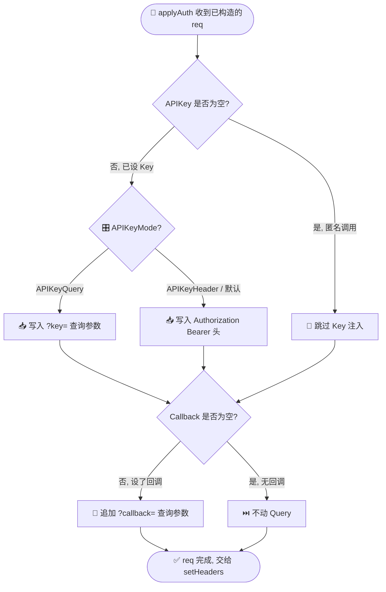

# 🔐 内部方法详解：applyAuth

> 🏷️ 类别：**内部方法** · 📍 定义于 `pkg/ipapi/api.go` · 🔁 在所有公开查询方法中被调用

---

## 📐 定义

`applyAuth` 定义在 `pkg/ipapi/api.go` 中，签名为：

```go
// applyAuth applies the API key authentication and JSONP callback to the request.
// If APIKeyMode is APIKeyQuery, the key is added as a ?key= query parameter.
// Otherwise, the key is set as a Bearer Authorization header.
// If a JSONP callback is set, it is added as a ?callback= query parameter.
func (c *Client) applyAuth(req *http.Request)
```

它接收一个已构造好的 `*http.Request`（由 [`newGetRequest`](./new-get-request) 创建），就地修改其 Header 与 URL Query，无返回值。

---

## 📖 说明

`applyAuth` 是 SDK 内部的**认证注入器**：在请求真正发送给 ipapi.co 之前，把 `Client` 上配置好的 API Key 与 JSONP 回调函数名"贴"到请求里。它对调用方完全透明，由每一个公开查询方法（`GetIPInfo`、`GetIPInfoRaw`、`GetField`、`GetClientIPInfo`、`GetClientIPInfoRaw`、`GetClientField`）在 `setHeaders` 之前统一调用。

它的工作分两段，且彼此独立：

::: tip 🎨 一图抵千言
下图展示了 `applyAuth` 内部的分支决策：先按 `APIKeyMode` 决定 Key 走 Header 还是 Query，再独立判断是否注入 `callback`。两段互不影响。
:::



### 1️⃣ API Key 注入

根据 `Client.APIKeyMode` 的取值，决定 Key 的传输方式：

| 🎛️ `APIKeyMode` | 📤 传输方式 | 🔍 示例 |
|------------------|------------|---------|
| `APIKeyHeader`（默认） | `Authorization: Bearer <key>` 请求头 | `Authorization: Bearer abc123` |
| `APIKeyQuery` | `?key=<key>` 查询参数 | `https://ipapi.co/8.8.8.8/json/?key=abc123` |

当 `c.APIKey == ""` 时（即未设置 Key 的免费/匿名调用场景），整段被跳过——既不写 Header 也不写 Query，请求以匿名身份发出，从而匹配 ipapi.co 的免费额度。

> 💡 **设计意图**：默认走 `Authorization` 头，把 Key 藏在 Header 里，避免它出现在访问日志、浏览器历史或 CDN 缓存键中；只有当目标环境（如某些代理或前端直连）拿不到自定义 Header 时，才用 [`WithAPIKeyQuery`](../../api/with-api-key-query) 切到查询参数模式。

### 2️⃣ JSONP 回调注入

只要 `c.Callback != ""`，就在 URL Query 上追加 `callback=<name>`。这一步与 Key 注入**解耦**：

- 即使没设 API Key，也可以单独设回调（匿名 + JSONP）；
- 即使设了 Header 模式的 Key，回调仍走 Query（ipapi.co 的 JSONP 约定就是 `?callback=`）；
- 两次 Query 写入都通过 `q := req.URL.Query()` → `q.Set(...)` → `req.URL.RawQuery = q.Encode()` 完成，会正确对值做 URL 编码。

> ⚠️ **注意**：`callback` 查询参数只有在使用 `FormatJSONP` 格式请求时才真正生效。即便你在 JSON 请求里带上它，ipapi.co 也不会把响应包成 `name({...})` 形式——它会安静地忽略。详见 [`WithCallback`](../../api/options) 与 [JSONP 指南](../../guide/jsonp)。

### 🔁 调用链位置

每个公开方法内部固定按以下顺序调用：

```text
newGetRequest(ctx, baseURL, segments...)
   ↓
c.applyAuth(req)   ← 本方法：注入 Key + callback
   ↓
c.setHeaders(req)  ← 注入 User-Agent
   ↓
c.doRequest(req)   ← 限流、重试、发请求、错误映射
```

`applyAuth` 只管"身份凭证"，`setHeaders` 只管"我是谁（UA）"，`doRequest` 只管"怎么发、发失败怎么办"。三者职责分离，便于单独测试与替换。

---

## 🛠️ 用法 / 示例

`applyAuth` 是**非导出方法**（首字母小写），包外无法直接调用。下面的示例展示它在不同 `Client` 配置下，对同一个请求产生的实际效果——这也是理解它的最佳方式。

### 示例 1：默认 Header 模式（最常见）

```go
package main

import (
	"context"
	"fmt"
	"net/http"
	"net/http/httptest"
)

import "github.com/cyberspacesec/ipapi.co-skills/pkg/ipapi"

func main() {
	// 用 httptest 捕获真实发出去的请求，看 applyAuth 到底写了什么
	var captured *http.Request
	srv := httptest.NewServer(http.HandlerFunc(func(w http.ResponseWriter, r *http.Request) {
		captured = r.Clone(context.Background())
		_, _ = w.Write([]byte(`{"ip":"8.8.8.8","city":"Mountain View"}`))
	}))
	defer srv.Close()

	client := ipapi.NewClient(
		ipapi.WithAPIKey("my-secret-key"),
	)
	client.BaseURL = srv.URL // 指向测试服务器

	// 任意一个公开方法都会内部调用 applyAuth
	_, _ = client.GetIPInfo(context.Background(), "8.8.8.8", "json")

	// applyAuth 写入的 Authorization 头：
	fmt.Println(captured.Header.Get("Authorization"))
	// 输出: Bearer my-secret-key

	// Query 里既没有 key 也没有 callback
	fmt.Println(captured.URL.RawQuery)
	// 输出: (空)
}
```

### 示例 2：Query 模式（Key 走 ?key=）

```go
client := ipapi.NewClient(
	ipapi.WithAPIKey("my-secret-key"),
	ipapi.WithAPIKeyQuery(), // 切到查询参数模式
)
client.BaseURL = srv.URL

_, _ = client.GetIPInfo(context.Background(), "8.8.8.8", "json")

// Header 里不再有 Authorization
fmt.Println(captured.Header.Get("Authorization")) // 输出: (空)

// Key 进了 Query
fmt.Println(captured.URL.Query().Get("key")) // 输出: my-secret-key
```

### 示例 3：JSONP 回调（与 Key 解耦）

```go
client := ipapi.NewClient(
	ipapi.WithAPIKey("my-secret-key"),
	ipapi.WithCallback("handleResponse"), // JSONP 回调名
)
client.BaseURL = srv.URL

// 用 Raw 方法取 JSONP 格式的原始响应
_, _ = client.GetIPInfoRaw(context.Background(), "8.8.8.8", "jsonp")

// Key 走 Header（默认），callback 走 Query
fmt.Println(captured.Header.Get("Authorization"))         // Bearer my-secret-key
fmt.Println(captured.URL.Query().Get("callback"))         // handleResponse
```

### 示例 4：匿名调用（不设 Key）

```go
client := ipapi.NewClient() // 没有任何选项 → APIKey == ""
client.BaseURL = srv.URL

_, _ = client.GetIPInfo(context.Background(), "8.8.8.8", "json")

// applyAuth 整段跳过：既无 Authorization 头，也无 key/callback 查询参数
fmt.Println(captured.Header.Get("Authorization")) // (空)
fmt.Println(captured.URL.RawQuery)                 // (空)
```

### 示例 5：模拟内部调用（仅测试用）

如果你在写这个包的单元测试，需要直接验证 `applyAuth` 的行为，可以手动构造 `*Client` 和 `*http.Request`：

```go
// 注意：applyAuth 是非导出方法，此代码必须在 pkg/ipapi 包内（_test.go）运行
func TestApplyAuth_HeaderMode(t *testing.T) {
	c := &Client{
		APIKey:     "k-123",
		APIKeyMode: APIKeyHeader,
	}
	req := httptest.NewRequest("GET", "https://ipapi.co/8.8.8.8/json/", nil)

	c.applyAuth(req)

	if got := req.Header.Get("Authorization"); got != "Bearer k-123" {
		t.Fatalf("Authorization = %q, want %q", got, "Bearer k-123")
	}
	if got := req.URL.Query().Get("key"); got != "" {
		t.Fatalf("unexpected key query: %q", got)
	}
}
```

---

## 🔗 相关

- [🏠 Client 客户端](../../api/client) — `Client` 结构体定义，`APIKey` / `APIKeyMode` / `Callback` 字段都在这里
- [🔧 API 方法](../../api/methods) — 6 个公开查询方法，每个都内部调用 `applyAuth`
- [🧩 选项函数 Options](../../api/options) — [`WithAPIKey`](../../api/with-api-key)、[`WithAPIKeyQuery`](../../api/with-api-key-query)、`WithCallback` 的统一入口
- [🗝️ WithAPIKey](../../api/with-api-key) — 设置 API Key（决定 Header 模式是否启用）
- [🔀 WithAPIKeyQuery](../../api/with-api-key-query) — 把 Key 切到 `?key=` 查询参数模式
- [🧩 数据模型](../../api/models) — `APIError` 等结构体，与 `applyAuth` 注入的凭证共同决定请求成败
- [🛡 错误类型](../../api/errors) — 当 Key 无效时，`doRequest` 会映射出 `ErrInvalidKey`
- [📖 认证机制指南](../../guide/auth-concept) — 从概念层面理解"为什么有 Header / Query 两种模式"
- [📦 JSONP 指南](../../guide/jsonp) — `callback` 查询参数的完整用法与适用场景

---

## 🚀 下一步

- 🔎 想看 `applyAuth` 注入的凭证最终如何被发送与重试？阅读 [API 方法](../../api/methods) 中的 `doRequest` 与 `setHeaders` 说明。
- 🧪 想亲手验证 Header / Query 两种模式？照着本页 [示例 1#_1-headertextbox-mo-shi-zui-chang-jian) 与 [示例 2#_2-query-mo-shi-key-zou-key) 跑一遍 `httptest`。
- ⚙️ 想自定义请求头（例如额外的代理认证）？了解 [`WithCustomHTTPClient`](../../api/options) 如何注入你自己的 `*http.Client` 与 `Transport`。
- 📐 想给这个包写更多内部测试？参考 `pkg/ipapi/client_test.go` 与 `api_test.go` 中现有的 `applyAuth` 相关用例。
