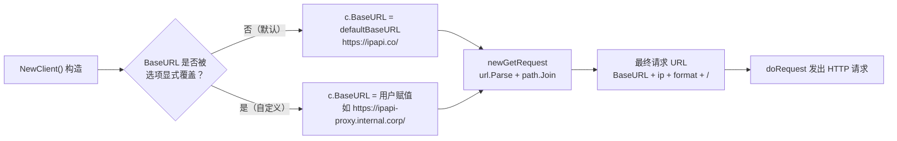

# 🌐 `defaultBaseURL` — API 默认基地址

> 包级别常量，定义了 `Client` 在未显式配置 `BaseURL` 时所指向的 ipapi.co API 服务端点。所有查询请求的 URL 都由它拼接而成，是 SDK 网络层的"地理原点"。

::: tip 🎨 一图抵千言
`defaultBaseURL` 的回退决策路径——当配置未显式设置时，请求如何落到默认端点并最终影响 URL 拼接：


:::

::: warning 🔒 内部方法警告
`newGetRequest`、`doRequest`、`setHeaders`、`applyAuth` 均为包内未导出方法，仅用于解释原理，**不可在用户代码中调用**。外部只能通过 [`NewClient`](../../api/new-client) 产出的 `*Client` 调用六个公开查询方法（如 [`GetIPInfo`](../../api/methods)）。若想改变请求行为，请通过 [`WithCustomHTTPClient`](../../api/with-custom-http-client) 注入自定义 `*http.Client`，或直接覆盖导出字段 `Client.BaseURL`，而非试图调用内部方法。
:::

---

## 📦 定义

```go
// pkg/ipapi/client.go
const (
	defaultBaseURL    = "https://ipapi.co/"
	defaultTimeout    = 10 * time.Second
	maxRedirects      = 3
	defaultRetryDelay = 500 * time.Millisecond
)
```

| 属性 | 值 |
| --- | --- |
| 🔣 符号 | `ipapi.defaultBaseURL`（包内非导出） |
| 📂 类别 | 常量（`const`） |
| 🎯 值 | `"https://ipapi.co/"` |
| 🧷 可见性 | 小写开头，仅包内可见，外部通过 `Client.BaseURL` 间接消费 |
| ⚙️ 默认生效位置 | [`NewClient`](../../api/new-client) 构造 `Client` 时赋给 `BaseURL` 字段 |

---

## 📖 说明

`defaultBaseURL` 是 SDK 与 ipapi.co 服务之间的"默认坐标"。它具有以下设计要点：

1. **🏠 服务端点**
   指向 ipapi.co 的公开 API 根路径 `https://ipapi.co/`。SDK 的六个查询方法（`GetIPInfo`、`GetIPInfoRaw`、`GetField`、`GetClientIPInfo`、`GetClientIPInfoRaw`、`GetClientField`）均把请求 URL 的"前缀"交给它决定。

2. **📍 赋值时机**
   在 [`NewClient`](../../api/new-client) 内部，`Client.BaseURL` 被初始化为 `defaultBaseURL`。这意味着：只要你不通过选项覆盖，**任何 `NewClient()` 产出的实例都自动指向官方端点**，无需额外配置。

3. **🧷 末尾斜杠不可省**
   值以 `/` 结尾是有意为之。内部请求构造器 `newGetRequest` 使用 `url.Parse(baseURL)` 解析后再用 `path.Join` 拼接路径段并补回 `/`。保持基地址带尾斜杠，可保证 `https://ipapi.co/` + `8.8.8.8/json/` 拼出的最终 URL 形如 `https://ipapi.co/8.8.8.8/json/`，而不会错误地丢失根路径。

4. **🔒 非导出，但可覆盖**
   常量本身小写不可导出，但 `Client.BaseURL` 字段是导出的。需要指向自建代理、企业内网镜像或本地测试服务器时，直接赋值即可覆盖默认值，**无需重新编译 SDK**。

5. **🧪 测试友好**
   在单元测试中，开发者常把 `client.BaseURL` 重写为本地 `httptest.Server` 的地址，从而在不触达真实网络的前提下验证请求构造与响应解析逻辑。

---

## 💻 用法 / 示例

### 1️⃣ 默认行为：零配置即指向官方端点

```go
package main

import (
	"context"
	"fmt"
	"log"

	"github.com/cyberspacesec/ipapi"
)

func main() {
	// NewClient 内部将 BaseURL 设为 defaultBaseURL = "https://ipapi.co/"
	client := ipapi.NewClient()

	// 此查询将发往 https://ipapi.co/8.8.8.8/json/
	info, err := client.GetIPInfo(context.Background(), "8.8.8.8", "json")
	if err != nil {
		log.Fatalf("查询失败: %v", err)
	}
	fmt.Printf("8.8.8.8 位于 %s, %s\n", info.City, info.CountryName)
}
```

### 2️⃣ 覆盖基地址：指向自建代理 / 镜像

```go
package main

import (
	"context"
	"fmt"
	"log"

	"github.com/cyberspacesec/ipapi"
)

func main() {
	client := ipapi.NewClient()
	// 覆盖默认基地址，走企业内网代理或自建镜像
	client.BaseURL = "https://ipapi-proxy.internal.corp/"

	info, err := client.GetIPInfo(context.Background(), "1.1.1.1", "json")
	if err != nil {
		log.Fatalf("查询失败: %v", err)
	}
	fmt.Printf("1.1.1.1 的国家: %s\n", info.CountryName)
}
```

### 3️⃣ 测试场景：重定向到本地 httptest.Server

```go
package ipapi_test

import (
	"context"
	"net/http"
	"net/http/httptest"
	"testing"

	"github.com/cyberspacesec/ipapi"
)

func TestGetIPInfo_HappyPath(t *testing.T) {
	// 启动本地模拟服务端
	ts := httptest.NewServer(http.HandlerFunc(func(w http.ResponseWriter, r *http.Request) {
		// 校验请求路径确实由 BaseURL 拼接而来
		if r.URL.Path != "/8.8.8.8/json/" {
			t.Fatalf("意外的请求路径: %s", r.URL.Path)
		}
		w.Header().Set("Content-Type", "application/json")
		_, _ = w.Write([]byte(`{"ip":"8.8.8.8","city":"Mountain View","country_name":"United States"}`))
	}))
	defer ts.Close()

	client := ipapi.NewClient()
	// 用本地服务地址覆盖 defaultBaseURL，测试全程不触达真实网络
	client.BaseURL = ts.URL + "/"

	info, err := client.GetIPInfo(context.Background(), "8.8.8.8", "json")
	if err != nil {
		t.Fatalf("查询失败: %v", err)
	}
	if info.City != "Mountain View" {
		t.Fatalf("城市不匹配: %s", info.City)
	}
}
```

> ⚠️ 注意：覆盖 `BaseURL` 时务必保留**末尾斜杠**，例如 `ts.URL + "/"`，否则 `path.Join` 的合并行为可能产生非预期的路径结构。

---

## 🔗 相关

- 🏠 [`Client` 客户端](../../api/client) — `BaseURL` 字段的宿主类型，含全部字段与默认值
- 🏗 [`NewClient` 构造函数](../../api/new-client) — 在此处将 `defaultBaseURL` 赋给 `Client.BaseURL`
- 📋 [API 方法详解](../../api/methods) — 六个查询方法均通过 `c.BaseURL` 拼接请求 URL
- 🧱 [数据模型](../../api/models) — 查询返回的 `IPInfo` 等结构定义
- 🛡 [错误类型](../../api/errors) — 当 `BaseURL` 非法时，`newGetRequest` 会返回 `invalid base URL` 错误
- ⚙️ [选项函数 Options](../../api/options) — `WithCustomHTTPClient` 等可配合自定义基地址使用

---

## 👉 下一步

- 📖 阅读 [`NewClient`](../../api/new-client)，理解默认值如何被装配到 `Client` 实例
- 🧭 翻阅 [API 方法详解](../../api/methods)，跟踪一次请求从 `BaseURL` 到最终 URL 的完整构造过程
- 🛠️ 结合 [`WithCustomHTTPClient`](../../api/with-custom-http-client) 自定义传输层，配合 `BaseURL` 覆盖实现代理 / 镜像 / 测试隔离
- 🧪 参考 [基础用法示例/examples/basic-usage) 跑通第一个零配置查询
