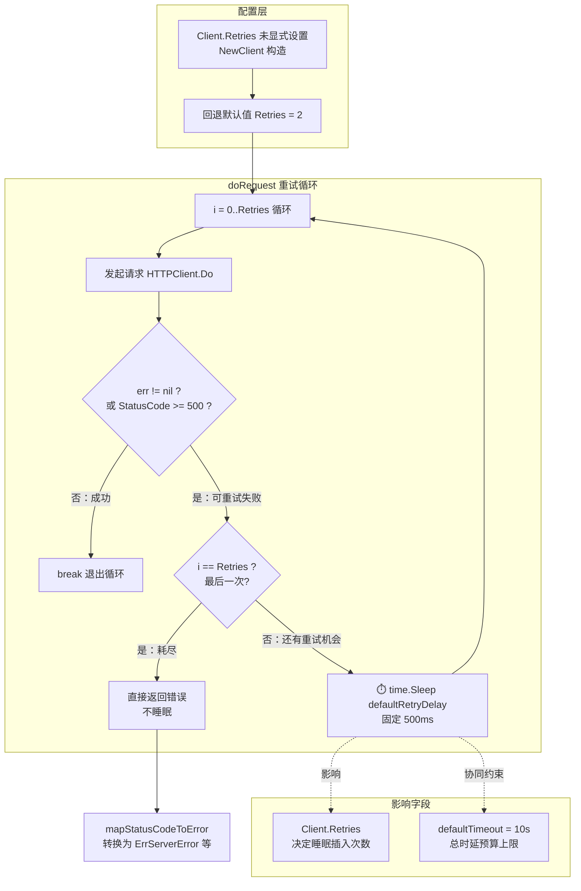

# ⏱️ `defaultRetryDelay` — 默认重试间隔

::: tip 🎨 一图抵千言
下图展示 `defaultRetryDelay` 如何在 [`Client.doRequest`](./default-retry-delay) 重试循环中作为「未显式配置时的回退默认值」被消费，以及它影响的字段与触发条件。



关键事实：`defaultRetryDelay = 500 * time.Millisecond` 是 **固定间隔**（非指数退避），仅在「还会继续重试」时插入；最后一次失败直接返回，不睡眠。4xx（含 429）不进入此循环。
:::

> `defaultRetryDelay` 是 `ipapi` SDK 内部的包级常量，用于在 `doRequest` 重试循环中，当一次请求因 **网络错误** 或 **HTTP `5xx` 服务端错误** 失败后、发起下一次重试之前插入的 **固定睡眠时长**。其值为 `500 * time.Millisecond`（500 毫秒），即在每次重试之间暂停半秒，给服务端留出恢复窗口，同时避免重试风暴对 `ipapi.co` 造成二次冲击。

---

## 📦 定义

```go
// pkg/ipapi/client.go
const (
	defaultBaseURL    = "https://ipapi.co/"
	defaultTimeout    = 10 * time.Second
	maxRedirects      = 3
	defaultRetryDelay = 500 * time.Millisecond
)
```

| 属性 | 值 |
| --- | --- |
| 🔤 名称 | `defaultRetryDelay` |
| 🏷️ 类别 | 常量（包级、未导出） |
| 🔢 值 | `500 * time.Millisecond`（500ms） |
| 📐 类型 | `time.Duration` |
| 📁 定义位置 | `pkg/ipapi/client.go` |
| 🛡️ 作用对象 | `Client.doRequest` 重试循环 |

> ⚠️ 这是一个 **未导出（小写开头）** 的常量，外部包无法直接引用。它仅在 SDK 内部生效，行为通过 `NewClient` 构造出的 `Client` 在 `doRequest` 中体现。重试次数由 [`Client.Retries`](../../api/client) 字段控制，默认为 `2`。

---

## 📖 说明

### 🎯 作用

`defaultRetryDelay` 在 `doRequest` 的重试循环中被消费。每当一次请求返回网络错误（`err != nil`）或 HTTP `5xx` 响应（`resp.StatusCode >= 500`）时，SDK 不会立刻发起下一次重试，而是先 `time.Sleep(defaultRetryDelay)` 暂停 500ms，再进入下一轮循环：

```go
// pkg/ipapi/api.go
func (c *Client) doRequest(req *http.Request) (*http.Response, error) {
	if c.RateLimiter != nil {
		<-c.RateLimiter
	}

	var resp *http.Response
	var err error

	for i := 0; i <= c.Retries; i++ {
		resp, err = c.HTTPClient.Do(req)
		if err == nil && resp.StatusCode < 500 { // 仅网络错误和5xx错误重试
			break
		}
		if err == nil { // 处理5xx错误
			resp.Body.Close()
		}

		if i == c.Retries {
			if err != nil {
				return nil, fmt.Errorf("request failed after %d retries: %w", c.Retries, err)
			}
			return nil, fmt.Errorf("server error after %d retries (status: %d)", c.Retries, resp.StatusCode)
		}

		time.Sleep(defaultRetryDelay) // ⏱️ 重试前固定等待 500ms
	}
	// ...后续状态码映射与错误处理
}
```

### 🔁 重试时序的语义

重试循环的条件为 `i <= c.Retries`，意味着总尝试次数为 `c.Retries + 1`（首次请求 + N 次重试）。`defaultRetryDelay` 仅在 **还会继续重试** 时插入——最后一次尝试失败后直接返回错误，不再睡眠：

| 轮次 `i` | 行为 | 是否睡眠 500ms |
| --- | --- | --- |
| `0`（首次请求） | 发起请求；失败且 `i < Retries` | ✅ 睡眠后进入下一轮 |
| `1`（第 1 次重试） | 发起请求；失败且 `i < Retries` | ✅ 睡眠后进入下一轮 |
| `2`（第 2 次重试，`i == Retries`） | 发起请求；无论成败均退出循环 | 🛑 不睡眠，直接返回 |

以默认 `Retries = 2` 为例：最坏情况下共发起 **3 次** 请求（1 次首发 + 2 次重试），中间插入 **2 次** 500ms 睡眠，累计额外耗时约 **1 秒**。

### 🧱 为何固定 500ms

1. **🩹 给服务端恢复窗口**：`ipapi.co` 的 5xx 抖动多由瞬时过载或依赖组件抖动引起，500ms 足以让大多数瞬时故障自愈。
2. **🚦 避免重试风暴**：若失败后立刻重试，可能在服务端尚未恢复时持续施压，放大故障；固定间隔起到天然限流作用。
3. **⚖️ 与超时协同**：[`defaultTimeout`](./default-timeout) 为 `10 * time.Second`，500ms 间隔在最坏路径下仅占超时预算的一小部分，保证总时延可控。

> 💡 注意：`defaultRetryDelay` 是 **固定间隔**，而非指数退避。SDK 内置的重试策略偏保守、偏简单；若你的业务对延迟与成功率有更高要求，建议在调用方叠加指数退避（参见下方示例）。

::: details 🐛 调试技巧：如何确认 defaultRetryDelay 真的触发了
当怀疑重试间隔未生效或重试次数异常时，可按以下步骤排查：

1. **确认 `Client.Retries` 未被覆盖为 `0`**：`Retries = 0` 会关闭重试，`defaultRetryDelay` 自然不会触发。
2. **观察累计耗时**：以默认 `Retries = 2`、持续 5xx 为例，3 次尝试 + 2 次 500ms 睡眠 ≈ 1s 额外耗时。若耗时远低于 1s 即返回，说明重试未发生（可能是 4xx/429 等不可重试错误提前退出）。
3. **注入自定义 HTTP 客户端打桩**：用 `httptest.NewServer` 构造可控的 5xx 响应，并在 `Transport` 层统计 `Do` 调用次数与时间间隔，验证是否符合 `500ms` 节奏。
4. **对照测试**：SDK 自带的 `TestClient_GetIPInfo_RetryLogic`、`TestClient_doRequest_5xx_ThenSuccess`（`pkg/ipapi/api_test.go`）已固化此行为，可直接复用其断言模式。

```go
// 通过时间差验证重试间隔
start := time.Now()
_, err := client.GetIPInfo(ctx, "8.8.8.8", "json")
elapsed := time.Since(start)
// 持续 5xx + Retries=2 → 期望 elapsed ≈ 1s（2 × 500ms 睡眠）
// 若 elapsed < 100ms → 多半是 4xx 不可重试，未进入睡眠分支
```
:::

### ⚙️ 自定义行为

由于 `defaultRetryDelay` 未导出，无法直接修改其值。若需调整重试间隔或改用指数退避，有两条路径：

1. **🔧 调整 `Client.Retries`**：通过设置 `Retries` 字段控制重试次数（设为 `0` 即关闭重试，也就不会触发任何 `defaultRetryDelay` 睡眠）。
2. **🧰 注入自定义 HTTP 客户端**：通过 [`WithCustomHTTPClient`](../../api/options) 注入自带 `Transport` 重试逻辑的 `*http.Client`，并在调用方用 `IsRetryableError` 判断后执行自定义退避策略，完全接管重试时序。

---

## 💻 用法 / 示例

以下示例展示 `defaultRetryDelay` 在真实重试场景下的行为。第一个用例构造一个 **持续返回 502** 的服务端，验证 SDK 在固定间隔后重试并最终报错；第二个用例构造 **先 502 后成功** 的链路，验证重试期间插入 500ms 间隔后请求恢复正常。

```go
package main

import (
	"context"
	"fmt"
	"net/http"
	"net/http/httptest"
	"time"

	"github.com/cyberspacesec/ipapi"
)

func main() {
	ctx := context.Background()

	// 🧪 场景一：服务端持续 5xx，SDK 按固定间隔重试后报错
	failServer := httptest.NewServer(http.HandlerFunc(func(w http.ResponseWriter, r *http.Request) {
		w.WriteHeader(http.StatusBadGateway) // 502
	}))
	defer failServer.Close()

	client := ipapi.NewClient(ipapi.WithCustomHTTPClient(failServer.Client()))
	client.BaseURL = failServer.URL + "/"
	client.Retries = 2 // 默认值；总尝试 3 次，中间睡眠 2 × 500ms

	start := time.Now()
	_, err := client.GetIPInfo(ctx, "8.8.8.8", "json")
	elapsed := time.Since(start)

	if err != nil {
		// ✅ 预期：3 次尝试均失败，累计耗时 ≈ 1s（两次 500ms 睡眠）
		fmt.Printf("重试耗尽后失败（耗时 %v）: %v\n", elapsed.Round(time.Millisecond), err)
	}

	// 🧪 场景二：首次 502、第二次成功，验证 500ms 间隔后恢复
	callCount := 0
	recoverServer := httptest.NewServer(http.HandlerFunc(func(w http.ResponseWriter, r *http.Request) {
		callCount++
		if callCount == 1 {
			w.WriteHeader(http.StatusBadGateway) // 首次 502
			return
		}
		w.Header().Set("Content-Type", "application/json")
		fmt.Fprint(w, `{"ip":"8.8.8.8","city":"Mountain View"}`)
	}))
	defer recoverServer.Close()

	client2 := ipapi.NewClient(ipapi.WithCustomHTTPClient(recoverServer.Client()))
	client2.BaseURL = recoverServer.URL + "/"
	client2.Retries = 2

	start = time.Now()
	info, err := client2.GetIPInfo(ctx, "8.8.8.8", "json")
	elapsed = time.Since(start)

	if err != nil {
		fmt.Printf("意外失败: %v\n", err)
		return
	}
	// ✅ 预期：第 2 次请求成功，期间睡眠 1 × 500ms
	fmt.Printf("重试后成功（耗时 %v）: ip=%s\n", elapsed.Round(time.Millisecond), info.IP)
}
```

> 📌 上述逻辑与 SDK 自身的测试 `TestClient_GetIPInfo_RetryLogic`、`TestClient_doRequest_5xx_ThenSuccess`（位于 `pkg/ipapi/api_test.go`）保持一致，可对照源码阅读。

### 🧪 验证常量值

SDK 在 `pkg/ipapi/api_test.go` 中对常量值做了断言，确保不被意外改动：

```go
// pkg/ipapi/api_test.go
func TestConstants(t *testing.T) {
	// ...
	if defaultRetryDelay != 500*time.Millisecond {
		t.Errorf("expected defaultRetryDelay 500ms, got %v", defaultRetryDelay)
	}
}
```

### 📈 在调用方叠加指数退避

SDK 内置的是固定间隔重试；若希望对可重试错误做更精细的退避，可结合 `IsRetryableError` 在业务侧实现：

```go
func getWithBackoff(ctx context.Context, client *ipapi.Client, ip string) (*ipapi.IPInfo, error) {
	backoff := 500 * time.Millisecond // 起步间隔，与 SDK 默认值对齐
	var lastErr error

	for attempt := 0; attempt < 3; attempt++ {
		info, err := client.GetIPInfo(ctx, ip, "json")
		if err == nil {
			return info, nil
		}
		lastErr = err
		if !ipapi.IsRetryableError(err) {
			return nil, err // 不可重试错误（如 ErrInvalidIP）立即返回
		}
		select {
		case <-time.After(backoff):
			backoff *= 2 // 指数退避：500ms → 1s → 2s
		case <-ctx.Done():
			return nil, ctx.Err()
		}
	}
	return nil, lastErr
}
```

---

## 🔗 相关

- 🖥️ [`Client`](../../api/client) — `Retries` 字段的宿主，决定重试次数上限
- 🧰 [方法列表](../../api/methods) — 所有发起 HTTP 请求的查询方法均经过 `doRequest` 重试循环
- 📦 [数据模型](../../api/models) — `Client` 字段与响应结构定义
- 🚨 [错误类型](../../api/errors) — `ErrServerError`、`ErrRateLimited`、`ErrNotFound` 等可重试错误的判定基础
- ⚙️ [配置选项](../../api/options) — `WithCustomHTTPClient` 等可覆盖底层 HTTP 行为与重试策略

---

## 👉 下一步

- 🔁 阅读 [重试机制概念](../../guide/retry-concept) 理解 SDK 内置重试与业务侧退避的分工
- ⏱️ 结合 [`defaultTimeout`](./default-timeout) 把握重试间隔与超时窗口如何协同约束总时延
- 🔧 参考 [自定义 HTTP 客户端](../../guide/custom-http) 了解如何用 `WithCustomHTTPClient` 接管重试时序
- 🧪 运行 `go test ./pkg/ipapi/ -run Retry` 亲自验证 `defaultRetryDelay` 的重试边界行为
