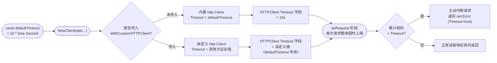

# ⏱️ `defaultTimeout` — 默认 HTTP 超时

> `pkg/ipapi/client.go` 中的包级常量。`defaultTimeout` 为 SDK 内置 `http.Client` 设定的默认请求超时时长，保证单次 IP 查询不会因网络抖动或服务端响应迟缓而无限挂起。

::: tip 🎨 一图抵千言
`defaultTimeout` 是一条「配置未显式设置时回退到的默认值」，下图展示它如何从常量定义流入 `NewClient`，最终成为内置 `http.Client.Timeout` 字段，以及被自定义客户端覆盖时回退失效的路径：



图中关键分支：走左侧（未覆盖）时 `defaultTimeout` 决定超时；走右侧（覆盖）时 `defaultTimeout` 不再生效，以调用方设定值为准。
:::

---

## 📦 定义

```go
// pkg/ipapi/client.go
package ipapi

import "time"

const (
    defaultTimeout = 10 * time.Second
    // ...
)
```

| 属性 | 值 |
| --- | --- |
| 🔤 名称 | `defaultTimeout` |
| 🏷️ 类别 | 常量（未导出） |
| 📐 类型 | `time.Duration` |
| 💡 取值 | `10 * time.Second`（10 秒） |
| 📍 定义位置 | `pkg/ipapi/client.go` 的 `const` 块 |
| ⚙️ 生效位置 | `NewClient` 创建的内置 `http.Client.Timeout` |

> ⚠️ 注意：`defaultTimeout` 是 **未导出** 常量，仅在 `ipapi` 包内可见。调用方无法直接引用它，但可通过 `NewClient()` 自动获得其默认行为，或通过 `WithCustomHTTPClient` 覆盖。

---

## 📖 说明

`defaultTimeout` 控制 SDK 默认 `http.Client` 的 **整体请求超时**，包含 TCP 连接建立、TLS 握手、发送请求、读取响应头的全过程，以及响应体读取阶段。一旦任一阶段累计耗时超过 10 秒，底层 `http.Client` 会主动中断请求并返回一个实现了 `net.Error` 接口的超时错误（`Timeout() == true`）。

### 🎯 设计意图

1. **🛡️ 防止无限挂起**
   IP 查询属于轻量级网络调用，10 秒已远超正常响应时间。设置上限可避免调用方协程因网络异常长时间阻塞，进而拖垮整个服务。

2. **⚖️ 兼顾弱网环境**
   在跨境访问 `ipapi.co` 或经过代理链时，10 秒留出了足够的缓冲，既不轻易误杀正常请求，又能在真正卡死时及时止损。

3. **🔁 与重试机制协同**
   超时错误会被 SDK 的重试逻辑纳入考量。当 `Client.Retries > 0` 时，超时后可自动重试，配合 `defaultRetryDelay`（500ms）形成基础的容错策略，而非直接向调用方抛出失败。

::: details 🐛 调试技巧：如何确认请求是否被 `defaultTimeout` 截断
当一次查询失败且怀疑是 10 秒超时所致时，可按以下顺序排查：

1. 先确认是否走默认客户端：检查 `client.HTTPClient.Timeout == 10*time.Second`，若不等说明已被 [`WithCustomHTTPClient`](../../api/options) 覆盖，此时截断来自调用方自定义值而非 `defaultTimeout`。
2. 再用 `errors.As` 判定错误是否实现 `net.Error` 且 `Timeout() == true`，这是 `http.Client` 层超时的唯一可靠信号。
3. 注意与请求上下文层超时区分：若同时设置了 `context.WithTimeout`，**较短者** 先触发。若 `context` 先到期，错误通常带 `context.DeadlineExceeded`，而非 `net.Error.Timeout()`。

```go
client := ipapi.NewClient()
// 步骤 1：确认走的是默认超时
fmt.Println(client.HTTPClient.Timeout == 10*time.Second) // true 表示 defaultTimeout 生效

// 步骤 2：精准识别 http.Client 层超时
var netErr net.Error
if errors.As(err, &netErr) && netErr.Timeout() {
    // 👉 这是 defaultTimeout（或自定义 HTTPClient.Timeout）触发的
}
```
:::

### 🔧 生效路径

`defaultTimeout` 在 `NewClient` 中被赋给内置 `http.Client` 的 `Timeout` 字段：

```go
// pkg/ipapi/client.go
func NewClient(opts ...ClientOption) *Client {
    c := &Client{
        HTTPClient: &http.Client{
            Timeout: defaultTimeout, // 👈 默认 10 秒超时
            CheckRedirect: func(req *http.Request, via []*http.Request) error {
                if len(via) >= maxRedirects {
                    return fmt.Errorf("stopped after %d redirects", maxRedirects)
                }
                return nil
            },
        },
        BaseURL:   defaultBaseURL,
        UserAgent: "ipapi-go-client/1.0",
        Retries:   2,
    }

    for _, opt := range opts {
        opt(c)
    }
    return c
}
```

### 🧪 默认值校验

SDK 测试套件显式断言 `defaultTimeout` 恒为 `10 * time.Second`，并校验 `NewClient()` 产出的 `HTTPClient.Timeout` 与之一致，防止后续重构意外修改默认行为：

```go
// pkg/ipapi/api_test.go
if defaultTimeout != 10*time.Second {
    t.Errorf("expected defaultTimeout 10s, got %v", defaultTimeout)
}

// pkg/ipapi/client_test.go
if client.HTTPClient.Timeout != defaultTimeout {
    t.Errorf("expected default timeout %v, got %v", defaultTimeout, client.HTTPClient.Timeout)
}
```

> 💡 关键点：`defaultTimeout` 仅作用于 SDK **自动创建** 的内置 `http.Client`。若调用方通过 `WithCustomHTTPClient` 注入了自定义 `*http.Client`，则完全以自定义客户端的超时配置为准，`defaultTimeout` 不再生效。

---

## 💻 用法 / 示例

### 1️⃣ 采用默认超时

不传任何选项时，`NewClient()` 自动套用 10 秒默认超时，无需额外配置：

```go
package main

import (
    "context"
    "fmt"
    "log"

    "github.com/cyberspacesec/ipapi"
)

func main() {
    // 👉 内置 http.Client.Timeout 已被设为 defaultTimeout（10s）
    client := ipapi.NewClient()

    ctx := context.Background()
    info, err := client.GetIPInfo(ctx, "8.8.8.8", "json")
    if err != nil {
        log.Fatalf("查询失败（含可能的超时）: %v", err)
    }
    fmt.Printf("8.8.8.8 => %s, %s\n", info.CountryName, info.City)
}
```

### 2️⃣ 读取当前默认超时值

由于 `defaultTimeout` 未导出，外部包无法直接引用。如需在日志或断言中体现默认超时，可读取 `NewClient()` 返回客户端的 `HTTPClient.Timeout`：

```go
package main

import (
    "fmt"
    "time"

    "github.com/cyberspacesec/ipapi"
)

func main() {
    client := ipapi.NewClient()
    // 👉 间接读取默认超时（即 defaultTimeout 的值）
    fmt.Printf("默认超时: %v\n", client.HTTPClient.Timeout) // 10s
    fmt.Printf("是否为 10s: %v\n", client.HTTPClient.Timeout == 10*time.Second)
}
```

### 3️⃣ 覆盖默认超时

若 10 秒不符合业务诉求（例如部署在内网高速链路希望更激进，或在弱网下希望更宽松），可通过 `WithCustomHTTPClient` 注入自定义 `http.Client` 完全替换默认配置：

```go
package main

import (
    "context"
    "net/http"
    "time"

    "github.com/cyberspacesec/ipapi"
)

func main() {
    customClient := &http.Client{
        Timeout: 30 * time.Second, // 👈 覆盖默认 10s，放宽到 30s
    }

    client := ipapi.NewClient(ipapi.WithCustomHTTPClient(customClient))

    ctx := context.Background()
    info, err := client.GetIPInfo(ctx, "8.8.8.8", "json")
    if err != nil {
        // 处理可能的超时（net.Error）或其他错误
        return
    }
    _ = info
}
```

### 4️⃣ 精准识别超时错误

超时触发的错误实现了 `net.Error` 接口，可通过类型断言判定 `Timeout()`，与业务错误区分开：

```go
package main

import (
    "context"
    "errors"
    "fmt"
    "log"
    "net"
    "time"

    "github.com/cyberspacesec/ipapi"
)

func main() {
    client := ipapi.NewClient()
    ctx, cancel := context.WithTimeout(context.Background(), 2*time.Second)
    defer cancel()

    _, err := client.GetIPInfo(ctx, "8.8.8.8", "json")
    if err != nil {
        var netErr net.Error
        if errors.As(err, &netErr) && netErr.Timeout() {
            log.Printf("⏱️ 请求超时: %v", err)
            return
        }
        fmt.Printf("其他错误: %v\n", err)
    }
}
```

> ⚠️ 注意区分两种超时来源：`defaultTimeout` 作用于 `http.Client` 层；而上方示例中的 `context.WithTimeout` 作用于请求上下文层。两者独立计时，**较短者** 先触发即终止请求。

---

## 🔗 相关

- 🏠 [`Client` 客户端](../../api/client) — `Client` 结构体定义与 `HTTPClient` 字段，`defaultTimeout` 的归属类型
- 🧩 [选项函数 `Options`](../../api/options) — `WithCustomHTTPClient` 等函数式选项，用于覆盖默认超时
- 🚀 [`NewClient`](../../api/new-client) — 应用 `defaultTimeout` 到内置 `http.Client` 的构造函数
- 🔧 [API 方法](../../api/methods) — 受超时约束的查询方法（`GetIPInfo` 等）
- 🛡 [错误类型](../../api/errors) — 超时错误与 `IsRetryableError` 的可重试判定
- 🗃 [数据模型](../../api/models) — 查询返回的 `IPInfo` / `APIError` 结构体

---

## 👉 下一步

- 🧩 学习 [选项函数 `Options`](../../api/options)，掌握 `WithCustomHTTPClient` 等配置入口
- 🖥️ 阅读 [`Client` 客户端](../../api/client)，理解 `HTTPClient`、`Retries`、`RateLimiter` 等字段的协作关系
- 🔄 结合 [重试概念](../../guide/retry-concept) 与 `defaultRetryDelay`，构建超时后的自动重试策略
- 🌐 参考 [自定义 HTTP 客户端](../../guide/custom-http) 指南，按业务场景调优超时与传输参数
