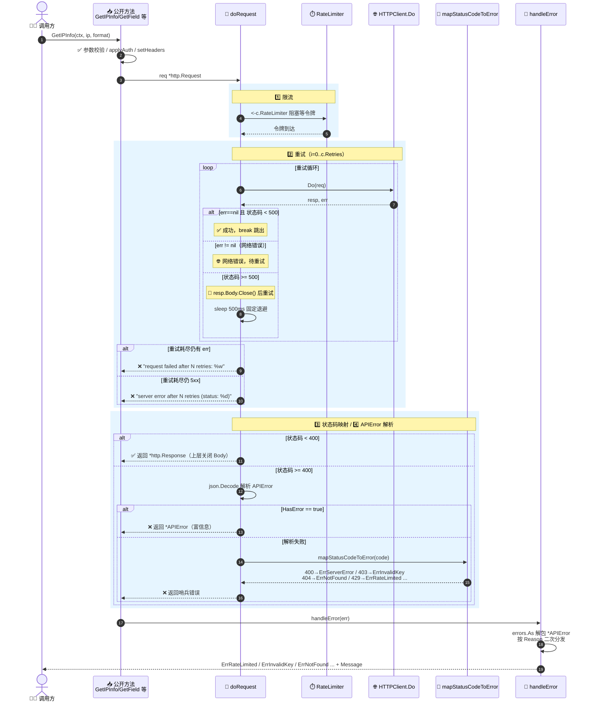

# 🚦 `doRequest` — 核心请求调度

> `doRequest` 是 `ipapi.co-skills` SDK 的内部请求调度中枢。每一个对外查询方法（`GetIPInfo`、`GetField` 等）在完成参数校验、鉴权注入与请求构建之后，都会把 `*http.Request` 交给它统一执行。它串起了 **限流 → 重试 → 状态码映射 → APIError 解析** 四道工序，是 SDK 容错与错误语义的真正源头。

::: warning 内部方法
`doRequest` 是 **未导出** 的内部方法（小写开头），不构成公开 API 契约，调用方不应直接依赖。其行为可在后续版本中调整。本页用于帮助使用者理解 SDK 内部如何处理网络抖动、限流与服务端错误，从而写出更稳健的调用代码。
:::

---

## 📦 定义

```go
// pkg/ipapi/api.go
func (c *Client) doRequest(req *http.Request) (*http.Response, error)
```

| 属性 | 值 |
| --- | --- |
| 🔣 符号 | `(*Client).doRequest` |
| 📛 类别 | 内部方法（未导出） |
| 📍 定义位置 | `pkg/ipapi/api.go` |
| 📥 入参 | `req *http.Request` —— 已完成 URL 构造、鉴权（`applyAuth`）与请求头（`setHeaders`）的请求对象 |
| 📤 出参 | `*http.Response` —— 仅在 HTTP 状态码 `< 400` 时返回，调用方负责关闭 `resp.Body` |
| 🔗 上游调用 | `GetIPInfo` / `GetIPInfoRaw` / `GetField` / `GetClientIPInfo` / `GetClientIPInfoRaw` / `GetClientField` |
| 🔧 依赖配置 | `Client.RateLimiter`、`Client.HTTPClient`、`Client.Retries` |

---

## 🧭 说明

`doRequest` 围绕一个核心目标设计：**把一次 HTTP 调用可能遇到的所有失败场景，统一收敛成清晰的 Go 错误语义**。它按顺序执行以下四道工序。

### 1️⃣ 限流（Rate Limiting）

```go
if c.RateLimiter != nil {
    <-c.RateLimiter // 阻塞等待令牌
}
```

若客户端配置了 `RateLimiter`（一个 `<-chan time.Time`），`doRequest` 在发起请求前会阻塞接收一次令牌，从而在客户端侧主动节流，从源头规避 `429`。这是 **客户端侧限流**，与服务端返回的 `429` 互为补充。

> 💡 该通道通常由调用方通过 `time.Tick` 之类构造并注入到 `Client.RateLimiter` 字段。SDK 不强制其节奏，调用方可按套餐配额自行设定。

### 2️⃣ 重试（Retry）

```go
for i := 0; i <= c.Retries; i++ {
    resp, err = c.HTTPClient.Do(req)
    if err == nil && resp.StatusCode < 500 { // 仅网络错误和5xx错误重试
        break
    }
    if err == nil { // 处理5xx错误：先关闭上一轮的 Body
        resp.Body.Close()
    }

    if i == c.Retries {
        if err != nil {
            return nil, fmt.Errorf("request failed after %d retries: %w", c.Retries, err)
        }
        return nil, fmt.Errorf("server error after %d retries (status: %d)", c.Retries, resp.StatusCode)
    }

    time.Sleep(defaultRetryDelay) // 固定退避 500ms
}
```

重试策略的关键事实：

- 🎯 **触发条件**：仅对 **网络错误**（`c.HTTPClient.Do` 返回非 `nil` err）与 **HTTP `5xx`** 重试。
- 🚫 **不重试**：`4xx` 错误（如 `400`、`403`、`404`、`429`）不会触发重试 —— 它们代表请求本身有缺陷或被拒绝，重试无意义，会直接进入状态码映射工序。
- 🔢 **重试次数**：循环 `i` 从 `0` 到 `c.Retries`，即最多执行 `c.Retries + 1` 次请求。`NewClient` 默认 `Retries = 2`，即首次 + 2 次重试 = 3 次尝试。
- ⏱️ **退避策略**：固定 `defaultRetryDelay`（500ms），非指数退避。
- 🧹 **资源清理**：对 `5xx` 重试时会先 `resp.Body.Close()` 释放上一轮响应体，避免连接泄漏。
- 💬 **失败语义**：重试耗尽后，网络错误以 `fmt.Errorf("request failed after %d retries: %w", ...)` 包装，`5xx` 以 `fmt.Errorf("server error after %d retries (status: %d)", ...)` 返回。

> ⚠️ 注意：循环里复用同一个 `*http.Request` 重发。对于带 body 的请求这可能涉及 body 重读问题，但本 SDK 所有请求均为 GET 且无 body，因此安全。

### 3️⃣ 状态码映射（Status Code Mapping）

当响应成功返回且状态码 `< 400` 时，`doRequest` 直接把 `*http.Response` 交还给上层方法（由上层负责 `defer resp.Body.Close()` 与解码）。若状态码 `>= 400`，则进入错误解析：

```go
if resp.StatusCode >= 400 {
    defer resp.Body.Close()
    var apiErr *APIError
    if err := json.NewDecoder(resp.Body).Decode(&apiErr); err == nil && apiErr.HasError {
        return nil, apiErr // 优先返回结构化 APIError
    }
    return nil, c.mapStatusCodeToError(resp.StatusCode) // 兜底：按状态码映射
}
```

兜底映射函数 `mapStatusCodeToError` 将裸状态码翻译为哨兵错误：

```go
// pkg/ipapi/api.go
func (c *Client) mapStatusCodeToError(code int) error {
    switch code {
    case http.StatusBadRequest:            // 400
        return fmt.Errorf("%w: invalid request", ErrServerError)
    case http.StatusForbidden:             // 403
        return fmt.Errorf("%w: %s", ErrInvalidKey, "check API key")
    case http.StatusNotFound:              // 404
        return ErrNotFound
    case http.StatusMethodNotAllowed:      // 405
        return ErrMethodNotAllowed
    case http.StatusTooManyRequests:       // 429
        return ErrRateLimited
    case http.StatusInternalServerError:   // 500
        return ErrServerError
    default:
        return fmt.Errorf("unexpected status code: %d", code)
    }
}
```

### 4️⃣ APIError 解析

当响应体可被反序列化为结构化 `APIError` 且 `HasError == true` 时，`doRequest` **直接返回该 `*APIError` 实例**（而非哨兵错误）。这一步是错误语义的"富信息"通道：

```go
// pkg/ipapi/models.go
type APIError struct {
    HasError bool   `json:"error"`
    Reason   string `json:"reason"`
    Message  string `json:"message"`
    IP       string `json:"ip"`
    Reserved bool   `json:"reserved"`
    Version  string `json:"version"`
}

func (e *APIError) Error() string { /* 实现 error 接口 */ }
```

返回的 `*APIError` 随后会经过上层 `handleError` 的二次分发：`handleError` 用 `errors.As` 解包，按 `apiErr.Reason` 字段（如 `"RateLimited"`、`"Reserved IP Address"`、`"Invalid IP Address"`、`"Invalid Key"`）映射到对应的哨兵错误（`ErrRateLimited` / `ErrReservedIP` / `ErrInvalidIP` / `ErrInvalidKey`），并用 `fmt.Errorf("%w: %s", ...)` 保留服务端的 `Message`。

> 📌 **双通道设计**：`doRequest` 优先走"结构化 APIError"通道（携带 `Reason` / `Message` 等富信息），解析失败时才回退到"裸状态码映射"通道。两条通道最终都汇入同一组哨兵错误，调用方用 `errors.Is` 即可统一判定。

::: tip 🎨 一图抵千言
下面这张时序图把 `doRequest` 的四道工序（限流 → 重试 → 状态码映射 → APIError）与上游调用方、`handleError` 的协作关系串了起来，蓝色为正常路径，红色为各类错误分支。
:::



---

## 💻 用法 / 示例

`doRequest` 本身不可直接调用，但它决定了所有公开方法的错误行为。以下示例展示如何 **观察并利用** `doRequest` 产出的错误语义。

### 示例 1：识别 `doRequest` 的两类失败

```go
package main

import (
    "context"
    "errors"
    "fmt"
    "log"
    "time"

    "github.com/cyberspacesec/ipapi"
)

func main() {
    client := ipapi.NewClient(ipapi.WithAPIKey("YOUR_API_KEY"))
    client.Retries = 3 // 自定义重试次数：首次 + 3 次 = 4 次尝试
    client.RateLimiter = time.Tick(200 * time.Millisecond) // 客户端侧节流

    ctx := context.Background()
    _, err := client.GetIPInfo(ctx, "8.8.8.8", "json")
    if err != nil {
        // doRequest 的两类终态错误：
        switch {
        case errors.Is(err, ipapi.ErrServerError):
            // 🟠 5xx 重试耗尽（"server error after N retries (status: 5xx)"）
            //   或 400 被兜底为 ErrServerError
            log.Printf("服务端故障: %v", err)
        case errors.Is(err, ipapi.ErrRateLimited):
            // 🟡 429 限流（APIError.Reason == "RateLimited" 或裸 429）
            log.Printf("已被限流，请降速: %v", err)
        case errors.Is(err, ipapi.ErrInvalidKey):
            // 🔑 403 / Reason=="Invalid Key"
            log.Printf("API Key 无效: %v", err)
        default:
            // 🌐 网络错误（"request failed after N retries: ..."）
            //   或其他哨兵错误（ErrNotFound / ErrInvalidIP ...）
            log.Printf("请求失败: %v", err)
        }
        return
    }

    fmt.Println("查询成功")
}
```

### 示例 2：基于 `IsRetryableError` 的调用方重试

`doRequest` 内部仅对网络错误与 `5xx` 重试；对于 `429` 限流这类瞬时错误，调用方可借助 `ipapi.IsRetryableError` 在外层补充指数退避：

```go
func lookupWithRetry(client *ipapi.Client, ctx context.Context, ip string) (*ipapi.IPInfo, error) {
    backoff := 500 * time.Millisecond
    const maxAttempts = 4

    var info *ipapi.IPInfo
    var err error
    for i := 0; i < maxAttempts; i++ {
        info, err = client.GetIPInfo(ctx, ip, "json")
        if err == nil {
            return info, nil
        }
        // doRequest 已对 5xx/网络错误内部重试过；
        // 这里只对外层可重试错误（ErrRateLimited / ErrServerError / ErrNotFound）退避重试
        if !ipapi.IsRetryableError(err) {
            return nil, err // 不可重试，直接返回
        }
        time.Sleep(backoff)
        backoff *= 2 // 指数退避
    }
    return nil, fmt.Errorf("lookup %s failed after %d attempts: %w", ip, maxAttempts, err)
}
```

### 示例 3：注入自定义错误处理器统一接管

`doRequest` 返回的 `*APIError` 会先经 `handleError` 分发。通过 `WithErrorHandler` 可在分发链路最前端统一接管：

```go
client := ipapi.NewClient(
    ipapi.WithAPIKey("YOUR_API_KEY"),
    ipapi.WithErrorHandler(func(err error) error {
        var apiErr *ipapi.APIError
        if errors.As(err, &apiErr) {
            // 拿到 doRequest 解析出的富信息错误
            log.Printf("ipapi 服务端错误 reason=%s message=%s ip=%s",
                apiErr.Reason, apiErr.Message, apiErr.IP)
        }
        return err // 原样返回，仍可被 errors.Is 匹配
    }),
)
```

---

## 🔗 相关

- 🖥️ [Client 客户端](../../api/client) —— `doRequest` 的宿主结构 `Client`，含 `HTTPClient` / `Retries` / `RateLimiter` 字段
- 📚 [API 方法](../../api/methods) —— 所有调用 `doRequest` 的公开查询方法总览
- 🧱 [数据模型](../../api/models) —— `APIError` 结构体定义与 `Error()` 实现
- 🚨 [错误类型](../../api/errors) —— `doRequest` 产出的哨兵错误（`ErrServerError` / `ErrRateLimited` / `ErrNotFound` …）一览
- ⚙️ [选项函数](../../api/options) —— `WithCustomHTTPClient` / `WithErrorHandler` 等可改变 `doRequest` 行为的配置项
- 🔁 [`IsRetryableError`](../../api/is-retryable) —— 判定 `doRequest` 产出错误是否值得外层重试
- ⚡ [`ErrRateLimited`](../errors/err-rate-limited) —— 限流错误的完整语义与触发路径
- 🧯 [`ErrServerError`](../errors/err-server-error) —— `5xx` 兜底错误语义

---

## 👉 下一步

- 📖 阅读 [Client 客户端](../../api/client)，了解 `doRequest` 依赖的 `HTTPClient` / `Retries` / `RateLimiter` 如何配置
- 🔁 结合 [API 方法](../../api/methods) 与 [`IsRetryableError`](../../api/is-retryable)，构建调用方指数退避重试机制
- 🚨 通读 [错误类型](../../api/errors)，掌握 `doRequest` 可能产出的全部错误语义
- ⚙️ 参考 [选项函数](../../api/options)，通过 `WithCustomHTTPClient` 注入自定义传输层或 `WithErrorHandler` 接管错误分发
- 🧪 查看 [错误处理示例](../../examples/error-handling) 编写健壮的容错调用代码
