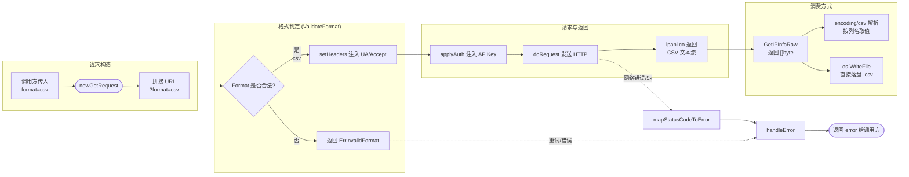

# 📄 FormatCSV

`FormatCSV` 是 ipapi.co-skills Go SDK 中的响应格式常量之一，用于将 API 响应指定为 **CSV** 格式，特别适合数据管道与批处理场景。

::: tip 🎨 一图抵千言
下图展示 CSV 格式从请求到落盘/解析的完整链路，并与 SDK 内部的格式判定、错误路径对照。


:::

## 📌 定义

```go
// FormatCSV 表示 CSV 响应格式，适合数据管道。
const FormatCSV Format = "csv"
```

底层类型 `Format` 是基于 `string` 的自定义类型：

```go
// Format 表示 API 请求的响应格式。
type Format string

const (
    FormatJSON  Format = "json"
    FormatJSONP Format = "jsonp"
    FormatXML   Format = "xml"
    FormatCSV   Format = "csv"
    FormatYAML  Format = "yaml"
)
```

`FormatCSV` 同时注册在 SDK 内部的 `validFormats` 白名单中，因此通过 `ValidateFormat` 校验时会返回合法。

## 📖 说明

🏷️ **类别**：格式常量（`Format`）

🎯 **适用场景**：

- 🔁 需要将 IP 地理信息**流式写入**数据管道（如 Kafka、Flume、Logstash）时
- 📊 需要把查询结果直接落盘为 `.csv` 文件，供 Excel、Pandas、BI 工具消费时
- 🏗️ 在 ETL / 数仓场景中作为**最轻量的行列结构**，避免 JSON 的解析开销
- 🧾 需要以**单行扁平结构**描述一条 IP 记录，便于追加到日志或事件流尾部

💡 **关键特性**：

- ✅ 极致精简：以逗号分隔的行列结构呈现，无嵌套、无键名冗余
- ✅ 与 `GetIPInfoRaw` 搭配使用，获取原始 CSV 字节流，可直接落盘或转交下游
- ✅ 通过 `ValidateFormat(FormatCSV)` 校验为合法格式
- ⚠️ SDK 的 `GetIPInfo` 等方法默认按 JSON 解析为 `*IPInfo` 结构体；若传入 `FormatCSV`，应使用 `GetIPInfoRaw` 获取原始文本，自行用 `encoding/csv` 解析
- ⚠️ CSV 响应通常以**首行表头 + 数据行**的形式返回，字段顺序固定；解析时建议按列索引取值
- ⚠️ 传入非法格式会触发 `ErrInvalidFormat` 错误

::: warning 🚧 内部实现提示
`FormatCSV` 的判定与拼接发生在 SDK 未导出的 [`newGetRequest`](./new-get-request) → [`setHeaders`](./set-headers) → [`doRequest`](./do-request) 链路中：`newGetRequest` 负责把 `format=csv` 拼到查询串，`setHeaders` 注入 `User-Agent` 与 `Accept`，`doRequest` 发送 HTTP 并把字节流原样返回。`GetIPInfoRaw` 不会对 CSV 文本做任何解析，因此调用方拿到的就是首行表头 + 数据行的原始文本。

调试时若发现响应被截断或字段错位，可先用 `GetIPInfoRaw` 打印前若干字节定位是网络层（`doRequest`）还是解析层（自行 `encoding/csv`）的问题。内部方法签名可能随版本调整，请勿在业务代码中依赖未导出符号。
:::

## 🛠️ 用法 / 示例

### 1️⃣ 获取原始 CSV 响应

使用 `GetIPInfoRaw` 获取指定 IP 的 CSV 格式原始字节：

```go
package main

import (
    "context"
    "fmt"
    "log"

    "github.com/cyberspacesec/ipapi.co-skills/pkg/ipapi"
)

func main() {
    client := ipapi.NewClient()

    // 以 CSV 格式查询 8.8.8.8 的全部字段
    raw, err := client.GetIPInfoRaw(context.Background(), "8.8.8.8", string(ipapi.FormatCSV))
    if err != nil {
        log.Fatalf("查询失败: %v", err)
    }

    fmt.Println(string(raw))
}
```

输出示例：

```csv
ip,network,version,city,region,region_code,country,country_name,country_code,country_code_iso3,country_capital,country_tld,continent_code,in_eu,postal,latitude,longitude,latlong,timezone,utc_offset,country_calling_code,currency,currency_name,languages,country_area,country_population,asn,org
8.8.8.8,8.8.8.0/24,IPv4,Mountain View,California,CA,US,United States,US,USA,Washington,.us,NA,false,,37.4056,-122.0775,"37.4056,-122.0775",America/Los_Angeles,-08:00,1,USD,US Dollar,"en",9629091,327167434,AS15169,Google LLC
```

### 2️⃣ 用 encoding/csv 解析为结构化数据

CSV 响应是纯文本，需借助标准库 `encoding/csv` 解析为可程序消费的记录：

```go
package main

import (
    "context"
    "encoding/csv"
    "fmt"
    "log"
    "strings"

    "github.com/cyberspacesec/ipapi.co-skills/pkg/ipapi"
)

func main() {
    client := ipapi.NewClient()

    raw, err := client.GetIPInfoRaw(context.Background(), "8.8.8.8", string(ipapi.FormatCSV))
    if err != nil {
        log.Fatalf("查询失败: %v", err)
    }

    // 解析 CSV：首行为表头，后续为数据行
    reader := csv.NewReader(strings.NewReader(string(raw)))
    records, err := reader.ReadAll()
    if err != nil {
        log.Fatalf("CSV 解析失败: %v", err)
    }

    if len(records) < 2 {
        log.Fatal("CSV 响应缺少数据行")
    }

    header := records[0]
    values := records[1]

    // 按列名定位取值，避免依赖固定列索引
    indexOf := func(name string) int {
        for i, h := range header {
            if h == name {
                return i
            }
        }
        return -1
    }

    if i := indexOf("city"); i >= 0 {
        fmt.Printf("城市: %s\n", values[i])
    }
    if i := indexOf("country_name"); i >= 0 {
        fmt.Printf("国家: %s\n", values[i])
    }
    if i := indexOf("org"); i >= 0 {
        fmt.Printf("运营商: %s\n", values[i])
    }
}
```

### 3️⃣ 将结果落盘为 CSV 文件

数据管道场景下，常见做法是把响应直接写入文件供下游消费：

```go
package main

import (
    "context"
    "log"
    "os"

    "github.com/cyberspacesec/ipapi.co-skills/pkg/ipapi"
)

func main() {
    client := ipapi.NewClient()

    raw, err := client.GetIPInfoRaw(context.Background(), "8.8.8.8", string(ipapi.FormatCSV))
    if err != nil {
        log.Fatalf("查询失败: %v", err)
    }

    // 直接将原始 CSV 字节落盘，避免二次序列化
    if err := os.WriteFile("8.8.8.8.csv", raw, 0o644); err != nil {
        log.Fatalf("写入文件失败: %v", err)
    }

    log.Println("已写入 8.8.8.8.csv")
}
```

### 4️⃣ 校验格式合法性

在拼装请求前可主动校验格式常量是否被 SDK 支持：

```go
package main

import (
    "fmt"
    "log"

    "github.com/cyberspacesec/ipapi.co-skills/pkg/ipapi"
)

func main() {
    if err := ipapi.ValidateFormat(string(ipapi.FormatCSV)); err != nil {
        log.Fatalf("格式非法: %v", err)
    }
    fmt.Println("FormatCSV 是受支持的响应格式")
}
```

### 5️⃣ 查询本机出口 IP 的 CSV 数据

`GetClientIPInfoRaw` 同样接受格式参数，可获取调用方（本机）IP 的 CSV 信息：

```go
package main

import (
    "context"
    "fmt"
    "log"

    "github.com/cyberspacesec/ipapi.co-skills/pkg/ipapi"
)

func main() {
    client := ipapi.NewClient()

    raw, err := client.GetClientIPInfoRaw(context.Background(), string(ipapi.FormatCSV))
    if err != nil {
        log.Fatalf("查询失败: %v", err)
    }

    fmt.Println(string(raw))
}
```

## 🔗 相关

- 🧱 [`Client`](../../api/client) —— 承载格式请求的客户端结构体
- 📚 [`Methods`](../../api/methods) —— `GetIPInfoRaw` / `GetClientIPInfoRaw` 等接受格式参数的方法
- 🗃️ [`Models`](../../api/models) —— `IPInfo` 等数据模型（默认按 JSON 解析）
- 🚨 [`Errors`](../../api/errors) —— 含 `ErrInvalidFormat` 等错误定义
- ⚙️ [`Options`](../../api/options) —— `NewClient` 的配置选项
- 🔎 [`ValidateFormat`](../../api/validate-format) —— 格式合法性校验函数

## 🚀 下一步

::: details 🔍 调试技巧：CSV 响应被当作 JSON 解析导致字段为空？
现象：调用 `GetIPInfo`（而非 `GetIPInfoRaw`）时传入 `FormatCSV`，返回的 `*IPInfo` 字段几乎全为空值，但 `err` 为 `nil`。

根因：`GetIPInfo` 内部默认按 JSON 反序列化到 `*IPInfo` 结构体；CSV 文本流并非合法 JSON，反序列化静默失败或落入零值，因此字段为空却无错误抛出。

排查步骤：
1. 确认调用的是 `GetIPInfoRaw`（返回 `[]byte`）而非 `GetIPInfo`（返回 `*IPInfo`）。
2. 打印 `raw` 的前若干字节，确认首行是逗号分隔的表头（如 `ip,network,version,...`）。
3. 若需结构化数据，用标准库 `encoding/csv` 自行解析（见上文示例 2️⃣），按列名定位取值，避免依赖固定列索引。
4. 若误用 `GetIPInfo` 且想保留结构化访问，应改用默认的 [`FormatJSON`](./format-json) 而非 `FormatCSV`。
:::

- 📖 阅读 [`格式概念`](../../guide/format-concept) 与 [`格式总览`](../../guide/formats)，了解全部五种响应格式
- 🧪 查看 [`原始格式示例`](../../examples/raw-formats)，对比 JSON / XML / CSV / YAML / JSONP 的用法
- 🛡️ 学习 [`错误处理概念`](../../guide/error-concept)，掌握 `ErrInvalidFormat` 的处理方式
- ⚡ 跳转 [`快速开始`](../../guide/getting-started)，从零搭建你的第一个查询程序
