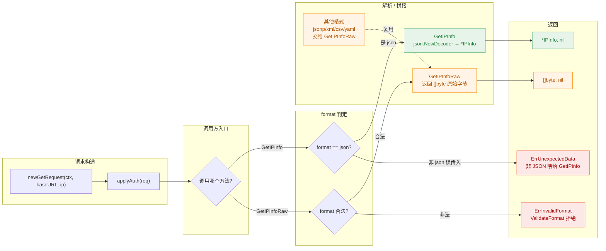

# 🧾 FormatJSON

::: tip 🎨 一图抵千言
`FormatJSON` 在 SDK 内部的请求-解析流程：请求携带 `format=json` → 服务端返回标准 JSON → `GetIPInfo` 直接解码为 `*IPInfo`；其他格式则走 `GetIPInfoRaw` 仅取原始字节。


:::

> 📦 格式常量 · 表示 `json` 响应格式，是唯一能被 `GetIPInfo` 解码为 `IPInfo` 结构体的格式。

## 📐 定义

```go
// Format 表示 API 请求的响应格式。
type Format string

const (
	FormatJSON  Format = "json"
	FormatJSONP Format = "jsonp"
	FormatXML   Format = "xml"
	FormatCSV   Format = "csv"
	FormatYAML  Format = "yaml"
)
```

| 属性 | 值 |
| --- | --- |
| 🏷️ 符号 | `ipapi.FormatJSON` |
| 🔤 字符串值 | `json` |
| 📂 类别 | 格式常量 |
| 🧩 底层类型 | `Format`（`string` 别名） |

## 💡 说明

`FormatJSON` 对应 ipapi.co 服务端的 **JSON 响应格式**。当请求 URL 携带 `format=json`（或默认不指定格式时），服务端返回一段标准的 JSON 文档，包含 IP、地理、网络、时区、货币等完整字段。

该常量在 SDK 中具有特殊地位：

- ✅ **唯一可被结构化解码的格式**。`Client.GetIPInfo` 内部使用 `json.NewDecoder` 将响应体直接反序列化为 `*IPInfo`，因此只有 `FormatJSON` 能成功走通 `GetIPInfo` 的解析路径。
- 🚫 **其他格式不可用于 `GetIPInfo`**。`jsonp`、`xml`、`csv`、`yaml` 虽然都通过了 `ValidateFormat` 的前置校验，但其响应体并非标准 JSON，交给 `GetIPInfo` 解码会得到 `ErrUnexpectedData`。若需使用这些格式，请改用 `Client.GetIPInfoRaw` 获取原始字节。
- 🧱 **预定义常量优先**。直接传字面量 `"json"` 也能工作，但推荐使用 `ipapi.FormatJSON` 常量，避免大小写或拼写错误（例如 `"JSON"` 会被 `ValidateFormat` 判为非法并返回 `ErrInvalidFormat`）。

> 💡 调用 `GetIPInfo` 时若希望获得解析后的结构体，请始终传入 `string(ipapi.FormatJSON)`。若需要原始字节或非 JSON 格式，使用 `GetIPInfoRaw` 并搭配对应的格式常量。

::: warning ⚠️ 内部方法不可直接调用
上图中的 `newGetRequest`、`applyAuth`、`setHeaders`、`doRequest` 等均为 SDK 内部未导出方法（小写命名），仅用于解释请求流转原理，无法在你的代码中直接调用。请始终通过公开方法 [`GetIPInfo`](../../api/methods) / [`GetIPInfoRaw`](../../api/methods) 发起请求，它们内部已封装好上述流程。
:::

::: details 🐛 调试技巧：定位格式不匹配导致的解码失败
当 `GetIPInfo` 返回 [`ErrUnexpectedData`](../../api/errors) 时，几乎可以断定是 **format 与方法不匹配**——你向只接受 `FormatJSON` 的 `GetIPInfo` 误传了 `jsonp`/`xml`/`csv`/`yaml`。排查三步：

1. **切换到 `GetIPInfoRaw`**：先用 `client.GetIPInfoRaw(ctx, ip, format)` 打印原始字节，确认服务端实际返回的报文形态，排除网络层问题。
2. **核对 `format` 字符串**：确认传入的是 `string(ipapi.FormatJSON)` 而非字面量 `"JSON"`（大小写敏感，`ValidateFormat` 会拒绝 `"JSON"` 并返回 [`ErrInvalidFormat`](../../api/errors)）。
3. **走 `ValidateFormat` 前置校验**：在调用前执行 `ipapi.ValidateFormat(format)`，把非法格式拦截在请求构造之前，避免浪费一次往返。

> 💡 仅 `FormatJSON` 能被 `json.NewDecoder` 反序列化为 `*IPInfo`；其余格式请一律走 [`GetIPInfoRaw`](../../api/methods) 拿原始字节自行解析。
:::

## 💻 用法 / 示例

### 1️⃣ 配合 GetIPInfo 获取结构化结果

`GetIPInfo` 只接受 `FormatJSON`（即 `"json"`），返回解码后的 `*IPInfo`：

```go
package main

import (
	"context"
	"fmt"
	"log"

	"github.com/cyberspacesec/ipapi.co-skills/pkg/ipapi"
)

func main() {
	ctx := context.Background()
	client := ipapi.NewClient()

	// 推荐写法：使用预定义常量，避免拼写/大小写错误
	info, err := client.GetIPInfo(ctx, "8.8.8.8", string(ipapi.FormatJSON))
	if err != nil {
		log.Fatal(err)
	}

	fmt.Printf("IP:        %s\n", info.IP)
	fmt.Printf("城市:      %s\n", info.City)
	fmt.Printf("国家:      %s (%s)\n", info.CountryName, info.CountryCode)
	fmt.Printf("ASN:       %s\n", info.ASN)
	fmt.Printf("组织:      %s\n", info.Org)
	fmt.Printf("时区:      %s (UTC%s)\n", info.Timezone, info.UTCOffset)
	fmt.Printf("获取时间:  %s\n", info.RetrievedAt.Format("2006-01-02 15:04:05"))
}
```

### 2️⃣ GetIPInfoRaw 同样支持 JSON 原始字节

若你需要原始的 JSON 字节（例如自行反序列化或转发给下游），可使用 `GetIPInfoRaw` 配合 `FormatJSON`：

```go
raw, err := client.GetIPInfoRaw(ctx, "8.8.8.8", string(ipapi.FormatJSON))
if err != nil {
	log.Fatal(err)
}
fmt.Printf("原始 JSON 字节数: %d\n", len(raw))
// raw 即服务端返回的 JSON 文本，可直接打印或二次解析
```

### 3️⃣ 与其他格式对比

`GetIPInfo` 仅认 `FormatJSON`；其他格式必须走 `GetIPInfoRaw`：

```go
// ✅ JSON：GetIPInfo 可解码
info, err := client.GetIPInfo(ctx, "8.8.8.8", string(ipapi.FormatJSON))

// ✅ XML / CSV / YAML / JSONP：必须用 GetIPInfoRaw 拿原始字节
raw, err := client.GetIPInfoRaw(ctx, "8.8.8.8", string(ipapi.FormatXML))
```

### 4️⃣ 前置校验：避免非法格式

`ValidateFormat` 会拒绝不在支持列表内的格式值，使用常量可彻底规避此类错误：

```go
if err := ipapi.ValidateFormat(string(ipapi.FormatJSON)); err != nil {
	// 永远不会进入这里：FormatJSON 是合法值
	log.Fatal(err)
}

// 反例：大小写不匹配会触发 ErrInvalidFormat
if err := ipapi.ValidateFormat("JSON"); err != nil {
	fmt.Println(err) // invalid response format
}
```

## 🔗 相关

- 🧱 [.](./../api/client](../../api/client) — `Client` 配置项与全部 `Format` 常量定义
- 📚 [.](./../api/methods](../../api/methods) — `GetIPInfo` / `GetIPInfoRaw` 等查询方法
- 🗂️ [.](./../api/models](../../api/models) — `Format` 类型与 `IPInfo` 结构体字段
- ⚠️ [.](./../api/errors](../../api/errors) — `ErrInvalidFormat`、`ErrUnexpectedData` 等错误
- 🎛️ [.](./../api/options](../../api/options) — 客户端可选配置项

## ➡️ 下一步

- 📖 阅读 [.](./../api/methods](../../api/methods) 全面了解 `GetIPInfo` 与 `GetIPInfoRaw` 的差异和适用场景
- 🗂️ 查阅 [.](./../api/models](../../api/models) 查看 `IPInfo` 各字段的 JSON 标签与含义
- 🚀 跳转 [.](./../guide/formats](../../guide/formats) 了解 SDK 支持的全部响应格式与选型建议
