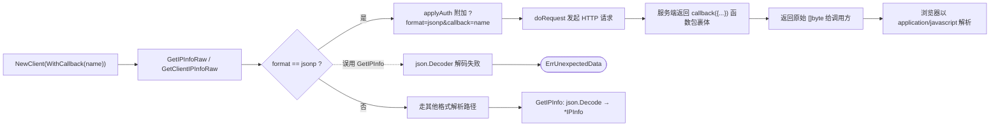

# 🧾 FormatJSONP

> 📦 格式常量 · 表示 `jsonp` 响应格式，需配合 `WithCallback` 设置回调名，并使用 `GetIPInfoRaw` 获取原始字节。

::: tip 🎨 一图抵千言
`FormatJSONP` 在请求链路中的位置与关键判定：回调名由 `WithCallback` 注入，响应体是「函数调用包裹 JSON」，因此必须走 `Raw` 通道拿原始字节，交给 `json.Decoder` 会触发 `ErrUnexpectedData`。


:::

## 📐 定义

```go
// Format 表示 API 请求的响应格式。
type Format string

const (
	FormatJSON  Format = "json"
	FormatJSONP Format = "jsonp"
	FormatXML   Format = "xml"
	FormatCSV   Format = "csv"
	FormatYAML  Format = "yaml"
)
```

| 属性 | 值 |
| --- | --- |
| 🏷️ 符号 | `ipapi.FormatJSONP` |
| 🔤 字符串值 | `jsonp` |
| 📂 类别 | 格式常量 |
| 🧩 底层类型 | `Format`（`string` 别名） |

## 💡 说明

`FormatJSONP` 对应 ipapi.co 服务端的 **JSONP（JSON with Padding）响应格式**。当请求 URL 同时携带 `format=jsonp` 与 `callback=<名称>` 时，服务端会把原本的 JSON 文档包裹成一个 JavaScript 函数调用返回，形如：

```js
myCallback({"ip":"8.8.8.8","city":"Mountain View",...})
```

这种格式天然适配浏览器 `<script>` 标签的跨域加载场景，前端无需 CORS 即可拿到 IP 地理位置数据。该常量在 SDK 中有以下要点：

- 🔗 **必须搭配回调名**。JSONP 的本质是「函数调用包裹 JSON」，缺少回调名则失去意义。请通过 [`WithCallback`](../../api/with-callback) 选项设置回调函数名；SDK 在 `applyAuth` 阶段会将其以 `?callback=` 查询参数附加到请求 URL。
- 🚫 **不能用于 `GetIPInfo`**。JSONP 响应体并非标准 JSON（外层多了一层函数调用），交给 `json.NewDecoder` 解码必然失败并返回 `ErrUnexpectedData`。请改用 `Client.GetIPInfoRaw` 或 `Client.GetClientIPInfoRaw` 获取原始字节。
- ✅ **通过 `ValidateFormat` 校验**。`FormatJSONP` 是合法格式值，调用 `ValidateFormat("jsonp")` 不会报错；但 `ValidateFormat("JSONP")` 因大小写不匹配会返回 `ErrInvalidFormat`，故应优先使用常量。
- 🌐 **浏览器场景才真正需要**。服务端到服务端调用用 `FormatJSON` 即可；仅当前端 `<script>` 直连或后端代理返回 `application/javascript` 给浏览器时，才有使用 JSONP 的必要。

> 💡 若回调名为空却传了 `FormatJSONP`，SDK 不会拦截，但 ipapi.co 服务端可能返回未包裹的 JSON 或报错。请务必在构造 `Client` 时一并设置 `WithCallback`。

::: details 🐞 调试技巧：JSONP 响应为何「看起来不是 JSON」
当响应体形如 `showIP({"ip":"8.8.8.8"})` 而非裸 `{"ip":"8.8.8.8"}` 时，不要怀疑服务端出错——这正是 JSONP 的预期形态。排查清单：

1. **确认走的是 `Raw` 方法**。若误用 [`GetIPInfo`](../../api/get-ip-info) 且 format 传 `jsonp`，`json.NewDecoder` 会把开头的 `showIP(` 当作非法 JSON 字符，返回 `ErrUnexpectedData`。改用 [`GetIPInfoRaw`](../../api/get-ip-info-raw) 或 [`GetClientIPInfoRaw`](../../api/get-client-ip-info-raw)。
2. **剥离回调包裹再解析**。后端拿到原始字节后，需自行裁掉首尾的 `name(` 与 `)`，再交给 `json.Unmarshal`。SDK 不代此劳，因为 JSONP 的语义就是「原样交给浏览器执行」。
3. **回调名缺失**。若忘了 [`WithCallback`](../../api/with-callback)，`applyAuth` 不会附加 `?callback=`，服务端可能退化为返回裸 JSON 或报错，此时响应不再是「函数调用包裹 JSON」。
4. **大小写陷阱**。直接传字符串 `"JSONP"` 会触发 `ErrInvalidFormat`；始终用常量 [`FormatJSONP`](./format-jsonp) 或小写 `"jsonp"`。
:::

## 💻 用法 / 示例

### 1️⃣ 基础：查询指定 IP 的 JSONP 原始字节

使用 `GetIPInfoRaw` + `FormatJSONP`，并通过 `WithCallback` 指定回调名：

```go
package main

import (
	"context"
	"fmt"
	"log"

	"github.com/cyberspacesec/ipapi.co-skills/pkg/ipapi"
)

func main() {
	ctx := context.Background()

	// 关键：WithCallback 设置回调函数名，FormatJSONP 指定格式
	client := ipapi.NewClient(
		ipapi.WithCallback("showIP"),
	)

	// JSONP 必须用 GetIPInfoRaw 拿原始字节
	data, err := client.GetIPInfoRaw(ctx, "8.8.8.8", string(ipapi.FormatJSONP))
	if err != nil {
		log.Fatal(err)
	}

	// 输出形如：showIP({"ip":"8.8.8.8","city":"Mountain View",...})
	fmt.Println(string(data))
}
```

### 2️⃣ 浏览器跨域代理：从 query 动态取回调名

实际后端代理场景下，回调名通常由前端通过 `?callback=` 传入，需按请求动态构造客户端：

```go
func jsonpHandler(w http.ResponseWriter, r *http.Request) {
	// 从前端 query 取回调名，缺省用 "callback"
	callback := r.URL.Query().Get("callback")
	if callback == "" {
		callback = "callback"
	}

	// 每个请求一个 Client，动态绑定回调名
	client := ipapi.NewClient(ipapi.WithCallback(callback))

	data, err := client.GetClientIPInfoRaw(r.Context(), string(ipapi.FormatJSONP))
	if err != nil {
		http.Error(w, err.Error(), http.StatusInternalServerError)
		return
	}

	// 浏览器侧以 JavaScript 解析
	w.Header().Set("Content-Type", "application/javascript")
	w.Write(data)
}

func main() {
	http.HandleFunc("/ip", jsonpHandler)
	http.ListenAndServe(":8080", nil)
}
```

前端用 `<script>` 直连即可触发回调：

```html
<script>
function showIP(data) {
  console.log("你的 IP:", data.ip);
  console.log("城市:", data.city);
}
</script>
<script src="http://localhost:8080/ip?callback=showIP"></script>
```

### 3️⃣ 带 API Key 的 JSONP（query 参数认证）

`<script>` 标签无法设置自定义请求头，因此 JSONP 场景下的 API Key 必须走 `?key=` 查询参数，需搭配 `WithAPIKeyQuery`：

```go
client := ipapi.NewClient(
	ipapi.WithAPIKey(os.Getenv("IPAPI_KEY")),
	ipapi.WithAPIKeyQuery(),   // 以 ?key= 形式发送，适配 <script> 无法设 Header 的限制
	ipapi.WithCallback("showIP"),
)

data, err := client.GetClientIPInfoRaw(ctx, string(ipapi.FormatJSONP))
```

> ⚠️ 走 query 参数的 Key 会暴露在前端 URL 中，请仅使用受限、临时或低权限 Key。详见 [认证机制](../../guide/auth-concept)。

### 4️⃣ 前置校验：确认格式合法

`ValidateFormat` 接受 `FormatJSONP`，可据此做接口前置校验：

```go
if err := ipapi.ValidateFormat(string(ipapi.FormatJSONP)); err != nil {
	// 永远不会进入这里：FormatJSONP 是合法值
	log.Fatal(err)
}

// 反例：大小写不匹配会触发 ErrInvalidFormat
if err := ipapi.ValidateFormat("JSONP"); err != nil {
	fmt.Println(err) // invalid response format
}
```

## 🔗 相关

- 🧱 [.](./../api/client](../../api/client) — `Client` 配置项与全部 `Format` 常量定义
- 📚 [.](./../api/methods](../../api/methods) — `GetIPInfoRaw` / `GetClientIPInfoRaw` 等原始字节查询方法
- 🗂️ [.](./../api/models](../../api/models) — `Format` 类型定义与 `IPInfo` 结构体字段
- ⚠️ [.](./../api/errors](../../api/errors) — `ErrInvalidFormat`、`ErrUnexpectedData` 等错误
- 🎛️ [.](./../api/options](../../api/options) — `WithCallback` 等客户端可选配置项

## ➡️ 下一步

- 🎛️ 阅读 [.](./../api/with-callback](../../api/with-callback) 深入了解回调名如何注入请求 URL
- 📖 跳转 [.](./../api/get-ip-info-raw](../../api/get-ip-info-raw) 查看 `GetIPInfoRaw` 的完整签名与原始字节返回逻辑
- 🌐 阅读 [.](./../guide/formats](../../guide/formats) 了解 SDK 支持的全部响应格式与选型建议
