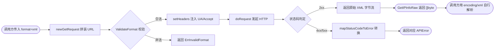

# 📄 FormatXML

`FormatXML` 是 ipapi.co-skills Go SDK 中的响应格式常量之一，用于将 API 响应指定为 **XML** 格式。由于 SDK 内置的 `IPInfo` 结构体默认按 JSON 解码，XML 格式需通过 `GetIPInfoRaw` 获取原始字节后自行处理。

::: tip 🎨 一图抵千言
下图展示了 SDK 在收到带 `format=xml` 的请求时，如何在内部分支中路由到 XML 处理路径，并以原始字节形式返回给调用方：


:::

::: warning ⚠️ 内部方法不可直接调用
上图中的 `newGetRequest` / `setHeaders` / `doRequest` / `mapStatusCodeToError` 均为 SDK **未导出的内部方法**，仅用于说明请求生命周期原理。用户代码只能通过 [`GetIPInfoRaw`](../../api/methods) 等公开方法间接触发该流程，无法也无需直接调用这些内部函数。
:::

## 📌 定义

```go
// FormatXML 表示 XML 响应格式，需通过 GetIPInfoRaw 获取原始字节。
const FormatXML Format = "xml"
```

底层类型 `Format` 是基于 `string` 的自定义类型，与其它格式常量一同声明在同一常量块中：

```go
// Format 表示 API 请求的响应格式。
type Format string

const (
    FormatJSON  Format = "json"
    FormatJSONP Format = "jsonp"
    FormatXML   Format = "xml"
    FormatCSV   Format = "csv"
    FormatYAML  Format = "yaml"
)
```

`FormatXML` 同时注册在 SDK 内部的 `validFormats` 白名单中，因此通过 `ValidateFormat` 校验时会返回合法。

## 📖 说明

🏷️ **类别**：格式常量（`Format`）

🎯 **适用场景**：

- 🏢 需要与遗留的 **SOAP / XML 数据管线**或企业内部 XML 接口对接时
- 🗂️ 需要用 `encoding/xml` 标准库将响应反序列化进自定义 Go 结构体时
- 📊 需要以**自描述标签**形式呈现字段名，便于跨系统、跨语言解析时

💡 **关键特性**：

- ✅ 以 XML 标签包裹字段，结构自描述、可被通用 XML 解析器读取
- ✅ 与 `GetIPInfoRaw` 搭配使用，获取原始 XML 字节流
- ✅ 通过 `ValidateFormat(FormatXML)` 校验为合法格式
- ⚠️ SDK 的 `GetIPInfo` 等方法默认按 JSON 解析为 `*IPInfo` 结构体；若传入 `FormatXML`，应使用 `GetIPInfoRaw` 获取原始文本，再用 `encoding/xml` 自行解析
- ⚠️ 传入非法格式会触发 `ErrInvalidFormat` 错误

::: details 🐞 调试技巧：如何确认服务端真的返回了 XML
当解析结果不符合预期时，可按以下三步排查：

1. **先看原始字节**：把 `GetIPInfoRaw` 返回的 `[]byte` 直接打印或落盘，确认首行是 `<?xml version="1.0" ...?>`，而不是 JSON 的 `{` 或 HTML 错误页。
2. **核对结构体标签**：`encoding/xml` 严格按 `xml:"tag"` 匹配服务端标签名，字段名拼写、大小写、下划线（如 `country_name`）必须一一对应，否则静默得到零值。
3. **留意错误页**：若触限或 key 非法，服务端可能返回非 XML 文本，此时 `xml.Unmarshal` 会报语法错；应先检查 `err` 与 HTTP 状态码，对照 [`mapStatusCodeToError`](./map-status-code) 与 [`ErrInvalidKey`](../errors/err-invalid-key) 判断根因。
:::

## 🛠️ 用法 / 示例

### 1️⃣ 获取原始 XML 响应

使用 `GetIPInfoRaw` 获取指定 IP 的 XML 格式原始字节：

```go
package main

import (
    "context"
    "fmt"
    "log"

    "github.com/cyberspacesec/ipapi.co-skills/pkg/ipapi"
)

func main() {
    client := ipapi.NewClient()

    // 以 XML 格式查询 8.8.8.8 的全部字段
    raw, err := client.GetIPInfoRaw(context.Background(), "8.8.8.8", string(ipapi.FormatXML))
    if err != nil {
        log.Fatalf("查询失败: %v", err)
    }

    fmt.Println(string(raw))
}
```

输出示例：

```xml
<?xml version="1.0" encoding="UTF-8"?>
<response>
    <ip>8.8.8.8</ip>
    <network>8.8.8.0/24</network>
    <version>IPv4</version>
    <city>Mountain View</city>
    <region>California</region>
    <region_code>CA</region_code>
    <country>US</country>
    <country_name>United States</country_name>
    <country_code>US</country_code>
    <country_code_iso3>USA</country_code_iso3>
    <country_capital>Washington</country_capital>
    <latitude>37.4056</latitude>
    <longitude>-122.0775</longitude>
</response>
```

### 2️⃣ 用 encoding/xml 解析进自定义结构体

`GetIPInfoRaw` 返回的是原始字节，可借助标准库 `encoding/xml` 反序列化为你自定义的结构体：

```go
package main

import (
    "context"
    "encoding/xml"
    "fmt"
    "log"

    "github.com/cyberspacesec/ipapi.co-skills/pkg/ipapi"
)

// 按需挑选字段，标签名与服务端 XML 标签一一对应。
type ipResult struct {
    IP          string  `xml:"ip"`
    City        string  `xml:"city"`
    Region      string  `xml:"region"`
    Country     string  `xml:"country"`
    CountryName string  `xml:"country_name"`
    Latitude    float64 `xml:"latitude"`
    Longitude   float64 `xml:"longitude"`
}

func main() {
    client := ipapi.NewClient()

    raw, err := client.GetIPInfoRaw(context.Background(), "8.8.8.8", string(ipapi.FormatXML))
    if err != nil {
        log.Fatalf("查询失败: %v", err)
    }

    var result ipResult
    if err := xml.Unmarshal(raw, &result); err != nil {
        log.Fatalf("XML 解析失败: %v", err)
    }

    fmt.Printf("%s 位于 %s, %s (%.4f, %.4f)\n",
        result.IP, result.City, result.CountryName,
        result.Latitude, result.Longitude)
}
```

### 3️⃣ 校验格式合法性

在拼装请求前可主动校验格式常量是否被 SDK 支持：

```go
package main

import (
    "fmt"
    "log"

    "github.com/cyberspacesec/ipapi.co-skills/pkg/ipapi"
)

func main() {
    if err := ipapi.ValidateFormat(string(ipapi.FormatXML)); err != nil {
        log.Fatalf("格式非法: %v", err)
    }
    fmt.Println("FormatXML 是受支持的响应格式")
}
```

### 4️⃣ 查询本机出口 IP 的 XML 数据

`GetClientIPInfoRaw` 同样接受格式参数，可获取调用方（本机）IP 的 XML 信息：

```go
package main

import (
    "context"
    "fmt"
    "log"

    "github.com/cyberspacesec/ipapi.co-skills/pkg/ipapi"
)

func main() {
    client := ipapi.NewClient()

    raw, err := client.GetClientIPInfoRaw(context.Background(), string(ipapi.FormatXML))
    if err != nil {
        log.Fatalf("查询失败: %v", err)
    }

    fmt.Println(string(raw))
}
```

## 🔗 相关

- 🧱 [`Client`](../../api/client) —— 承载格式请求的客户端结构体
- 📚 [`Methods`](../../api/methods) —— `GetIPInfoRaw` / `GetClientIPInfoRaw` 等接受格式参数的方法
- 🗃️ [`Models`](../../api/models) —— `IPInfo` 等数据模型（默认按 JSON 解析）
- 🚨 [`Errors`](../../api/errors) —— 含 `ErrInvalidFormat` 等错误定义
- ⚙️ [`Options`](../../api/options) —— `NewClient` 的配置选项
- 🔎 [`ValidateFormat`](../../api/validate-format) —— 格式合法性校验函数

## 🚀 下一步

- 📖 阅读 [格式概念](../../guide/format-concept) 与 [格式总览](../../guide/formats)，了解全部五种响应格式
- 🧪 查看 [原始格式示例](../../examples/raw-formats)，对比 JSON / XML / CSV / YAML / JSONP 的用法
- 🛡️ 学习 [错误处理概念](../../guide/error-concept)，掌握 `ErrInvalidFormat` 的处理方式
- ⚡ 跳转 [快速开始](../../guide/getting-started)，从零搭建你的第一个查询程序
