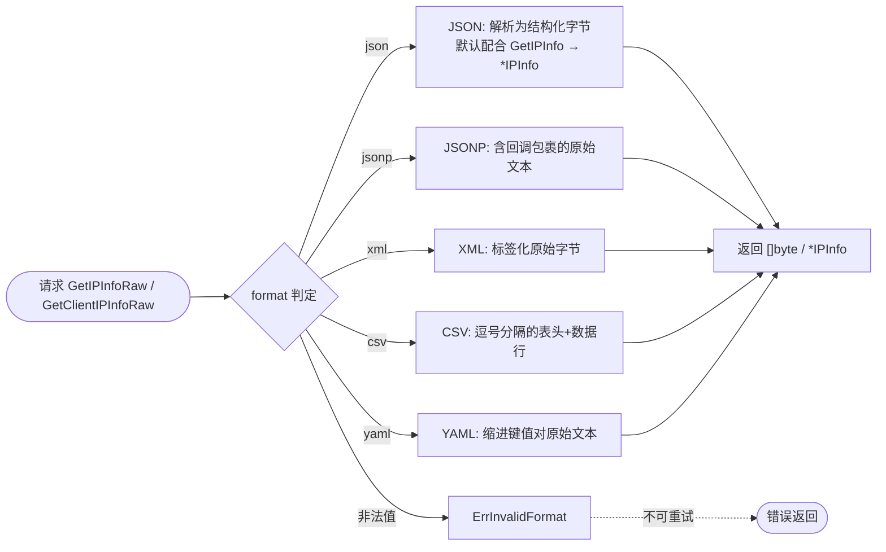

# 🗂️ FormatYAML

::: tip 🎨 一图抵千言
下图展示 SDK 在收到一次查询请求后，如何依据 `format` 参数分流到对应的解析/拼接路径，并对比了 5 种格式（`json` / `jsonp` / `xml` / `csv` / `yaml`）各自的处理方式与最终返回形态。
:::



`FormatYAML` 是 ipapi.co-skills Go SDK 中的响应格式常量之一，用于将 API 响应指定为 **YAML** 格式。

## 📌 定义

```go
// FormatYAML 表示 YAML 响应格式，可读性好。
const FormatYAML Format = "yaml"
```

底层类型 `Format` 是基于 `string` 的自定义类型：

```go
// Format 表示 API 请求的响应格式。
type Format string

const (
    FormatJSON  Format = "json"
    FormatJSONP Format = "jsonp"
    FormatXML   Format = "xml"
    FormatCSV   Format = "csv"
    FormatYAML  Format = "yaml"
)
```

`FormatYAML` 同时注册在 SDK 内部的 `validFormats` 白名单中，因此通过 `ValidateFormat` 校验时会返回合法。

::: warning ⚙️ 内部实现提醒
`FormatYAML` 仅作为请求参数传入公开方法（如 [`GetIPInfoRaw`](../../api/methods) / [`GetClientIPInfoRaw`](../../api/methods)），SDK **不会**在内部对 YAML 文本做结构化解析——这一步发生在 [`newGetRequest`](./set-headers) 拼装查询参数之后、由服务端返回原始字节。也就是说，从 [`doRequest`](./set-headers) 拿回的 `[]byte` 直接透传给调用方，期间不经过任何 YAML 反序列化。

如需在客户端侧解析为结构体，请自行引入 `gopkg.in/yaml.v3`，并避免与默认按 JSON 解析的 [`GetIPInfo`](../../api/methods) 混用，否则会触发 [`ErrUnexpectedData`](../../api/errors)。
:::

## 📖 说明

🏷️ **类别**：格式常量（`Format`）

🎯 **适用场景**：

- 🔍 需要以**人类可读**方式查看或调试 API 返回内容时
- 🧩 需要将响应直接嵌入配置文件、文档或 YAML 驱动的工具链时
- 📜 相比 JSON，YAML 的缩进结构更利于人工阅读和差异比对

💡 **关键特性**：

- ✅ 可读性好：以缩进与键值对呈现，结构清晰直观
- ✅ 与 `GetIPInfoRaw` 搭配使用，获取原始 YAML 字节流
- ✅ 通过 `ValidateFormat(FormatYAML)` 校验为合法格式
- ⚠️ SDK 的 `GetIPInfo` 等方法默认按 JSON 解析为 `*IPInfo` 结构体；若传入 `FormatYAML`，应使用 `GetIPInfoRaw` 获取原始文本，自行解析
- ⚠️ 传入非法格式会触发 `ErrInvalidFormat` 错误

## 🛠️ 用法 / 示例

### 1️⃣ 获取原始 YAML 响应

使用 `GetIPInfoRaw` 获取指定 IP 的 YAML 格式原始字节：

```go
package main

import (
    "context"
    "fmt"
    "log"

    "github.com/cyberspacesec/ipapi.co-skills/pkg/ipapi"
)

func main() {
    client := ipapi.NewClient()

    // 以 YAML 格式查询 8.8.8.8 的全部字段
    raw, err := client.GetIPInfoRaw(context.Background(), "8.8.8.8", string(ipapi.FormatYAML))
    if err != nil {
        log.Fatalf("查询失败: %v", err)
    }

    fmt.Println(string(raw))
}
```

输出示例：

```yaml
ip: 8.8.8.8
network: 8.8.8.0/24
version: IPv4
city: Mountain View
region: California
region_code: CA
country: US
country_name: United States
country_code: US
country_code_iso3: USA
country_capital: Washington
latitude: 37.4056
longitude: -122.0775
```

### 2️⃣ 校验格式合法性

在拼装请求前可主动校验格式常量是否被 SDK 支持：

```go
package main

import (
    "fmt"
    "log"

    "github.com/cyberspacesec/ipapi.co-skills/pkg/ipapi"
)

func main() {
    if err := ipapi.ValidateFormat(string(ipapi.FormatYAML)); err != nil {
        log.Fatalf("格式非法: %v", err)
    }
    fmt.Println("FormatYAML 是受支持的响应格式")
}
```

### 3️⃣ 查询本机出口 IP 的 YAML 数据

`GetClientIPInfoRaw` 同样接受格式参数，可获取调用方（本机）IP 的 YAML 信息：

```go
package main

import (
    "context"
    "fmt"
    "log"

    "github.com/cyberspacesec/ipapi.co-skills/pkg/ipapi"
)

func main() {
    client := ipapi.NewClient()

    raw, err := client.GetClientIPInfoRaw(context.Background(), string(ipapi.FormatYAML))
    if err != nil {
        log.Fatalf("查询失败: %v", err)
    }

    fmt.Println(string(raw))
}
```

::: details 🐞 调试技巧：为何 GetIPInfo 配合 FormatYAML 时会报错？
SDK 的 [`GetIPInfo`](../../api/methods) 内部默认按 **JSON** 解析响应为 `*IPInfo` 结构体。若你把 `FormatYAML` 传给 `GetIPInfo`，返回的 YAML 文本无法被 JSON 解码器识别，最终会触发 [`ErrUnexpectedData`](../../api/errors)。

正确的做法是：

- 用 [`GetIPInfoRaw`](../../api/methods) 拿到 YAML 原始字节，自行用 `gopkg.in/yaml.v3` 等库解析；
- 或直接使用默认的 [`FormatJSON`](./format-json)，让 SDK 自动反序列化为 `*IPInfo`。

```go
// ✅ 正确：Raw + YAML
raw, err := client.GetIPInfoRaw(ctx, "8.8.8.8", string(ipapi.FormatYAML))

// ❌ 错误：GetIPInfo 不识别 YAML
// info, err := client.GetIPInfo(ctx, "8.8.8.8", string(ipapi.FormatYAML))
```
:::

## 🔗 相关

- 🧱 [`Client`](../../api/client) —— 承载格式请求的客户端结构体
- 📚 [`Methods`](../../api/methods) —— `GetIPInfoRaw` / `GetClientIPInfoRaw` 等接受格式参数的方法
- 🗃️ [`Models`](../../api/models) —— `IPInfo` 等数据模型（默认按 JSON 解析）
- 🚨 [`Errors`](../../api/errors) —— 含 `ErrInvalidFormat` 等错误定义
- ⚙️ [`Options`](../../api/options) —— `NewClient` 的配置选项
- 🔎 [`ValidateFormat`](../../api/validate-format) —— 格式合法性校验函数

## 🚀 下一步

- 📖 阅读 [`格式概念`](../../guide/format-concept) 与 [`格式总览`](../../guide/formats)，了解全部五种响应格式
- 🧪 查看 [`原始格式示例`](../../examples/raw-formats)，对比 JSON / XML / CSV / YAML / JSONP 的用法
- 🛡️ 学习 [`错误处理概念`](../../guide/error-concept)，掌握 `ErrInvalidFormat` 的处理方式
- ⚡ 跳转 [`快速开始`](../../guide/getting-started)，从零搭建你的第一个查询程序
