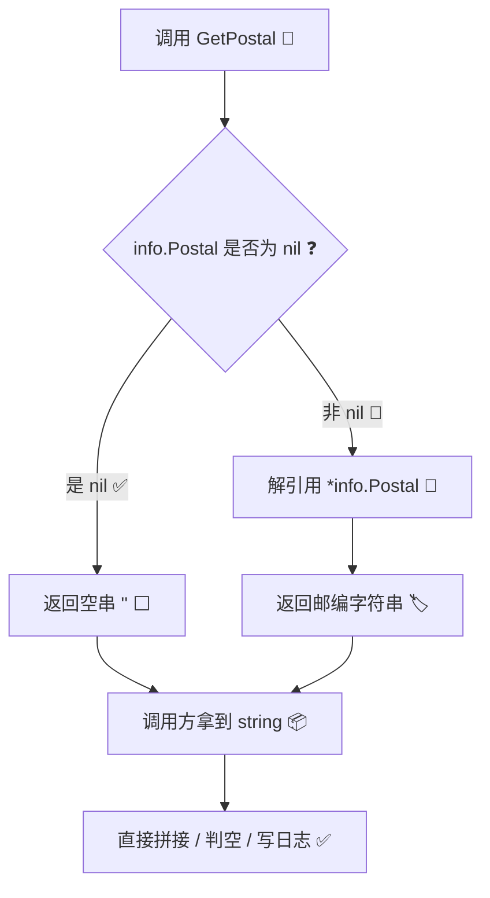

# 📮 GetPostal

> 🧩 IPInfo 方法 · 安全读取 `Postal`（邮政编码）字段，底层指针为 `nil` 时返回空字符串，杜绝空指针解引用。

## 📐 定义

```go
// GetPostal returns the postal code as a string, or empty string if nil
func (info *IPInfo) GetPostal() string
```

| 属性 | 值 |
| --- | --- |
| 🏷️ 符号 | `(*ipapi.IPInfo).GetPostal` |
| 📦 接收者 | `*IPInfo` |
| 🔁 返回值 | `string`（邮政编码，或 `""`） |
| 📂 类别 | IPInfo 方法 |
| 📄 源文件 | `pkg/ipapi/models.go` |

## 💡 说明

`IPInfo.Postal` 在结构体中声明为 **指针类型** `*string`：

```go
Postal *string `json:"postal"`
```

之所以用指针，是因为 ipapi.co 的响应中 `postal` 字段可能 **完全缺失**（例如某些 IP 段没有对应的邮编数据，或查询的是保留地址）。若直接用 `*info.Postal` 解引用，在字段缺失（`nil`）时会触发 **空指针 panic**，导致整个程序崩溃。

`GetPostal()` 正是为解决这一痛点而生：

- ✅ **nil 安全**。内部先判断 `info.Postal == nil`，是则直接返回空串 `""`，绝不解引用空指针。
- 🧱 **零值友好**。返回值始终是普通 `string`，可直接拼接、判空、写日志，无需再写防御性 `if` 语句。
- 🎯 **语义清晰**。调用方拿到 `""` 即可知道「无邮编数据」，与业务上的「邮编恰好是空串」在 ipapi.co 数据中不会混淆（邮编若有值则必为非空字符串）。

> 💡 当你只需要「拿邮编用」而非「判断邮编字段是否存在」时，优先用 `GetPostal()`；若必须区分「字段缺失」与「字段为空」，再直接访问 `info.Postal` 指针并做 `nil` 判断。

::: tip 🎨 一图抵千言
下图展示 `GetPostal()` 的安全访问路径：先做 nil 检查，再决定返回空串还是解引用取值，从源头杜绝空指针 panic。
:::



## 💻 用法 / 示例

### 1️⃣ 基本调用：安全获取邮编

查询任意 IP 后，通过 `GetPostal()` 安全读取邮编，无需担心空指针：

```go
package main

import (
	"context"
	"fmt"
	"log"

	"github.com/cyberspacesec/ipapi.co-skills/pkg/ipapi"
)

func main() {
	ctx := context.Background()
	client := ipapi.NewClient()

	info, err := client.GetIPInfo(ctx, "8.8.8.8")
	if err != nil {
		log.Fatalf("查询失败: %v", err)
	}

	// 安全读取邮编，nil 时返回空串，不会 panic
	postal := info.GetPostal()
	if postal == "" {
		fmt.Println("该 IP 无邮编数据")
	} else {
		fmt.Printf("邮政编码: %s\n", postal)
	}
}
```

### 2️⃣ 在日志与拼接场景中使用

返回值是普通 `string`，可直接嵌入字符串、日志或模板，无需额外判空：

```go
info, err := client.GetIPInfo(ctx, "8.8.8.8")
if err != nil {
	log.Fatal(err)
}

// 即便 Postal 为 nil，GetPostal() 也返回 ""，拼接安全
log.Printf("城市=%s 邮编=%s 国家=%s",
	info.City,
	info.GetPostal(),
	info.CountryName,
)
```

### 3️⃣ 区分「字段缺失」与「取值」

`GetPostal()` 返回 `""` 无法区分「字段缺失」与「字段恰好为空」，需要精确区分时直接访问指针：

```go
info, _ := client.GetIPInfo(ctx, "8.8.8.8")

if info.Postal == nil {
	// 字段在响应中完全缺失
	fmt.Println("postal 字段缺失")
} else {
	// 字段存在，安全取值
	fmt.Printf("postal = %q\n", info.GetPostal())
}
```

## 🔗 相关

- 🧱 [`IPInfo` 结构体（models.md）](../../api/models) — `GetPostal` 的接收者，含 `Postal *string` 字段定义。
- 📚 [方法总览（methods.md）](../../api/methods) — `IPInfo` 上全部方法的索引，含 `GetPostal`、`ParseLatLong` 等。
- 🤝 [客户端（client.md）](../../api/client) — 通过 `Client.GetIPInfo` 获取 `*IPInfo` 后即可调用 `GetPostal()`。
- ⚠️ [错误处理（errors.md）](../../api/errors) — 调用前的 `err` 处理，避免拿到 `nil` 的 `info`。
- ⚙️ [配置选项（options.md）](../../api/options) — 配置 `Client` 的超时、重试、API Key 等。

## ➡️ 下一步

- 📖 学习如何用 `Client.GetIPInfo` 拿到 `*IPInfo`：见 [GetIPInfo](../../api/get-ip-info)。
- 🌐 了解 `IPInfo` 的全部地理/网络字段：见 [字段 - 地理（field-geo.md）](../../api/field-geo)。
- 🗺️ 同样 nil 安全的坐标解析：见 [`ParseLatLong`](../../api/models) 方法。
