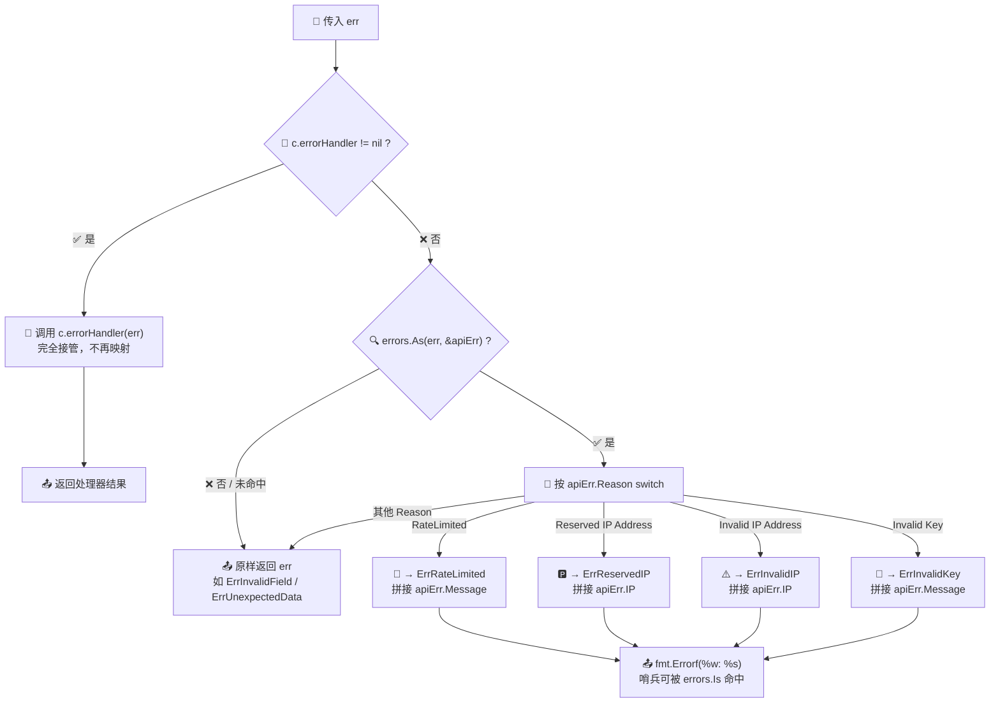

# 🛡️ `handleError` — 统一错误出口

> `handleError` 是 `ipapi` SDK `Client` 上的一个 **未导出（小写开头）方法**，充当所有查询方法的 **唯一错误出口**。它在错误离开 SDK 之前做最后一道加工：若用户通过 [`WithErrorHandler`](../../api/with-error-handler) 注入了自定义处理器，则优先委托给它；否则按照 `APIError.Reason` 将服务端语义映射到 SDK 内置的 **哨兵错误（sentinel error）**，使调用方可以用 `errors.Is` 稳健地判别错误类型。

---

## 📦 定义

```go
// pkg/ipapi/errors.go
func (c *Client) handleError(err error) error {
	if c.errorHandler != nil {
		return c.errorHandler(err)
	}

	var apiErr *APIError
	if errors.As(err, &apiErr) { // 现在可以正确解包
		switch apiErr.Reason {
		case "RateLimited":
			return fmt.Errorf("%w: %s", ErrRateLimited, apiErr.Message)
		case "Reserved IP Address":
			return fmt.Errorf("%w: %s", ErrReservedIP, apiErr.IP)
		case "Invalid IP Address":
			return fmt.Errorf("%w: %s", ErrInvalidIP, apiErr.IP)
		case "Invalid Key":
			return fmt.Errorf("%w: %s", ErrInvalidKey, apiErr.Message)
		}
	}

	return err
}
```

| 属性 | 值 |
| --- | --- |
| 🔤 名称 | `handleError` |
| 🏷️ 类别 | 方法（接收者 `*Client`，未导出） |
| 🔂 签名 | `func (c *Client) handleError(err error) error` |
| 📁 定义位置 | `pkg/ipapi/errors.go` |
| 🧩 依赖 | `c.errorHandler`、`APIError`、哨兵错误 `ErrRateLimited` / `ErrReservedIP` / `ErrInvalidIP` / `ErrInvalidKey` |
| 📞 调用方 | `GetIPInfo`、`GetIPInfoRaw`、`GetClientIPInfo`、`GetClientIPInfoRaw`、`GetIPField`、`GetClientField` 等 SDK 内部方法 |

> ⚠️ 这是一个 **未导出** 方法，外部包无法直接调用。它的行为通过 `NewClient` 构造出的 `Client` 上的各类查询方法间接体现，调用方拿到的是它 **返回并加工后** 的错误。

---

## 📖 说明

### 🎯 作用

`handleError` 是 SDK 所有查询方法的 **错误收口点**。在 `pkg/ipapi/api.go` 中，每一个会返回 `error` 的公共方法（如 `GetIPInfo`、`GetIPField`）在遇到参数校验失败、HTTP 传输失败、响应解码失败或服务端 `APIError` 时，都会把原始错误交给 `handleError`，再将其返回值交给调用方：

```go
// pkg/ipapi/api.go（节选）
func (c *Client) GetIPInfo(ctx context.Context, ip string, format string) (*IPInfo, error) {
	if err := ValidateIP(ip); err != nil {
		return nil, c.handleError(err) // 参数错误也走统一出口
	}
	// ...
	resp, err := c.doRequest(req)
	if err != nil {
		return nil, c.handleError(err) // 传输/状态码错误也走统一出口
	}
	// ...
}
```

这样做带来三个好处：

1. **🧭 一致的错误形态**：无论错误来自参数校验、网络层还是业务层，调用方拿到的都是经统一加工的 `error`，可用 `errors.Is` 一致判别。
2. **🔌 可插拔的自定义处理**：注入 `errorHandler` 后，所有错误在出口处被一次性改写，无需在每个方法里散落 `if err != nil` 分支。
3. **🧱 哨兵解耦**：服务端的 `Reason` 字符串（如 `"RateLimited"`）被映射为 SDK 导出的哨兵错误，调用方不依赖魔法字符串，只依赖稳定的 `Err*` 变量。

### 🔀 两段式分流

`handleError` 内部按如下顺序决策：

::: tip 🎨 一图抵千言
下方 Mermaid 流程图直观呈现 `handleError` 的两段式分流：先看 `errorHandler` 是否注入，再走 `APIError.Reason` 到哨兵的映射。
:::



```
传入 err
   │
   ▼
c.errorHandler != nil ? ── 是 ──▶ return c.errorHandler(err)   （完全接管，不再映射）
   │ 否
   ▼
errors.As(err, &apiErr) ? ── 是 ──▶ 按 apiErr.Reason switch：
   │                              • "RateLimited"         → ErrRateLimited
   │                              • "Reserved IP Address" → ErrReservedIP
   │                              • "Invalid IP Address"  → ErrInvalidIP
   │                              • "Invalid Key"         → ErrInvalidKey
   │ 否 / Reason 未命中           （用 fmt.Errorf("%w: ...") 包裹，保留哨兵可被 errors.Is 命中）
   ▼
return err                      （原样返回，如 ErrInvalidField、ErrUnexpectedData 等）
```

> 💡 注意 `errors.As(err, &apiErr)` 这一步能正确解包被 `fmt.Errorf("%w", ...)` 层层包裹的 `*APIError`。这意味着即便上游用 `%w` 包裹过，`handleError` 仍能识别其中的 `APIError` 并读取 `Reason` 进行映射。

### 🚩 Reason 到哨兵的映射表

| `APIError.Reason` | 映射到的哨兵 | 拼接的附加信息 |
| --- | --- | --- |
| `"RateLimited"` | `ErrRateLimited` | `apiErr.Message` |
| `"Reserved IP Address"` | `ErrReservedIP` | `apiErr.IP` |
| `"Invalid IP Address"` | `ErrInvalidIP` | `apiErr.IP` |
| `"Invalid Key"` | `ErrInvalidKey` | `apiErr.Message` |
| 其他 / 未命中 | — | 原样返回 `err` |

> 📌 映射时使用 `fmt.Errorf("%w: %s", sentinel, detail)` 形式：`%w` 保证 **哨兵错误可被 `errors.Is` 命中**，`%s` 拼接服务端给出的细节（`Message` 或 `IP`），便于日志排查。未被命中的错误（如 `ErrInvalidField`、`ErrUnexpectedData`、`ErrServerError`、`ErrNotFound` 等）直接原样返回，保留其原始可判别性。

### 🔌 自定义处理器优先

一旦通过 [`WithErrorHandler`](../../api/with-error-handler) 设置了 `c.errorHandler`，`handleError` 便 **完全让位** —— 直接返回 `c.errorHandler(err)`，**不再执行** `APIError.Reason` 的映射分支。这意味着：

- ✅ 你可以统一改写所有错误（如脱敏、加 trace ID、转译为业务错误码）。
- ⚠️ 但也意味着 **哨兵映射被旁路**：若你的处理器没有用 `%w` 保留哨兵，调用方将无法再用 `errors.Is(err, ErrRateLimited)` 命中。需要保留可判别性时，请在处理器内自行用 `fmt.Errorf("%w: ...", err)` 包裹。

---

## 💻 用法 / 示例

`handleError` 本身未导出，调用方不直接调用它，而是通过 `Client` 的查询方法间接触发。下列示例展示 **默认哨兵映射** 与 **注入自定义处理器** 两种模式下的不同行为。

### 🧪 示例一：默认映射 —— 用 `errors.Is` 判别哨兵

```go
package main

import (
	"errors"
	"fmt"
	"time"

	"example.com/ipapi"
)

func main() {
	client := ipapi.NewClient(ipapi.WithAPIKey("invalid-key-demo"))

	// 使用一个非法的 API Key 查询，服务端将返回 APIError{Reason: "Invalid Key"}
	// 该错误在 handleError 出口处被映射为 ErrInvalidKey
	_, err := client.GetIPInfo(nil, "8.8.8.8", "json")
	if err == nil {
		fmt.Println("未发生错误")
		return
	}

	// ✅ 用哨兵稳定判别，无需依赖魔法字符串
	switch {
	case errors.Is(err, ipapi.ErrInvalidKey):
		fmt.Println("API Key 无效，请检查配置：", err)
	case errors.Is(err, ipapi.ErrRateLimited):
		fmt.Println("触发限流，建议退避重试：", err)
	case errors.Is(err, ipapi.ErrReservedIP):
		fmt.Println("查询的是保留地址段：", err)
	case errors.Is(err, ipapi.ErrInvalidIP):
		fmt.Println("IP 地址格式非法：", err)
	default:
		fmt.Println("其他错误：", err)
	}

	_ = time.Second
}
```

### 🧪 示例二：注入自定义处理器 —— 统一改写出口

```go
package main

import (
	"errors"
	"fmt"

	"example.com/ipapi"
)

func main() {
	// 自定义处理器：给每个错误加上 trace，并保留原始哨兵可判别性
	customHandler := func(err error) error {
		// 用 %w 包裹，保留 errors.Is 的可命中性
		return fmt.Errorf("[trace-abc123] %w", err)
	}

	client := ipapi.NewClient(
		ipapi.WithAPIKey("invalid-key-demo"),
		ipapi.WithErrorHandler(customHandler), // 注入后 handleError 完全让位
	)

	_, err := client.GetIPInfo(nil, "8.8.8.8", "json")

	// ⚠️ 注意：因为 errorHandler 优先，handleError 不再执行 Reason 映射分支。
	// 此处 err 是原始 *APIError 被 [trace-abc123] 包裹后的结果。
	// 若希望仍能用 errors.Is(err, ErrInvalidKey) 命中，
	// 需在处理器内自行做映射（见示例三）。
	fmt.Printf("出口错误: %v\n", err)

	// 仍可判别是否为 *APIError
	var apiErr *ipapi.APIError
	if errors.As(err, &apiErr) {
		fmt.Printf("服务端 Reason: %s\n", apiErr.Reason) // Invalid Key
	}
}
```

### 🧪 示例三：在自定义处理器内自行映射哨兵

```go
package main

import (
	"errors"
	"fmt"

	"example.com/ipapi"
)

func main() {
	// 既想加 trace，又想保留哨兵可判别性：在处理器内手动映射
	handler := func(err error) error {
		var apiErr *ipapi.APIError
		if errors.As(err, &apiErr) {
			switch apiErr.Reason {
			case "Invalid Key":
				return fmt.Errorf("[trace-abc123] %w: %s", ipapi.ErrInvalidKey, apiErr.Message)
			case "RateLimited":
				return fmt.Errorf("[trace-abc123] %w: %s", ipapi.ErrRateLimited, apiErr.Message)
			}
		}
		return fmt.Errorf("[trace-abc123] %w", err)
	}

	client := ipapi.NewClient(ipapi.WithErrorHandler(handler))
	_, err := client.GetIPInfo(nil, "8.8.8.8", "json")

	// ✅ 现在既带 trace，又能用哨兵命中
	if errors.Is(err, ipapi.ErrInvalidKey) {
		fmt.Println("命中 ErrInvalidKey：", err)
	}
}
```

> 📌 上述逻辑与 SDK 自身的测试 `TestErrorHandler`（位于 `pkg/ipapi/client_test.go`）保持一致：该测试验证注入 `WithErrorHandler` 后 `handleError` 会调用自定义处理器并原样返回错误，可对照源码阅读。

---

## 🔗 相关

- 🖥️ [Client 结构体](../../api/client) — `errorHandler` 字段的宿主，承载错误出口策略
- 🏗️ [NewClient 构造函数](../../api/new-client) — 初始化 `Client`，默认 `errorHandler` 为 `nil`，走哨兵映射分支
- 🧰 [方法列表](../../api/methods) — 所有查询方法的错误都经 `handleError` 流出
- 📦 [数据模型](../../api/models) — `APIError` 结构定义，`Reason` 字段是映射的输入
- 🚨 [错误类型](../../api/errors) — 哨兵错误 `ErrRateLimited` / `ErrReservedIP` / `ErrInvalidIP` / `ErrInvalidKey` 等的定义
- ⚙️ [配置选项](../../api/options) — `WithErrorHandler` 选项用于注入自定义处理器
- 🔧 [WithErrorHandler](../../api/with-error-handler) — 注入 `errorHandler`，使 `handleError` 让位给自定义逻辑

---

## 👉 下一步

- 🧭 阅读 [错误处理概念](../../guide/error-concept) 理解 SDK 的哨兵错误设计与 `errors.Is` / `errors.As` 用法
- 🔧 参考 [自定义错误处理示例](../../examples/custom-error) 在真实场景中用 `WithErrorHandler` 接管出口
- 🔁 结合 [IsRetryableError](../../api/is-retryable) 与 [重试机制概念](../../guide/retry-concept) 把 `handleError` 映射出的 `ErrRateLimited`、`ErrServerError`、`ErrNotFound` 纳入退避重试策略
- 🧪 运行 `go test ./pkg/ipapi/ -run TestErrorHandler` 亲自验证 `handleError` 在注入处理器后的分流行为
