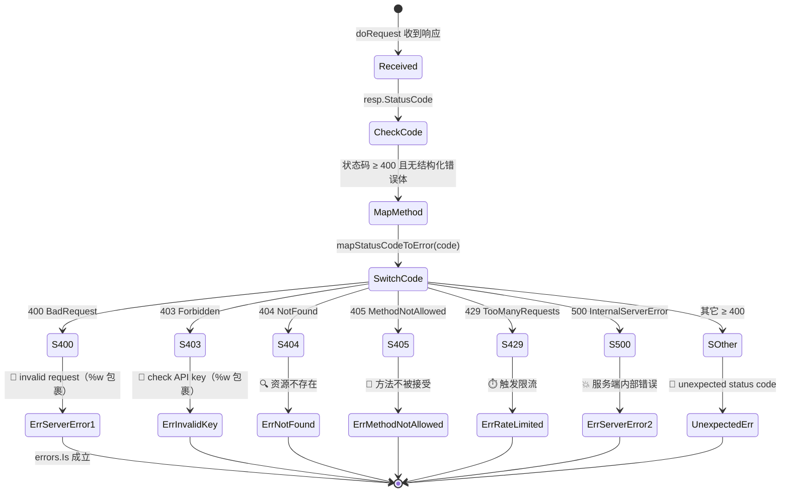

# 🗺️ `mapStatusCodeToError` — HTTP 状态码兜底映射

> `mapStatusCodeToError` 是 `ipapi` SDK 内部的 **兜底错误映射方法**，定义在 `Client` 上。当一次请求返回的 HTTP 状态码 ≥ `400`，且响应体无法被解析为结构化的 `APIError` 时，由 [`doRequest`](./do-request) 调用它，把裸状态码翻译成 SDK 对外统一的 **哨兵错误（sentinel error）**，让调用方能够用 `errors.Is` 稳定地判别失败原因。

---

## 📦 定义

```go
// pkg/ipapi/api.go
func (c *Client) mapStatusCodeToError(code int) error {
	switch code {
	case http.StatusBadRequest:
		return fmt.Errorf("%w: invalid request", ErrServerError)
	case http.StatusForbidden:
		return fmt.Errorf("%w: %s", ErrInvalidKey, "check API key")
	case http.StatusNotFound:
		return ErrNotFound
	case http.StatusMethodNotAllowed:
		return ErrMethodNotAllowed
	case http.StatusTooManyRequests:
		return ErrRateLimited
	case http.StatusInternalServerError:
		return ErrServerError
	default:
		return fmt.Errorf("unexpected status code: %d", code)
	}
}
```

| 属性 | 值 |
| --- | --- |
| 🔤 名称 | `mapStatusCodeToError` |
| 🏷️ 类别 | 内部方法（未导出，小写开头） |
| 📐 签名 | `func (c *Client) mapStatusCodeToError(code int) error` |
| 📁 定义位置 | `pkg/ipapi/api.go` |
| 🔗 接收者 | `*Client` |
| 📥 入参 | `code int` — HTTP 响应状态码 |
| 📤 返回值 | `error` — 哨兵错误或带状态码的兜底错误 |
| 📞 唯一调用点 | `Client.doRequest`（`pkg/ipapi/api.go`） |

> ⚠️ 这是一个 **未导出** 的方法，外部包无法直接调用。它的存在是为了让 SDK 内部把“HTTP 层的失败”与“业务层的哨兵错误”对齐，调用方感知到的始终是后者。

---

## 📖 说明

### 🎯 作用

在 [`doRequest`](./do-request) 中，当响应状态码 ≥ `400` 时，SDK 会 **先尝试** 把响应体解码成 `*APIError`：

```go
// pkg/ipapi/api.go
if resp.StatusCode >= 400 {
	defer resp.Body.Close()
	var apiErr *APIError
	if err := json.NewDecoder(resp.Body).Decode(&apiErr); err == nil && apiErr.HasError {
		return nil, apiErr // 直接返回 APIError 实例
	}
	return nil, c.mapStatusCodeToError(resp.StatusCode) // 兜底
}
```

只有当解码失败、或解码出的 `apiErr.HasError` 为 `false`（即服务端没有给出结构化错误）时，才会落到 `mapStatusCodeToError`。此时响应体已不可靠，SDK 转而 **以状态码本身作为判别依据**，映射到对应的哨兵错误。

### 🧭 状态码 → 哨兵错误 映射表

| HTTP 状态码 | 哨兵错误 | 备注 |
| --- | --- | --- |
| `400` BadRequest | `ErrServerError`（附带 `"invalid request"`） | 请求格式或参数有问题，归为服务端可识别的失败 |
| `403` Forbidden | `ErrInvalidKey`（附带 `"check API key"`） | 通常是 API Key 缺失/失效 |
| `404` NotFound | `ErrNotFound` | 资源（IP/字段）不存在 |
| `405` MethodNotAllowed | `ErrMethodNotAllowed` | HTTP 方法不被接受 |
| `429` TooManyRequests | `ErrRateLimited` | 触发限流 |
| `500` InternalServerError | `ErrServerError` | 服务端内部错误 |
| 其它任意 ≥ `400` | `"unexpected status code: <code>"` | 兜底，不匹配任何已知哨兵 |

> 💡 注意 `400` 与 `500` 都归到 `ErrServerError`，但 `400` 用 `fmt.Errorf("%w: ...", ErrServerError)` 包了一层描述文本；由于使用了 `%w` 动词，`errors.Is(err, ErrServerError)` 依然成立。



### 🧱 为何用哨兵错误而非状态码

1. **🔍 稳定判别**：调用方写 `errors.Is(err, ipapi.ErrRateLimited)` 比比较 `code == 429` 更健壮——状态码可能因服务端调整而变化，哨兵错误是 SDK 对外承诺的契约。
2. **🧩 与重试/错误处理打通**：[`IsRetryableError`](../../api/is-retryable) 依赖 `errors.Is` 判定 `ErrRateLimited` / `ErrServerError` / `ErrNotFound` 来决定是否重试；[`handleError`](./do-request) 也基于哨兵错误做二次包装。
3. **🪜 分层解耦**：上层业务无需感知 HTTP，只关心“限流了”“Key 不对”“资源不存在”等语义。

### 🔁 与重试循环的关系

`mapStatusCodeToError` **只处理“最终失败”**，不参与重试决策。在 `doRequest` 的重试循环中：

- `5xx` 响应会在循环内被重试（`resp.StatusCode < 500` 才跳出循环）；
- 当 `Retries` 用尽仍是 `5xx` 时，循环返回的是 `"server error after N retries (status: M)"`，**不会**走到 `mapStatusCodeToError`；
- 只有在循环正常跳出（`StatusCode < 500`）但 `StatusCode >= 400` 时，才会进入本方法。

因此 `mapStatusCodeToError` 实际处理的 `500` 分支，是在 **`Retries = 0`** 或服务端在最后一次重试恰好返回 `500` 之外的 `4xx/5xx` 时才会触发的兜底路径。SDK 测试中为此专门提供了直接调用 `mapStatusCodeToError` 的用例（见下文）。

---

## 💻 用法 / 示例

`mapStatusCodeToError` 未导出，无法在 SDK 外部直接调用。下面的示例与 SDK 自身的测试（`pkg/ipapi/api_test.go`）一致，演示其在各类状态码下的行为。由于是内部方法，示例位于 `package ipapi` 内：

```go
package ipapi

import (
	"errors"
	"net/http"
	"testing"
)

// 直接验证每个状态码映射到正确的哨兵错误。
func TestClient_mapStatusCodeToError_AllCodes(t *testing.T) {
	client := NewClient()

	tests := []struct {
		code    int
		wantErr error
	}{
		{http.StatusBadRequest, ErrServerError},        // 400 -> ErrServerError
		{http.StatusForbidden, ErrInvalidKey},         // 403 -> ErrInvalidKey
		{http.StatusNotFound, ErrNotFound},            // 404 -> ErrNotFound
		{http.StatusMethodNotAllowed, ErrMethodNotAllowed}, // 405 -> ErrMethodNotAllowed
		{http.StatusTooManyRequests, ErrRateLimited},  // 429 -> ErrRateLimited
		{http.StatusInternalServerError, ErrServerError}, // 500 -> ErrServerError
		{418, nil}, // 未知状态码 -> 不匹配任何哨兵，但仍返回 error
	}

	for _, tt := range tests {
		err := client.mapStatusCodeToError(tt.code)
		if tt.wantErr != nil {
			if !errors.Is(err, tt.wantErr) {
				t.Errorf("mapStatusCodeToError(%d) = %v, want %v", tt.code, err, tt.wantErr)
			}
		} else {
			// 未知状态码：仍应返回非 nil 的 error（兜底文本）
			if err == nil {
				t.Errorf("mapStatusCodeToError(%d) should return error", tt.code)
			}
		}
	}
}
```

### 🧪 端到端：从 HTTP 响应到哨兵错误

下面演示一次真实请求中，状态码如何经 `doRequest` → `mapStatusCodeToError` 落到调用方手里。用一个 `httptest` 服务端模拟 `429 Too Many Requests`，并设置 `Retries = 0` 以避开重试循环：

```go
package main

import (
	"context"
	"errors"
	"fmt"
	"net/http"
	"net/http/httptest"

	"github.com/cyberspacesec/ipapi"
)

func main() {
	// 🧪 模拟限流服务端：始终返回 429，且无结构化错误体
	srv := httptest.NewServer(http.HandlerFunc(func(w http.ResponseWriter, r *http.Request) {
		w.WriteHeader(http.StatusTooManyRequests) // 429
		// 故意不返回 JSON 错误体 → 触发 mapStatusCodeToError 兜底
	}))
	defer srv.Close()

	// 用自定义 BaseURL 指向测试服务端，并关闭重试
	client := ipapi.NewClient(
		ipapi.WithBaseURL(srv.URL),
		ipapi.WithRetries(0),
	)

	_, err := client.GetIPInfo(context.Background(), "8.8.8.8", "json")
	switch {
	case errors.Is(err, ipapi.ErrRateLimited):
		// ✅ 预期：429 被映射为 ErrRateLimited
		fmt.Println("命中限流哨兵错误：ErrRateLimited")
	default:
		fmt.Printf("其它错误: %v\n", err)
	}
}
```

> 📌 `WithBaseURL` / `WithRetries` 是内部测试常用的注入点；生产环境通常无需自定义 `BaseURL`。上面这段逻辑与 SDK 测试 `TestClient_mapStatusCodeToError_TooManyRequests` 思路一致，可对照源码阅读。

---

## 🔗 相关

- 🖥️ [Client 客户端](../../api/client) — `mapStatusCodeToError` 的接收者 `*Client`，承载 `HTTPClient` / `Retries` 等字段
- 📚 [API 方法](../../api/methods) — 所有发起 HTTP 请求的查询方法，其错误最终都可能经由本方法产生
- 🧱 [数据模型](../../api/models) — `APIError` 结构体定义，是本方法的“上一道防线”
- 🚨 [错误类型](../../api/errors) — 本方法返回的全部哨兵错误（`ErrServerError` / `ErrInvalidKey` / `ErrNotFound` / `ErrMethodNotAllowed` / `ErrRateLimited`）一览
- ⚙️ [配置选项](../../api/options) — `WithErrorHandler` 可在哨兵错误之后再做包装；`WithRetries` 影响是否进入本方法
- 🔄 [`doRequest`](./do-request) — 唯一调用本方法的位置，理解重试循环与兜底触发的关键
- 🔁 [`IsRetryableError`](../../api/is-retryable) — 基于本方法产出的哨兵错误判定是否值得重试
- ⏱️ [`defaultRetryDelay`](./default-retry-delay) — 重试循环中的退避间隔，与本方法的“最终失败”语义互补

---

## 👉 下一步

- 🚨 阅读 [错误处理概念](../../examples/error-handling) 了解 `mapStatusCodeToError` 产出的哨兵错误如何被 `handleError` 二次包装、被 `errors.Is` 稳定识别
- 🔁 结合 [`doRequest`](./do-request) 与 [重试机制概念](../../guide/retry-concept) 理清“重试循环 → 兜底映射 → 哨兵错误”的完整链路
- ⚙️ 参见 [自定义错误处理](../../examples/custom-error) 用 `WithErrorHandler` 在哨兵错误之上叠加日志、指标或重写逻辑
- 🧪 运行 `go test ./pkg/ipapi/ -run mapStatusCodeToError` 亲自验证各状态码的映射结果
